# Team Voltimor

> [!NOTE]
> Este repositorio corresponde a nuestra participación en la World Robot Olympiad 2026 con vTitan. Si buscas información sobre nuestra participación en la World Robot Olympiad 2025 con Klevor, el robot del Team Steel Bot, visita el repositorio [**klevor**](https://github.com/teamsteelbot/klevor).

> 🕊️ Este proyecto está dedicado a la memoria de **Javier Pérez** ([@kaucrow](https://github.com/kaucrow)), amigo y colega, y de **Luna Margarita**, compañera de doce años. La [dedicatoria completa](memorial.md) vive en [`memorial.md`](memorial.md).

<p align="center">
    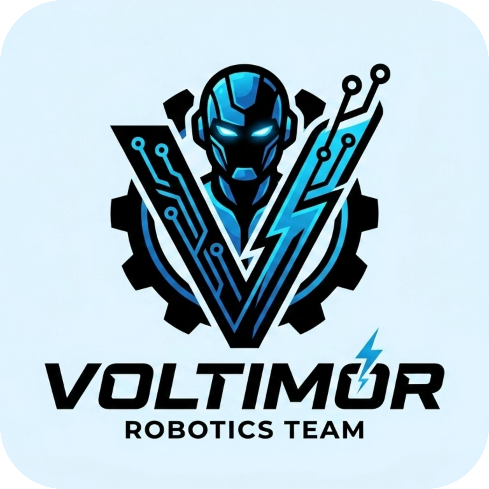
    <br>
    <i>Logo del Equipo</i>
</p>

Bienvenidos al repositorio de vTitan, el robot del Team Voltimor, que compite en la World Robot Olympiad 2026 en la categoría Futuros Ingenieros. Aquí encontrarás toda la información sobre el robot, incluyendo su código, modelos 3D, esquemas y documentación.

<p align="center">
    
    <br>
    <i>Foto del Equipo, de izquierda a derecha: Ramón Álvarez, Sebastián Álvarez, Jesús Pérez (Padre, Mentor), Jesús Pérez</i>
</p>

El equipo lo forman tres miembros:

- **Ramón Álvarez**, 20 años. [ralvarezdev](https://github.com/ralvarezdev). Líder del equipo y encargado de la programación. Trabaja en Automation Labs y finalizó sus estudios de Ingeniería en Computación en URU.
- **Sebastián Álvarez**, 16 años. [salvarezdev](https://github.com/salvarezdev). Encargado de la programación, la documentación y las decisiones sobre la lógica del robot. Cursa el primer trimestre de Ingeniería en Computación en URU.
- **Jesús Pérez**, 16 años. [JesusPerez15](https://github.com/JesusPerez15). Encargado del diseño, la mecánica y la fabricación del robot. Cursa quinto año de bachillerato en el Colegio Salto Ángel.

## vTitan en números

<table align="center">
<thead>
<tr>
<th align="left">Métrica</th>
<th align="left">Valor</th>
<th align="left">Contexto</th>
</tr>
</thead>
<tbody>
<tr>
<td align="left">Detección de señales</td>
<td align="left"><strong>15 Hz</strong> punta a punta</td>
<td align="left">Captura 640x640 + inferencia NPU + publicación; 101.5 FPS el modelo solo</td>
</tr>
<tr>
<td align="left">Corpus de simulación</td>
<td align="left"><strong>638 / 640</strong> escenarios Open</td>
<td align="left">Semilla fija y resultados repetibles; los 2 casos restantes identificados uno por uno</td>
</tr>
<tr>
<td align="left">Peso del robot</td>
<td align="left"><strong>~1460 g</strong></td>
<td align="left">Límite reglamentario 1500 g, con ~40 g de margen</td>
</tr>
<tr>
<td align="left">Techo de velocidad real</td>
<td align="left"><strong>~0.58 m/s</strong></td>
<td align="left">Descubierto al corregir un error de cuantización que lo limitaba a 0.45 m/s</td>
</tr>
<tr>
<td align="left">Duración de una ronda</td>
<td align="left"><strong>180 s</strong> sin pausa</td>
<td align="left">Por eso todo lo que ocurre a bordo queda grabado en bags MCAP</td>
</tr>
<tr>
<td align="left">Lazo de velocidad en pista</td>
<td align="left"><strong>~2% de error</strong> de seguimiento</td>
<td align="left">Tres vueltas limpias en 132.5 s frente a 142.3 s antes del ajuste</td>
</tr>
</tbody>
</table>

Cada número es medido, no estimado, y puede rastrearse hasta el código y la medición que lo produjo vía el historial de git (ver [Versionado](#versionado)).

**Índice**

1. **[vTitan en números](#vtitan-en-números)**
2. **[Estructura del repositorio](#estructura-del-repositorio)**
    1. [Cómo explorar este repositorio](#cómo-explorar-este-repositorio)
3. **[Arranque rápido y reproducibilidad](#arranque-rápido-y-reproducibilidad)**
    1. [Requisitos previos](#requisitos-previos-una-sola-vez)
    2. [Desarrollo y simulación](#desarrollo-y-simulación-en-el-computador-de-desarrollo)
    3. [Despliegue al robot](#despliegue-al-robot-desde-el-computador-por-ssh)
    4. [Operación en pista](#operación-en-pista-directamente-en-la-raspberry-pi-5-vía-ssh)
    5. [Provisionado desde cero](#provisionado-desde-cero-instalar-el-sistema-en-las-raspberry-pi)
    6. [Documentación](#documentación)
    7. [Pruebas](#pruebas)
    8. [Versionado](#versionado)
4. **[Historial del equipo](#historial-del-equipo)**
    1. [Klevor (WRO 2025)](#klevor-wro-2025)
        1. [Klevor v0.1](other/docs/development/previous-prototypes/klevor-v0.1.md)
        2. [Klevor v0.1.1](other/docs/development/previous-prototypes/klevor-v0.1.1.md)
        3. [Klevor v0.2](other/docs/development/previous-prototypes/klevor-v0.2.md)
        4. [Klevor v1.0](other/docs/development/previous-prototypes/klevor-v1.0.md)
    2. [vTitan (WRO 2026)](#vtitan-wro-2026)
5. **[Movilidad y diseño mecánico](#movilidad-y-diseño-mecánico)**
    1. [Restricciones iniciales](#restricciones-iniciales)
    2. [Métodos de prototipaje](#métodos-de-prototipaje)
    3. [Evolución y justificación del diseño](#evolución-y-justificación-del-diseño)
        1. [Fase 1: prototipo de rin estático, corona interna y guayas flexibles](#fase-1-prototipo-de-rin-estático-corona-interna-y-guayas-flexibles)
        2. [Fase 2: pruebas de integración y detección de fallas](#fase-2-pruebas-de-integración-y-detección-de-fallas)
        3. [Fase 3: rediseño a engranajes perpendiculares, coronas y correa dentada](#fase-3-rediseño-a-engranajes-perpendiculares-coronas-y-correa-dentada)
        4. [Fase 4: optimización de peso, integración y chasis final](#fase-4-optimización-de-peso-integración-y-chasis-final)
        5. [Fase 5: integración del REV HD Hex Motor](#fase-5-integración-del-rev-hd-hex-motor)
    4. [Sistema de transmisión](#sistema-de-transmisión)
    5. [Sistema de dirección](#sistema-de-dirección)
    6. [Estructura mecánica](#estructura-mecánica)
        1. [Chasis inferior](#chasis-inferior)
        2. [Monochasis](#monochasis)
    7. [Montaje](#montaje)
        1. [Las piezas, y cómo mirarlas](#las-piezas-y-cómo-mirarlas)
    8. [Relación de torque y velocidad](#relación-de-torque-y-velocidad)
        1. [Velocidad: teórica contra real](#velocidad-teórica-contra-real)
6. **[Arquitectura de energía y sensores](#arquitectura-de-energía-y-sensores)**
    1. [Lista de componentes](#lista-de-componentes)
        1. [Raspberry Pi 5 (16 GB de RAM)](#raspberry-pi-5-16-gb-de-ram)
        2. [Raspberry Pi Camera Module 3 Wide](#raspberry-pi-camera-module-3-wide)
        3. [Raspberry Pi AI HAT+ (26 TOPS)](#raspberry-pi-ai-hat-26-tops)
        4. [Raspberry Pi Zero 2 W](#raspberry-pi-zero-2-w)
        5. [RPLiDAR C1](#rplidar-c1)
        6. [Servomotor Hiwonder HPS-3527SG (35 kg·cm)](#servomotor-hiwonder-hps-3527sg-35-kgcm)
        7. [REV HD Hex Motor](#rev-hd-hex-motor)
        8. [IMU GY-BNO085](#imu-gy-bno085)
        9. [Batería Li-Po Ovonic Air de 11.1 V](#batería-li-po-ovonic-air-de-111-v)
        10. [Puente H BTS7960 / IBT-2](#puente-h-bts7960--ibt-2)
        11. [Step Down Mini-560 Pro](#step-down-mini-560-pro)
        12. [Pantalla OLED SSD1306](#pantalla-oled-ssd1306)
        13. [Convertidor KL89576 (DC a USB-C)](#convertidor-kl89576-dc-a-usb-c)
    2. [Diagrama de conexiones](#diagrama-de-conexiones)
    3. [Consumo energético](#consumo-energético)
    4. [Calibración](#calibración)
7. **[Arquitectura de software](#arquitectura-de-software)**
    1. [Arquitectura ROS2 y reparto entre dos computadores](#arquitectura-ros2-y-reparto-entre-dos-computadores)
        1. [La pantalla OLED, el único instrumento en pista](#la-pantalla-oled-el-único-instrumento-en-pista)
        2. [La segunda pila (stack) en Go, y por qué no corre en carrera](#la-segunda-pila-stack-en-go-y-por-qué-no-corre-en-carrera)
    2. [Modelo de detección YOLO](#modelo-de-detección-yolo)
        1. [El modelo y su cadena de procesamiento](#el-modelo-y-su-cadena-de-procesamiento)
        2. [Datos de entrenamiento](#datos-de-entrenamiento)
        3. [Cómo lo medimos (y qué cambió por eso)](#cómo-lo-medimos-y-qué-cambió-por-eso)
        4. [Qué pasa cuando la visión falla](#qué-pasa-cuando-la-visión-falla)
    3. [Algoritmo PID](#algoritmo-pid)
        1. [Control de velocidad: PI sobre RPM](#control-de-velocidad-pi-sobre-rpm)
        2. [Dirección: de PID a pure pursuit](#dirección-de-pid-a-pure-pursuit)
        3. [El modo ciego: P de centrado eliminada por medición](#el-modo-ciego-p-de-centrado-eliminada-por-medición)
        4. [El rol del giroscopio](#el-rol-del-giroscopio)
8. **[Estrategia en pista](#estrategia-en-pista)**
    1. [Inferencia del sentido de la vuelta](#inferencia-del-sentido-de-la-vuelta)
    2. [Seguimiento de pasillo, vueltas y escapes](#seguimiento-de-pasillo-vueltas-y-escapes)
    3. [Vista completa de cada desafío](#vista-completa-de-cada-desafío)
9. **[Análisis y simulación](#análisis-y-simulación)**
    1. [Grabación y análisis de carreras](#grabación-y-análisis-de-carreras)
    2. [Simulador y corpus de escenarios](#simulador-y-corpus-de-escenarios)
10. **[Pensamiento sistémico y decisiones de ingeniería](#pensamiento-sistémico-y-decisiones-de-ingeniería)**
    1. [Interacciones entre subsistemas](#interacciones-entre-subsistemas)
    2. [Diseño gobernado por configuración](#diseño-gobernado-por-configuración)
    3. [Perfiles de hardware intercambiables](#perfiles-de-hardware-intercambiables)
    4. [Compensaciones y alternativas descartadas](#compensaciones-y-alternativas-descartadas)
    5. [Registro de decisiones de arquitectura (ADR)](#registro-de-decisiones-de-arquitectura-adr)
    6. [Ciclo de trabajo: idea → simulación → pista](#ciclo-de-trabajo-idea--simulación--pista)
    7. [Hallazgos de ingeniería](#hallazgos-de-ingeniería)
    8. [Gestión de riesgos](#gestión-de-riesgos)
    9. [Tecnologías utilizadas](#tecnologías-utilizadas)
11. **[Videos de vTitan](#videos-de-vtitan)**
    1. [Open Challenge](#open-challenge)
    2. [Open Challenge Simulation](#open-challenge-simulation)
    3. [Obstacle Challenge Simulation](#obstacle-challenge-simulation)
    4. [Parking Challenge](#parking-challenge)
    5. [Otros](#otros)

## Estructura del repositorio

La raíz del repositorio sigue la estructura que pide la categoría Futuros Ingenieros de la WRO. Cada carpeta obligatoria está en su sitio, y las que apuntan a un monorepo más grande llevan su propio `README.md` con la ruta exacta:

```text
vtitan/
├── README.md          # Este documento: la documentación completa de ingeniería
├── CHANGELOG.md       # Notas de versión de v1.0, v1.1 y v1.2
├── t-photos/          # Fotos del equipo
├── v-photos/          # Fotos de vTitan y de los prototipos anteriores
├── video/             # Enlaces a los videos de las rondas (video/video.md)
├── schemes/           # Diagramas de flujo y esquemático de conexiones
│   ├── flowcharts/    #   Fuentes Mermaid + renders WebP: common/, open/, obstacles/
│   └── wiring/        #   Esquemático del arnés + proyecto tscircuit que lo genera
├── models/            # Modelos 3D (ver models/README.md)
│   ├── vtitan/      #   WRO 2026: blueprints/, step-files/ (CAD), stl-files/ (visor 3D)
│   └── klevor/      #   WRO 2025: el prototipo de la temporada anterior
├── src/               # python/ (pila ROS2), go/ (reimplementación Go), config/ (TOML
│                      #   compartido, leído por ambos), model/ (esquemas JSON que
│                      #   validan ese TOML), tools/ y assets/ (imágenes compartidas)
├── other/             # Todo lo que no es material de competencia
│   ├── apps/          #   backend/, frontend/, gazebo/, auto-annotator/, hugo-docs/, landing/
│   ├── assets/        #   Logos e imágenes de esta documentación
│   ├── contracts/     #   proto/ (buf, esquemas gRPC/NATS) y openapi/ (spec-first REST)
│   ├── data/          #   Salidas de ejecución (bags, fotos, videos); vacía en el repo
│   ├── deploy/ansible/#   Provisionamiento de las placas (tareas task rpi:*, windows:*)
│   ├── docs/          #   Bitácora, referencia de configuración, datasheets, prototipos
│   ├── ml/hailo/ ml/weights/  # Entrenamiento del detector y pesos publicados
│   ├── scripts/       #   Utilidades de desarrollo (configuración de SSH para el robot)
│   └── tasks/         #   Tareas del Taskfile raíz (fleet.yml, platform.yml, infra.yml)
└── .github/           # Flujos de trabajo de CI
```

<table align="center">
<thead>
<tr>
<th align="left">Carpeta</th>
<th align="left">Contenido</th>
</tr>
</thead>
<tbody>
<tr>
<td align="left"><code>README.md</code></td>
<td align="left">Este documento: la documentación completa de ingeniería de vTitan</td>
</tr>
<tr>
<td align="left"><code>other/docs/tests.md</code></td>
<td align="left">El flujo de pruebas: los cuatro niveles, las métricas y el protocolo de comparación A/B</td>
</tr>
<tr>
<td align="left"><code>CHANGELOG.md</code></td>
<td align="left">Notas de versión: qué cambió en <code>v1.0</code>, <code>v1.1</code> y <code>v1.2</code>, y por qué</td>
</tr>
<tr>
<td align="left"><code>t-photos/</code></td>
<td align="left">Fotos del equipo</td>
</tr>
<tr>
<td align="left"><code>v-photos/</code></td>
<td align="left">Fotos de vTitan y de los prototipos anteriores</td>
</tr>
<tr>
<td align="left"><code>video/</code></td>
<td align="left">Enlaces a los videos de las rondas y del robot en funcionamiento (<a href="video/video.md"><code>video/video.md</code></a>)</td>
</tr>
<tr>
<td align="left"><code>schemes/</code></td>
<td align="left">Diagramas de flujo y esquemático de conexiones. En <code>schemes/flowcharts/</code> están las fuentes Mermaid y sus renders WebP, separados en <code>common/</code> (lógica compartida por ambos desafíos), <code>open/</code> y <code>obstacles/</code>; <code>schemes/flowcharts/_legacy/</code> conserva los diagramas de versiones anteriores. En <code>schemes/wiring/</code> está el esquemático del arnés junto al proyecto tscircuit que lo genera</td>
</tr>
<tr>
<td align="left"><code>models/</code></td>
<td align="left">Modelos 3D de las piezas, una carpeta por robot: <code>vtitan/</code> (WRO 2026) y <code>klevor/</code> (WRO 2025), cada una con <code>blueprints/</code> (planos), <code>step-files/</code> (CAD para fabricar y editar) y <code>stl-files/</code> (para imprimir, y que <strong>GitHub renderiza en un visor 3D interactivo</strong>). Inventario completo en <a href="models/README.md"><code>models/README.md</code></a></td>
</tr>
<tr>
<td align="left"><code>src/</code></td>
<td align="left">El código de competencia y lo que comparte con la segunda implementación en Go: <code>src/python/</code> (pila ROS2, ver <a href="src/python/README.md"><code>src/python/README.md</code></a>), <code>src/go/</code> (reimplementación Go), <code>src/config/</code> (TOML que ambos leen), <code>src/model/</code> (los esquemas JSON que validan ese TOML y apuntan a su ADR), <code>src/tools/</code> y <code>src/assets/</code> (imágenes compartidas, p. ej. el logo del HUD).</td>
</tr>
<tr>
<td align="left"><code>other/</code></td>
<td align="left">Todo lo que no es material de competencia: <code>other/apps/</code> (telemetría, simulador, auto-anotador, docs), <code>other/contracts/</code> (proto + OpenAPI compartidos), <code>other/ml/</code> (entrenamiento y pesos), <code>other/deploy/ansible/</code>, <code>other/docs/</code>, <code>other/data/</code>, <code>other/scripts/</code>, <code>other/tasks/</code> y <code>other/assets/</code>. Ver <a href="other/README.md"><code>other/README.md</code></a></td>
</tr>
</tbody>
</table>

### Cómo explorar este repositorio

Según lo que quieras revisar, esta es la ruta más corta:

- **Código que corre en una ronda**: [`src/python/README.md`](src/python/README.md) mapea cada nodo ROS2 de la pila de competencia a su paquete y su rol (percepción, navegación, máquina de estados, drivers).
- **Configuración que gobierna al robot**: `src/config/`, descrita en [Diseño gobernado por configuración](#diseño-gobernado-por-configuración). Los perfiles de hardware intercambiables están en [Perfiles de hardware intercambiables](#perfiles-de-hardware-intercambiables). La lee tanto `src/python/` como `src/go/`.
- **Simulador y corpus de escenarios**: [`other/README.md`](other/README.md), sección del simulador; los resultados reproducibles están en [Simulador y corpus de escenarios](#simulador-y-corpus-de-escenarios).
- **Cómo se entrenó el detector**: `other/ml/hailo/` (entrenamiento y compilación), `other/ml/weights/` (pesos publicados), `other/apps/auto-annotator/` (anotación asistida).
- **Cómo se instala el sistema en las placas**: [`other/docs/pi-setup.md`](other/docs/pi-setup.md) y `other/deploy/ansible/`; automatizado por los comandos `task rpi:provision:*` de [Arranque rápido](#arranque-rápido-y-reproducibilidad).
- **Las piezas del robot en 3D**: [`models/README.md`](models/README.md). Los `.stl` se abren directamente en el visor 3D de GitHub, sin instalar nada. Los diagramas y el arnés, en [`schemes/README.md`](schemes/README.md); las vistas del robot, en [`v-photos/README.md`](v-photos/README.md).
- **Cómo verificamos que algo funciona**: [`other/docs/tests.md`](other/docs/tests.md), que describe los cuatro niveles de prueba y el protocolo con el que aceptamos o descartamos un cambio.
- **El historial del proyecto**: bitácora de ingeniería en [`other/docs/bitacora-ingenieria.md`](other/docs/bitacora-ingenieria.md), prototipos previos en [`other/docs/development/previous-prototypes/`](other/docs/development/previous-prototypes/klevor-v0.1.md), y las etiquetas de git (`v1.0` regional, `v1.1` y `v1.2` posteriores) con mensajes de commit convencionales.

Además de las carpetas obligatorias, el repositorio contiene:

- `src/` con el código: `src/python/` (la pila ROS2 de competencia), `src/go/` (la segunda implementación en Go), `src/config/` (la configuración TOML que ambos leen), `src/model/` (los esquemas JSON que la validan y la enlazan con su ADR), `src/tools/` y `src/assets/` (imágenes compartidas, p. ej. el logo del HUD de navegación).
- `other/contracts/` con los contratos de interfaz que generan código para los tres consumidores (robot, backend y frontend): `other/contracts/proto/` (buf, esquemas gRPC/NATS) y `other/contracts/openapi/` (spec-first REST).
- `other/docs/` con la documentación de apoyo: la [bitácora de ingeniería](other/docs/bitacora-ingenieria.md), la [referencia de configuración TOML de navegación](other/docs/configuracion-toml-navegacion.md), la [guía de instalación de las Raspberry Pi](other/docs/pi-setup.md), las hojas de datos en `other/docs/reference/datasheets/` y el historial de prototipos en `other/docs/development/previous-prototypes/`.
- `other/apps/` con procesos independientes: `other/apps/backend/` y `other/apps/frontend/` (telemetría), `other/apps/auto-annotator/` (anotación asistida), `other/apps/hugo-docs/` (sitio de documentación navegable), `other/apps/gazebo/` (entorno de ejecución del simulador) y `other/apps/landing/` (página de presentación).
- `other/ml/hailo/` con el entrenamiento y la compilación del detector YOLO, `other/ml/weights/` con los pesos publicados.
- `other/deploy/ansible/` con el provisionamiento de las placas; las tareas que lo ejecutan (`task rpi:*`, `task windows:provision:*`) están definidas en `other/tasks/fleet.yml`.
- `other/scripts/` con utilidades de desarrollo (configuración de SSH para el robot) y `.github/` con los flujos de trabajo de CI.
- `other/data/` es la carpeta de salida en tiempo de ejecución: `other/data/live/` y `other/data/sim/` guardan los bags, fotos y videos que producen las corridas del robot y del simulador. En el repositorio solo está su estructura (archivos `.gitkeep`); el contenido se llena al ejecutar `task robot:pull-runs` (bags desde la Pi 5), `task robot:pull-videos` (videos por ronda) o las corridas de simulación, y no se versiona.

## Arranque rápido y reproducibilidad

Todo el ciclo de vida del proyecto, desde la simulación y las pruebas hasta el despliegue al robot y la operación en pista, está automatizado con [Task](https://taskfile.dev) (Taskfile) y [Pixi](https://pixi.sh) / [uv](https://docs.astral.sh/uv/). Todo se invoca con `task`; la CLI `vt` (ver más abajo) ayuda a descubrir y lanzar esos mismos comandos. Nada de lo que hacemos depende de pasos manuales no documentados: otra persona puede clonar el repositorio y llegar del código al robot con estos comandos.

### Requisitos previos (una sola vez)

- [Task](https://taskfile.dev) (`go install github.com/go-task/task/v3/cmd/task@latest` o el instalador de la página)
- [uv](https://docs.astral.sh/uv/) (entornos de Python fuera de ROS2: herramientas y scripts de apoyo)
- [Pixi](https://pixi.sh) (gestiona los entornos de Python + ROS2 en el robot y la simulación)
- [Go](https://go.dev) 1.26+ (backend de telemetría, generador de escenarios y binarios del robot)
- Node.js 22+ (dashboard, el panel de telemetría)

### Desarrollo y simulación (en el computador de desarrollo)

```bash
task install          # Dependencias de simulación, robot y backend Go
task init:dev         # Configuración completa: install + lint

# Generar la pista y el corpus de escenarios (semilla fija → resultados repetibles)
task gen:corpus:all   # 640 escenarios Open + 256 Obstacle, semilla 2026

# Visualizar en RViz una carrera a lazo cerrado (simulador de navegación)
task sim:navigate:visualize:all -- --challenge open --interactive

# Pruebas: todas, o por subsistema
task test             # Python + Go, todos los módulos (ver Pruebas, más abajo)
```

### CLI de desarrollo `vt` (opcional)

`vt` es una capa sobre los mismos Taskfiles: organiza las tareas en subcomandos agrupados (dominios `sim`, `robot`, `go`, `fleet`, `gen`; transversales `setup`, `test`, `lint`, `clean`), les da flags tipados y ejecuta `task` por debajo, devolviendo su mismo código de salida. `task X` sigue funcionando exactamente igual y es lo que usa CI; `vt` solo existe en el computador de desarrollo, las placas siguen con `task`. Los comandos que solo existen en Windows (enlace Ethernet directo, rutas) se ocultan en Linux y macOS.

```bash
task cli:build                      # Compila src/go/bin/vt (recomendado)
task cli:run -- sim --help          # O sin compilar, vía go run

src/go/bin/vt                       # En una terminal: selector con los últimos comandos arriba y confirmación previa
src/go/bin/vt sim view -- --challenge open --interactive   # Simulador + RViz en un solo comando
src/go/bin/vt gen corpus --both     # Corpus de barrido de ambos desafíos (semilla fija)
src/go/bin/vt fleet set-wifi zero --ssid Casa --password '...'
src/go/bin/vt lint --fix            # Las variantes de una tarea son flags, no subcomandos
src/go/bin/vt --dry-run robot deploy   # Muestra la línea de task que ejecutaría, sin ejecutar nada
src/go/bin/vt task                  # Todas las tareas con su descripción
src/go/bin/vt task gen:track        # Cualquier tarea, con o sin flags tipados
source <(src/go/bin/vt completion bash)   # Autocompletado (también zsh y fish)
```

### Despliegue al robot (desde el computador, por SSH)

```bash
task robot:deploy         # Código + detector HEF → recompilar colcon → reiniciar servicios
task robot:watch-vision   # Detecciones en vivo, una línea por fotograma
task robot:pull-runs      # Descargar los bags MCAP de las carreras
```

### Operación en pista (directamente en la Raspberry Pi 5, vía SSH)

```bash
task rpi:stack ACTION=up           # Levantar la pila de servicios en el orden correcto
task rpi:stack ACTION=status       # Estado de la pila
task rpi:stack ACTION=logs         # Últimos registros de todos los servicios
task rpi:health                    # Captura de salud: temperatura, throttling, disco, RAM
task robot:calibrate-encoder       # Calibración de pulsos/vuelta contra distancia medida
task robot:test-motors             # Prueba de humo de hardware: rango de servo + pulso de motor
```

### Provisionado desde cero (instalar el sistema en las Raspberry Pi)

```bash
task windows:provision:pi5         # Provisionar la Pi 5 con Ansible (etiquetas opcionales)
task rpi:provision:all             # Ambas placas, en tmux, tras regrabar la SD
task rpi:ansible:check BOARD=pi5   # Ensayo en seco y diferencias del provisionador
```

### Documentación

```bash
task docs:diagrams                 # Re-renderizar todos los diagramas Mermaid a WebP
cd schemes/wiring/tscircuit && npm run artifacts   # Regenerar el esquemático del arnés
```

### Pruebas

```bash
task test                      # Python + Go, todos los módulos
task robot:test SCOPE=unit     # unit | navigation | hardware | all
task sim:test                  # pruebas de la simulación
task config:check              # cada clave de configuración descrita y con su ADR
task lint                      # ruff, golangci-lint, ESLint, buf lint
```

El **flujo de pruebas completo** está documentado en [`other/docs/tests.md`](other/docs/tests.md): los cuatro niveles (unitario, corpus de simulación, banco de hardware, pista), las métricas con las que decidimos, el protocolo de comparación A/B con las cinco trampas que nos costaron conclusiones falsas, y el estado real de la integración continua.

### Versionado

Marcamos hitos del proyecto con etiquetas de git. `v1.0` es el estado con el que vTitan compitió en el evento regional de la WRO 2026; `v1.1` y `v1.2` son los estados posteriores que se desplegaron y corrieron rondas. Las notas de cada versión, con qué cambió y por qué, están en [`CHANGELOG.md`](CHANGELOG.md).

Entre etiquetas el historial es continuo, con mensajes de commit convencionales (`fix(robot):`, `docs(readme):`, `perf(nav):`) y firmados con GPG. Cualquier resultado medido en este documento (tasas del corpus, FPS del detector, consumo de potencia) puede rastrearse hasta el código exacto que lo produjo vía el historial.

Un detalle de convención que usamos y no es estándar: el `!` en el tipo (`feat(sim)!:`) marca un cambio que **rompe la comparabilidad de resultados anteriores**, no solo la compatibilidad de una interfaz. Un número medido antes de uno de esos commits no se resta con uno medido después.

## Historial del equipo

Aquí repasamos nuestras temporadas anteriores en Futuros Ingenieros y lo que aprendimos de los prototipos que precedieron a vTitan.

### Klevor (WRO 2025)

<details>
<summary><b>Vistas de Klevor (seis vistas)</b></summary>

<table align="center">
        <tbody>
                <tr>
                        <td>
                                <p align="center">
                                        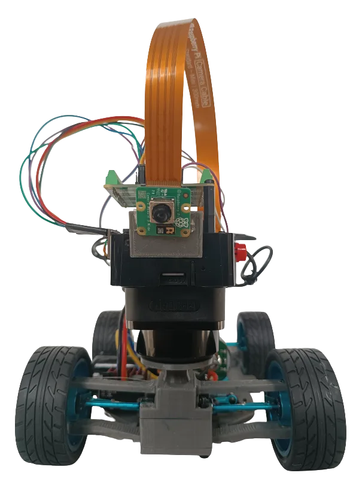
                                        <br>
                                        <i>Vista delantera de Klevor</i>
                                </p>
                        </td>
                        <td>
                                <p align="center">
                                        
                                        <br>
                                        <i>Vista trasera de Klevor</i>
                                </p>
                        </td>
                </tr>
                <tr>
                        <td>
                                <p align="center">
                                        
                                        <br>
                                        <i>Vista derecha de Klevor</i>
                                </p>
                        </td>
                        <td>
                                <p align="center">
                                        
                                        <br>
                                        <i>Vista izquierda de Klevor</i>
                                </p>
                        </td>
                </tr>
                <tr>
                        <td>
                                <p align="center">
                                        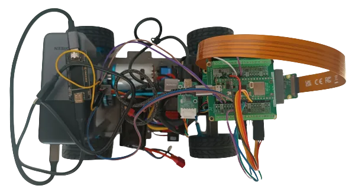
                                        <br>
                                        <i>Vista superior de Klevor</i>
                                </p>
                        </td>
                        <td>
                                <p align="center">
                                        
                                        <br>
                                        <i>Vista inferior de Klevor</i>
                                </p>
                        </td>
                </tr>
        </tbody>
</table>

</details>

Klevor es el **predecesor** de vTitan, participando en la temporada 2025 de la World Robot Olympiad en la categoría de Futuros Ingenieros, con el Team Steel Bot (quienes ahora participan bajo el nombre de Team Voltimor) y como todo proyecto fue evolucionando hasta culminar con la versión que tenemos hoy en día. 

Para conocer a nuestro prototipo actual, vTitan, mejor, es importante recalcar que muchas de sus características, más específicamente en la electrónica y programación, son **directamente heredadas** de Klevor, con cambios nulos o mínimos entre un prototipo o el otro. Algunas de las **herencias** más importantes son:

- El manejo de la Raspberry Pi 5 como computadora principal

- La detección de los obstáculos gracias a la Raspberry Pi Camera 3 y su Hailo AI+

- La comunicación serial entre una computadora principal y un microcontrolador

Ahora bien, también hay que recalcar que tuvimos algunos fallos en el desarrollo de Klevor, por ejemplo: 

El uso de un ESC para controlar el motor parecía una idea muy buena en papel: aprovechar el «combo» de motor 540 y variador de un carro de radiocontrol nos daba velocidad de sobra para completar los desafíos. Terminó siendo un problema grave por su falta de precisión: aceleraba demasiado rápido y no había forma de compensarlo desde la programación.

<p align="center">
	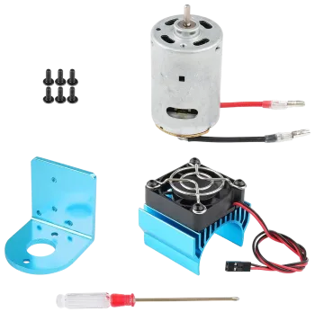
	<br>
	<i>El motor 540 de Klevor, heredado de un carro de radiocontrol junto a su variador</i>
</p>

Además, optamos por un modelo más robusto y pesado en comparación con los demás prototipos habituales de esta competición, si bien, gracias a esto pudimos incorporar muchos elementos de gran utilidad (como la Raspberry Pi 5), debido a esto, no podíamos optar por cambios significativos, siendo obligados a reestructurar el prototipo desde cero en caso de necesitar algún cambio.

Debido a la gran cantidad de cambios que necesitamos, por diferentes motivos, teníamos que reestructurar el prototipo múltiples veces, por lo que terminamos confiando ciegamente en algunas características que no pudimos probar completamente.

### vTitan (WRO 2026)

<details>
<summary><b>Vistas de vTitan (seis vistas)</b></summary>

<table align="center">
        <tbody>
                <tr>
                        <td>
                                <p align="center">
                                        
                                        <br>
                                        <i>Vista delantera de vTitan</i>
                                </p>
                        </td>
                        <td>
                                <p align="center">
                                        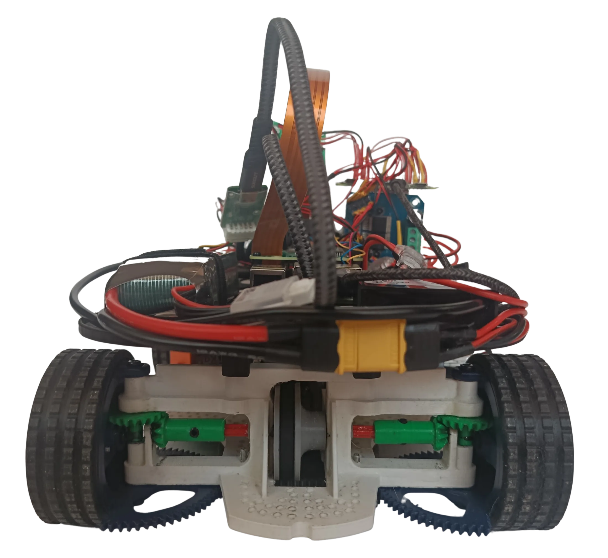
                                        <br>
                                        <i>Vista trasera de vTitan</i>
                                </p>
                        </td>
                </tr>
                <tr>
                        <td>
                                <p align="center">
                                        
                                        <br>
                                        <i>Vista derecha de vTitan</i>
                                </p>
                        </td>
                        <td>
                                <p align="center">
                                        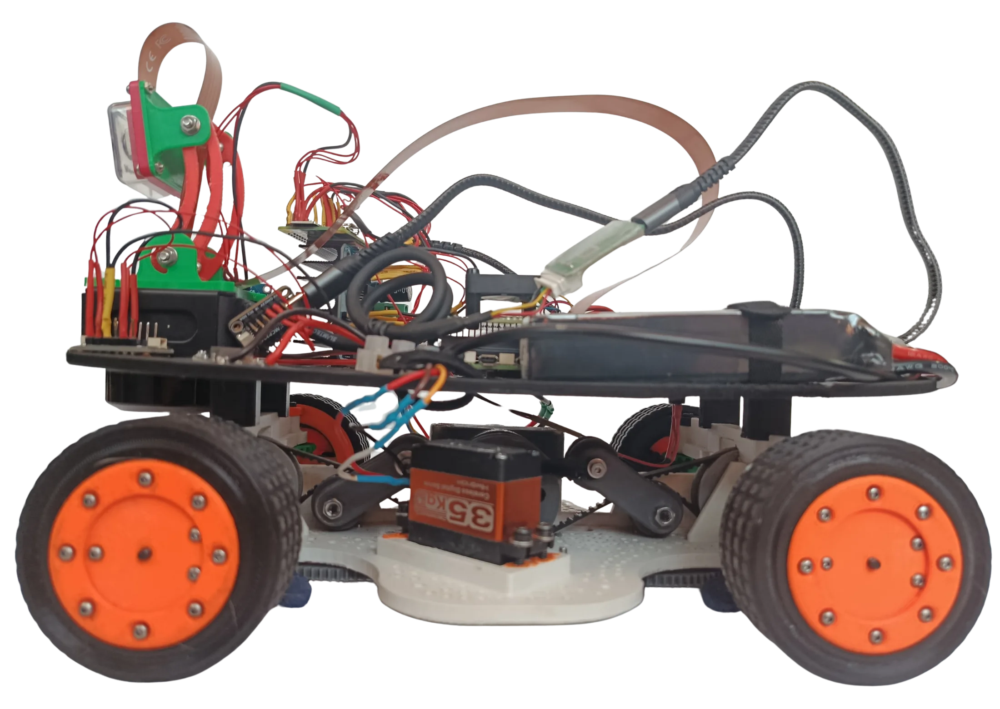
                                        <br>
                                        <i>Vista izquierda de vTitan</i>
                                </p>
                        </td>
                </tr>
                <tr>
                        <td>
                                <p align="center">
                                        
                                        <br>
                                        <i>Vista superior de vTitan</i>
                                </p>
                        </td>
                        <td>
                                <p align="center">
                                        
                                        <br>
                                        <i>Vista inferior de vTitan</i>
                                </p>
                        </td>
                </tr>
        </tbody>
</table>

</details>

vTitan es el **sucesor** de Klevor, participando en la temporada 2026 de la World Robot Olympiad en la categoría Futuros Ingenieros, con el Team Voltimor (anteriormente Team Steel Bot), y es un proyecto que se encuentra evolucionando hasta el día de hoy.

vTitan mejora en muchos aspectos con respecto a su predecesor, Klevor, con la mayoría de cambios siendo en el aspecto mecánico, ya que, una de nuestras metas principales era implementar un sistema de giro que permita el giro en 90 grados (o lo más cercano posible) para facilitar la estrategia para completar el Obstacle Challenge, además de esto, vTitan conserva muchos de los componentes electrónicos que utilizó Klevor, tales como la Raspberry Pi 5, y el RPLiDAR C1.

## Movilidad y diseño mecánico

Esta sección cubre la movilidad y el diseño mecánico: las restricciones de partida, cómo prototipamos, y la evolución del chasis, la transmisión y la dirección hasta su forma actual.

### Restricciones iniciales

* **Dimensiones y peso límite:** Máximo 300 mm (largo) 200 mm (ancho) 300 mm (alto) y un peso no mayor a 1500 g.

* **Reglamento de tracción y dirección:** Permitido tracción 4x4 impulsada por un **único motor** (o dos conectados en el mismo árbol de transmisión) y sistema de dirección para las 4 ruedas accionado por un **único servomotor**.

### Métodos de prototipaje

Para realizar nuestros prototipos, decidimos utilizar la impresión 3D como método principal, ya que ya éramos bastante familiares con todo el proceso, si bien el uso de máquinas CNC puede ser beneficioso para prototipos de esta categoría, decidimos optar por piezas pre-fabricadas o impresas en 3D, ya que nos permite minimizar el peso de vTitan, ya que el peso fue un problema recurrente en nuestros primeros prototipos, llegando a estar 200 gramos por encima del límite establecido.

Para poder diseñar e imprimir dichas piezas, utilizamos el programa de diseño 3D SolidWorks, ya que tiene una gran cantidad de funciones útiles para el diseño de prototipos mecánicos, y, era el programa con el que teníamos mejor afinidad.

### Evolución y justificación del diseño

Con las reglas claras, la idea rectora para elegir componentes fue la simplicidad: cubrir la mayor cantidad de funciones en pista con la menor cantidad de piezas. De ahí salió esta lista:

- **Navegación**: el [RPLiDAR C1](#rplidar-c1) delimita las paredes de la pista, y el [giroscopio BNO085](#imu-gy-bno085) aporta la orientación, que es lo que da autonomía en los cruces.
- **Percepción de obstáculos**: la [Raspberry Pi Camera Module 3 Wide](#raspberry-pi-camera-module-3-wide) por su campo de visión amplio, con la [Raspberry Pi 5](#raspberry-pi-5-16-gb-de-ram) y el [Raspberry Pi AI HAT+ (26 TOPS)](#raspberry-pi-ai-hat-26-tops) ejecutando el modelo de detección.
- **Actuación**: la [Raspberry Pi Zero 2 W](#raspberry-pi-zero-2-w) como controlador dedicado del [motor](#rev-hd-hex-motor) y el [servomotor](#servomotor-hiwonder-hps-3527sg-35-kgcm).
- **Energía**: la [batería](#batería-li-po-ovonic-air-de-111-v) y el convertidor a 5 V DC que alimenta la Raspberry Pi 5.

Con todos estos componentes en mente, queríamos implementar esta idea en un sistema de transmisión 4x4 con un sistema de dirección que permita generar el giro de 90 grados (o lo más cercano posible) hacia cualquier lado (izquierda o derecha) para permitir que la salida del estacionamiento en el Obstacle Challenge sea lo más fácil posible de programar, además de, cumplir con todas las reglas que tiene esta categoría, a través de pruebas y diseños, para efectos de esta documentación dividimos el proceso en cinco fases:

#### Fase 1: prototipo de rin estático, corona interna y guayas flexibles

<p align="center">
	
	<br>
	<i>Primer Prototipo del Sistema de Dirección</i>
</p>

* **Mecanismo de Rueda:** Nuestro primer prototipo fue un rin estático (es decir, la rueda sin el caucho exterior) que actúa como soporte/pivote en la tijera, mientras que el caucho exterior móvil incorpora una corona/cremallera interna accionada por piñones para transmitir tracción.

* **Transmisión de Dirección/Potencia:** Se implementaron **guayas flexibles** (cables de transmisión, tipo mototool/rotamil) para llevar el movimiento de rotación a la rueda soportando el ángulo extremo de 90 grados.

* **Caja de Engranajes Modular:** Diseñada para distribuir el movimiento de un solo motor hacia 4 guayas independientes.

* **Resultado:** Las pruebas aisladas confirmaron la viabilidad de la rotación y el pivoteo a 90 grados.

#### Fase 2: pruebas de integración y detección de fallas

<p align="center">
	
	<br>
	<i>Iteración de diseño en CAD entre prototipos impresos</i>
</p>

* **Sistema de Dirección:** Diseñamos una relación de palancas y piñones para la inversión de movimiento simultáneo. Se integraron **sensores Hall** para monitorear con precisión el ángulo de giro ante la necesidad de usar un servo de más de 360 grados.

* **Problemas detectados:**
  * Las barras de transmisión entre discos eran débiles: se doblaban, e incluso una llegó a quebrarse.
  * Las guayas generaban una tensión excesiva sobre el servomotor al ejecutar el giro.

* **Decisión:** Descartamos el sistema de guayas y palancas por ser complejo y pesado, buscando un mecanismo más ligero y directo.

#### Fase 3: rediseño a engranajes perpendiculares, coronas y correa dentada

<p align="center">
	
	<br>
	<i>Sistema de dirección por engranajes, vista inferior: coronas integradas a los rines</i>
</p>

* **Nuevo Sistema de Tracción:** Eliminación de guayas. Se optó por **engranajes perpendiculares** ajustando el punto de pivote sobre el centro de la rueda, manteniendo los 90 grados de giro sin perder tracción.

* **Optimización de la dirección:**
  * La primera prueba con líneas de piñones pequeños generó juego entre dientes (*backlash*) y movimiento errático.
  * Se reemplazaron por una **corona más grande integrada al rin**, que da una conexión directa y precisa accionada por el servomotor único.

* **Sincronización 4x4:** Se unificaron los árboles de transmisión delantero y trasero mediante una **correa dentada con poleas**, logrando accionar las 4 ruedas simultáneamente con un solo motor.

#### Fase 4: optimización de peso, integración y chasis final

<p align="center">
	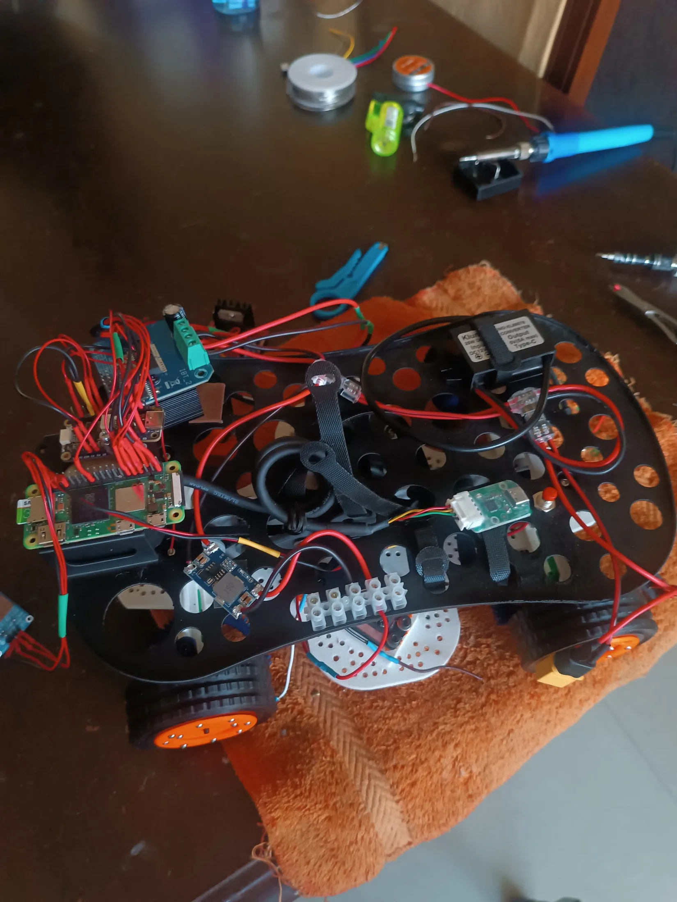
	<br>
	<i>Integración de la electrónica sobre el monochasis agujereado</i>
</p>

* **Distribución de Componentes:** Se diseñó una plataforma elevada para separar la electrónica de la mecánica. Esta posición permitió ubicar el RPLiDAR con unos 270° de arco útil: 230° continuos hacia el frente y los costados, más una ventana de unos 40° justo hacia atrás. Las cuñas que el propio chasis ocluye están medidas y declaradas en `src/config/navigation/sensors/lidar_sectors.toml`.

* **Control de Peso (1500 g):** al ensamblar el conjunto se detectó un exceso de 150 g, ya por debajo de los 200 g con los que arrancó el primer prototipo.

* **Acciones correctivas:**
  * Materiales de impresión más ligeros, como el ASA (acrilonitrilo estireno acrilato).
  * Reducción de la densidad de relleno en la impresión 3D.
  * Menor espesor de pared y vacíos estructurales en chasis, rines y bancadas, sin comprometer la rigidez.

* **Resultado Final:** Se logró ingresar dentro del rango de peso reglamentario y consolidar un chasis rígido impreso en 3D con soportes dedicados para la electrónica.

#### Fase 5: integración del REV HD Hex Motor

<p align="center">
	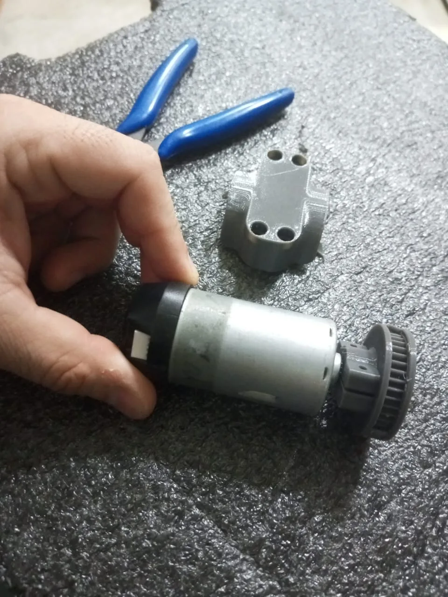
	<br>
	<i>Integración del REV HD Hex Motor al Sistema de Transmisión</i>
</p>

* **Nuevo Motor**: tras el montaje final se detectó que el motor previo, un motor reductor genérico de 1500 rpm con encoder, no daba el torque necesario. Movía a vTitan, pero su techo de velocidad medido en pista era de **0.156 m/s** (unos 15 cm/s), con el que el robot no completaba los desafíos dentro del límite de tiempo. La solución más simple y efectiva fue sustituirlo por un **REV HD Hex Motor**, con 6000 rpm sin carga y 0.105 Nm de torque de bloqueo.

* **Resultado Final**: Tras adaptar el chasis inferior para el encaje del HD Hex Motor, la velocidad en pista subió de los 15 cm/s del motor anterior a 25-30 cm/s, y más tarde, al corregir el encoder, se descubrió que el techo real era de ~58 cm/s (ver [Velocidad: teórica contra real](#velocidad-teórica-contra-real)). De esta manera, vTitan tiene la velocidad necesaria para completar los desafíos sin exceder el tiempo límite establecido de 3 minutos.

### Sistema de transmisión

<p align="center">
	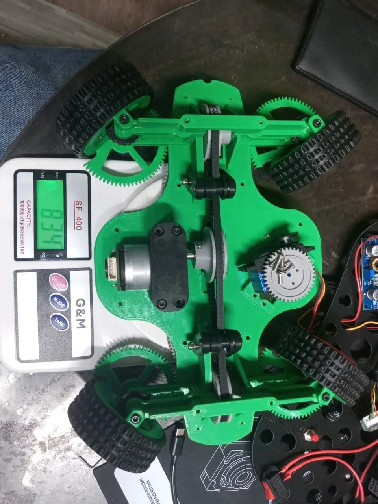
	<br>
	<i>Sistema de Transmisión, visto desde arriba</i>
</p>

Para poder diseñar nuestro sistema de transmisión, tuvimos que tener en cuenta nuestra meta inicial de nuestro alcance de dirección, para poder transmitir el movimiento del motor hacia las ruedas aun cuando estén rotadas a un ángulo de 90 grados. 

Nuestro sistema de transmisión es 4x4 para maximizar la tracción en cada rueda, y lo gobierna un único motor. Del motor salen dos correas dentadas, una hacia el eje delantero y otra hacia el trasero, montados sobre pernos de transmisión de LEGO. Cada eje reparte el giro a un tren de engranajes cónicos por rueda, y el último de ellos engrana directamente con la corona interna de la rueda: en lugar de un caucho liso, la rueda recibe la tracción por sus propios dientes. Así las cuatro reciben la misma potencia. El rin no transmite nada; su función es sostener la corona y los engranajes cónicos. Los dientes de cada etapa están en la [tabla de relaciones](#relación-de-torque-y-velocidad).

### Sistema de dirección

<p align="center">
	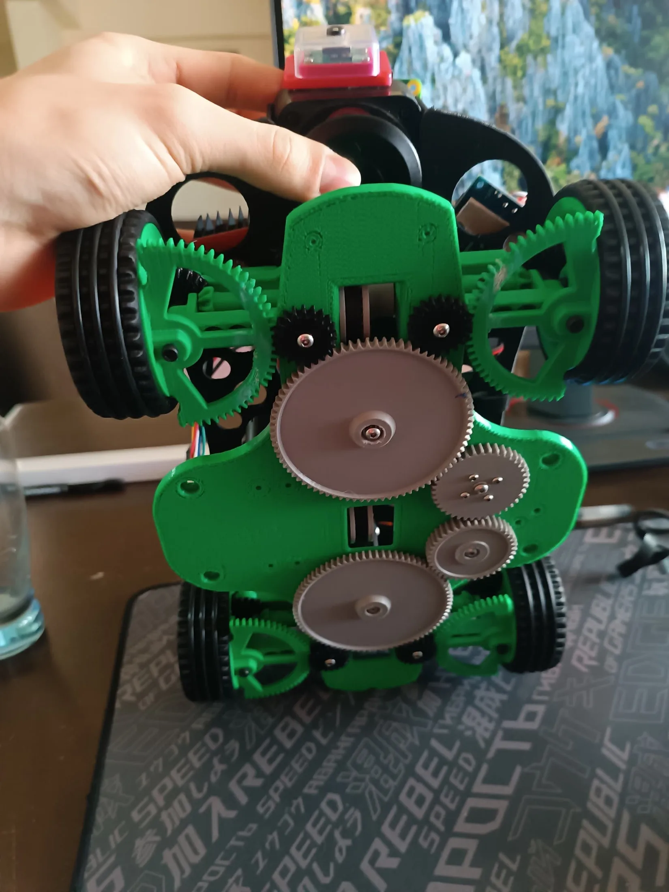
	<br>
	<i>Sistema de Dirección, visto desde arriba</i>
</p>

Como ya se ha mencionado previamente, nuestra meta principal con nuestro sistema de dirección es tener un giro de 90 grados para facilitar la ruta en pista, para lograr esto, tuvimos que replantear la solución mecánica de Klevor desde cero. 

<p align="center">
	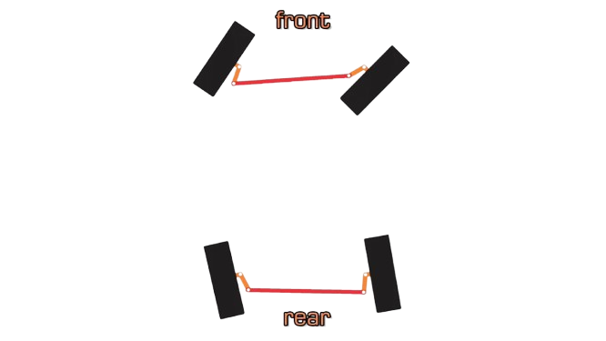
	<br>
	<i>Ejemplo de sistema de dirección en contrafase</i>
</p>

vTitan usa **dirección en contrafase**: las ruedas traseras giran en sentido opuesto a las delanteras, lo que reduce mucho el radio de giro y facilita maniobras como el estacionamiento y los giros cerrados, importantes en el Obstacle Challenge.

Todo el movimiento se transmite por engranajes, y los rines actúan a la vez como soporte y como actuador, porque llevan una base dentada. El precio es el par: al dirigir cuatro ruedas motrices, el servomotor tiene que vencer mucha más resistencia, y por eso sustituimos el servo anterior de 14 kg·cm por uno de 35 kg·cm.

En cuanto al mecanismo, en primer lugar al servo le implementamos un eje de 20 dientes, el cual se conecta luego a otro engranaje de 20 dientes para transmitir ese mismo movimiento pero en dirección opuesta, cada engranaje de 20 dientes luego transmite su movimiento a un engranaje de 40 dientes, el cual conecta con el engranaje individual que conecta finalmente con cada rueda, ya sean delanteras o traseras.

<p align="center">
	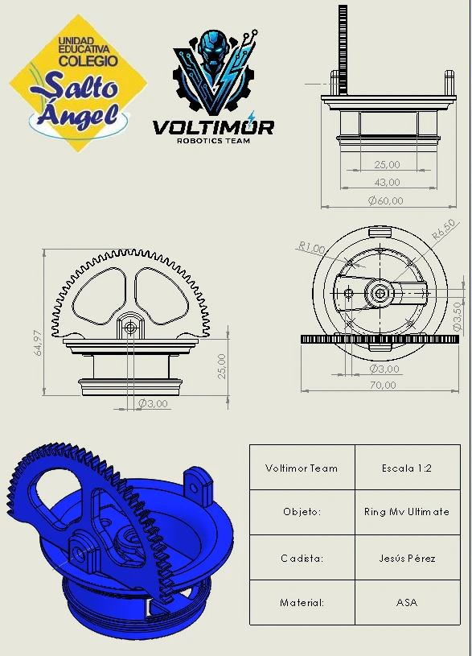
	<br>
	<i>Ring de 33 dientes</i>
</p>

También es importante recalcar la base dentada del rin de las ruedas, o mejor dicho, el piñón de dirección de la misma, debido a que el sistema de transmisión de vTitan en lugar de utilizar engranajes diferenciales estándar, utiliza una transmisión por engranajes a cada rueda, lo que permite que la rueda pueda seguir recibiendo la tracción aún cuando está a 90 grados.

**Radio de giro: predicho contra medido.** El simulador originalmente permitía radios de giro virtualmente ilimitados (hasta ~8 mm), muy por debajo de lo que la geometría real puede cumplir. La medición en banco del chasis real fijó el radio mínimo en **0.29 m**, y ese valor vive ahora como límite duro (`MIN_TURN_RADIUS_M` en `src/config/`) tanto en la simulación como en el controlador: el simulador ya no aprueba curvas que el chasis no puede trazar. La consecuencia práctica se midió después sobre bags reales: entre 57 y 59% de los pasos del pure pursuit exigían un radio menor al que el chasis puede entregar, lo que disparaba el corte de velocidad por rumbo; el corrector que descarta puntos de mira inalcanzables (`MIN_TARGET_RADIUS_M`, medido y aceptado en A/B sobre 128 casos) nació de esa medición. Es la diferencia entre diseñar contra un chasis que existe y uno que no.

<!-- HUECO (rubro WRO 2026, criterio 1 "Opciones del sistema de dirección").
Falta la comparación explícita Ackermann contra contrafase: por qué se descartó
Ackermann y qué se ganó con contrafase (giro de 90 grados para la salida del
estacionamiento). El diagrama schemes/ackermann-steering-system.webp existe y
schemes/README.md lo cataloga, pero esta sección todavía no lo usa. -->

### Estructura mecánica

El chasis de vTitan se reparte en dos piezas con responsabilidades distintas: el chasis inferior, que sostiene la transmisión y la dirección, y el monochasis, que cierra el conjunto y fija la electrónica.

#### Chasis inferior

<p align="center">
	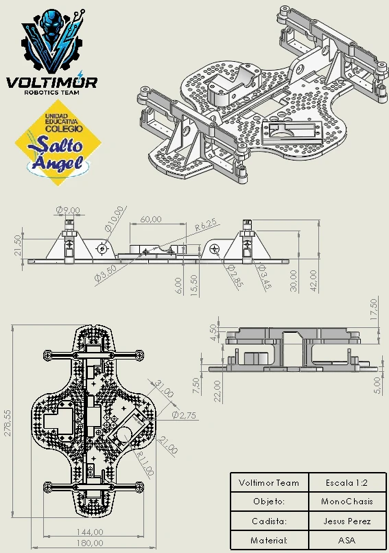
	<br>
	<i>Chasis Inferior</i>
</p>

El chasis inferior es donde se implementan la transmisión y la dirección. Su rasgo más visible es la forma agujereada, que responde a las limitaciones de peso que arrastraba el primer prototipo. En el centro lleva dos encajes, uno para el motor y otro para el servomotor; en los extremos, los encajes de los ejes de transmisión, que usan pernos de LEGO para garantizar una unión rígida entre componentes y chasis.

#### Monochasis

**Dimensiones.** El conjunto ensamblado mide **300 × 194 × 100 mm** (largo × ancho × alto, medidos), con margen sobre los límites reglamentarios de 300 × 200 × 300 mm. El peso final dependió de la batería: con la de prácticas y sus conectores Deans el conjunto quedó en **~1510 g**, apenas por encima del límite de 1500 g, y el paso a la batería de competencia (shorty XT60, 46 g menos) junto con el cambio de conectores lo bajó a **~1460 g**, dentro del límite con ~40 g de margen. La geometría que consume el control (distancia entre ejes (wheelbase) de 0.19 m, vía de 0.1675 m entre ruedas, ruedas de 0.07 m de diámetro) reside en `src/config/robot.toml` como fuente única, y es la misma que usan la simulación, la TF estática y el generador de Gazebo.

### Montaje

<p align="center">
	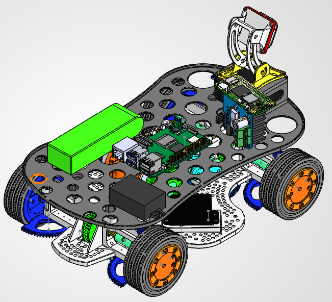
	<br>
	<i>Conjunto ensamblado, renderizado desde el CAD</i>
</p>

Y el mismo conjunto despiezado, del mismo modelo de SolidWorks del que se exportan los archivos de [`models/vtitan/`](models/README.md):

<p align="center">
	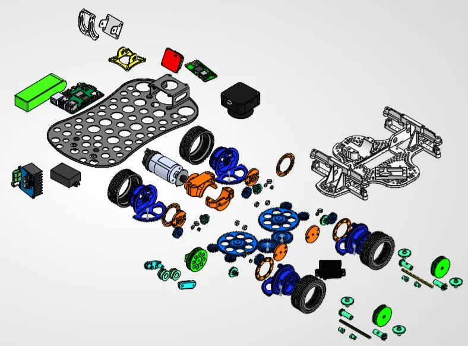
	<br>
	<i>Vista despiezada de vTitan: chasis inferior, tren de transmisión, sistema de dirección y electrónica</i>
</p>

La misma vista despiezada con cada pieza numerada, y su tabla de elementos desplegable con el enlace a cada archivo disponible (el número de la tabla corresponde al globo de la vista):

<p align="center">
	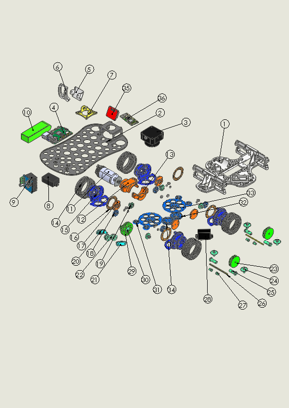
	<br>
	<i>Vista despiezada numerada: cada globo enlaza con la tabla de elementos</i>
</p>

<details>
<summary><b>Tabla de elementos (39 piezas)</b></summary>

<table align="center">
<thead>
<tr>
<th align="center">N°</th>
<th align="left">Pieza</th>
<th align="center">Cantidad</th>
<th align="left">STL</th>
<th align="left">STEP</th>
</tr>
</thead>
<tbody>
<tr>
<td align="center">1</td>
<td align="left">Monochasis v3</td>
<td align="center">1</td>
<td align="left"><a href="models/vtitan/stl-files/monochasis-v3.stl">STL</a></td>
<td align="left">pendiente</td>
</tr>
<tr>
<td align="center">2</td>
<td align="left">Ring Mv v2</td>
<td align="center">4</td>
<td align="left"><a href="models/vtitan/stl-files/ring-mv-v2.stl">STL</a></td>
<td align="left">pendiente</td>
</tr>
<tr>
<td align="center">3</td>
<td align="left">Rueda vTitan</td>
<td align="center">4</td>
<td align="left"><a href="models/vtitan/stl-files/rueda-vtitan.stl">STL</a></td>
<td align="left">pendiente</td>
</tr>
<tr>
<td align="center">4</td>
<td align="left">Piñón de 40 dientes de dirección</td>
<td align="center">2</td>
<td align="left">pendiente</td>
<td align="left"><a href="models/vtitan/step-files/pinon-40-dientes-direccion.step">STEP</a></td>
</tr>
<tr>
<td align="center">5</td>
<td align="left">Piñón de 20 dientes de dirección (v2)</td>
<td align="center">4</td>
<td align="left"><a href="models/vtitan/stl-files/pinon-20-dientes-direccion-v2.stl">STL</a></td>
<td align="left">pendiente</td>
</tr>
<tr>
<td align="center">6</td>
<td align="left">Cubierta de ring</td>
<td align="center">4</td>
<td align="left"><a href="models/vtitan/stl-files/cubierta-de-ring.stl">STL</a></td>
<td align="left"><a href="models/vtitan/step-files/cubierta-de-ring.step">STEP</a></td>
</tr>
<tr>
<td align="center">7</td>
<td align="left">Aro de fijación axial de caucho</td>
<td align="center">4</td>
<td align="left"><a href="models/vtitan/stl-files/aro-de-fijacion-axial-de-caucho.stl">STL</a></td>
<td align="left"><a href="models/vtitan/step-files/aro-de-fijacion-axial-de-caucho.step">STEP</a></td>
</tr>
<tr>
<td align="center">8</td>
<td align="left">Buje guía de cruceta</td>
<td align="center">4</td>
<td align="left"><a href="models/vtitan/stl-files/buje-guia-de-cruceta.stl">STL</a></td>
<td align="left"><a href="models/vtitan/step-files/buje-guia-de-cruceta.step">STEP</a></td>
</tr>
<tr>
<td align="center">9</td>
<td align="left">Base del sistema de transmisión (corto)</td>
<td align="center">2</td>
<td align="left">pendiente</td>
<td align="left"><a href="models/vtitan/step-files/base-de-sistema-de-transmision-corto.step">STEP</a></td>
</tr>
<tr>
<td align="center">10</td>
<td align="left">Piñón de 33 dientes de correa</td>
<td align="center">2</td>
<td align="left"><a href="models/vtitan/stl-files/pinon-33-dientes-correa-dentada.stl">STL</a></td>
<td align="left"><a href="models/vtitan/step-files/pinon-33-dientes-correa-dentada.step">STEP</a></td>
</tr>
<tr>
<td align="center">11</td>
<td align="left">Piñón de 40 dientes de servo, con cajera</td>
<td align="center">1</td>
<td align="left"><a href="models/vtitan/stl-files/pinon-40-dientes-servo-cajera.stl">STL</a></td>
<td align="left"><a href="models/vtitan/step-files/pinon-40-dientes-servo-cajera.step">STEP</a></td>
</tr>
<tr>
<td align="center">12</td>
<td align="left">Piñón de 40 dientes de dirección, arrastre</td>
<td align="center">1</td>
<td align="left"><a href="models/vtitan/stl-files/pinon-40-dientes-direccion-arrastre.stl">STL</a></td>
<td align="left">pendiente</td>
</tr>
<tr>
<td align="center">13</td>
<td align="left">Servo de dirección (INJORA 14 kg)</td>
<td align="center">1</td>
<td align="left">pendiente</td>
<td align="left">pendiente</td>
</tr>
<tr>
<td align="center">14</td>
<td align="left">Piñón 90 de cruceta, 10 dientes</td>
<td align="center">4</td>
<td align="left"><a href="models/vtitan/stl-files/pinon-90-cruceta-10-dientes.stl">STL</a></td>
<td align="left"><a href="models/vtitan/step-files/pinon-90-cruceta-10-dientes.step">STEP</a></td>
</tr>
<tr>
<td align="center">15</td>
<td align="left">Piñón cónico de 20 dientes</td>
<td align="center">4</td>
<td align="left"><a href="models/vtitan/stl-files/pinon-conico-20-dientes.stl">STL</a></td>
<td align="left"><a href="models/vtitan/step-files/pinon-conico-20-dientes.step">STEP</a></td>
</tr>
<tr>
<td align="center">16</td>
<td align="left">Rolinera 3 x 7 x 2</td>
<td align="center">8</td>
<td align="left">pendiente</td>
<td align="left"><a href="models/vtitan/step-files/rolinera-3-7-2.step">STEP</a></td>
</tr>
<tr>
<td align="center">17</td>
<td align="left">Rolinera 6.35 x 9.525 x 3.175</td>
<td align="center">5</td>
<td align="left">pendiente</td>
<td align="left"><a href="models/vtitan/step-files/rolinera-6.35-9.525-3.175.step">STEP</a></td>
</tr>
<tr>
<td align="center">18</td>
<td align="left">Piñón de 20 dientes de rueda dentada (v2)</td>
<td align="center">4</td>
<td align="left"><a href="models/vtitan/stl-files/pinon-20-dientes-rueda-dentada-v2.stl">STL</a></td>
<td align="left">pendiente</td>
</tr>
<tr>
<td align="center">19</td>
<td align="left">Piñón cónico 15 x 8 dientes</td>
<td align="center">4</td>
<td align="left"><a href="models/vtitan/stl-files/pinon-conico-15x8-dientes.stl">STL</a></td>
<td align="left"><a href="models/vtitan/step-files/pinon-conico-15x8-dientes.step">STEP</a></td>
</tr>
<tr>
<td align="center">20</td>
<td align="left">Cámara Camera Module 3 v8</td>
<td align="center">1</td>
<td align="left">pendiente</td>
<td align="left"><a href="models/vtitan/step-files/camera-module-3-v8.step">STEP</a></td>
</tr>
<tr>
<td align="center">21</td>
<td align="left">Batería Ovonic Air Li-Po</td>
<td align="center">1</td>
<td align="left">pendiente</td>
<td align="left"><a href="models/vtitan/step-files/ovonic-air-lipo-battery.step">STEP</a></td>
</tr>
<tr>
<td align="center">22</td>
<td align="left">Raspberry Pi 5</td>
<td align="center">1</td>
<td align="left">pendiente</td>
<td align="left"><a href="models/vtitan/step-files/raspberry-pi-5.step">STEP</a></td>
</tr>
<tr>
<td align="center">23</td>
<td align="left">RPLiDAR C1</td>
<td align="center">1</td>
<td align="left">pendiente</td>
<td align="left"><a href="models/vtitan/step-files/rplidar-c1.step">STEP</a></td>
</tr>
<tr>
<td align="center">24</td>
<td align="left">Suplemento de bancada de motor pequeño</td>
<td align="center">1</td>
<td align="left"><a href="models/vtitan/stl-files/suplemento-de-bancada-motor-pequeno.stl">STL</a></td>
<td align="left">pendiente</td>
</tr>
<tr>
<td align="center">25</td>
<td align="left">Motor REV-41-1600</td>
<td align="center">1</td>
<td align="left">pendiente</td>
<td align="left">pendiente</td>
</tr>
<tr>
<td align="center">26</td>
<td align="left">Engranaje unificado de motor REV, 36 dientes</td>
<td align="center">1</td>
<td align="left"><a href="models/vtitan/stl-files/engranaje-unificado-motor-rev-36-dientes.stl">STL</a></td>
<td align="left">pendiente</td>
</tr>
<tr>
<td align="center">27</td>
<td align="left">Tapa de bancada de motor REV</td>
<td align="center">1</td>
<td align="left"><a href="models/vtitan/stl-files/tapa-de-bancada-motor-rev.stl">STL</a></td>
<td align="left">pendiente</td>
</tr>
<tr>
<td align="center">28</td>
<td align="left">Brazo de tensor v2 largo</td>
<td align="center">1</td>
<td align="left"><a href="models/vtitan/stl-files/brazo-de-tensor-v2-largo.stl">STL</a></td>
<td align="left">pendiente</td>
</tr>
<tr>
<td align="center">29</td>
<td align="left">Rodillo tensor v2</td>
<td align="center">2</td>
<td align="left"><a href="models/vtitan/stl-files/rodillo-tensor-v2.stl">STL</a></td>
<td align="left">pendiente</td>
</tr>
<tr>
<td align="center">30</td>
<td align="left">Brazo de tensor v3</td>
<td align="center">1</td>
<td align="left"><a href="models/vtitan/stl-files/brazo-de-tensor-v3.stl">STL</a></td>
<td align="left">pendiente</td>
</tr>
<tr>
<td align="center">31</td>
<td align="left">Soporte superior</td>
<td align="center">1</td>
<td align="left"><a href="models/vtitan/stl-files/soporte-superior.stl">STL</a></td>
<td align="left"><a href="models/vtitan/step-files/soporte-superior.step">STEP</a></td>
</tr>
<tr>
<td align="center">32</td>
<td align="left">Carcasa de la cámara</td>
<td align="center">1</td>
<td align="left">pendiente</td>
<td align="left">pendiente</td>
</tr>
<tr>
<td align="center">33</td>
<td align="left">Soporte inferior de cámara</td>
<td align="center">1</td>
<td align="left"><a href="models/vtitan/stl-files/soporte-camara-inferior.stl">STL</a></td>
<td align="left">pendiente</td>
</tr>
<tr>
<td align="center">34</td>
<td align="left">Soporte de cámara superior</td>
<td align="center">1</td>
<td align="left"><a href="models/vtitan/stl-files/soporte-camara-superior.stl">STL</a></td>
<td align="left">pendiente</td>
</tr>
<tr>
<td align="center">35</td>
<td align="left">Soporte de cámara, brazo intermedio</td>
<td align="center">1</td>
<td align="left"><a href="models/vtitan/stl-files/soporte-camara-brazo-intermedio.stl">STL</a></td>
<td align="left">pendiente</td>
</tr>
<tr>
<td align="center">36</td>
<td align="left">Raspberry Pi Zero 2 W</td>
<td align="center">1</td>
<td align="left">pendiente</td>
<td align="left">pendiente</td>
</tr>
<tr>
<td align="center">37</td>
<td align="left">Klunox</td>
<td align="center">1</td>
<td align="left">pendiente</td>
<td align="left">pendiente</td>
</tr>
<tr>
<td align="center">38</td>
<td align="left">Sensor de color APDS9960</td>
<td align="center">1</td>
<td align="left">pendiente</td>
<td align="left">pendiente</td>
</tr>
<tr>
<td align="center">39</td>
<td align="left">Puente H IBT-2 (BTS7960)</td>
<td align="center">1</td>
<td align="left">pendiente</td>
<td align="left">pendiente</td>
</tr>
</tbody>
</table>

> [!NOTE]
> **pendiente** significa que el archivo todavía no está publicado en `models/` y queda por agregar.

</details>

El conjunto se ordena en tres capas: el **chasis inferior** perforado sostiene el motor y el servomotor en sus encajes centrales; sobre él se monta el **tren de transmisión** (correas dentadas hacia los dos ejes, y de cada eje a los engranajes cónicos de cada rueda); y el **monochasis** cierra el conjunto y fija la electrónica. Los ejes usan pernos de transmisión de LEGO, elegidos por su ajuste rígido y porque evitan mecanizar un eje a medida.

#### Las piezas, y cómo mirarlas

Publicamos cada pieza en **dos formatos**, porque sirven para cosas distintas:

<table align="center">
<thead>
<tr>
<th align="left">Formato</th>
<th align="left">Archivos</th>
<th align="left">Para qué</th>
</tr>
</thead>
<tbody>
<tr>
<td align="left"><a href="models/vtitan/step-files/"><code>step-files/</code></a></td>
<td align="left">29 <code>.step</code></td>
<td align="left"><strong>Fabricar y editar.</strong> Conserva la geometría exacta, así que se puede reabrir y modificar en cualquier CAD</td>
</tr>
<tr>
<td align="left"><a href="models/vtitan/stl-files/"><code>stl-files/</code></a></td>
<td align="left">47 <code>.stl</code></td>
<td align="left"><strong>Imprimir y mirar.</strong> GitHub renderiza los <code>.stl</code> en un <strong>visor 3D interactivo</strong>: pincha cualquiera y podrás girarlo, desplazarlo y acercarlo en el navegador, sin instalar nada</td>
</tr>
</tbody>
</table>

Una pieza que existe en los dos formatos **lleva el mismo nombre** en ambos, que es lo que permite emparejarlas de un vistazo. 17 de las 29 piezas en `.step` tienen su `.stl`; las 12 restantes son componentes comerciales (Raspberry Pi 5, cámara, RPLiDAR, batería, rodamientos) que modelamos para el ensamblaje virtual y nunca se imprimen.

Algunas piezas para empezar, cada enlace abre el visor 3D de GitHub:

<table align="center">
<thead>
<tr>
<th align="center">Vista</th>
<th align="left">Pieza</th>
<th align="left">Subsistema</th>
</tr>
</thead>
<tbody>
<tr>
<td align="center"><a href="models/vtitan/stl-files/rueda-vtitan.stl">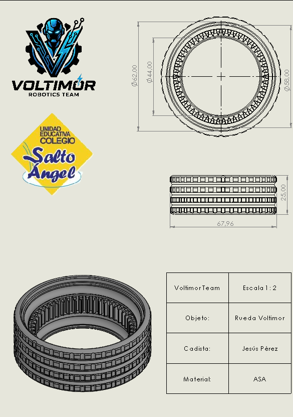</a></td>
<td align="left"><a href="models/vtitan/stl-files/rueda-vtitan.stl"><code>rueda-vtitan.stl</code></a></td>
<td align="left">La rueda con corona dentada interna</td>
</tr>
<tr>
<td align="center"><a href="models/vtitan/stl-files/pinon-90-cruceta-10-dientes.stl">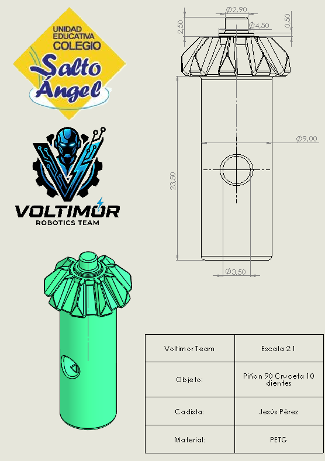</a></td>
<td align="left"><a href="models/vtitan/stl-files/pinon-90-cruceta-10-dientes.stl"><code>pinon-90-cruceta-10-dientes.stl</code></a></td>
<td align="left">El engranaje cónico que lleva la tracción a la rueda a 90°</td>
</tr>
<tr>
<td align="center"><a href="models/vtitan/stl-files/pinon-33-dientes-correa-dentada.stl">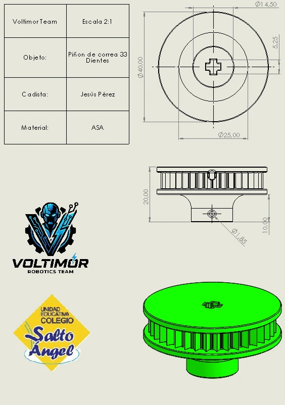</a></td>
<td align="left"><a href="models/vtitan/stl-files/pinon-33-dientes-correa-dentada.stl"><code>pinon-33-dientes-correa-dentada.stl</code></a></td>
<td align="left">El piñón de correa de 33 dientes, la entrada de la tracción</td>
</tr>
<tr>
<td align="center"><a href="models/vtitan/stl-files/pinon-40-dientes-servo-cajera.stl">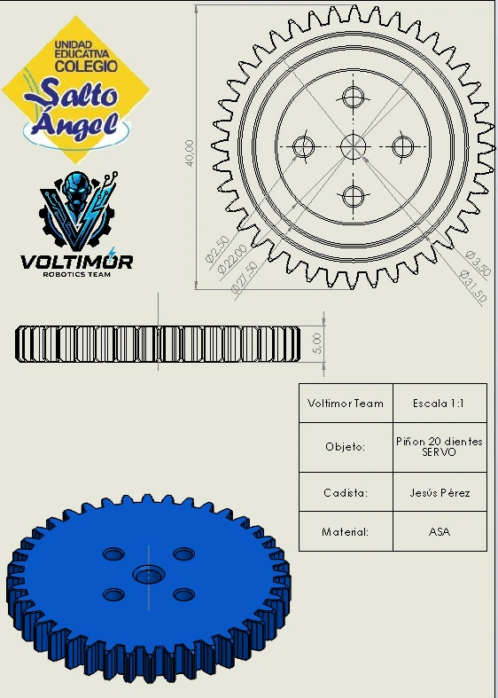</a></td>
<td align="left"><a href="models/vtitan/stl-files/pinon-40-dientes-servo-cajera.stl"><code>pinon-40-dientes-servo-cajera.stl</code></a></td>
<td align="left">El piñón del eje del servo, la entrada de la dirección</td>
</tr>
<tr>
<td align="center"><a href="models/vtitan/stl-files/brazo-de-tensor-v2.stl">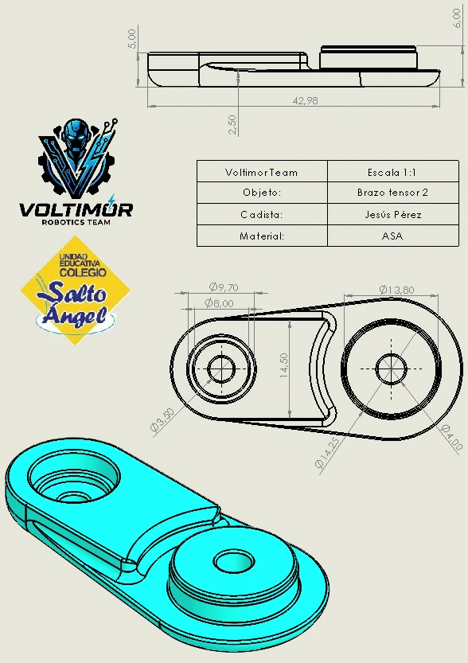</a></td>
<td align="left"><a href="models/vtitan/stl-files/brazo-de-tensor-v2.stl"><code>brazo-de-tensor-v2.stl</code></a></td>
<td align="left">El tensor que mantiene la correa dentada</td>
</tr>
<tr>
<td align="center">(sin plano)</td>
<td align="left"><a href="models/vtitan/stl-files/monochasis-v3.stl"><code>monochasis-v3.stl</code></a></td>
<td align="left">La estructura que cierra el conjunto (última iteración)</td>
</tr>
</tbody>
</table>

La miniatura es el plano acotado de la pieza, y **tanto la miniatura como el nombre abren el visor 3D de GitHub**. Un `.stl` no se puede incrustar en Markdown: GitHub solo lo renderiza en la página del propio archivo, así que el enlace es la única forma de llegar al visor.

El inventario completo, subsistema por subsistema, está en [`models/README.md`](models/README.md).

<!-- HUECO (rubro WRO 2026, criterio 1 "Montaje", lo que sigue faltando).
La vista despiezada y el inventario de piezas ya están arriba, pero falta lo que
hace el montaje REPRODUCIBLE: orden de armado paso a paso, tornillería (métrica y
longitud por posición), par de apriete, y los parámetros de impresión por pieza
(material, altura de capa, relleno, soportes, orientación de cama). -->

### Relación de torque y velocidad

Ahora bien, en el caso de vTitan, este utiliza un [REV HD Hex Motor](#rev-hd-hex-motor), el cual tiene un torque de bloqueo (es decir, su torque máximo) de 0.105 Nm, y una velocidad sin carga de 6000 RPM, ahora bien, ¿cómo podemos saber si este torque es necesario para mover a vTitan?

La fórmula general para calcular el torque necesario es:

$$T = \frac{m \cdot \left( a + g \cdot \left( \mu \cos\theta + \sin\theta \right) \right) \cdot r}{N}$$

Donde:

- $m$ es la masa del vehículo (en kg; en vTitan son **~1.51 kg con la batería de prácticas y ~1.46 kg con la de competencia**, medidos en el robot ensamblado). La simulación usa 1.5 kg fijos (`src/config/robot.toml`: chasis de 1.3 kg más 4 ruedas de 0.05 kg), un punto medio conservador entre ambas configuraciones: calcular con la masa mayor nunca subestima el torque necesario
- $r$ es el radio de la rueda (en metros; en vTitan mide $0.035\ \text{m}$)
- $a$ es la aceleración deseada. La **medimos sobre bags MCAP de pista real**: la derivada de la velocidad del encoder (`/motor/drive_speed`) sobre 5 carreras recientes da una aceleración sostenida de **~1.0 m/s²** (muy consistente: 0.93-1.09 en los 5 bags) y una rampa de arranque desde reposo de **~0.4 m/s²**. Usamos $a = 1.0\ \text{m/s}^2$, el caso conservador
- $g$ es la gravedad, $9.81\ \text{m/s}^2$
- $\mu$ es el coeficiente de fricción (estimamos $0.3$ para ruedas de ASA sobre lona de PVC flexible)
- $\theta$ es el ángulo de inclinación ($\theta = 0°$ en esta competición)
- $N$ es el número de motores en tracción (en vTitan solo hay uno)

Al efectuar toda la operación obtenemos como resultado que se necesita un torque mínimo de $0.207\ \text{Nm}$ para que vTitan sostenga la aceleración medida ($1.0\ \text{m/s}^2$). Para referencia: con solo fricción ($a = 0$) el requerimiento baja a $0.155\ \text{Nm}$, y con la rampa de arranque ($0.4\ \text{m/s}^2$) a $0.176\ \text{Nm}$.

Así que, como el torque de bloqueo del motor ($0.105\ \text{Nm}$) es menor al torque mínimo ($0.207\ \text{Nm}$), es evidente que el motor por sí solo no podría mover a vTitan sin utilizar algún método para aumentar el torque del motor de forma mecánica, la manera en la que resolvimos este problema es mediante las relaciones de engranajes, las cuales operan mediante la siguiente formula:

<p align="center">
	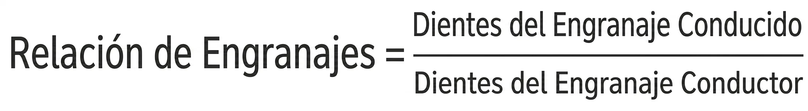
	<br>
	<i>Relación de Engranajes</i>
</p>

El torque final, o de salida será igual a la multiplicación del torque inicial por la misma relación de engranajes total, ahora, simplemente hay que calcular la relación de transmisión total, para la cual simplemente calculamos cada relación individual y se efectúa el producto de ese conjunto:

| Etapa | Transmisión | Relación |
|-------|-------------|----------|
| 1 | Eje del motor (50 dientes) → correa hacia cada eje (33 dientes) | $i_1 = 33/50 = 0.66$ |
| 2 | Pernos de transmisión de LEGO con engranaje cónico de 10 dientes → engranaje de 20 dientes | $i_2 = 20/10 = 2$ |
| 3 | Engranaje de 20 dientes → engranaje de 15 dientes | $i_3 = 15/20 = 0.75$ |
| 4 | Engranaje de 15 dientes → engranaje de 20 dientes | $i_4 = 20/15 \approx 1.33$ |
| 5 | Engranaje de 20 dientes → rueda dentada de 50 dientes | $i_5 = 50/20 = 2.5$ |

La relación de transmisión total es el producto de las cinco etapas:

$$R_{total} = i_1 \cdot i_2 \cdot i_3 \cdot i_4 \cdot i_5 = 0.66 \cdot 2 \cdot 0.75 \cdot 1.33 \cdot 2.5 = 3.29$$

Y el torque de bloqueo final:

$$T_{final} = T_{stall} \cdot R_{total} = 0.105\ \text{Nm} \cdot 3.29 = 0.345\ \text{Nm}$$

Una recomendación habitual para los motores DC es utilizar el 50% de su torque de bloqueo para aceleraciones y tramos cortos, ahora bien, $0.345 \cdot 0.5 = 0.173\ \text{Nm}$, que queda por debajo del requerimiento con la aceleración sostenida medida ($0.207\ \text{Nm}$). Esto no invalida el diseño, y los bags lo confirman: la recomendación del 50% es para **funcionamiento continuo prolongado** (donde el calentamiento del devanado manda), mientras que la demanda real de una ronda es de tramos cortos de aceleración entre cruces; para eso están los picos de torque que los motores DC toleran por breves segundos. Contra el torque de bloqueo completo ($0.345\ \text{Nm}$), el margen es holgado incluso con $a = 1.0\ \text{m/s}^2$. La prueba final es empírica: los mismos bags de donde salió la aceleración muestran al robot sosteniendo esos $1.0\ \text{m/s}^2$ en pista, con este mismo motor y esta misma relación. Además, a medida que el vehículo gana velocidad, el coeficiente de fricción disminuye considerablemente (alrededor de un 15%), por lo que el torque necesario baja y es más fácil que el vehículo gane aceleración.

#### Velocidad: teórica contra real

El lado de la velocidad se verifica igual que el del torque: predicción, medición y explicación de la brecha.

**Techo cinemático.** Con el motor a su velocidad sin carga de 6000 RPM y la relación total $R_{total} = 3.29$, las ruedas girarían a $6000 / 3.29 \approx 1824$ RPM; con ruedas de 0.07 m de diámetro:

$$v_{teórico} = \frac{1824}{60} \cdot \pi \cdot 0.07 \approx 6.7\ \text{m/s}$$

**Medición en banco, con carga.** El motor nunca ve 6000 RPM en pista. La ley medida en banco (cargado, cinta métrica contra lo que el encoder cree recorrer) es afín: $\text{rpm} = 434.6 \cdot \text{duty} - 86.7$ ($R^2 = 0.9999$), con zona muerta en duty 0.200 y un techo físico de 348 RPM de rueda a duty 1.0, es decir **1.28 m/s**. El robot opera además con el ciclo de trabajo limitado al 50% por térmica, y los perfiles de velocidad de carrera (CREEP/SLOW/MEDIUM/FAST) viven dentro de ese presupuesto: la prealimentación afín `duty = 0.20 + 0.8 · rpm/max_rpm` (medida, con la misma zona muerta) les asigna ciclos de trabajo de 0.295 a 0.419.

**Resultado en pista.** El techo real medido es **~0.58 m/s**. No es un límite físico del motor: es el resultado combinado del tope del 50% de duty, de la zona muerta con carga (20% del duty se gasta en vencer la fricción) y de los perfiles de velocidad que el gobernador impone. La brecha contra el techo cinemático (~11x) queda así explicada: es la diferencia entre el motor sin carga de la hoja de datos y el motor cargado del banco con su ciclo de trabajo limitado. La cadena completa de esta medición (y del error de cuantización que antes la limitaba a 0.45 m/s) está en `src/config/hardware/motors/profiles/rev-hd-hex-motor-6000rpm/encoder.toml` y en la sección del [lazo de velocidad](#algoritmo-pid).

## Arquitectura de energía y sensores

Esta sección cubre la electrónica de vTitan: qué sensores lleva, por qué elegimos cada uno, cómo se integran y cuánta energía consumen.

### Lista de componentes
A continuación, está la descripción de todos los componentes principales de vTitan.

#### Raspberry Pi 5 (16 GB de RAM)

<p align="center">
	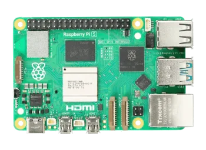
	<br>
	<i>Raspberry Pi 5</i>
</p>

Equipada con un procesador ARM Cortex-A76 de 64 bits a 2.4 GHz. La Raspberry Pi 5 es nuestro controlador principal. La elegimos por tres motivos:

- **Compatibilidad**: Existen muchos componentes de vTitan (como la Camera Module 3 Wide) que a su vez pertenecen al ecosistema Raspberry, lo que hace que implementarlos a la Raspberry Pi 5 no requiera tanto esfuerzo.

- **Potencia**: La Raspberry Pi 5 es uno de los computadores de placa única más potentes que se pueden comprar hoy, y eso pone el procesamiento de imágenes en tiempo real dentro de su alcance.

- **Portabilidad**: La Raspberry Pi 5 destaca entre los controladores, porque pesa apenas 46 g, lo que hace que montarla en vTitan no comprometa el presupuesto de peso.

<table align="center">
<thead>
<tr>
<th align="center"><strong>Medida</strong></th>
<th align="center"><strong>Valor</strong></th>
</tr>
</thead>
<tbody>
<tr>
<td align="center">Largo</td>
<td align="center">85 mm</td>
</tr>
<tr>
<td align="center">Alto</td>
<td align="center">58.9 mm</td>
</tr>
<tr>
<td align="center">Ancho</td>
<td align="center">56 mm</td>
</tr>
<tr>
<td align="center">Peso</td>
<td align="center">46 g</td>
</tr>
</tbody>
</table>

#### Raspberry Pi Camera Module 3 Wide

<p align="center">
	
	<br>
	<i>Raspberry Pi Camera Module 3</i>
</p>

Como el resto de los componentes Raspberry, destaca por lo ligera y compacta: 25 × 24 × 12.4 mm y 4 gramos, sin sacrificar resolución, porque alcanza 1536 × 864 a 120 fps. Elegimos la versión Wide por su campo de visión horizontal de 102 grados, que es lo que nos permite ver todos los obstáculos de la pista y ganar autonomía.

<table align="center">
<thead>
<tr>
<th align="center"><strong>Medida</strong></th>
<th align="center"><strong>Valor</strong></th>
</tr>
</thead>
<tbody>
<tr>
<td align="center">Largo</td>
<td align="center">24 mm</td>
</tr>
<tr>
<td align="center">Alto</td>
<td align="center">25 mm</td>
</tr>
<tr>
<td align="center">Ancho</td>
<td align="center">12.4 mm</td>
</tr>
<tr>
<td align="center">Peso</td>
<td align="center">4 g</td>
</tr>
</tbody>
</table>

**Montaje.** La cámara va montada directamente sobre el LIDAR (mismo desplazamiento frontal, x = 0.1222 m), a unos **20 cm del suelo** e inclinada **~10° hacia abajo**. La posición alta cumple dos funciones: despeja la línea de visión sobre el propio chasis y sobre los obstáculos bajos de la pista, y junto con la inclinación leve hacia abajo equilibra el cuadro entre la pista cercana (donde aparecen las señales que hay que leer a tiempo para decidir el lado de paso) y el horizonte del pasillo. El ángulo es lo bastante pequeño para que las señales a distancia de decisión (~1.4 m de radio de activación) queden bien dentro del encuadre, sin sacrificar la visión lejana que da la versión Wide. Las constantes de montaje viven en `src/config/robot.toml` (`[camera]`), y son las mismas que consumen la simulación y la TF estática.

**Calibración.** No hacemos calibración intrínseca de fábrica: el detector no necesita proyectar píxeles con precisión métrica, porque la decisión de la distancia al obstáculo la toma el LIDAR (la visión **no** es la red de seguridad de colisiones). Para las señales, la cámara aporta rumbo (preciso: la posición horizontal en el cuadro no depende de la profundidad) y color, mientras que la distancia por altura del cuadro delimitador (bounding box) es un modelo pinhole (proyección estenopeica) cuyo error crece con el rango (~3.6 cm a 1.5 m, ~14 cm a 3 m). Por eso el sistema fusiona ambas fuentes: cuando hay barrido LIDAR en el ciclo de muestreo, se confía en el rango del rayo más cercano al rumbo de la cámara, y el pinhole queda como respaldo. Su limitación conocida (asume cámara nivelada) está documentada honestamente en `src/python/docs/robot-physical-constants.md`.

#### Raspberry Pi AI HAT+ (26 TOPS)

<p align="center">
	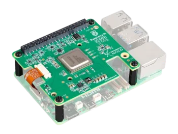
	<br>
	<i>Raspberry Pi AI HAT+ 26 TOPS</i>
</p>

Si bien la Raspberry Pi 5 es capaz de procesar imágenes en tiempo real, tras algunas pruebas, descubrimos que su tasa de procesamiento era bastante baja (alrededor de 1 a 2 fotos por segundo, con varias optimizaciones implementadas) por ende, tuvimos en cuenta que necesitaba más capacidad de cómputo, por lo cual decidimos incorporar la AI HAT+ a la Raspberry Pi 5 para poder alcanzar el nivel de procesamiento necesario.

El Raspberry Pi AI HAT+ tiene dos versiones, una de 13 billones de operaciones por segundo (TOPS) y otra de 26 TOPS. Como se menciona en el índice, vTitan posee un Raspberry Pi AI HAT+ de 26 TOPS, gracias a este procesador de imágenes, vTitan puede analizar imágenes de 640 px × 640 px a 15 Hz de punta a punta (captura, inferencia y publicación), con el modelo rindiendo 101.5 FPS en inferencia pura. La medición completa está en la [sección del modelo de detección](#modelo-de-detección-yolo).

<table align="center">
<thead>
<tr>
<th align="center"><strong>Medida</strong></th>
<th align="center"><strong>Valor</strong></th>
</tr>
</thead>
<tbody>
<tr>
<td align="center">Largo</td>
<td align="center">65 mm</td>
</tr>
<tr>
<td align="center">Alto</td>
<td align="center">5.5 mm</td>
</tr>
<tr>
<td align="center">Ancho</td>
<td align="center">56 mm</td>
</tr>
<tr>
<td align="center">Peso</td>
<td align="center">9.07 g</td>
</tr>
</tbody>
</table>

#### Raspberry Pi Zero 2 W

<p align="center">
	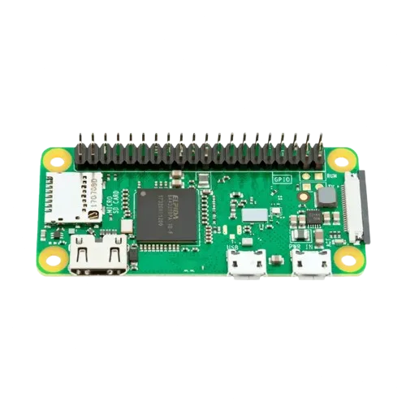
	<br>
	<i>Raspberry Pi Zero 2 W</i>
</p>

Construida sobre el chip Broadcom BCM2710A1 de cuatro núcleos, la Raspberry Pi Zero 2 W es un ordenador de placa única ligero y ultra compacto para vTitan. Al ejecutar un entorno Linux completo, este chip permite una fácil integración con el resto de los componentes Raspberry, haciendo que establecer comunicación de red o serial con una Raspberry Pi 5 sea nativo y sencillo dentro del mismo ecosistema.

Además de ofrecer cuatro núcleos a 1 GHz, supera drásticamente la capacidad de procesamiento de microcontroladores de tamaño similar, como el Arduino Nano que cuenta con una frecuencia de 16 MHz a 20 MHz.

Incorpora conectividad Wi-Fi/Bluetooth y regletas de pines GPIO soldadas. Esto ofrece una gran ventaja a la hora de desarrollar y practicar, ya que permite monitorear exactamente qué está procesando vTitan en tiempo real a través de la red, sin necesidad de utilizar LED de distintos colores para señalizar decisiones y logrando un acabado final mucho más limpio.

<table align="center">
<thead>
<tr>
<th align="center"><strong>Medida</strong></th>
<th align="center"><strong>Valor</strong></th>
</tr>
</thead>
<tbody>
<tr>
<td align="center">Largo</td>
<td align="center">65 mm</td>
</tr>
<tr>
<td align="center">Alto</td>
<td align="center">13 mm</td>
</tr>
<tr>
<td align="center">Ancho</td>
<td align="center">30 mm</td>
</tr>
<tr>
<td align="center">Peso</td>
<td align="center">12 g</td>
</tr>
</tbody>
</table>

#### RPLiDAR C1

<p align="center">
	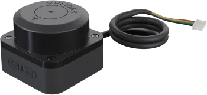
	<br>
	<i>RPLiDAR C1</i>
</p>

El RPLiDAR C1 es un escáner de rango láser de 360 grados, el cual puede detectar superficies que están hasta 12 metros de distancia, su punto ciego es de tan solo 5 centímetros alrededor del mismo, todos estos factores hacen que el RPLiDAR C1 sea una gran opción para poder guiar a vTitan por la pista.

Este RPLiDAR C1 permite a vTitan poder identificar exactamente dónde está ubicado en la pista, gracias a que nos ofrece 230° continuos de visión hacia el frente y los costados, suficientes para navegar la pista con autonomía, la prioridad para el uso apropiado de este sensor, en el caso de la categoría Futuros Ingenieros es montarlo con su plano de barrido por debajo de los 10 cm sobre el suelo, para que alcance tanto las paredes como los bloques; lo más adelantado posible; y sin nada que lo tape.

<table align="center">
<thead>
<tr>
<th align="center"><strong>Medida</strong></th>
<th align="center"><strong>Valor</strong></th>
</tr>
</thead>
<tbody>
<tr>
<td align="center">Largo</td>
<td align="center">55.6 mm</td>
</tr>
<tr>
<td align="center">Alto</td>
<td align="center">41.3 mm</td>
</tr>
<tr>
<td align="center">Ancho</td>
<td align="center">55.6 mm</td>
</tr>
<tr>
<td align="center">Peso</td>
<td align="center">110 g</td>
</tr>
</tbody>
</table>

Especificaciones técnicas:

<table align="center">
<thead>
<tr>
<th align="center"><strong>Especificación</strong></th>
<th align="center"><strong>Valor</strong></th>
</tr>
</thead>
<tbody>
<tr>
<td align="center">Rango de distancia</td>
<td align="center">Blanco: 0.05-12 m (70% de reflectividad); Negro: 0.05-6 m (10% de reflectividad)</td>
</tr>
<tr>
<td align="center">Frecuencia de muestreo</td>
<td align="center">5 kHz</td>
</tr>
<tr>
<td align="center">Resolución angular</td>
<td align="center">0.72°</td>
</tr>
<tr>
<td align="center">Ángulo de inclinación</td>
<td align="center">0°-1.5°</td>
</tr>
</tbody>
</table>

#### Servomotor Hiwonder HPS-3527SG (35 kg·cm)

<p align="center">
	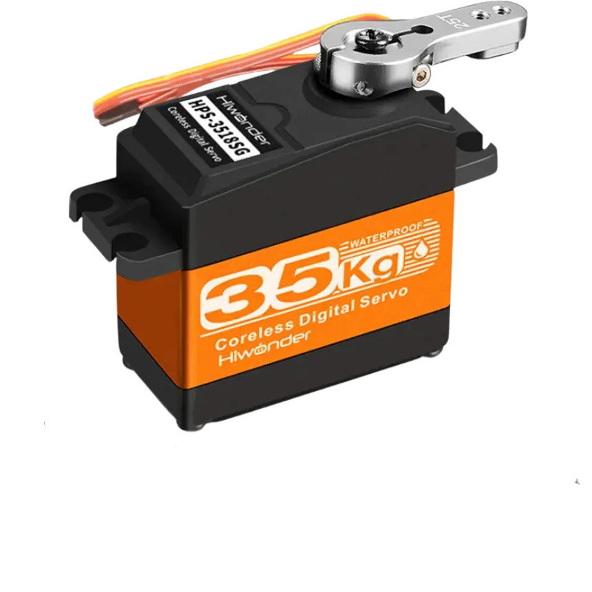
	<br>
	<i>Servomotor Hiwonder HPS-3527SG</i>
</p>

El Hiwonder HPS-3527SG es el servomotor que controla la dirección de vTitan. Lo elegimos por combinar tres cosas en un encapsulado pequeño y ligero: los 35 kg·cm de par que exige mover cuatro ruedas motrices en contrafase, un recorrido de 270° y una precisión de posicionamiento más que suficiente para la pista.

Lo gobernamos con la biblioteca `adafruit_motor` y su módulo `servo`, que traduce el ángulo que pedimos al ancho de pulso correspondiente. Eso deja el código de dirección legible sin coste de rendimiento.

<table align="center">
<thead>
<tr>
<th align="center"><strong>Medida</strong></th>
<th align="center"><strong>Valor</strong></th>
</tr>
</thead>
<tbody>
<tr>
<td align="center">Largo</td>
<td align="center">40 mm</td>
</tr>
<tr>
<td align="center">Alto</td>
<td align="center">28.8 mm</td>
</tr>
<tr>
<td align="center">Ancho</td>
<td align="center">20 mm</td>
</tr>
<tr>
<td align="center">Peso</td>
<td align="center">50 g</td>
</tr>
</tbody>
</table>

#### REV HD Hex Motor

<p align="center">
	
	<br>
	<i>HD Hex Motor</i>
</p>

Después de probar distintos modelos de motor optamos por el REV HD Hex Motor, porque cumple los dos requisitos que buscábamos: encoder integrado y un régimen de giro alto (6000 rpm sin carga). El torque de bloqueo no fue el criterio decisivo, porque la reducción total de 3.29 de nuestra transmisión lo multiplica (ver [Relación de Torque y Velocidad](#relación-de-torque-y-velocidad)); lo que descartó al motor anterior fue no dar torque suficiente ni siquiera montado en esa misma transmisión. A esto se sumó que encajaba con facilidad en el chasis que ya teníamos diseñado: solo hubo que rehacer su encaje.

<table align="center">
<thead>
<tr>
<th align="center"><strong>Medida</strong></th>
<th align="center"><strong>Valor</strong></th>
</tr>
</thead>
<tbody>
<tr>
<td align="center">Largo</td>
<td align="center">77 mm</td>
</tr>
<tr>
<td align="center">Diámetro</td>
<td align="center">37 mm</td>
</tr>
<tr>
<td align="center">Peso</td>
<td align="center">234 g</td>
</tr>
</tbody>
</table>

#### IMU GY-BNO085

<p align="center">
	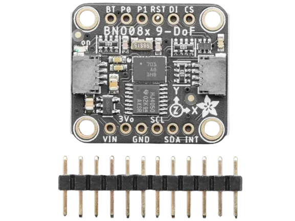
	<br>
	<i>Giroscopio BNO085</i>
</p>

El GY-BNO085 es nuestro sensor de orientación inercial (IMU). Lo usamos para que el robot mantenga rumbo en los cruces y cuente las vueltas dadas tanto en el Open Challenge como en el Obstacle Challenge, aunque exista algún problema mecánico que lo desvíe de su trayectoria.

**Cómo lo usamos (y cómo no).** El BNO085 no alimenta un PID de rumbo: alimenta la **pose**. Corre en modo UART-RVC a 100 Hz, una fusión interna de 6 ejes (giroscopio + acelerómetro, sin magnetómetro) que el chip calcula por sí mismo. Elegimos descartar el magnetómetro a propósito: sobre la pista conviven tres motores, un chasis metálico y la electrónica de potencia, y un rumbo por campo magnético sería vulnerable a todo eso. La contrapartida es la deriva de la hoja de datos (~0.5°/min), que acotamos por otras vías (ver abajo). Esta decisión, con su comparación cuantitativa contra el modo de 9 ejes, está documentada en `other/docs/adr/0079-imu-6axis-and-yaw-reference.md`.

**Calibración y referencia de rumbo.** El modo RVC no expone rutinas de calibración al usuario: la calibración de giroscopio/acelerómetro la hace el chip en su arranque. Nuestra parte del proceso es la **referencia de yaw**, y es deliberadamente simple:

1. El robot se enciende y se coloca en la pose de salida (puede quedar girado 90° o 180° respecto al pasillo; es irrelevante).
2. Al presionar el botón de inicio, el estimador fija un desplazamiento (offset): ese rumbo pasa a ser 0°. Todo el yaw del robot es relativo a esa referencia (`reset_heading_reference` en `src/python/src/state_machine/estimator.py`).
3. Durante la ronda, la deriva se acota con un filtro complementario contra el mundo «Manhattan» de la pista: cada pared es paralela o perpendicular al pasillo, así que el promedio circular de los ángulos medidos por el LIDAR recupera el rumbo absoluto y corrige la deriva del IMU.

La implementación maneja dos variables: `yaw_deg` (orientación relativa desde el inicio de la ronda) y `relative_yaw`, que acumula las vueltas sin saltar en ±180°. Dividiendo `relative_yaw` entre 90 y redondeando hacia abajo sabemos cuántos tramos rectos recorrió; cuando el cociente llega a ±12, el robot sabe que está en su zona de estacionamiento y avanza un poco más hasta detenerse (en el Open Challenge).

<table align="center">
<thead>
<tr>
<th align="center"><strong>Medida</strong></th>
<th align="center"><strong>Valor</strong></th>
</tr>
</thead>
<tbody>
<tr>
<td align="center">Largo</td>
<td align="center">25.6 mm</td>
</tr>
<tr>
<td align="center">Alto</td>
<td align="center">22.7 mm</td>
</tr>
<tr>
<td align="center">Ancho</td>
<td align="center">4.6 mm</td>
</tr>
<tr>
<td align="center">Peso</td>
<td align="center">3 g</td>
</tr>
</tbody>
</table>

#### Batería Li-Po Ovonic Air de 11.1 V

<p align="center">
	
	<br>
	<i>Ovonic Air 11.1V Li-Po Battery</i>
</p>

La batería de 11.1 V de la marca Ovonic es la fuente de alimentación principal: de ella se alimentan la Raspberry Pi 5 y todos sus componentes embebidos, además del motor de tracción. Usamos **dos modelos de la misma serie 3S**, con un rol distinto cada uno:

<table align="center">
<thead>
<tr>
<th align="center"><strong>Característica</strong></th>
<th align="center"><strong>Competencia: Ovonic 3S Short 2200 mAh 120C</strong></th>
<th align="center"><strong>Prácticas: Ovonic 3S 3000 mAh 50C</strong></th>
</tr>
</thead>
<tbody>
<tr>
<td align="center">Voltaje nominal</td>
<td align="center">11.1 V (3S1P, celdas 3.8-4.2 V)</td>
<td align="center">11.1 V (3S)</td>
</tr>
<tr>
<td align="center">Capacidad</td>
<td align="center">2200 mAh (24.4 Wh)</td>
<td align="center">3000 mAh (33.3 Wh)</td>
</tr>
<tr>
<td align="center">C-rating</td>
<td align="center">120C</td>
<td align="center">50C</td>
</tr>
<tr>
<td align="center">Conector</td>
<td align="center">XT60</td>
<td align="center">Deans (T-plug)</td>
</tr>
<tr>
<td align="center">Dimensiones</td>
<td align="center">77.17 × 34.06 × 25.12 mm</td>
<td align="center">107 × 24 × 33 mm</td>
</tr>
<tr>
<td align="center">Peso</td>
<td align="center">140 g</td>
<td align="center">186 g</td>
</tr>
</tbody>
</table>

**Por qué dos.** La de 3000 mAh/50C es la batería de **prácticas**: más capacidad para sesiones largas de calibración y depuración sin recargas, a cambio de más peso y volumen. La de 2200 mAh/120C es la de **competencia**, en formato compacto («shorty») y con conector XT60: menos capacidad, pero 46 g menos en la balanza (140 g contra 186 g) y un C-rating doble, que es lo que importa en pista.

**Por qué es suficiente.** El presupuesto de potencia del robot (ver la [sección de consumo energético](#consumo-energético)) da un total nominal de ~14-16 A y picos de ~31 A, de los cuales la rama de tracción - el motor al 50% del ciclo de trabajo - aporta ~10 A nominales y ~20 A de pico, y el resto del sistema ~4-6 A. Con la batería de competencia:

- **Autonomía**: 2200 mAh contra ~14 A nominales sostenidos da ~9 minutos de operación continua a plena demanda. Una ronda completa dura pocos minutos y la tracción no exige su nominal el 100% del tiempo, así que el margen real es mayor; el límite práctico en un día de competencia no es la descarga de una ronda sino el ciclo de recargas entre rondas.
- **Corriente de pico**: el C-rating de 120C anunciado representa 264 A, cifra de marketing en condiciones ideales; incluso descontando la mitad por realismo continuo, la batería puede entregar más de 100 A, más de 3 veces el pico de ~31 A del presupuesto completo. La entrega de corriente no es el cuello de botella en ninguna parte del sistema.

Usar baterías más pequeñas no tiene sentido (el margen energético ya es holgado), y usar la de prácticas en competencia solo pagaría el peso y el volumen extra de una batería más grande, sin ningún beneficio en pista.

<table align="center">
<thead>
<tr>
<th align="center"><strong>Medida</strong></th>
<th align="center"><strong>Valor</strong></th>
</tr>
</thead>
<tbody>
<tr>
<td align="center">Largo</td>
<td align="center">107 mm</td>
</tr>
<tr>
<td align="center">Alto</td>
<td align="center">24 mm</td>
</tr>
<tr>
<td align="center">Ancho</td>
<td align="center">33 mm</td>
</tr>
<tr>
<td align="center">Peso (medido, con conectores Deans)</td>
<td align="center">190 g</td>
</tr>
</tbody>
</table>

> Las medidas son de la batería de prácticas; el peso medido con conectores (190 g) sobre el listado de 186 g explica la diferencia entre ambas cifras.

#### Puente H BTS7960 / IBT-2

<p align="center">
	
	<br>
	<i>Puente H BTS7960 / IBT-2 (el que monta vTitan actualmente)</i>
</p>

El BTS7960 es el puente H que controla el motor de tracción. **No fue nuestra primera opción: reemplazó al L298N, y el motivo fue puramente de corriente.**

<p align="center">
	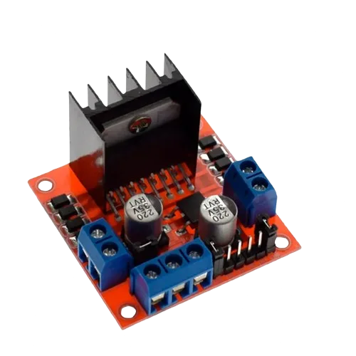
	<br>
	<i>Puente H L298N - el diseño anterior, descartado por corriente insuficiente</i>
</p>

El L298N entrega **2 A por canal**. Cuando pasamos a medir realmente lo que consume el tren motriz con el motor actual, los números no cuadraban: la rama de tracción consume del orden de **10 A promedio** al 50% del ciclo de trabajo, con **picos instantáneos cercanos a 20 A** en los arranques y en los cambios de sentido. Eso es un orden de magnitud por encima de lo que el L298N puede sostener, y explicaba los cortes y el calentamiento que veíamos: el puente no estaba fallando, estaba operando muy por encima de su especificación.

El BTS7960 está clasificado a **43 A**, lo que deja un margen amplio incluso sobre los picos. La otra diferencia importante es la caída de tensión: el L298N usa transistores bipolares y pierde cerca de 2 V en el puente, mientras que el BTS7960 usa MOSFET y esa pérdida es mucho menor, de modo que llega más tensión útil al motor con la misma batería.

Este cambio también reordenó el análisis del resto de la ruta de potencia. Con el puente sobredimensionado, **el elemento más débil pasó a ser el interruptor de encendido**, cuya capacidad de conducción continua está muy por debajo del BTS7960 y de lo que puede entregar la batería. Lo dejamos documentado en el esquemático como el punto a vigilar, porque un componente sobredimensionado no elimina un cuello de botella: solo lo mueve de sitio.

> [!WARNING]
> **Pendiente declarado.** No hemos medido la capacidad de conducción continua del interruptor, así que el margen de esa rama es el único del presupuesto eléctrico que damos por cualitativo.

<table align="center">
<thead>
<tr>
<th align="center"><strong>Característica</strong></th>
<th align="center"><strong>L298N (anterior)</strong></th>
<th align="center"><strong>BTS7960 (actual)</strong></th>
</tr>
</thead>
<tbody>
<tr>
<td align="center">Corriente máxima</td>
<td align="center">2 A por canal</td>
<td align="center">43 A</td>
</tr>
<tr>
<td align="center">Tecnología</td>
<td align="center">Transistor bipolar</td>
<td align="center">MOSFET</td>
</tr>
<tr>
<td align="center">Caída en el puente</td>
<td align="center">~2 V</td>
<td align="center">Muy baja</td>
</tr>
<tr>
<td align="center">Control</td>
<td align="center">ENA + IN1/IN2</td>
<td align="center">RPWM / LPWM independientes</td>
</tr>
</tbody>
</table>

#### Step Down Mini-560 Pro

<p align="center">
	
	<br>
	<i>Step Down Mini-560 Pro (el que monta vTitan actualmente)</i>
</p>

El Mini-560 Pro es el regulador que alimenta el riel propio del servo de dirección, separándolo del riel de 5V de la Raspberry Pi para que los picos de corriente del servo no lleguen al computador.

<p align="center">
	
	<br>
	<i>Step Down XLC4016 - el regulador anterior, descartado por peso</i>
</p>

**También es un reemplazo, y aquí el criterio fue el peso.** El regulador original era un XLC4016, un módulo notablemente más grande y pesado. El peso fue un problema recurrente en nuestros prototipos (llegamos a estar 200 gramos por encima del límite), así que revisamos la lista de componentes buscando piezas que estuvieran sobredimensionadas para su función. El regulador del servo era una de ellas: la corriente que realmente necesita esa rama es muy inferior a lo que el XLC4016 podía entregar, de modo que estábamos pagando peso por una capacidad que nunca íbamos a usar.

El Mini-560 Pro cubre la demanda real del servo en un encapsulado mucho más compacto. La diferencia medida es de **24 g a 5 g: 19 gramos menos, casi un 80% del peso del módulo anterior**, por una capacidad que la rama del servo no necesitaba.

<table align="center">
<thead>
<tr>
<th align="center"><strong>Regulador</strong></th>
<th align="center"><strong>Peso</strong></th>
</tr>
</thead>
<tbody>
<tr>
<td align="center">XLC4016 (anterior)</td>
<td align="center">24 g</td>
</tr>
<tr>
<td align="center">Mini-560 Pro (actual)</td>
<td align="center">5 g</td>
</tr>
<tr>
<td align="center"><strong>Diferencia</strong></td>
<td align="center"><strong>-19 g</strong></td>
</tr>
</tbody>
</table>

Diecinueve gramos no ganan una carrera por sí solos, y ese es justamente el punto: **el peso no se recupera de un solo golpe, sino sumando decisiones pequeñas**. Llegamos a estar 200 g por encima del límite, y ninguna pieza individual explicaba esos 200 g. Resolver eso consistió en repetir este mismo ejercicio pieza por pieza (¿cuánta capacidad usa realmente esta rama, y cuánto peso estamos pagando por la que sobra?). Es el mismo razonamiento que aplicamos en la transmisión y en el chasis: **dimensionar cada pieza contra la carga medida, no contra el peor caso imaginable.**

#### Pantalla OLED SSD1306

<p align="center">
	
	<br>
	<i>SSD1306 OLED Display 128x64</i>
</p>

Pantalla monocroma de 128x64 píxeles conectada por I2C. Cumple una función de diagnóstico en pista: muestra el estado de la máquina de estados, el desafío seleccionado por el puente físico (jumper) y el resultado del autodiagnóstico de arranque, sin necesidad de conectar un computador ni depender de la red. En una mesa de competencia, poder leer en qué estado está el robot antes de pulsar el botón de inicio evita arrancar una ronda con un sensor caído.

#### Convertidor KL89576 (DC a USB-C)

Convertidor reductor que toma la tensión de la batería y entrega **5 V a 5 A por salida USB-C**, dedicado exclusivamente a la Raspberry Pi 5. Es una rama independiente de la del servo y la del motor: las tres cuelgan de la batería por separado, de modo que el consumo del tren motriz no puede provocar una caída de tensión en el computador y reiniciarlo a mitad de una ronda.

El dimensionamiento merece una aclaración, porque la tabla de consumo suma por componente y aquí esa suma sería engañosa. El AI HAT+, la cámara, el LIDAR y el puente IMU no se alimentan del KL89576 directamente: se alimentan del riel de 5 V de la propia Pi 5, y la Pi Zero entera (motor, adaptador de nivel, OLED, encoder) recibe su alimentación por el VBUS del puerto USB de la Pi 5. Es decir, los 5 A de la especificación de la Pi 5 **ya incluyen** a todo lo conectado a la placa, y el pico del AI HAT+ (2.5 A) no se suma dos veces. El presupuesto real de la rama es: pico de la placa con sus periféricos (5 A, valor de especificación oficial que cubre el AI HAT+) más LIDAR (0.6 A) e IMU (0.03 A), ambos casi constantes, contra los 5 A del convertidor.

Ese margen es deliberadamente fino y lo monitoreamos en vez de sobredimensionarlo sin medir: el indicador `vcgencmd get_throttled` de la Pi 5 reporta cualquier caída de tensión, y es la misma señal con la que verificamos (0x0, sin eventos) que la Pi Zero alimentada por VBUS funciona sin caída de tensión (undervoltage) en carrera. Si el margen algún día se cerrara, el punto de vigilancia es el consumo conjunto placa+NPU, no el convertidor.

### Diagrama de conexiones

El arnés completo de vTitan está trazado como un esquemático generado por código, no dibujado a mano: la fuente reside en [`schemes/wiring/tscircuit/circuit.tsx`](schemes/wiring/tscircuit/circuit.tsx) y se exporta con [tscircuit](https://tscircuit.com/). Esto nos permite versionar el cableado igual que el resto del código: cualquier cambio de pin queda en el historial de git y el render se regenera desde la misma fuente.

<p align="center">
    
    <br>
    <i>Arnés de conexiones de vTitan - <a href="schemes/wiring/harness.schematic.png">versión PNG</a></i>
</p>

Para regenerar los artefactos tras editar `circuit.tsx`:

```bash
cd schemes/wiring/tscircuit
npm install
npm run artifacts   # netlist legible + SVG (fondo blanco) + PNG a 2400 px
```

Los exportados (`harness.schematic.svg` y `harness.schematic.png`) se versionan en `schemes/wiring/`, ya que son lo que se lee en esta documentación y reconstruirlos exige toda la cadena de herramientas de tscircuit.

### Consumo energético

<table align="center">
<thead>
<tr>
<th align="center"><strong>Componente</strong></th>
<th align="center"><strong>Cantidad</strong></th>
<th align="center"><strong>Voltaje</strong></th>
<th align="center"><strong>Corriente sin carga</strong></th>
<th align="center"><strong>Corriente Nominal</strong></th>
<th align="center"><strong>Corriente Pico</strong></th>
</tr>
</thead>
<tbody>
<tr>
<td align="center">Raspberry Pi 5</td>
<td align="center">1</td>
<td align="center">5.0V</td>
<td align="center">~0.50A</td>
<td align="center">~1.50A - 2.50A</td>
<td align="center">5.00A</td>
</tr>
<tr>
<td align="center">Raspberry Pi Zero 2 W</td>
<td align="center">1</td>
<td align="center">5.0V</td>
<td align="center">~0.10A</td>
<td align="center">~0.35A - 0.50A</td>
<td align="center">0.70A</td>
</tr>
<tr>
<td align="center">Raspberry Pi Camera Module 3 Wide</td>
<td align="center">1</td>
<td align="center">3.3V</td>
<td align="center">~0.05A</td>
<td align="center">~0.25A</td>
<td align="center">0.30A</td>
</tr>
<tr>
<td align="center">Raspberry Pi AI HAT+ (26 TOPS)</td>
<td align="center">1</td>
<td align="center">5.0V</td>
<td align="center">~0.10A</td>
<td align="center">~1.00A - 1.50A</td>
<td align="center">2.50A</td>
</tr>
<tr>
<td align="center">RPLiDAR C1</td>
<td align="center">1</td>
<td align="center">5.0V</td>
<td align="center">~0.20A</td>
<td align="center">~0.40A</td>
<td align="center">0.60A</td>
</tr>
<tr>
<td align="center">Hiwonder HPS-3527SG 35 kg Servo</td>
<td align="center">1</td>
<td align="center">4.8V - 8.4V</td>
<td align="center">~0.02A</td>
<td align="center">~0.30A - 0.50A</td>
<td align="center">1.80A (Stall)</td>
</tr>
<tr>
<td align="center">IMU GY-BNO085 (6 ejes en modo RVC)</td>
<td align="center">1</td>
<td align="center">3.3V - 5.0V</td>
<td align="center">~0.003A</td>
<td align="center">~0.015A</td>
<td align="center">0.03A</td>
</tr>
<tr>
<td align="center">Puente H BTS7960 / IBT-2</td>
<td align="center">1</td>
<td align="center">5V / 6-27V</td>
<td align="center">~0.007A (Lógica)</td>
<td align="center">~10.00A (tracción)</td>
<td align="center">~20.00A (picos)</td>
</tr>
<tr>
<td align="center"><strong>TOTAL</strong></td>
<td align="center"><strong>8</strong></td>
<td align="center"><strong>3.3V-5V</strong></td>
<td align="center"><strong>~0.980A</strong></td>
<td align="center"><strong>~13.82A - 15.67A</strong></td>
<td align="center"><strong>~30.93A</strong></td>
</tr>
</tbody>
</table>

> [!NOTE]
> Tres aclaraciones sobre esta tabla:
>
> - **Rama de tracción.** El salto respecto de versiones anteriores no es un cambio de consumo del robot, sino una corrección: el puente anterior figuraba con «según motor» en la columna nominal, de modo que la corriente de tracción, que es la mayor del sistema con diferencia, nunca entraba en el total. Los ~10 A nominales y ~20 A de pico son la rama del motor medida al 50% del ciclo de trabajo, y son exactamente el motivo por el que el L298N de 2 A por canal tuvo que ser reemplazado. El valor de 43 A del BTS7960 es la clasificación de la pieza, no un consumo: no se suma aquí.
> - **Rama del computador.** Los picos de la Raspberry Pi 5 (5.00 A) y del AI HAT+ (2.50 A) **no se suman**: el AI HAT+ se alimenta del riel de 5 V de la propia Pi 5, y el pico de 5 A de la placa ya cubre por especificación a todo lo conectado a ella, incluida la Pi Zero, que recibe su alimentación por el VBUS de un puerto USB de la Pi 5. Los 5 A del KL89576 dimensionan esta rama completa; ver la [sección del convertidor](#convertidor-kl89576-dc-a-usb-c).
> - **Tres ramas separadas.** Computador, servo y tracción se alimentan de la batería por separado a propósito. El total sirve para dimensionar la batería y el interruptor, no para dimensionar un único regulador.

<!-- HUECO (rubro WRO 2026, criterio 2 "modos de fallo y fiabilidad").
Falta la sección de protección eléctrica: fusible o limitador en la rama de
tracción (picos medidos de ~20 A), corte por bajo voltaje de la Li-Po 3S, y
procedimiento de carga y almacenamiento. (La discrepancia de la altura del haz
del LIDAR quedó resuelta: 0.08 m, ver ADR 0014.) -->

### Calibración

Cada sensor del robot tiene una parte calibrada contra medición propia, no contra la hoja de datos. Este es el inventario:

| Qué | Método | Valor |
|-----|--------|-------|
| Pulsos por vuelta del encoder | Cinta métrica: distancia conocida recorrida contra la que el robot cree haber recorrido (`task robot:calibrate-encoder`) | 60 pulsos/vuelta en el HD Hex. Se heredó el 676 del motor retirado, se midió 86 y se corrigió a 60 |
| Ley motor-duty en banco | Motor cargado, duty barrido, rpm medidas contra cinta | $\text{rpm} = 434.6 \cdot \text{duty} - 86.7$ ($R^2 = 0.9999$); zona muerta en duty 0.200 |
| Referencia de yaw del IMU | Reinicio del desplazamiento (offset) al presionar el botón de inicio: ese rumbo pasa a ser 0° (`reset_heading_reference`) | Todo el yaw de la ronda es relativo a esa referencia |
| Calibración giroscopio/acelerómetro | Rutina del chip (modo RVC) en su arranque; no intervenimos | De fábrica |
| Latencia cámara→detección | Medida de punta a punta sobre bags reales | **0.85 s** (ejecuciones del 2026-09-06); el rango LIDAR del ciclo actual cubre el hueco |
| Rango de la visión | Modelo pinhole contra barrido LIDAR: cuando hay medición LIDAR al rumbo de la cámara, manda el LIDAR; el pinhole queda de respaldo | Error del pinhole: ~3.6 cm a 1.5 m, ~14 cm a 3 m |
| Radio de giro del chasis | Medido en banco | 0.29 m, usado como límite duro en simulación y control |
| Simulador | Ajustado contra grabaciones reales; conclusiones previas a la calibración descartadas | Ver [Simulador y corpus de escenarios](#simulador-y-corpus-de-escenarios) |

La consecuencia de método: ninguna constante del robot es un número «de fábrica» sin justificación; cada una de estas mediciones tiene una historia de hallazgo documentada en la [sección de hallazgos](#hallazgos-de-ingeniería).

## Arquitectura de software

Esta sección describe el software que corre a bordo: cómo se reparte entre las dos placas, el detector de señales y los lazos de control.

### Arquitectura ROS2 y reparto entre dos computadores

vTitan no corre sobre un solo computador, sino sobre dos, y el reparto no es por comodidad: es la decisión de arquitectura que sostiene todo lo demás.

La **Raspberry Pi 5** se encarga de percepción y planificación (LIDAR, cámara, inferencia en el AI HAT+, decidir hacia dónde ir), y la **Raspberry Pi Zero 2 W** se encarga exclusivamente del control en tiempo real del motor y del servo. El motivo es que esas dos cargas tienen exigencias temporales incompatibles. La inferencia de visión es pesada y su tiempo de respuesta varía; el lazo de control del motor tiene que ejecutarse a ritmo constante o el robot se vuelve inestable. Si ambas cosas compiten por el mismo procesador, un fotograma lento se traduce en una corrección de dirección tardía. Separándolas, **ningún retraso de visión puede detener el lazo de control**.

El software está organizado en cinco paquetes ROS2:

<table align="center">
<thead>
<tr>
<th align="left">Paquete</th>
<th align="left">Responsabilidad</th>
</tr>
</thead>
<tbody>
<tr>
<td align="left"><code>vtitan_bringup</code></td>
<td align="left">Lanzamiento del sistema completo y composición de nodos</td>
</tr>
<tr>
<td align="left"><code>vtitan_drivers</code></td>
<td align="left">Controladores de hardware: IMU, I2C, UART</td>
</tr>
<tr>
<td align="left"><code>vtitan_navigation</code></td>
<td align="left">Navegación: seguimiento de pasillo, planificación, escapes</td>
</tr>
<tr>
<td align="left"><code>vtitan_state_machine</code></td>
<td align="left">Máquina de estados de carrera y grabación de bags</td>
</tr>
<tr>
<td align="left"><code>vtitan_vision</code></td>
<td align="left">Cámara e inferencia de detección</td>
</tr>
</tbody>
</table>

Visto como componentes, el reparto queda así. `vtitan_bringup` es la única caja que no participa en la comunicación: no declara ningún ejecutable, solo los archivos de lanzamiento que arrancan a las demás.

<!-- mermaid-src: schemes/flowcharts/common/mermaid/paquetes-ros2.mmd -->
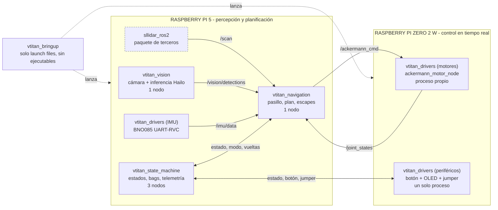
```mermaid
flowchart LR
    subgraph PI5["RASPBERRY PI 5 - percepción y planificación"]
        VIS["vtitan_vision<br/>cámara + inferencia Hailo<br/>1 nodo"]
        NAV["vtitan_navigation<br/>pasillo, plan, escapes<br/>1 nodo"]
        SM["vtitan_state_machine<br/>estados, bags, telemetría<br/>3 nodos"]
        IMUP["vtitan_drivers (IMU)<br/>BNO085 UART-RVC"]
        LID["sllidar_ros2<br/>paquete de terceros"]
    end

    subgraph ZERO["RASPBERRY PI ZERO 2 W - control en tiempo real"]
        MOT["vtitan_drivers (motores)<br/>ackermann_motor_node<br/>proceso propio"]
        PER["vtitan_drivers (periféricos)<br/>botón + OLED + jumper<br/>un solo proceso"]
    end

    BRING["vtitan_bringup<br/>solo launch files, sin ejecutables"]

    BRING -.->|lanza| PI5
    BRING -.->|lanza| ZERO

    LID -->|"/scan"| NAV
    VIS -->|"/vision/detections"| NAV
    IMUP -->|"/imu/data"| NAV
    MOT -->|"/joint_states"| NAV
    NAV -->|"/ackermann_cmd"| MOT

    SM <-->|"estado, modo, vueltas"| NAV
    SM <-->|"estado, botón, jumper"| PER

    classDef externo stroke:#6e7781,stroke-dasharray: 4 3
    class LID externo
```

Los nodos se comunican por **29 tópicos (topics) declarados en un único archivo de configuración** (`ros_topics.toml`) en lugar de estar escritos a mano en cada nodo. Esto evita una clase de error entera: un nodo que publica en `/lidar/scan` mientras otro escucha `/scan` compila, arranca y no funciona, sin ningún mensaje de error. Con los nombres centralizados, esa discrepancia no puede existir.

Bajando al detalle, el grafo se parte en dos planos casi disjuntos. El **plano de carrera** es el que decide y actúa, y es el único que cruza la frontera entre las dos placas: solo dos tópicos la atraviesan en el lazo cerrado, `/ackermann_cmd` de ida y `/joint_states` de vuelta. Cada flecha sale de un `create_publisher`/`create_subscription` real del código, no de una descripción escrita a mano:

<!-- mermaid-src: schemes/flowcharts/common/mermaid/nodos-ros2.mmd -->
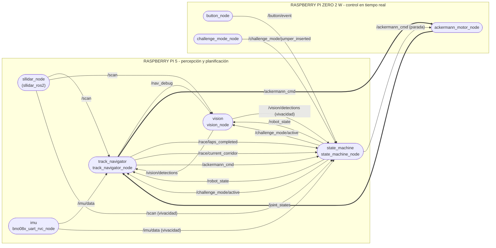
```mermaid
flowchart LR
    subgraph PI5["RASPBERRY PI 5 - percepción y planificación"]
        LIDAR(["sllidar_node<br/>(sllidar_ros2)"])
        IMU(["imu<br/>bno08x_uart_rvc_node"])
        VISION(["vision<br/>vision_node"])
        NAVE(["track_navigator<br/>track_navigator_node"])
        SMN(["state_machine<br/>state_machine_node"])
    end

    subgraph ZERO["RASPBERRY PI ZERO 2 W - control en tiempo real"]
        MOTOR(["ackermann_motor_node"])
        BTN(["button_node"])
        CHAL(["challenge_mode_node"])
    end

    LIDAR -->|"/scan"| NAVE
    LIDAR -->|"/scan"| VISION
    IMU -->|"/imu/data"| NAVE
    VISION -->|"/vision/detections"| NAVE
    NAVE -->|"/nav_debug"| VISION

    NAVE ==>|"/ackermann_cmd"| MOTOR
    MOTOR ==>|"/joint_states"| NAVE

    LIDAR -->|"/scan (vivacidad)"| SMN
    IMU -->|"/imu/data (vivacidad)"| SMN
    VISION -->|"/vision/detections (vivacidad)"| SMN
    NAVE -->|"/race/laps_completed"| SMN
    NAVE -->|"/race/current_corridor"| SMN
    NAVE -->|"/ackermann_cmd"| SMN
    SMN -->|"/robot_state"| NAVE
    SMN -->|"/robot_state"| VISION
    SMN -->|"/challenge_mode/active"| NAVE
    SMN -->|"/challenge_mode/active"| VISION
    SMN -->|"/ackermann_cmd (parada)"| MOTOR

    BTN -->|"/button/event"| SMN
    CHAL -->|"/challenge_mode/jumper_inserted"| SMN

    linkStyle 5,6 stroke-width:3px
```

El **plano de observación** cuelga de los mismos tópicos pero no participa en ninguna decisión: graba los bags, pinta el OLED y agrega las lecturas que este muestra. Es casi enteramente de una dirección, y sus dos únicas vías de vuelta hacia el plano de carrera (el botón remoto y el ajuste de parámetros de visión) son de operador de banco, no de control de carrera:

<!-- mermaid-src: schemes/flowcharts/common/mermaid/nodos-ros2-telemetria.mmd -->
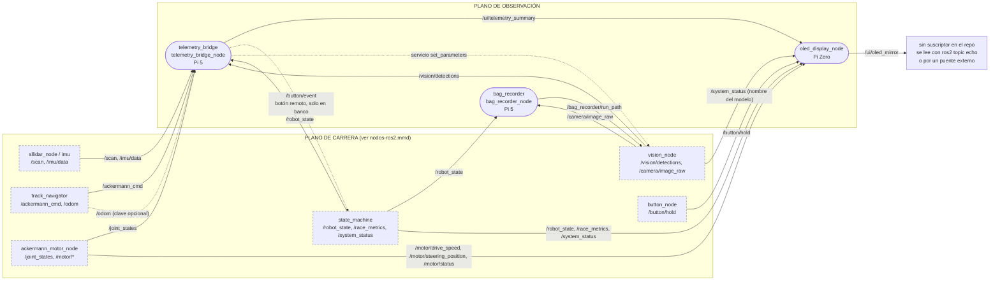
```mermaid
flowchart LR
    subgraph CARRERA["PLANO DE CARRERA (ver nodos-ros2.mmd)"]
        SENS["sllidar_node / imu<br/>/scan, /imu/data"]
        NAVE["track_navigator<br/>/ackermann_cmd, /odom"]
        SMN["state_machine<br/>/robot_state, /race_metrics, /system_status"]
        VISION["vision_node<br/>/vision/detections, /camera/image_raw"]
        MOTOR["ackermann_motor_node<br/>/joint_states, /motor/*"]
        BTN["button_node<br/>/button/hold"]
    end

    subgraph OBS["PLANO DE OBSERVACIÓN"]
        TEL(["telemetry_bridge<br/>telemetry_bridge_node<br/>Pi 5"])
        BAG(["bag_recorder<br/>bag_recorder_node<br/>Pi 5"])
        OLED(["oled_display_node<br/>Pi Zero"])
    end

    SENS -->|"/scan, /imu/data"| TEL
    NAVE -->|"/ackermann_cmd"| TEL
    NAVE -.->|"/odom (clave opcional)"| TEL
    SMN -->|"/robot_state"| TEL
    VISION -->|"/vision/detections"| TEL
    MOTOR -->|"/joint_states"| TEL

    SMN -->|"/robot_state"| BAG
    VISION -->|"/camera/image_raw"| BAG
    BAG -->|"/bag_recorder/run_path"| VISION

    SMN -->|"/robot_state, /race_metrics, /system_status"| OLED
    MOTOR -->|"/motor/drive_speed, /motor/steering_position, /motor/status"| OLED
    BTN -->|"/button/hold"| OLED
    VISION -->|"/system_status (nombre del modelo)"| OLED
    TEL -->|"/ui/telemetry_summary"| OLED
    OLED -->|"/ui/oled_mirror"| SINMIRROR
    SINMIRROR["sin suscriptor en el repo<br/>se lee con ros2 topic echo<br/>o por un puente externo"]

    TEL -.->|"/button/event<br/>botón remoto, solo en banco"| SMN
    TEL -.->|"servicio set_parameters"| VISION

    classDef espejo stroke:#6e7781,stroke-dasharray: 5 4
    class SENS,NAVE,SMN,VISION,MOTOR,BTN espejo
```

En ninguno de los tres diagramas aparece el backend de telemetría en Go. Es deliberado: **en competencia el robot corre sin red**, así que ese enlace no existe durante una ronda, y dibujarlo sugeriría una dependencia que la pista no tiene. `telemetry_bridge_node` sí se queda, porque su salida `/ui/telemetry_summary` es de donde la página RACING del OLED saca las distancias y el yaw. El estado del backend y la política de migración a Go están más abajo, en su propia subsección.

Un detalle que ilustra el nivel de restricción real: el SoC de la Pi Zero 2 W tiene **exactamente dos generadores de PWM por hardware**. Uno está tomado por el servo de dirección, que necesita mantener una posición absoluta y no tolera fluctuaciones. El otro se asigna a la marcha adelante del motor. La marcha atrás, que solo se usa en maniobras de estacionamiento y recuperación a baja velocidad, funciona con PWM por software y sí tolera esa fluctuación. Es un reparto deliberado de un recurso escaso, no una casualidad.

#### La pantalla OLED, el único instrumento en pista

En competencia el robot corre sin red: no hay panel de telemetría, no hay SSH, no hay consola. La pantalla OLED de 128x64 es literalmente lo único que el operador puede leer antes de pulsar el botón, y el botón es lo único que puede tocar. Eso convierte a `oled_display_node` en algo más que un adorno: es la interfaz completa del robot en pista, y por eso su lógica está diagramada igual que la de navegación.

El nodo no tiene un menú ni páginas que se roten. Una cadena de prioridad decide qué se dibuja en cada tick, y el orden de las ramas *es* la decisión: un botón retenido gana a cualquier estado, porque el operador está usando el único control que tiene y necesita saber qué va a pasar antes de soltarlo.

<!-- mermaid-src: schemes/flowcharts/common/mermaid/oled-paginas.mmd -->
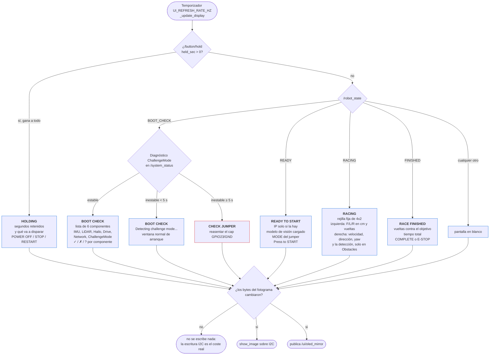
```mermaid
flowchart TD
    TIMER(["Temporizador UI_REFRESH_RATE_HZ<br/>_update_display"])
    HOLD{"¿/button/hold<br/>held_sec &gt; 0?"}
    STATE{"/robot_state"}

    TIMER --> HOLD
    HOLD -->|"sí, gana a todo"| PHOLD
    HOLD -->|no| STATE

    PHOLD["<b>HOLDING</b><br/>segundos retenidos<br/>y qué va a disparar<br/>POWER OFF / STOP / RESTART"]

    STATE -->|BOOT_CHECK| JUMPER
    STATE -->|READY| PREADY
    STATE -->|RACING| PRACING
    STATE -->|FINISHED| PFIN
    STATE -->|"cualquier otro"| PBLANK

    JUMPER{"Diagnóstico ChallengeMode<br/>en /system_status"}
    JUMPER -->|"estable"| PBOOT
    JUMPER -->|"inestable &lt; 5 s"| PDETECT
    JUMPER -->|"inestable &ge; 5 s"| PFAULT

    PBOOT["<b>BOOT CHECK</b><br/>lista de 6 componentes<br/>IMU, LiDAR, Hailo, Drive,<br/>Network, ChallengeMode<br/>✓ / ✗ / ? por componente"]
    PDETECT["<b>BOOT CHECK</b><br/>Detecting challenge mode...<br/>ventana normal de arranque"]
    PFAULT["<b>CHECK JUMPER</b><br/>reasentar el cap GPIO23/GND"]
    PREADY["<b>READY TO START</b><br/>IP solo si la hay<br/>modelo de visión cargado<br/>MODE del jumper<br/>Press to START"]
    PRACING["<b>RACING</b><br/>rejilla fija de 4x2<br/>izquierda: F/L/R en cm y vueltas<br/>derecha: velocidad, dirección, yaw<br/>y la detección, solo en Obstacles"]
    PFIN["<b>RACE FINISHED</b><br/>vueltas contra el objetivo<br/>tiempo total<br/>COMPLETE o E-STOP"]
    PBLANK["pantalla en blanco"]

    DEDUP{"¿los bytes del fotograma<br/>cambiaron?"}
    PHOLD --> DEDUP
    PBOOT --> DEDUP
    PDETECT --> DEDUP
    PFAULT --> DEDUP
    PREADY --> DEDUP
    PRACING --> DEDUP
    PFIN --> DEDUP
    PBLANK --> DEDUP

    DEDUP -->|no| SKIP(["no se escribe nada:<br/>la escritura I2C es el coste real"])
    DEDUP -->|si| I2C(["show_image sobre I2C"])
    DEDUP -->|si| MIRROR(["publica /ui/oled_mirror"])

classDef pagina stroke:#0969da
classDef fallo stroke:#cf222e
    class PHOLD,PBOOT,PDETECT,PREADY,PRACING,PFIN,PBLANK pagina
    class PFAULT fallo
```

Dos detalles que el diagrama hace explícitos. El primero es que **la escritura I2C es el coste real**, no el dibujo: el nodo compara los bytes del fotograma con el anterior y no escribe nada si no cambiaron. El segundo es que `BOOT_CHECK` no es una página sino tres, y cuál sale depende del tiempo: mientras la lectura del jumper es inestable muestra un "Detecting challenge mode..." neutro, y solo pasados 5 segundos escala a la advertencia de reasentar el cap. Un fallo de arranque normal y uno real se ven distintos.

Ninguna línea de ninguna página se calcula aquí. Cada valor viene de un tópico, y las tres fuentes que alimentan `/system_status` son tres nodos distintos que el OLED fusiona por nombre, así que ninguno puede escribir el campo de otro ni contradecirlo:

<!-- mermaid-src: schemes/flowcharts/common/mermaid/oled-fuentes.mmd -->
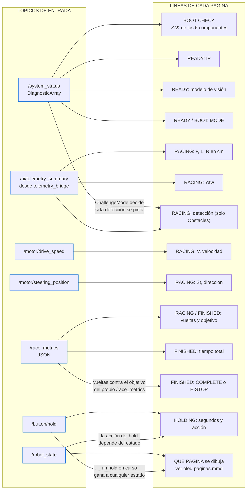
```mermaid
flowchart LR
    subgraph FUENTES["TÓPICOS DE ENTRADA"]
        SS["/system_status<br/>DiagnosticArray"]
        RM["/race_metrics<br/>JSON"]
        UIS["/ui/telemetry_summary<br/>desde telemetry_bridge"]
        MDS["/motor/drive_speed"]
        MSP["/motor/steering_position"]
        BH["/button/hold"]
        RS["/robot_state"]
    end

    subgraph PAGINAS["LÍNEAS DE CADA PÁGINA"]
        B1["BOOT CHECK<br/>✓/✗ de los 6 componentes"]
        R1["READY: IP"]
        R2["READY: modelo de visión"]
        R3["READY / BOOT: MODE"]
        C1["RACING: F, L, R en cm"]
        C2["RACING: Yaw"]
        C3["RACING: detección (solo Obstacles)"]
        C4["RACING: V, velocidad"]
        C5["RACING: St, dirección"]
        C6["RACING / FINISHED: vueltas y objetivo"]
        F1["FINISHED: tiempo total"]
        F2["FINISHED: COMPLETE o E-STOP"]
        H1["HOLDING: segundos y acción"]
        SEL["QUÉ PÁGINA se dibuja<br/>ver oled-paginas.mmd"]
    end

    RS --> SEL
    BH -->|"un hold en curso<br/>gana a cualquier estado"| SEL
    BH --> H1
    RS -->|"la acción del hold<br/>depende del estado"| H1

    SS --> B1
    SS --> R1
    SS --> R2
    SS --> R3
    SS -->|"ChallengeMode decide<br/>si la detección se pinta"| C3

    UIS --> C1
    UIS --> C2
    UIS --> C3
    MDS --> C4
    MSP --> C5
    RM --> C6
    RM --> F1
    RM -->|"vueltas contra el objetivo<br/>del propio /race_metrics"| F2

    classDef topico stroke:#0969da
    class SS,RM,UIS,MDS,MSP,BH,RS topico
```

Eso es deliberado en los dos sitios donde costó caro. `Model:` lo publica `vision_node`, el único que sabe qué modelo se cargó de verdad, después de que un nombre escrito a mano aquí llevara tiempo divergiendo del desplegado sin que nada lo notara. Y el objetivo de vueltas sale de `/race_metrics`, no de la constante del Open Challenge: usar la constante reportaría "E-STOP" en una ronda de Obstacles terminada correctamente, en cuanto las dos cifras difieran.

#### La segunda pila (stack) en Go, y por qué no corre en carrera

Existe una segunda implementación de la pila en Go (con NATS como transporte en lugar de ROS2/DDS), y conviene ser explícitos sobre su estado: **no es la que compite**. La pila en carrera es la de Python + ROS2 descrita arriba, en todos los componentes: visión, navegación, máquina de estados y controladores en ambas placas.

La única pieza de Go que corre en producción es el **backend de telemetría** (`vtitan-backend.service`), un binario compilado que la Pi 5 sirve al panel de telemetría (dashboard).

La migración a Go se tomó como un reemplazo a largo plazo de ROS2 (arranque más rápido, menor consumo de recursos y de memoria en las placas), pero con una política deliberada: **migración en vía paralela con corte único, sin híbridos**. La pila de Python sigue siendo la de competencia y ahí continúan los ajustes de temporada; la de Go solo cortará a producción cuando alcance paridad completa, y entonces se conmutará de una vez con `vtitan-robot@go`, con la pila de Python documentada como camino de reversión. Al día de hoy, lo portado (incluida la navegación) está verificado contra bags de carreras reales en un arnés de paridad, pero el navegador de Go todavía no ha corrido dentro de un lazo completo de carrera en el robot, y ese es justamente el criterio de paridad que falta para el corte.

### Modelo de detección YOLO

Para detectar los obstáculos del Obstacle Challenge de manera confiable usamos un detector YOLO entrenado por nosotros y compilado para el AI HAT+. Esta sección documenta el modelo completo: qué es, con qué datos se entrenó, cómo lo medimos y qué decisiones tomamos a partir de esas mediciones.

#### El modelo y su cadena de procesamiento

<table align="center">
<thead>
<tr>
<th align="center">Aspecto</th>
<th align="center">Valor</th>
</tr>
</thead>
<tbody>
<tr>
<td align="center">Arquitectura</td>
<td align="center">YOLOv11n (nano), 3 clases: prisma verde, magenta y rojo</td>
</tr>
<tr>
<td align="center">Entrada</td>
<td align="center">640 × 640 × 3, UINT8</td>
</tr>
<tr>
<td align="center">Formato desplegado</td>
<td align="center">ONNX compilado a HEF (Hailo-8) con Hailo Model Zoo</td>
</tr>
<tr>
<td align="center">NMS</td>
<td align="center">Embebido en el HEF, score 0.20, IoU 0.70</td>
</tr>
<tr>
<td align="center">Umbral de despliegue</td>
<td align="center">0.45 en el detector (las detecciones por debajo no llegan al navegador); 0.25 en el enrutador de señales, para confirmación tardía</td>
</tr>
<tr>
<td align="center">Rendimiento (throughput)</td>
<td align="center">101.5 FPS el HEF solo (<code>hailortcli run</code>); la cadena completa (captura → escala con relleno (letterbox) → NPU → decodificación → publicación) corre a <strong>15 Hz</strong>, limitada por el temporizador de captura, no por el modelo</td>
</tr>
</tbody>
</table>

Los primeros prototipos ejecutaban detección solo con CPU sobre la Raspberry Pi 5, a ~1-2 imágenes por segundo (~700 ms por imagen), demasiado lento para reaccionar a obstáculos a velocidad de carrera. El AI HAT+ movió la inferencia al NPU, y con ella reorganizamos la cadena de procesamiento: el nodo de visión abre la cámara directamente y alimenta los fotogramas al NPU sin pasar por un intermedio de ROS para las imágenes, eliminando ese salto de la latencia.

#### Datos de entrenamiento

El modelo actual se entrenó sobre **1340 imágenes propias** de los prismas de la pista (verde, magenta y rojo), anotadas **manualmente con Label Studio** en formato YOLO. Es un conjunto de datos heredado de Klevor, que sigue siendo la base del detector actual.

En paralelo construimos el **auto-anotador** ([`other/apps/auto-annotator/`](other/apps/auto-annotator/)), una herramienta de anotación asistida con SAM2: orquestación en Go, servicio de aprendizaje automático en Python e interfaz propia. No la usamos para el modelo actual: las anotaciones de este fueron a mano. La construimos pensando en la siguiente iteración del conjunto de datos, porque anotar 1340 imágenes a mano fue la parte más lenta del entrenamiento y un modelo nuevo empieza por ahí. Las imágenes del conjunto de datos viven junto al auto-anotador y sirven también como datos de calibración para la cuantización del HEF.

#### Cómo lo medimos (y qué cambió por eso)

Evaluamos el modelo sobre 600 imágenes con IoU ≥ 0.5, comparando el resultado en punto flotante, tomado como referencia, contra dos variantes cuantizadas del compilador de Hailo:

<table align="center">
<thead>
<tr>
<th align="center">Variante</th>
<th align="center">mAP@0.5</th>
<th align="center">mAP@0.5:0.95</th>
<th align="center">Clasificaciones erróneas</th>
<th align="center">Omitidas</th>
</tr>
</thead>
<tbody>
<tr>
<td align="center">Punto flotante (referencia)</td>
<td align="center">0.9955</td>
<td align="center">0.8885</td>
<td align="center">0</td>
<td align="center">-</td>
</tr>
<tr>
<td align="center">Nivel 0, la desplegada</td>
<td align="center">0.9954</td>
<td align="center">0.8808</td>
<td align="center">0</td>
<td align="center">2</td>
</tr>
<tr>
<td align="center">Nivel 2 + QAT (cuantización durante el entrenamiento)</td>
<td align="center">0.9689</td>
<td align="center">0.8096</td>
<td align="center">2 (magenta↔rojo)</td>
<td align="center">23</td>
</tr>
</tbody>
</table>

La decisión de desplegar la variante de nivel 0 salió directamente de esta tabla: la heurística «más optimización del compilador es mejor» era falsa para nuestro caso, y la variante de nivel 2, pese a llevar QAT, perdía mAP y, lo peor, introducía las únicas 2 confusiones entre clases del estudio.

Dos hallazgos de esta evaluación nos parecieron los más valiosos:

- **El orden de canales RGB/BGR casi pasa inadvertido.** Con el orden de canales equivocado, el mAP de la clase roja caía de 0.99 a **0.17**, y el sistema no falla de forma evidente: detecta «algo» con confianza razonable, solo que peor. Lo detectamos comparando mAP por clase entre variantes, no mirando imágenes.
- **Errar el color es peor que omitir la señal.** Clasificar un prisma rojo como verde invierte el lado de paso reglamentario; omitir la detección no lo hace, porque la red de seguridad en colisiones es el LIDAR, no la visión. Sobre 600 imágenes, el modelo desplegado jamás confundió rojo con verde y omitió 2 señales; los falsos positivos a umbral 0.25 fueron 119 (muchos atribuibles a etiquetado incompleto del conjunto de prueba), y el umbral de 0.45 del detector los suprime antes de que lleguen al navegador. El 0.25 no los readmite: solo sirve para confirmar tarde una señal ya descubierta, nunca para dar de alta una nueva.

#### Qué pasa cuando la visión falla

La visión no es la red de seguridad contra colisiones y la diseñamos como tal. Una detección falsa dentro del radio de activación (1.40 m) fuerza el lado de esquiva según su color, con el riesgo de una esquiva innecesaria; una detección omitida deja la esquiva sin invocar, pero el controlador de colisión por LIDAR sigue activo y los escapes escalan (retroceso y reintento) si el contacto ocurre igualmente. La máquina de estados, además, marca la visión como caída si deja de recibir detecciones dentro de su ventana de tiempo, de modo que una cámara o una NPU averiada no pase inadvertida en el autodiagnóstico de arranque.

### Algoritmo PID

El control de vTitan tiene dos lazos con exigencias distintas, y a pesar del título de esta sección ninguno de los dos es un PID completo. El de **velocidad** sí es un PI clásico sobre las RPM medidas por el encoder; el de **dirección** dejó de serlo: la ganancia proporcional pura resultó ser un lazo inestable a velocidad de carrera y fue reemplazada por *pure pursuit* basado en curvatura. Contar esa sustitución es, de hecho, la parte más instructiva de esta sección.

#### Control de velocidad: PI sobre RPM

El lazo corre en la Raspberry Pi Zero 2 W con la señal del encoder. La clase `PIDController` implementa un PI con saturación de salida (límite de ciclo de trabajo en 50%) y anti-windup por integración condicional: el término integral solo acumula cuando la salida no está saturada, de modo que el windup no puede crecer contra el límite.

Sobre el PI va una **prealimentación (feedforward) afín** medida en banco, `duty = 0.20 + 0.8 · rpm/max_rpm`, con la zona muerta (deadband) medida con carga (`rpm = 434.6·duty − 86.7`). El lazo integral solo corrige lo que la prealimentación no modela; una consigna de cero devuelve ciclo de trabajo cero, así que el robot no sufre avance residual al detenerse.

Las ganancias son perfiles por motor y su historia ilustra por qué las constantes sin justificación dentro del código eran un problema. Al cambiar al HD Hex, el `counts_per_rev` heredado del motor retirado (676) dejó de valer: la primera medición del motor nuevo dio 86, lo que multiplicó por ~8 la sensibilidad de la medición de RPM, y las ganancias viejas produjeron una oscilación visible: la velocidad oscilaba entre 2 y 21.5 RPM alrededor de una consigna de 13.6, con el ciclo de trabajo oscilando de 0.15 a 0.31. Ese 86 se refinó después a los 60 definitivos, medidos con retenciones más largas. Se reescalaron las ganancias en el mismo factor inverso (0.010→0.00125, 0.020→0.0025) para mantener constante la ganancia de lazo abierto, y se añadió un registro por paso del PID (consigna, medida, ciclo de trabajo) para poder *ver* la oscilación en vez de inferirla de síntomas. Tras corregir además el feedforward (el `max_rpm` viejo dejaba el lazo apoyado contra su límite: la respuesta se estabilizaba a 1.33× la consigna con desviación estándar cero, la firma inequívoca de una saturación), el lazo sigue la consigna a ~2% en pista: tres vueltas limpias con 132.5 s frente a los 142.3 s previos al ajuste.

#### Dirección: de PID a pure pursuit

La dirección de vTitan no es un lazo P sobre error angular, aunque lo fue. Con `steering = kp · angle_error`, el sistema era estable solo por debajo de ~0.07 m/s: a velocidad de carrera, el lazo se volvía un oscilador no amortiguado que saturaba el servo entre −70.2° y +70.2° durante carreras completas. La causa tenía un detalle fino: la ganancia se había ajustado contra un modelo de simulación con dirección delantera, mientras el chasis real es de 4 ruedas direccionales en contrafase, que gira aproximadamente al doble de rápido para el mismo ángulo de servo.

La solución no fue ajustar la ganancia, sino cambiar la ley de control: **pure pursuit** sobre el punto de mira del camino planificado, con la distancia efectiva `L = wheelbase/2` para compensar el doble de tasa de guiñada del chasis en contrafase. La curvatura se convierte en ángulo de servo con saturación en ±70.2° y un limitador de tasa de 1.2 rad/s (bajado de 2.0 tras ver en un bag real que el controlador alcanzaba el límite de tasa en cada esquina, lo que en pista se percibía como una conducción demasiado brusca).

Dos refinamientos más, ambos dictados por evidencia de hardware:

- **Mezcla de la anticipación (lookahead) en vez de conmutación.** Los dos valores de anticipación (0.16 m corto, 0.32 m largo) conmutaban a ~2.5 Hz, y cada conmutación multiplicaba la curvatura por cuatro, produciendo un zigzag visible (pico medio de |steer| de 0.306 a 0.398 sin ganancia lateral real). Se reemplazó la conmutación por una rampa de mezcla continua.
- **Vista previa de esquina.** Con la señal de error lateral (una señal rezagada), el robot sostenía 0.9 rad de error de rumbo durante 3 s antes de reaccionar en las esquinas. Se añadió una vista previa geométrica de la pista a 0.80 m adelante para activar la anticipación corta antes, sin alargarla más porque otra prueba midió un tejido lateral de ±0.18 m con vista previa excesiva.

#### El modo ciego: P de centrado eliminada por medición

En la fase inicial, antes de que la inferencia de dirección se estabilice, el robot sigue el pasillo solo con LIDAR. Ahí probamos un controlador P de dos términos (centrado + amortiguación de rumbo) y la ganancia de centrado resultó ser el peor error de ajuste del proyecto: con el centrado en 2.0, una barra de 128 escenarios perdió la dirección en 12 casos y provocó 9 choques contra una pared; en hardware se midieron **112 inversiones de signo del steering en 177 s, con el 45% de los ciclos saturados en el límite**. La corrección fue eliminar el término de centrado (ganancia en 0) y quedarse solo con la amortiguación de rumbo: la misma barra pasó a 0 fallos y el avance lento inicial bajó de 6.7 s a 3.4 s. La lección registrada: corregir posición sin tener en cuenta el rumbo siempre sobrecorrige y el error reaparece, porque el steering fija la tasa de guiñada, no la posición.

#### El rol del giroscopio

El BNO085 no alimenta un PID de rumbo: alimenta la **pose**. Su yaw relativo (ajustado por el desplazamiento de referencia al inicio de la ronda) se fusiona con odometría del encoder y con el LIDAR para producir la posición y rumbo que consume el pure pursuit; en el modo ciego entra solo por el término de amortiguación. En los cruces, el alineamiento con el eje del pasillo (medido contra el yaw del IMU) es lo que autoriza la velocidad normal, y un desalineamiento mayor que ~57° obliga a avance lento, que es donde vive la protección contra el sobrepaso que antes se le atribuía al PID.

## Estrategia en pista

Esta sección describe cómo el robot resuelve los desafíos de forma autónoma, sin mapa y sin dirección conocida.

El robot arranca **sin mapa y sin saber hacia qué lado se corre la pista**. Todo lo que sigue lo deduce de sus propios sensores durante los primeros metros. Los diagramas de flujo completos de esta lógica están en [`schemes/flowcharts/`](schemes/flowcharts/), separados en `common/` (lo compartido por ambos desafíos), `open/` y `obstacles/`.

### Inferencia del sentido de la vuelta

Es la primera decisión de cada ronda y condiciona todas las demás. El robot avanza despacio y centrado, y compara cuánto espacio libre mide el LIDAR a izquierda y derecha: el lado que **deja de ser pared** indica dónde está el bloque interior, y el bloque interior fija el sentido de giro.

<!-- mermaid-src: schemes/flowcharts/common/mermaid/inferencia-direccion.mmd -->
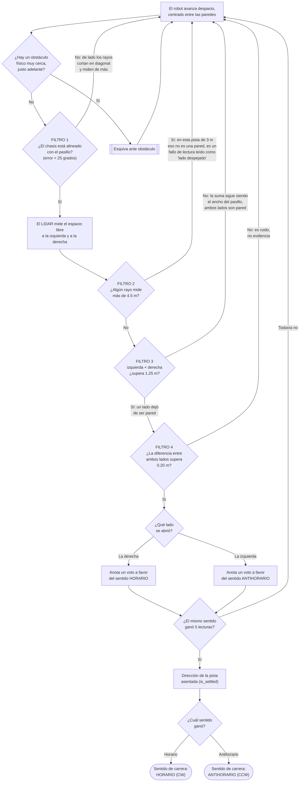
```mermaid
flowchart TD
    A["El robot avanza despacio,<br/>centrado entre las paredes"] --> Block{"¿Hay un obstáculo<br/>físico muy cerca,<br/>justo adelante?"}

    Block -- "No" --> G1
    Block -- "Sí" --> Avoid[["Esquiva ante obstáculo"]]
    Avoid --> A

    G1{"FILTRO 1<br/>¿El chasis está alineado<br/>con el pasillo?<br/>(error &lt; 25 grados)"}
    G1 -- "No: de lado los rayos<br/>cortan en diagonal<br/>y miden de más" --> A
    G1 -- "Sí" --> M

    M["El LIDAR mide el espacio libre<br/>a la izquierda y a la derecha"] --> G2

    G2{"FILTRO 2<br/>¿Algún rayo mide<br/>más de 4.5 m?"}
    G2 -- "Sí: en esta pista de 3 m<br/>eso no es una pared, es un<br/>fallo de lectura leído como<br/>'lado despejado'" --> A
    G2 -- "No" --> G3

    G3{"FILTRO 3<br/>izquierda + derecha<br/>¿supera 1.25 m?"}
    G3 -- "No: la suma sigue siendo<br/>el ancho del pasillo,<br/>ambos lados son pared" --> A
    G3 -- "Sí: un lado dejó<br/>de ser pared" --> G4

    G4{"FILTRO 4<br/>¿La diferencia entre<br/>ambos lados supera<br/>0.20 m?"}
    G4 -- "No: es ruido,<br/>no evidencia" --> A
    G4 -- "Sí" --> C

    C{"¿Qué lado<br/>se abrió?"}
    C -- "La derecha" --> D["Anota un voto a favor<br/>del sentido HORARIO"]
    C -- "La izquierda" --> E["Anota un voto a favor<br/>del sentido ANTIHORARIO"]

    D --> F{"¿El mismo sentido<br/>ganó 5 lecturas?"}
    E --> F

    F -- "Todavía no" --> A
    F -- "Sí" --> G["Dirección de la pista<br/>asentada (is_settled)"]

    G --> H{"¿Cuál sentido<br/>ganó?"}
    H -- "Horario" --> I(["Sentido de carrera:<br/>HORARIO (CW)"])
    H -- "Antihorario" --> J(["Sentido de carrera:<br/>ANTIHORARIO (CCW)"])
```

<p align="center"><i>Inferencia del sentido de la vuelta</i><br><sub>Fuente: <a href="schemes/flowcharts/common/mermaid/inferencia-direccion.mmd"><code>inferencia-direccion.mmd</code></a> | <a href="schemes/flowcharts/common/webp/inferencia-direccion.webp">render WebP</a></sub></p>

Lo interesante no es la comparación, sino todo lo que hay que descartar antes de creerla. Una lectura solo cuenta como voto si supera cuatro filtros ([`inferencia-direccion.mmd`](schemes/flowcharts/common/mermaid/inferencia-direccion.mmd)):

1. **El chasis está alineado con el pasillo** (error menor a 25°). De lado, los rayos laterales cortan en diagonal y miden de más.
2. **Ningún rayo supera los 4.5 m.** En una pista de 3 m eso no puede ser una pared. Importa porque **un fallo de lectura del LIDAR se sustituye por el rango máximo**, que es exactamente la señal de «este lado está despejado» que el módulo busca: sin este filtro, un sensor sin respuesta parece un pasillo abierto.
3. **La suma de ambos lados supera 1.25 m.** La decisión se toma sobre la *suma*, no sobre cada rayo por separado, y este es el punto fino: dos paredes suman el ancho del pasillo sin importar dónde esté el robot entre ellas, así que la suma solo salta cuando un lado deja de ser pared. Comparar los rayos directamente no funciona: un robot desviado hacia el bloque interior lee 0.27 m a su izquierda y 0.72 m a su derecha, y «el lado más lejano está abierto» elige la pared exterior y devuelve exactamente la respuesta contraria.
4. **La diferencia entre lados supera 0.20 m**, para que el ruido no cuente como evidencia.

Y aun así una sola lectura no decide: hacen falta **5 votos coincidentes**. Un rayo que entra por la esquina de un bloque produce errores breves y agrupados, y uno de esos llegando primero no puede decidir la ronda.

### Seguimiento de pasillo, vueltas y escapes

Con el sentido resuelto, el robot sigue el pasillo manteniéndose centrado, cuenta las vueltas por el paso acumulado alrededor del circuito, y vigila permanentemente dos condiciones de fallo: **colisión** y **atasco**. Ambas comparten una misma rutina de escape, documentada una sola vez en `common/` y referenciada desde los dos desafíos en vez de redibujarse.

<!-- mermaid-src: schemes/flowcharts/common/mermaid/conteo-vueltas.mmd -->
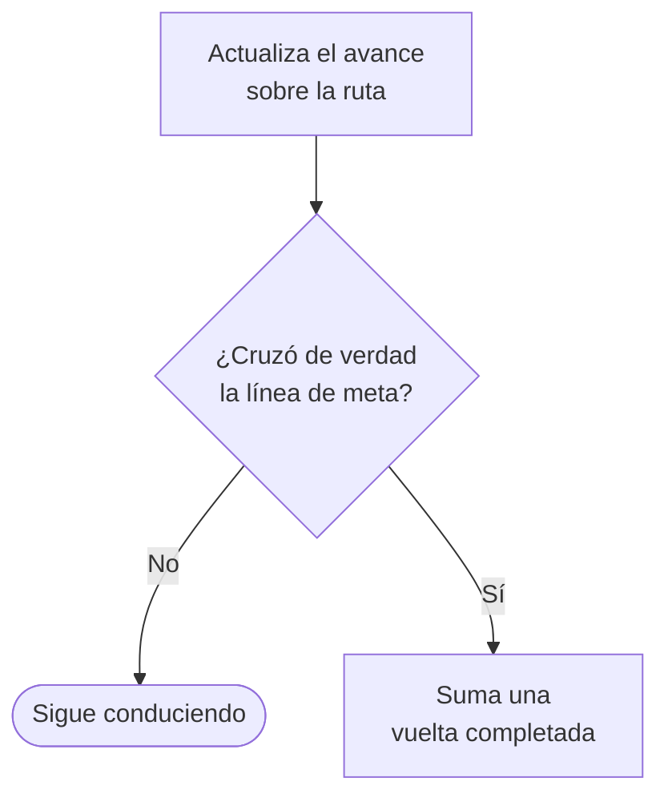
```mermaid
flowchart TD
    LapCheck["Actualiza el avance<br/>sobre la ruta"] --> CrossCheck{"¿Cruzó de verdad<br/>la línea de meta?"}
    CrossCheck -- "No" --> Continue(["Sigue conduciendo"])
    CrossCheck -- "Sí" --> IncLap["Suma una<br/>vuelta completada"]
```

<p align="center"><i>Conteo de vueltas por paso acumulado alrededor del circuito</i><br><sub>Fuente: <a href="schemes/flowcharts/common/mermaid/conteo-vueltas.mmd"><code>conteo-vueltas.mmd</code></a> | <a href="schemes/flowcharts/common/webp/conteo-vueltas.webp">render WebP</a></sub></p>

<!-- mermaid-src: schemes/flowcharts/common/mermaid/escape-colision.mmd -->
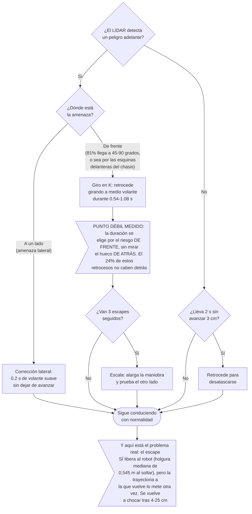
```mermaid
flowchart TD
    Risk{"¿El LIDAR detecta<br/>un peligro adelante?"}

    Risk -- "No" --> Stuck{"¿Lleva 2 s sin<br/>avanzar 3 cm?"}
    Risk -- "Sí" --> Where{"¿Dónde está<br/>la amenaza?"}

    Where -- "A un lado<br/>(amenaza lateral)" --> Side["Corrección lateral:<br/>0.2 s de volante suave<br/>sin dejar de avanzar"]
    Where -- "De frente<br/>(81% llega a 45-90 grados,<br/>o sea por las esquinas<br/>delanteras del chasis)" --> KTurn["Giro en K: retrocede<br/>girando a medio volante<br/>durante 0.54-1.08 s"]

    KTurn --> Fit>"PUNTO DÉBIL MEDIDO: la duración se<br/>elige por el riesgo DE FRENTE, sin mirar<br/>el hueco DE ATRÁS. El 24% de estos<br/>retrocesos no caben detrás"]

    Side --> Resume
    Fit --> Attempts{"¿Van 3 escapes<br/>seguidos?"}
    Attempts -- "Sí" --> Escalate["Escala: alarga la maniobra<br/>y prueba el otro lado"]
    Attempts -- "No" --> Resume
    Escalate --> Resume

    Stuck -- "Sí" --> StuckEscape["Retrocede para<br/>desatascarse"]
    Stuck -- "No" --> Resume

    StuckEscape --> Resume(["Sigue conduciendo<br/>con normalidad"])

    Resume --> Back>"Y aquí está el problema real: el escape<br/>SÍ libera al robot (holgura mediana de<br/>0.545 m al soltar), pero la trayectoria a<br/>la que vuelve lo mete otra vez. Se vuelve<br/>a chocar tras 4-25 cm"]
```

<p align="center"><i>Rutina de escape compartida ante colisión y atasco</i><br><sub>Fuente: <a href="schemes/flowcharts/common/mermaid/escape-colision.mmd"><code>escape-colision.mmd</code></a> | <a href="schemes/flowcharts/common/webp/escape-colision.webp">render WebP</a></sub></p>

<!-- mermaid-src: schemes/flowcharts/common/mermaid/esquiva-generica.mmd -->
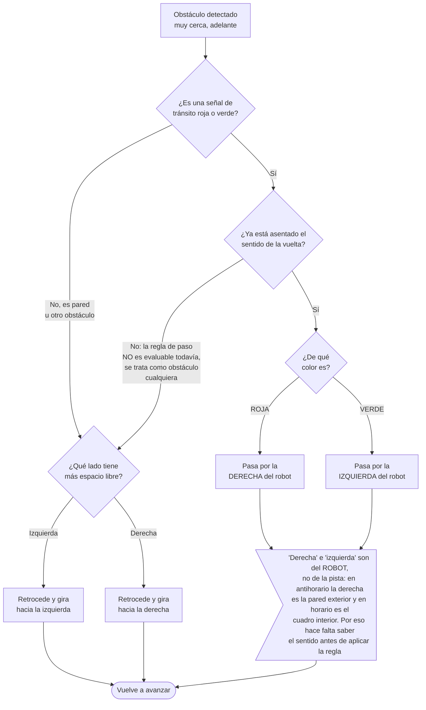
```mermaid
flowchart TD
    Obstacle["Obstáculo detectado<br/>muy cerca, adelante"] --> IsSign{"¿Es una señal de<br/>tránsito roja o verde?"}

    IsSign -- "No, es pared<br/>u otro obstáculo" --> Choose
    IsSign -- "Sí" --> Settled{"¿Ya está asentado el<br/>sentido de la vuelta?"}

    Settled -- "No: la regla de paso<br/>NO es evaluable todavía,<br/>se trata como obstáculo<br/>cualquiera" --> Choose
    Settled -- "Sí" --> Color{"¿De qué<br/>color es?"}

    Choose{"¿Qué lado tiene<br/>más espacio libre?"}
    Choose -- "Izquierda" --> TurnLeft["Retrocede y gira<br/>hacia la izquierda"]
    Choose -- "Derecha" --> TurnRight["Retrocede y gira<br/>hacia la derecha"]

    Color -- "ROJA" --> DodgeR["Pasa por la<br/>DERECHA del robot"]
    Color -- "VERDE" --> DodgeG["Pasa por la<br/>IZQUIERDA del robot"]

    DodgeR --> Frame>"'Derecha' e 'izquierda' son del ROBOT,<br/>no de la pista: en antihorario la derecha<br/>es la pared exterior y en horario es el<br/>cuadro interior. Por eso hace falta saber<br/>el sentido antes de aplicar la regla"]
    DodgeG --> Frame

    TurnLeft --> Resume(["Vuelve a avanzar"])
    TurnRight --> Resume
    Frame --> Resume
```

<p align="center"><i>Esquiva genérica de obstáculo</i><br><sub>Fuente: <a href="schemes/flowcharts/common/mermaid/esquiva-generica.mmd"><code>esquiva-generica.mmd</code></a> | <a href="schemes/flowcharts/common/webp/esquiva-generica.webp">render WebP</a></sub></p>

En el Obstacle Challenge se añade la regla de color: el robot debe pasar por un lado determinado de cada señal según sea roja o verde. La consecuencia de equivocarse no es perder puntos, es **terminar la ronda**, así que el criterio de paso es una de las partes más conservadoras del sistema.

<!-- mermaid-src: schemes/flowcharts/obstacles/mermaid/regla-senales.mmd -->
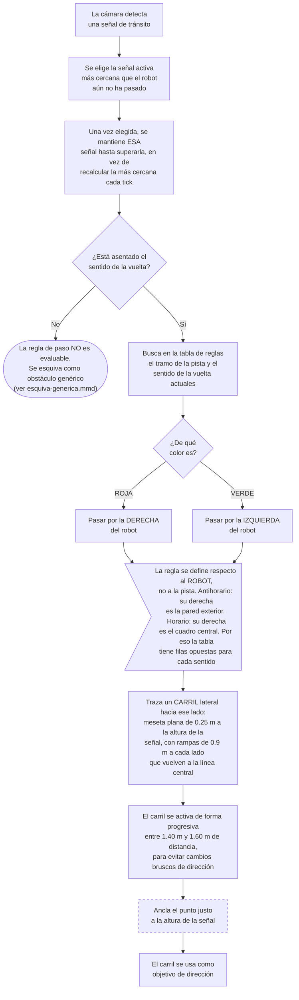
```mermaid
flowchart TD
    Sign["La cámara detecta<br/>una señal de tránsito"] --> Active["Se elige la señal activa<br/>más cercana que el robot<br/>aún no ha pasado"]
    Active --> Commit["Una vez elegida, se mantiene ESA<br/>señal hasta superarla, en vez de<br/>recalcular la más cercana cada tick"]
    Commit --> Dir{"¿Está asentado el<br/>sentido de la vuelta?"}

    Dir -- "No" --> NoRule(["La regla de paso NO es evaluable.<br/>Se esquiva como obstáculo genérico<br/>(ver esquiva-generica.mmd)"])
    Dir -- "Sí" --> Lookup["Busca en la tabla de reglas<br/>el tramo de la pista y el<br/>sentido de la vuelta actuales"]

    Lookup --> Color{"¿De qué<br/>color es?"}

    Color -- "ROJA" --> Right["Pasar por la DERECHA<br/>del robot"]
    Color -- "VERDE" --> Left["Pasar por la IZQUIERDA<br/>del robot"]

    Right --> Note>"La regla se define respecto al ROBOT,<br/>no a la pista. Antihorario: su derecha<br/>es la pared exterior. Horario: su derecha<br/>es el cuadro central. Por eso la tabla<br/>tiene filas opuestas para cada sentido"]
    Left --> Note

    Note --> Lane["Traza un CARRIL lateral hacia ese lado:<br/>meseta plana de 0.25 m a la altura de la<br/>señal, con rampas de 0.9 m a cada lado<br/>que vuelven a la línea central"]
    Lane --> Taper["El carril se activa de forma progresiva<br/>entre 1.40 m y 1.60 m de distancia,<br/>para evitar cambios bruscos de dirección"]
    Taper --> Pin["Ancla el punto justo<br/>a la altura de la señal"]:::optional
    Pin --> Steer["El carril se usa como<br/>objetivo de dirección"]

    classDef optional stroke-dasharray: 5 5
```

<p align="center"><i>Regla de paso por señales de color (Obstacle Challenge)</i><br><sub>Fuente: <a href="schemes/flowcharts/obstacles/mermaid/regla-senales.mmd"><code>regla-senales.mmd</code></a> | <a href="schemes/flowcharts/obstacles/webp/regla-senales.webp">render WebP</a></sub></p>

### Vista completa de cada desafío

Los diagramas anteriores describen piezas sueltas de la lógica. Estos son los flujos completos y las máquinas de estado de cada desafío, renderizados desde las mismas fuentes Mermaid de [`schemes/flowcharts/`](schemes/flowcharts/).

<!-- mermaid-src: schemes/flowcharts/open/mermaid/flujo-completo.mmd -->
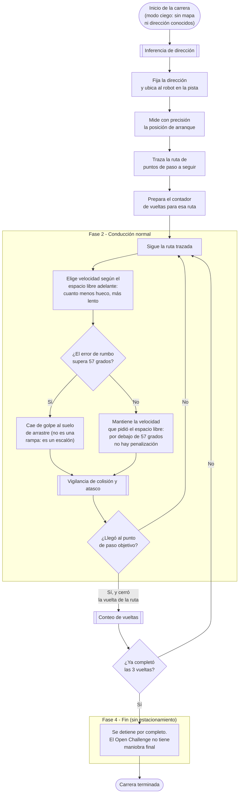
```mermaid
flowchart TD
    Start(["Inicio de la carrera<br/>(modo ciego: sin mapa<br/>ni dirección conocidos)"]) --> Fase1

    Fase1[["Inferencia de dirección"]] --> Commit["Fija la dirección<br/>y ubica al robot en la pista"]
    Commit --> StartPose["Mide con precisión<br/>la posición de arranque"]
    StartPose --> PlanPath["Traza la ruta de<br/>puntos de paso a seguir"]
    PlanPath --> BuildLap["Prepara el contador<br/>de vueltas para esa ruta"]

    BuildLap --> Drive

    subgraph FASE_2["Fase 2 - Conducción normal"]
        Drive["Sigue la ruta trazada"] --> SpeedClear["Elige velocidad según el<br/>espacio libre adelante:<br/>cuanto menos hueco, más lento"]
        SpeedClear --> HeadCheck{"¿El error de rumbo<br/>supera 57 grados?"}
        HeadCheck -- "Sí" --> Crawl["Cae de golpe al suelo<br/>de arrastre (no es una<br/>rampa: es un escalón)"]
        HeadCheck -- "No" --> Full["Mantiene la velocidad<br/>que pidió el espacio libre:<br/>por debajo de 57 grados<br/>no hay penalización"]
        Crawl --> Watch
        Full --> Watch[["Vigilancia de colisión y atasco"]]
        Watch --> WPCheck
    end

    WPCheck{"¿Llegó al punto<br/>de paso objetivo?"}
    WPCheck -- "No" --> Drive
    WPCheck -- "Sí, y cerró<br/>la vuelta de la ruta" --> LapPhase

    LapPhase[["Conteo de vueltas"]] --> LapsDone{"¿Ya completó<br/>las 3 vueltas?"}
    LapsDone -- "No" --> Drive
    LapsDone -- "Sí" --> Finish

    subgraph FASE_4["Fase 4 - Fin (sin estacionamiento)"]
        Finish["Se detiene por completo.<br/>El Open Challenge no tiene<br/>maniobra final"]
    end

    Finish --> End(["Carrera terminada"])
```

<p align="center"><i>Open Challenge - flujo completo</i><br><sub>Fuente: <a href="schemes/flowcharts/open/mermaid/flujo-completo.mmd"><code>flujo-completo.mmd</code></a> | <a href="schemes/flowcharts/open/webp/flujo-completo.webp">render WebP</a></sub></p>

<!-- mermaid-src: schemes/flowcharts/open/mermaid/maquina-estados.mmd -->
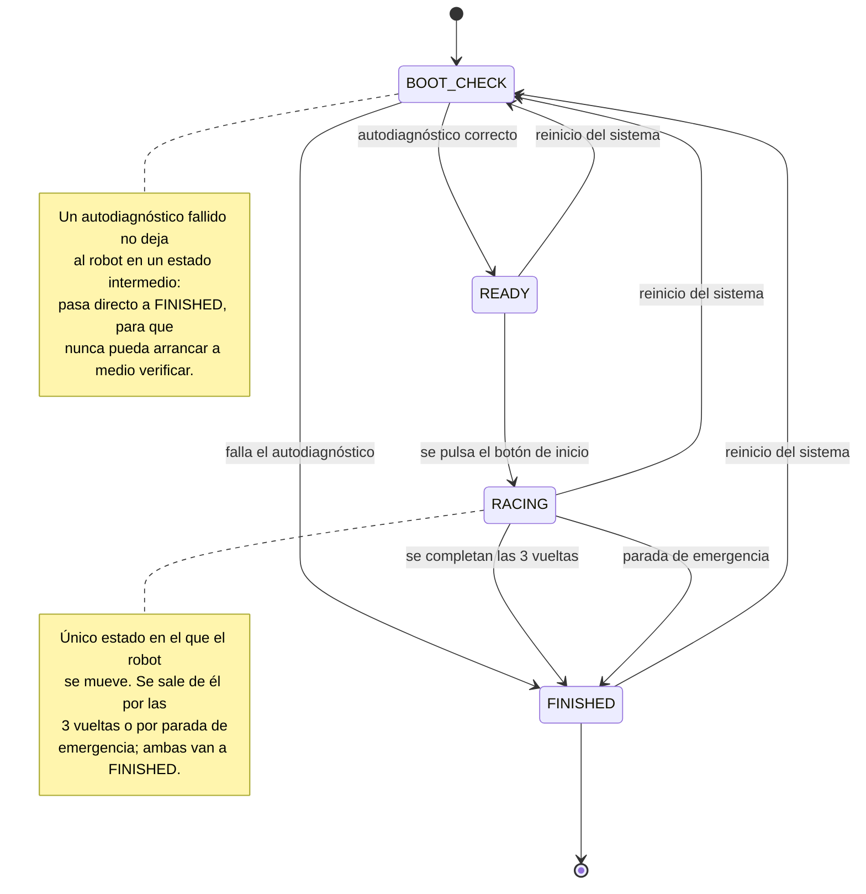
```mermaid
stateDiagram-v2
    [*] --> BOOT_CHECK

    BOOT_CHECK --> READY: autodiagnóstico correcto
    BOOT_CHECK --> FINISHED: falla el autodiagnóstico

    READY --> RACING: se pulsa el botón de inicio
    READY --> BOOT_CHECK: reinicio del sistema

    RACING --> FINISHED: se completan las 3 vueltas
    RACING --> FINISHED: parada de emergencia
    RACING --> BOOT_CHECK: reinicio del sistema

    FINISHED --> BOOT_CHECK: reinicio del sistema

    FINISHED --> [*]

    note right of BOOT_CHECK
        Un autodiagnóstico fallido no deja
        al robot en un estado intermedio:
        pasa directo a FINISHED, para que
        nunca pueda arrancar a medio verificar.
    end note

    note right of RACING
        Único estado en el que el robot
        se mueve. Se sale de él por las
        3 vueltas o por parada de
        emergencia; ambas van a FINISHED.
    end note
```

<p align="center"><i>Open Challenge - máquina de estados</i><br><sub>Fuente: <a href="schemes/flowcharts/open/mermaid/maquina-estados.mmd"><code>maquina-estados.mmd</code></a> | <a href="schemes/flowcharts/open/webp/maquina-estados.webp">render WebP</a></sub></p>

<!-- mermaid-src: schemes/flowcharts/obstacles/mermaid/flujo-parte1-conduccion.mmd -->

```mermaid
flowchart TD
    Start(["Inicio de la carrera<br/>(modo ciego: sin mapa<br/>ni dirección conocidos)"]) --> InBay{"¿Está dentro del hueco<br/>de estacionamiento?<br/>(se asume que sí)"}

    InBay -- "No: hay espacio<br/>libre adelante" --> Fase1
    InBay -- "Sí" --> BayExit

    subgraph FASE_0["Fase 0 - Salir de la bahía (solo Obstacle Challenge)"]
        BayExit["Gira el volante a tope<br/>y avanza un tramo corto"] --> Guard{"¿La pierna dejaría al<br/>chasis demasiado cerca<br/>de una aleta?"}
        Guard -- "Sí" --> Flip["Descarta esa pierna e<br/>invierte el sentido de marcha"]
        Guard -- "No" --> Move["Ejecuta la pierna"]
        Flip --> Mirror
        Move --> Mirror["Al invertir, ESPEJA el volante:<br/>sin espejo el retroceso rehace<br/>el arco de ida y no se rota"]
        Mirror --> YawCheck{"¿Ya rotó 70 grados<br/>desde la posición<br/>de arranque?"}
        YawCheck -- "No" --> BayExit
    end

    YawCheck -- "Sí" --> Fase1

    Fase1[["Inferencia de dirección"]] --> Commit["Fija la dirección<br/>y ubica al robot en la pista"]
    Commit --> StartPose["Mide con precisión<br/>la posición de arranque"]
    StartPose --> PlanPath["Traza la ruta de<br/>puntos de paso a seguir"]
    PlanPath --> BuildRouter["Prepara el reconocimiento de señales.<br/>Como es modo ciego, empieza vacío<br/>y se llena con lo que ve la cámara"]
    BuildRouter --> BuildLap["Prepara el contador<br/>de vueltas para esa ruta"]

    BuildLap --> Drive

    subgraph FASE_2["Fase 2 - Conducción y esquiva de señales"]
        Drive["Sigue la ruta trazada"] --> Discover["La cámara detecta señales<br/>nuevas y las añade<br/>al mapa de señales"]
        Discover --> Candidate["Elige la señal activa más<br/>cercana que aún no ha pasado"]
        Candidate --> HasSign{"¿Hay una señal<br/>activa cerca?"}
        HasSign -- "No" --> Watch
        HasSign -- "Sí" --> Reroute[["Regla de paso por señal"]]
        Reroute --> Watch[["Vigilancia de colisión y atasco"]]
        Watch --> WPCheck
    end

    WPCheck{"¿Llegó al punto<br/>de paso objetivo?"}
    WPCheck -- "No" --> Drive
    WPCheck -- "Sí, y cerró<br/>la vuelta de la ruta" --> LapPhase

    subgraph FASE_3["Fase 3 - Contar vueltas"]
        LapPhase[["Conteo de vueltas"]] --> Rearm["Vuelve a habilitar todas<br/>las señales para<br/>la siguiente vuelta"]
    end

    Rearm --> LapsDone{"¿Ya completó<br/>las 3 vueltas?"}
    LapsDone -- "No" --> Drive
    LapsDone -- "Sí" --> Next(["Continúa en:<br/>Parte 2 - Final de carrera"])
```

<p align="center"><i>Obstacle Challenge - parte 1: conducción y señales</i><br><sub>Fuente: <a href="schemes/flowcharts/obstacles/mermaid/flujo-parte1-conduccion.mmd"><code>flujo-parte1-conduccion.mmd</code></a> | <a href="schemes/flowcharts/obstacles/webp/flujo-parte1-conduccion.webp">render WebP</a></sub></p>

<!-- mermaid-src: schemes/flowcharts/obstacles/mermaid/flujo-parte2-estacionamiento.mmd -->
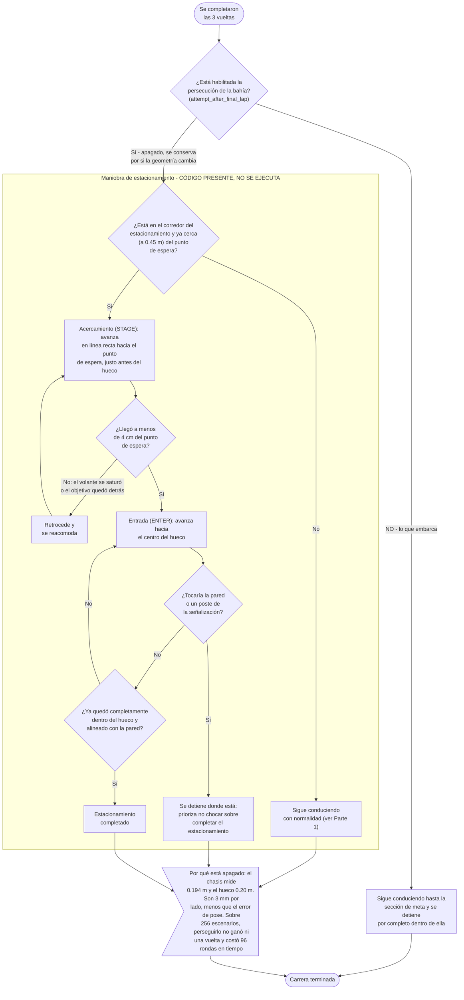
```mermaid
flowchart TD
    Start(["Se completaron<br/>las 3 vueltas"]) --> Flag{"¿Está habilitada la<br/>persecución de la bahía?<br/>(attempt_after_final_lap)"}

    Flag -- "NO - lo que embarca" --> FinishStop["Sigue conduciendo hasta la<br/>sección de meta y se detiene<br/>por completo dentro de ella"]
    FinishStop --> End(["Carrera terminada"])

    Flag -- "Sí - apagado, se conserva<br/>por si la geometría cambia" --> EngageCheck

    subgraph DESHABILITADO["Maniobra de estacionamiento - CÓDIGO PRESENTE, NO SE EJECUTA"]
        EngageCheck{"¿Está en el corredor del<br/>estacionamiento y ya cerca<br/>(a 0.45 m) del punto<br/>de espera?"}
        EngageCheck -- "No" --> KeepDriving["Sigue conduciendo<br/>con normalidad (ver Parte 1)"]

        EngageCheck -- "Sí" --> Stage["Acercamiento (STAGE): avanza<br/>en línea recta hacia el punto<br/>de espera, justo antes del hueco"]
        Stage --> StageReach{"¿Llegó a menos<br/>de 4 cm del punto<br/>de espera?"}
        StageReach -- "No: el volante se saturó<br/>o el objetivo quedó detrás" --> Reposition["Retrocede y<br/>se reacomoda"]
        Reposition --> Stage

        StageReach -- "Sí" --> Enter["Entrada (ENTER): avanza hacia<br/>el centro del hueco"]
        Enter --> Breach{"¿Tocaría la pared<br/>o un poste de<br/>la señalización?"}
        Breach -- "Sí" --> GiveUp["Se detiene donde está:<br/>prioriza no chocar sobre<br/>completar el estacionamiento"]
        Breach -- "No" --> Inside{"¿Ya quedó completamente<br/>dentro del hueco y<br/>alineado con la pared?"}
        Inside -- "No" --> Enter
        Inside -- "Sí" --> Done["Estacionamiento<br/>completado"]
    end

    Geo>"Por qué está apagado: el chasis mide<br/>0.194 m y el hueco 0.20 m. Son 3 mm por<br/>lado, menos que el error de pose. Sobre<br/>256 escenarios, perseguirlo no ganó ni<br/>una vuelta y costó 96 rondas en tiempo"]

    KeepDriving --> Geo
    GiveUp --> Geo
    Done --> Geo
    Geo --> End
```

<p align="center"><i>Obstacle Challenge - parte 2: estacionamiento</i><br><sub>Fuente: <a href="schemes/flowcharts/obstacles/mermaid/flujo-parte2-estacionamiento.mmd"><code>flujo-parte2-estacionamiento.mmd</code></a> | <a href="schemes/flowcharts/obstacles/webp/flujo-parte2-estacionamiento.webp">render WebP</a></sub></p>

<!-- mermaid-src: schemes/flowcharts/obstacles/mermaid/maquina-estados.mmd -->
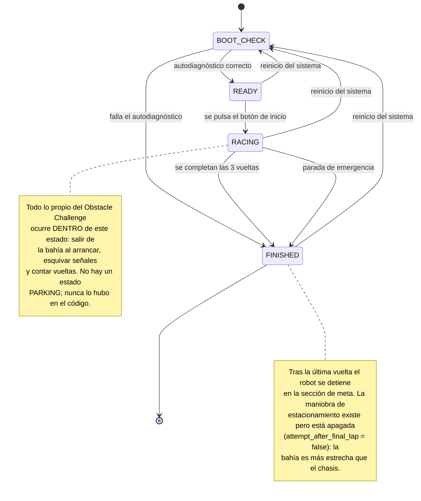
```mermaid
stateDiagram-v2
    [*] --> BOOT_CHECK

    BOOT_CHECK --> READY: autodiagnóstico correcto
    BOOT_CHECK --> FINISHED: falla el autodiagnóstico

    READY --> RACING: se pulsa el botón de inicio
    READY --> BOOT_CHECK: reinicio del sistema

    RACING --> FINISHED: se completan las 3 vueltas
    RACING --> FINISHED: parada de emergencia
    RACING --> BOOT_CHECK: reinicio del sistema

    FINISHED --> BOOT_CHECK: reinicio del sistema

    FINISHED --> [*]

    note right of RACING
        Todo lo propio del Obstacle Challenge
        ocurre DENTRO de este estado: salir de
        la bahía al arrancar, esquivar señales
        y contar vueltas. No hay un estado
        PARKING; nunca lo hubo en el código.
    end note

    note right of FINISHED
        Tras la última vuelta el robot se detiene
        en la sección de meta. La maniobra de
        estacionamiento existe pero está apagada
        (attempt_after_final_lap = false): la
        bahía es más estrecha que el chasis.
    end note
```

<p align="center"><i>Obstacle Challenge - máquina de estados</i><br><sub>Fuente: <a href="schemes/flowcharts/obstacles/mermaid/maquina-estados.mmd"><code>maquina-estados.mmd</code></a> | <a href="schemes/flowcharts/obstacles/webp/maquina-estados.webp">render WebP</a></sub></p>

## Análisis y simulación

Estas dos herramientas convierten lo que ocurre en pista en algo que se puede reproducir y medir fuera de ella.

### Grabación y análisis de carreras

Una ronda dura como máximo **180 segundos** y no se puede pausar. Si algo sale mal, observar el robot no revela la causa. Por eso todo lo que ocurre a bordo queda grabado.

Cada ejecución escribe un *bag* en formato **MCAP** con todos los tópicos: barridos del LIDAR, pose estimada, comandos de dirección y velocidad, estado de la máquina de estados y detecciones de visión. Los bags se descargan del robot a `other/data/` y se analizan en frío, fuera de la pista.

Sobre esos bags corren decenas de scripts de diagnóstico especializados: uno reconstruye el conteo de vueltas, otro mide la sobrecorrección en las esquinas, otro compara la dirección inferida contra lo que realmente ocurrió, otro revisa la robustez de los rayos laterales. Para inspección visual, los bags se abren en **Foxglove**.

La diferencia práctica es grande: un fallo no se resuelve repitiendo la ronda y esperando que se manifieste de nuevo, sino **reproduciendo el instante exacto tantas veces como haga falta**, con los mismos datos, hasta encontrar la causa. Varios de los hallazgos listados más abajo salieron de un bag, no de la pista.

### Simulador y corpus de escenarios

Probar solo en la pista física tiene un límite duro: cada intento cuesta minutos, cada montaje es ligeramente distinto y no se puede repetir una situación difícil a voluntad. Por eso construimos un simulador y, sobre él, un **corpus de escenarios**.

Un escenario es una combinación concreta de posición de arranque, anchos de pasillo y sentido de la pista. El corpus los enumera de forma exhaustiva:

<table align="center">
<thead>
<tr>
<th align="left">Desafío</th>
<th align="left">Escenarios</th>
<th align="left">Qué varía</th>
</tr>
</thead>
<tbody>
<tr>
<td align="left">Open Challenge</td>
<td align="left"><strong>640</strong></td>
<td align="left">Posición de arranque, configuración de anchos, sentido de giro</td>
</tr>
<tr>
<td align="left">Obstacle Challenge</td>
<td align="left"><strong>256</strong></td>
<td align="left">Lo anterior, más la disposición y el color de las señales</td>
</tr>
</tbody>
</table>

Esto cambia el significado de «funciona». Una mejora ya no se juzga por una carrera afortunada, sino por **cuántos de los 640 escenarios completa**. La referencia actual del Open Challenge es de **638 de 640**, y los dos casos restantes están identificados uno por uno, no agrupados como «ruido».

También cambia la forma de fallar. Cuando un cambio parece mejorar el resultado, el corpus permite comprobar *cuáles* casos concretos cambiaron de estado. Más de una vez, una mejora aparente resultó ser un caso que empezó a pasar y otro distinto que empezó a fallar, con el total sin moverse.

## Pensamiento sistémico y decisiones de ingeniería

Esta sección no describe qué hace el robot, sino **cómo tomamos las decisiones** que lo llevaron a ser así. Es la parte del proyecto que más nos cambió la forma de trabajar.

### Interacciones entre subsistemas

Las cinco áreas del robot no se diseñaron por separado y luego se juntaron. Cada una impone restricciones sobre las otras, y la mayoría de las decisiones de este documento se entienden mejor viendo qué cruza entre ellas.

<!-- mermaid-src: schemes/flowcharts/common/mermaid/subsistemas.mmd -->
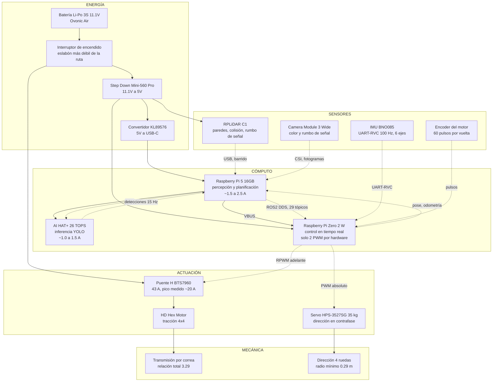
```mermaid
flowchart TD
    subgraph ENERGÍA["ENERGÍA"]
        BAT["Batería Li-Po 3S 11.1V<br/>Ovonic Air"]
        SW["Interruptor de encendido<br/>eslabón más débil de la ruta"]
        REG["Step Down Mini-560 Pro<br/>11.1V a 5V"]
        USBC["Convertidor KL89576<br/>5V a USB-C"]
    end

    subgraph CÓMPUTO["CÓMPUTO"]
        PI5["Raspberry Pi 5 16GB<br/>percepción y planificación<br/>~1.5 a 2.5 A"]
        NPU["AI HAT+ 26 TOPS<br/>inferencia YOLO<br/>~1.0 a 1.5 A"]
        ZERO["Raspberry Pi Zero 2 W<br/>control en tiempo real<br/>solo 2 PWM por hardware"]
    end

    subgraph SENSORES["SENSORES"]
        LIDAR["RPLiDAR C1<br/>paredes, colisión, rumbo de señal"]
        CAM["Camera Module 3 Wide<br/>color y rumbo de señal"]
        IMU["IMU BNO085<br/>UART-RVC 100 Hz, 6 ejes"]
        ENC["Encoder del motor<br/>60 pulsos por vuelta"]
    end

    subgraph ACTUACIÓN["ACTUACIÓN"]
        HB["Puente H BTS7960<br/>43 A, pico medido ~20 A"]
        MOT["HD Hex Motor<br/>tracción 4x4"]
        SRV["Servo HPS-3527SG 35 kg<br/>dirección en contrafase"]
    end

    subgraph MECÁNICA["MECÁNICA"]
        TRANS["Transmisión por correa<br/>relación total 3.29"]
        DIR["Dirección 4 ruedas<br/>radio mínimo 0.29 m"]
    end

    BAT --> SW
    SW --> REG
    SW --> HB
    REG --> USBC
    REG --> ZERO
    REG --> LIDAR
    USBC --> PI5
    PI5 -->|VBUS| ZERO
    PI5 --> NPU

    LIDAR -.->|USB, barrido| PI5
    CAM -.->|CSI, fotogramas| PI5
    PI5 -.->|PCIe| NPU
    NPU -.->|detecciones 15 Hz| PI5
    PI5 -.->|ROS2 DDS, 29 tópicos| ZERO
    ZERO -.->|pose, odometría| PI5
    IMU -.->|UART-RVC| ZERO
    ENC -.->|pulsos| ZERO
    ZERO -.->|RPWM adelante| HB
    ZERO -.->|PWM absoluto| SRV

    HB --> MOT
    MOT --> TRANS
    SRV --> DIR
```

<p align="center"><i>Interacciones entre subsistemas: línea continua es energía, línea punteada es dato</i><br><sub>Fuente: <a href="schemes/flowcharts/common/mermaid/subsistemas.mmd"><code>subsistemas.mmd</code></a> | <a href="schemes/flowcharts/common/webp/subsistemas.webp">render WebP</a></sub></p>

**Lo que el diagrama hace visible y las secciones sueltas no:**

- **Una sola batería alimenta dos mundos con exigencias opuestas.** La rama de tracción consume ~10 A con picos de ~20 A; la rama de lógica necesita 5 V estables. Van separadas desde el interruptor precisamente para que un pico de motor no arrastre la tensión de la Pi 5.
- **Los cuatro puntos únicos de fallo** no tienen redundancia: el interruptor de encendido (el eslabón más débil de la ruta de potencia desde que el puente pasó a 43 A), las dos placas (Pi 5 y Zero 2 W) y el puente H. Si cae cualquiera, la ronda se pierde. Está asumido: añadir redundancia costaría peso, y el peso es la restricción que más aprieta.
- **La Pi Zero se alimenta por VBUS desde la Pi 5.** Esto acopla las dos placas: un reinicio de la Pi 5 se lleva por delante el control en tiempo real. Verificado con `vcgencmd get_throttled` en carrera (0x0, sin caída de tensión), pero es un acoplamiento real y conviene declararlo.
- **El reparto de cómputo es una decisión de tiempo, no de potencia.** La inferencia de visión es pesada y de latencia variable; el lazo de control del servo no tolera fluctuaciones. Por eso viven en placas distintas, y por eso el enlace entre ellas es ROS2 sobre DDS con 29 tópicos declarados en un único archivo.
- **La restricción más dura del robot es un detalle de silicio.** El SoC de la Pi Zero tiene exactamente **dos generadores de PWM por hardware**. Uno lo toma el servo, que necesita posición absoluta. El otro va a la marcha adelante del motor. La marcha atrás se queda sin PWM de hardware, y de ahí sale el riesgo del `LPWM` sin pull-down que aparece en la tabla de riesgos. Una limitación de cómputo se convirtió en una limitación eléctrica y luego en una restricción de estrategia: el estacionamiento y la recuperación son las únicas maniobras que usan reversa.
- **El LIDAR es la red de seguridad, no la cámara.** La visión decide **qué** es una señal y **por dónde** pasarla; la distancia a la que hay que frenar la decide siempre el LIDAR. Por eso un fallo de cámara degrada la estrategia pero no provoca una colisión.

### Diseño gobernado por configuración

La regla que más impacto tuvo en la calidad del sistema es simple de enunciar: **ninguna constante de comportamiento vive dentro del código**. Hoy son decenas, repartidas en archivos TOML, y cada una lleva al lado varias líneas de comentario que justifican su valor.

No es documentación decorativa. Un número suelto en el código es imposible de auditar: nadie recuerda, tres meses después, si `0.20` se midió, se calculó o simplemente se estimó sin medir. Al obligarnos a escribir la justificación junto al valor, cada constante lleva su propia historia: qué se midió, con qué método, y qué pasó cuando valía otra cosa. Un ejemplo real, del archivo que gobierna la inferencia de dirección:

```toml
# Diferencia mínima entre izquierda y derecha para que un barrido cuente como
# evidencia y no como ruido. Antes era 0.30, lo que descartaba la asimetría que
# realmente ve un robot que arranca cerca del centro de un pasillo ancho.
min_asymmetry_m = 0.20
```

Y otro, del perfil del motor actual, que muestra el caso contrario, una constante marcada explícitamente como *todavía no medida*:

```toml
# Techo físico de aceleración (m/s^2). NO MEDIDO para este motor: viene del 2.0
# único y compartido que vivía en el robot.toml base hasta el 2026-08-29.
max_accel_mps2 = 2.0
```

Escribir «esto todavía no está medido» dentro del propio sistema evita que una estimación se convierta silenciosamente en un hecho.

### Perfiles de hardware intercambiables

El robot cambió de servo y de motor durante el desarrollo. Para que eso no obligara a tocar el código, el hardware está descrito en **perfiles componibles**: uno por pieza física.

<table align="center">
<thead>
<tr>
<th align="center">Perfil</th>
<th align="center">Pieza</th>
</tr>
</thead>
<tbody>
<tr>
<td align="center"><code>180deg-injora-14kg</code></td>
<td align="center">Servo de dirección de 180°, 14 kg</td>
</tr>
<tr>
<td align="center"><code>270deg-hiwonder-35kg</code></td>
<td align="center">Servo de dirección de 270°, 35 kg (actual)</td>
</tr>
<tr>
<td align="center"><code>generic-motor-1500rpm</code></td>
<td align="center">Motor de tracción de 1500 rpm</td>
</tr>
<tr>
<td align="center"><code>rev-hd-hex-motor-6000rpm</code></td>
<td align="center">Motor de tracción HD Hex de 6000 rpm (actual)</td>
</tr>
</tbody>
</table>

Se combinan al arrancar. Cambiar de servo es seleccionar otro perfil, no editar código, y, sobre todo, significa que **los dos servos siguen siendo utilizables** después del cambio: si el de 35 kg falla en competencia, volver al de 14 kg es una línea de configuración, no una tarde de reescritura.

### Compensaciones y alternativas descartadas

Ninguna de estas piezas se cambió por intuición. Cada fila responde a la misma pregunta: **qué dato hizo insostenible la primera opción**. Las cuatro piezas descartadas conservan su foto en el repositorio, porque la que se fue explica por qué está la que se quedó.

<table align="center">
<thead>
<tr>
<th align="left">Descartado</th>
<th align="left">Elegido</th>
<th align="left">Qué lo decidió</th>
<th align="left">Qué se pagó</th>
</tr>
</thead>
<tbody>
<tr>
<td align="left"><strong>Puente H L298N</strong><br></td>
<td align="left"><strong>BTS7960 / IBT-2</strong></td>
<td align="left">Medimos el consumo real del tren motriz: <strong>~10 A sostenidos al 50% de ciclo de trabajo, con picos cercanos a 20 A</strong>, contra los <strong>2 A por canal</strong> del L298N. Un orden de magnitud de diferencia, y explicaba de golpe los cortes y el calentamiento</td>
<td align="left">Mayor tamaño y peso. Y el cuello de botella no desapareció: se movió al interruptor de encendido</td>
</tr>
<tr>
<td align="left"><strong>Step Down XLC4016</strong><br></td>
<td align="left"><strong>Mini-560 Pro</strong></td>
<td align="left">Peso. Con el robot <strong>200 g por encima del límite de 1500 g</strong> y ninguna pieza responsable del exceso, la única salida era dimensionar cada rama contra su carga medida en vez de contra el peor caso imaginable. Este cambio solo recuperó <strong>19 g</strong></td>
<td align="left">Margen de corriente más ajustado, que ahora vigilamos con <code>vcgencmd get_throttled</code> en vez de sobredimensionar</td>
</tr>
<tr>
<td align="left"><strong>Motor reductor genérico de 1500 rpm</strong><br>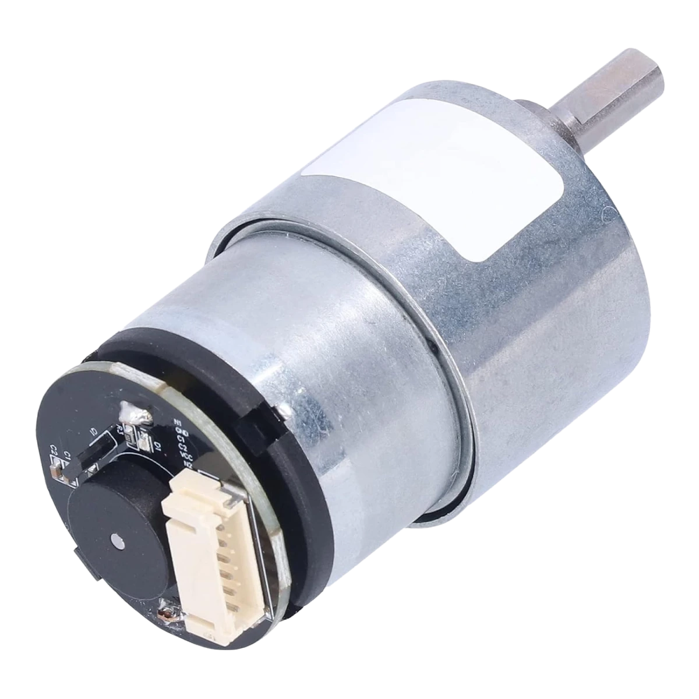</td>
<td align="left"><strong>REV HD Hex Motor</strong></td>
<td align="left">Torque insuficiente. Su techo medido en pista era de <strong>0.156 m/s</strong>, con el que vTitan no completaba los desafíos dentro del límite de tiempo. El HD Hex da 0.105 Nm de bloqueo y 6000 rpm sin carga</td>
<td align="left">Obligó a rehacer el ajuste del PID: el <code>counts_per_rev</code> no se hereda entre motores, y el del HD Hex tardó dos mediciones en quedar fijado (676 → 86 → 60). Las ganancias viejas producían oscilación visible</td>
</tr>
<tr>
<td align="left"><strong>Servo Injora 14 kg</strong><br>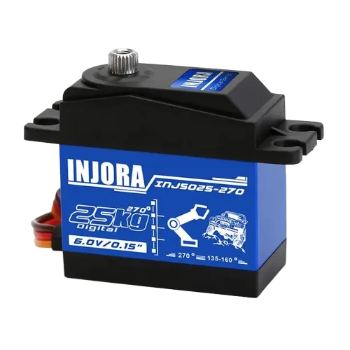</td>
<td align="left"><strong>Hiwonder HPS-3527SG 35 kg</strong></td>
<td align="left">Recorrido. El Injora abarca <strong>180°</strong>; la dirección en contrafase de vTitan necesita el recorrido ampliado del Hi Wonder (<strong>270°</strong>) para acercarse al giro de 90° por rueda que hace viable la salida del estacionamiento</td>
<td align="left">Más peso y volumen. Ambos servos siguen siendo válidos: viven como <a href="#perfiles-de-hardware-intercambiables">perfiles de hardware</a> y se eligen sin tocar código</td>
</tr>
</tbody>
</table>

Y tres compensaciones que no son de pieza sino de diseño:

<table align="center">
<thead>
<tr>
<th align="left">Descartado</th>
<th align="left">Elegido</th>
<th align="left">Qué lo decidió</th>
</tr>
</thead>
<tbody>
<tr>
<td align="left"><strong>IMU en 9 ejes</strong> (con magnetómetro)</td>
<td align="left"><strong>6 ejes en modo UART-RVC</strong></td>
<td align="left">Sobre la pista conviven tres motores, chasis metálico y electrónica de potencia. Un rumbo por campo magnético es vulnerable a todo eso. Aceptamos a cambio la deriva de la hoja de datos (~0.5°/min) y la acotamos por otras vías</td>
</tr>
<tr>
<td align="left"><strong>Lazo P sobre error angular</strong></td>
<td align="left"><strong>Pure pursuit</strong></td>
<td align="left">El lazo P era estable solo por debajo de <strong>~0.07 m/s</strong>; a velocidad de carrera saturaba el servo entre −70.2° y +70.2° durante carreras enteras. La ganancia estaba ajustada contra un modelo de dirección delantera, y el chasis real es de 4 ruedas en contrafase. No era cuestión de reajustar, sino de cambiar la ley de control</td>
</tr>
<tr>
<td align="left"><strong>Conmutación de anticipación</strong> (0.16 m / 0.32 m)</td>
<td align="left"><strong>Rampa de mezcla continua</strong></td>
<td align="left">La conmutación ocurría a <strong>~2.5 Hz</strong> y cada una multiplicaba la curvatura por cuatro, con un zigzag visible (pico medio de <code>|steer|</code> de 0.306 a 0.398) sin ganancia lateral real</td>
</tr>
</tbody>
</table>

Y una compensación de arquitectura que sigue abierta a propósito:

<table align="center">
<thead>
<tr>
<th align="left">Descartado</th>
<th align="left">Elegido</th>
<th align="left">Qué lo decidió</th>
</tr>
</thead>
<tbody>
<tr>
<td align="left"><strong>Migrar ya a la pila en Go</strong> (NATS en lugar de ROS2/DDS)</td>
<td align="left"><strong>Seguir compitiendo con Python + ROS2</strong>, con Go en vía paralela</td>
<td align="left">Go promete arranque más rápido y menos consumo de memoria en las placas, y el backend de telemetría en Go <strong>ya corre en producción</strong>. Pero el criterio para cortar no es «parece listo»: es <strong>paridad completa verificada</strong>. Hoy lo portado se valida contra bags de carreras reales en un arnés de paridad, y el navegador de Go todavía no ha corrido dentro de un lazo de carrera completo en el robot. Mientras ese criterio no se cumpla, migrar cambiaría un sistema con temporada de ajustes encima por uno sin ella</td>
</tr>
</tbody>
</table>

La parte de esta decisión que consideramos la importante no es elegir Go o Python, sino **prohibirnos el híbrido**: migración en vía paralela y corte único, con la pila de Python documentada como camino de reversión. Un sistema medio migrado tiene el doble de superficie de fallo y ninguna de las dos ventajas, y en una temporada con fecha fija ese es el escenario que más cuesta.

### Registro de decisiones de arquitectura (ADR)

Cada constante que gobierna al robot tiene un archivo que explica su origen. Son **48 registros de decisión de arquitectura** en [`other/docs/adr/`](other/docs/adr/), uno por decisión, cada uno con su contexto, las opciones consideradas, la medición que la resolvió y el commit donde aterrizó. Varios documentan también premisas que **fueron refutadas después**, porque una decisión revertida enseña tanto como una que se sostuvo.

No son notas sueltas al margen del código: los esquemas JSON de `src/model/` apuntan a su ADR mediante la clave `x-journal`, y **`task config:check` falla si alguna referencia no resuelve**. Una constante sin justificación rastreable no pasa la verificación del repositorio.

Seis que ilustran el patrón:

<table align="center">
<thead>
<tr>
<th align="left">Decisión</th>
<th align="left">Qué resolvió</th>
</tr>
</thead>
<tbody>
<tr>
<td align="left"><a href="other/docs/adr/0013-turn-radius-speed-curve.md">0013 - El radio de giro mínimo depende de la velocidad</a></td>
<td align="left">El modelo de bicicleta predecía 1.5 cm de radio a tope de dirección, imposible para un chasis de 30 x 19.4 cm. Medir en banco sustituyó la fórmula por una curva dependiente de la velocidad</td>
</tr>
<tr>
<td align="left"><a href="other/docs/adr/0015-lidar-inverted-mount.md">0015 - El LIDAR está montado invertido</a></td>
<td align="left">Las lecturas hay que espejarlas, no rotarlas 180 grados. Rotarlas produce una pista plausible pero equivocada, el fallo que más costó localizar</td>
</tr>
<tr>
<td align="left"><a href="other/docs/adr/0020-config-loaded-at-runtime.md">0020 - La configuración se lee en ejecución, no se genera</a></td>
<td align="left">Por qué los TOML se leen al arrancar en vez de compilarse dentro de cada consumidor, y qué se paga por esa decisión</td>
</tr>
<tr>
<td align="left"><a href="other/docs/adr/0026-corridor-follower-no-centering.md">0026 - El seguidor de pasillo no centra</a></td>
<td align="left">Centrarse en el pasillo parecía obvio y resultó contraproducente. La medición que eliminó la ganancia de centrado</td>
</tr>
<tr>
<td align="left"><a href="other/docs/adr/0041-lidar-valid-range-floor.md">0041 - El piso de rango válido queda bajo el mínimo nominal</a></td>
<td align="left">Por qué aceptamos lecturas por debajo de lo que el fabricante garantiza, y qué ganó el robot con ello</td>
</tr>
<tr>
<td align="left"><a href="other/docs/adr/0047-contact-reverse-ships-disabled.md">0047 - El retroceso por contacto se publica desactivado</a></td>
<td align="left">Una función terminada que <strong>no se activa</strong> porque la evidencia no la respaldó. Escribir por qué algo queda apagado es parte del registro</td>
</tr>
</tbody>
</table>

Los ADR están redactados en inglés, igual que los mensajes de commit; esta documentación y la bitácora de ingeniería están en español.

### Ciclo de trabajo: idea → simulación → pista

Nuestro método de trabajo se estabilizó en tres pasos, y el orden importa:

1. **Formular la hipótesis antes de medir.** Escribir qué esperamos que cambie y en qué dirección, *antes* de ejecutar nada. Sin esto es demasiado fácil ejecutar, mirar el resultado y construir después una explicación que lo justifique.
2. **Contrastar contra el corpus completo**, no contra un caso. Un cambio se evalúa sobre los 640 escenarios, y se compara siempre contra la versión inmediatamente anterior, no contra una medición vieja tomada en otras condiciones.
3. **Verificar en la pista.** El simulador orienta; no decide. Solo la pista confirma.

Dos disciplinas que aprendimos a costa de errores:

**El simulador se calibra contra la realidad, no al revés.** Al comparar grabaciones reales con simuladas descubrimos que el simulador giraba más de lo que gira el robot y alcanzaba su velocidad al instante, cosa que el robot no hace. Era **optimista**: aprobaba comportamientos que en pista fallaban. Lo corregimos contra datos medidos y **descartamos las conclusiones anteriores a esa calibración**, porque estaban tomadas contra un robot que no existe.

**Un resultado solo es comparable dentro de sus propias condiciones.** Una misma configuración medida en dos momentos distintos puede dar resultados diferentes si algo del entorno cambió. Por eso las comparaciones se hacen en una sola ejecución y contra la versión inmediatamente anterior.

### Hallazgos de ingeniería

Los errores más costosos del proyecto no fueron de programación, sino **suposiciones que nadie había verificado**. Estos son los que más nos enseñaron:

<table align="center">
<thead>
<tr>
<th align="left">Hallazgo</th>
<th align="left">Detalle</th>
</tr>
</thead>
<tbody>
<tr>
<td align="left">El encoder daba <strong>60 pulsos por vuelta, no 86</strong></td>
<td align="left">Toda medición de distancia y velocidad estaba mal por ese factor. Se descubrió midiendo con cinta métrica una distancia conocida y comparándola con lo que el robot creía haber recorrido</td>
</tr>
<tr>
<td align="left">El «techo de 0.45 m/s» <strong>no era un límite físico</strong></td>
<td align="left">Era un artefacto del error anterior. Con el valor correcto, el techo real resultó ser <strong>~0.58 m/s</strong>. Estuvimos limitando el robot por un error de cuentas, no por el motor</td>
</tr>
<tr>
<td align="left">Un LIDAR montado invertido necesita <strong>espejar las lecturas, no rotarlas 180°</strong></td>
<td align="left">Rotar deja los ángulos invertidos en un sentido que parece plausible: el robot no falla de golpe, sino que interpreta mal la pista de forma sutil. Fue de los fallos que más costó localizar</td>
</tr>
<tr>
<td align="left">Un fallo de lectura del LIDAR <strong>se sustituye por el rango máximo</strong></td>
<td align="left">Es decir, un sensor sin respuesta se lee como «lado completamente despejado», justo la señal que usamos para decidir el sentido de la vuelta. Sin filtrarlo, el robot podía salir a dar vueltas al revés con total confianza</td>
</tr>
<tr>
<td align="left">El puente H <strong>operaba diez veces por encima de su especificación</strong></td>
<td align="left">Medir el consumo real del tren motriz (~10 A, con picos de ~20 A) contra los 2 A por canal del L298N explicó de golpe los cortes y el calentamiento</td>
</tr>
<tr>
<td align="left">Sobredimensionar una pieza <strong>no elimina el cuello de botella</strong></td>
<td align="left">Al pasar a un puente de 43 A, el elemento más débil de la ruta de potencia pasó a ser el interruptor de encendido. El límite se movió de sitio; no desapareció</td>
</tr>
</tbody>
</table>

> [!IMPORTANT]
> El patrón es siempre el mismo: **el sistema se comportaba de forma coherente con una suposición equivocada**, y por eso los síntomas nunca apuntaban a la causa. La conclusión que sacamos, y que ahora aplicamos por defecto, es medir antes de optimizar.

### Gestión de riesgos

Riesgos identificados del robot, con su mitigación o su estado. Incluimos también los abiertos sin solución completa: declararlos es parte de gestionarlos.

> [!WARNING]
> **Dos riesgos siguen abiertos y no los escondemos**, y están marcados como tales en la tabla: las lecturas fantasma del LIDAR y el `LPWM` sin resistencia de pull-down. En ambos casos lo que tenemos es una mitigación que funciona, no una causa raíz ni una solución definitiva, y absorber un síntoma no es explicarlo.

<table align="center">
<thead>
<tr>
<th align="left">Riesgo</th>
<th align="left">Impacto</th>
<th align="left">Mitigación</th>
<th align="left">Estado</th>
</tr>
</thead>
<tbody>
<tr>
<td align="left">Caída de tensión (undervoltage) en la Pi 5 (consumo conjunto placa + AI HAT+ cerca del margen)</td>
<td align="left">Reinicios o reducción de frecuencia (throttling) en plena ronda</td>
<td align="left">Presupuesto de potencia por riel; monitoreo con <code>vcgencmd get_throttled</code></td>
<td align="left">Vigilado</td>
</tr>
<tr>
<td align="left">Fallo de la cámara o la NPU durante la ronda</td>
<td align="left">Ciegas ante señales y obstáculos visuales</td>
<td align="left">La visión está marcada como caída si no hay detecciones en su ventana; la colisión la cubre el LIDAR, no la visión</td>
<td align="left">Mitigado</td>
</tr>
<tr>
<td align="left">Lectura fallida del LIDAR que se reporta como rango máximo</td>
<td align="left">El robot interpreta un lado despejado que no lo está</td>
<td align="left">Cuatro filtros de voto + 5 votos coincidentes antes de inferir dirección</td>
<td align="left">Mitigado</td>
</tr>
<tr>
<td align="left">Lecturas fantasma del LIDAR (rangos alternando sin causa clara)</td>
<td align="left">Navegación con datos esporádicamente erróneos</td>
<td align="left">Los mismos filtros de voto absorben lecturas aisladas</td>
<td align="left"><strong>Abierto</strong> - causa raíz sin identificar</td>
</tr>
<tr>
<td align="left">Watchdog DDS: nodo vivo pero silencioso (emparejados sin datos)</td>
<td align="left">Robot sin comandos con todo "conectado"</td>
<td align="left">Watchdog de BOOT_CHECK (3 fallos antes de actuar) y reinicio coordinado; watchdog de motores auto-frena a 1 s sin comandos</td>
<td align="left">Mitigado</td>
</tr>
<tr>
<td align="left">Fallo del puente H o de la ruta de potencia</td>
<td align="left">Pérdida de tracción</td>
<td align="left">BTS7960 sobredimensionado (43 A); el eslabón débil actual es el interruptor de encendido</td>
<td align="left">Mitigado - punto débil documentado</td>
</tr>
<tr>
<td align="left">Pull-down físico ausente en <code>LPWM</code> del BTS7960</td>
<td align="left">Pulso de motor espurio al arrancar la Pi</td>
<td align="left"><code>LPWM</code> solo se usa en reversa (estacionamiento/recuperación, fluctuación tolerada por diseño); la ruta de carrera usa <code>RPWM</code> por PWM de hardware</td>
<td align="left"><strong>Mitigado parcialmente</strong> - pull-down físico en cola</td>
</tr>
<tr>
<td align="left">Sobrepeso cerca del límite de 1.5 kg</td>
<td align="left">Descalificación</td>
<td align="left">Pieza por pieza contra carga medida</td>
<td align="left">Vigilado</td>
</tr>
<tr>
<td align="left">El simulador es optimista respecto a la pista real</td>
<td align="left">Fallos en pista que la simulación no muestra</td>
<td align="left">Calibración del simulador contra mediciones reales; ninguna conclusión se da por válida solo en sim</td>
<td align="left">Mitigado parcialmente</td>
</tr>
<tr>
<td align="left">Modo ciego con campo de visión (FOV) limitado (~2.3 m)</td>
<td align="left">78% de los fallos en modo ciego ocurren en la primera vuelta</td>
<td align="left">Velocidad reducida, prioridad de paso estrecho por seguridad</td>
<td align="left">Conocido - aceptado</td>
</tr>
<tr>
<td align="left">Contingencia de ronda equivocada (la ronda se ejecutó como el desafío incorrecto, 2026-09-06)</td>
<td align="left">Puntaje nulo en la ronda real</td>
<td align="left">Remuestreo del puente en SYSTEM_RESET; tiempo de espera de 180 s</td>
<td align="left">Mitigado tras el fallo</td>
</tr>
<tr>
<td align="left">Peso del sistema: arranque lento y servicios caídos en el arranque</td>
<td align="left">Robot no listo al llamar a pista</td>
<td align="left">Unidades systemd con <code>Restart</code>/<code>on-failure</code>; arranque reducido desde ~3 min</td>
<td align="left">Mitigado</td>
</tr>
</tbody>
</table>

### Tecnologías utilizadas

<table align="center">
<thead>
<tr>
<th align="left">Tecnología</th>
<th align="left">Uso</th>
<th align="left">Por qué</th>
</tr>
</thead>
<tbody>
<tr>
<td align="left"><strong>ROS2 Kilted</strong></td>
<td align="left">Middleware de todo el robot</td>
<td align="left">Comunicación entre nodos, herramientas de grabación y ecosistema ya maduro</td>
</tr>
<tr>
<td align="left"><strong>Python</strong></td>
<td align="left">Navegación, visión, máquina de estados</td>
<td align="left">Velocidad de iteración durante el desarrollo</td>
</tr>
<tr>
<td align="left"><strong>Go</strong></td>
<td align="left">Backend de telemetría (en producción) y segunda implementación de la pila de navegación (en migración)</td>
<td align="left">Reemplazo a largo plazo de ROS2: arranque más rápido y menor consumo de recursos en el robot; el corte a producción se hace cuando la pila de Go alcance paridad completa</td>
</tr>
<tr>
<td align="left"><strong>Pixi / RoboStack</strong></td>
<td align="left">Entorno de desarrollo</td>
<td align="left">Permite trabajar el mismo proyecto en Windows, Linux y en la Raspberry sin divergencias</td>
</tr>
<tr>
<td align="left"><strong>Gazebo</strong></td>
<td align="left">Simulación física</td>
<td align="left">Ejecutar el corpus de escenarios sin pista</td>
</tr>
<tr>
<td align="left"><strong>Hailo + YOLO</strong></td>
<td align="left">Detección de señales</td>
<td align="left">Inferencia en NPU: de ~700 ms por imagen en CPU a una cadena de 15 Hz de punta a punta</td>
</tr>
<tr>
<td align="left"><strong>MCAP + Foxglove</strong></td>
<td align="left">Grabación y análisis</td>
<td align="left">Formato de bags y visualización posterior de cada ronda</td>
</tr>
<tr>
<td align="left"><strong>Task</strong></td>
<td align="left">Automatización</td>
<td align="left">Un único punto de entrada para compilar, probar, desplegar y simular</td>
</tr>
<tr>
<td align="left"><strong>tscircuit</strong></td>
<td align="left">Esquemático de conexiones</td>
<td align="left">El arnés se define en código y se versiona igual que el software</td>
</tr>
</tbody>
</table>

## Videos de vTitan

Finalmente, quisiéramos invitarlos a revisar nuestro canal de YouTube, en el que subiremos contenido relacionado a vTitan y los desafíos de la WRO.

Esta misma lista está disponible en [`video/video.md`](video/video.md), dentro de la carpeta `video/` que pide la categoría.

### Open Challenge

<table align="center">
<thead>
<tr>
<th align="center"><a href="https://youtube.com/shorts/xrTShkQfnUk"></a></th>
<th align="center"><a href="https://youtu.be/28cxIb5Uug4"></a></th>
</tr>
</thead>
<tbody>
<tr>
<td align="center"><strong>Open Challenge #1</strong></td>
<td align="center"><strong>Open Challenge #2</strong></td>
</tr>
<tr>
<td align="center"><a href="https://youtube.com/shorts/JDZCLhUOZ_Q"></a></td>
<td align="center"><a href="https://youtu.be/wWfganqnq8A"></a></td>
</tr>
<tr>
<td align="center"><strong>Open Challenge #3</strong></td>
<td align="center"><strong>Open Challenge #4</strong></td>
</tr>
<tr>
<td align="center"><a href="https://youtube.com/shorts/0JTcstQ5lVM"></a></td>
<td align="center"><a href="https://youtu.be/tpZ2MUb4gyc"></a></td>
</tr>
<tr>
<td align="center"><strong>Open Challenge #5</strong></td>
<td align="center"><strong>Open Challenge #6</strong></td>
</tr>
</tbody>
</table>

### Open Challenge Simulation

<p align="center">
<a href="https://youtu.be/S0tjWiyK1bM"></a>
<br>
<i>Open Challenge Simulation #1</i>
</p>

### Obstacle Challenge Simulation

<p align="center">
<a href="https://youtu.be/fb5zcayUf0A"></a>
<br>
<i>Obstacle Challenge Simulation #1</i>
</p>

### Parking Challenge

<p align="center">
<a href="https://youtube.com/shorts/dpk2NokeFFs"></a>
<br>
<i>Parking Challenge #1</i>
</p>

### Otros

<table align="center">
<thead>
<tr>
<th align="center"><a href="https://youtube.com/shorts/K51M7iB6rWM"></a></th>
<th align="center"><a href="https://youtube.com/shorts/MQwCzlizyTI"></a></th>
</tr>
</thead>
<tbody>
<tr>
<td align="center"><strong>Counter Phase Steering</strong></td>
<td align="center"><strong>Previous Prototypes #1</strong></td>
</tr>
<tr>
<td align="center"><a href="https://youtu.be/u9PNsfgKNgM"></a></td>
<td align="center"><a href="https://youtu.be/c7y4DL4ijQ8"></a></td>
</tr>
<tr>
<td align="center"><strong>Robot POV #1</strong></td>
<td align="center"><strong>Foxglove Studio Replay</strong></td>
</tr>
</tbody>
</table>