# Team Voldemor

    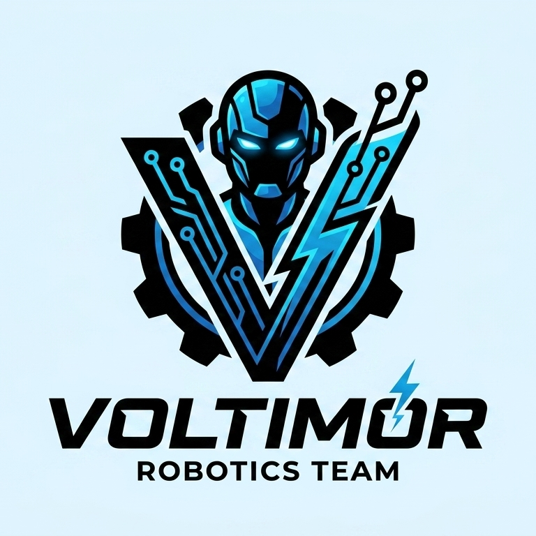
     
    <i>Logo del Equipo</i>

Bienvenidos al repositorio de V-Titan, el robot del Team Voldemor, que compite en la World Robot Olympiad 2026 en la categoría Futuros Ingenieros. Aquí encontrarás toda la información sobre el robot, incluyendo su código, modelos 3D, esquemas y documentación.

## Estructura de la documentación

Esta documentación es bastante extensa, por lo que decidimos dividir los contenidos de esta documentación en múltiples archivos para facilitar la lectura, los cuales están ubicados en la carpeta `docs`.

Ahora bien, la estructura de los archivos es la siguiente:

- En la carpeta `devices` se encuentra todo el código utilizado por Voltimor, dividido en dos carpetas, una para la Raspberry Pi 5, y la otra para la Raspberry Pi Zero W.

- En la carpeta `docs`, como ya se ha mencionado, se encuentra todo lo documentado sobre V-Titan, dividido en 4 secciones, la electrónica, la mecánica, la programación, además de estas secciones, también contamos con algunos archivos que detallan, por ejemplo, el software utilizado, los "gadgets" o herramientas que utilizamos, cómo nos pueden contactar, y demás, **estos archivos están listados al final del índice**.

- En la carpeta `3d-models` se encuentran todos los modelos de las piezas 3d que fueron impresas para V-Titan, esta carpeta está dividida para los planos de las piezas, y el archivo para imprimirlas, además de, estar organizadas por cada prototipo.

- En la carpeta `schemes` están los diagramas de flujo, y los diagramas de conexiones.

- En la carpeta `t-photos` están las fotos del equipo.

- En la carpeta `v-photos` están las fotos de V-Titan.

## Índice 

1. **[Historial del equipo](README.md#historial-del-equipo)**     
    1. **[Klevor (2025)](README.md#klevor-wro-2025)**
         1. [Klevor v0.1](/docs/development/previous-prototypes/klevor-v0.1.md) 
         2. [Klevor v0.1.1](/docs/development/previous-prototypes/klevor-v0.1.1.md)  
         3. [Klevor v0.2](/docs/development/previous-prototypes/klevor-v0.2.md)  
         4. [Klevor v1.0](/docs/development/previous-prototypes/klevor-v1.0.md)  
    2. **[V-Titan(2026)](README.md#v-titan-wro-2026)**

2. **[Arquitectura de energía y sensores](README.md#arquitectura-de-energía-y-sensores)**
	1. [Lista de Componentes](README.md#lista-de-componentes)
         1. [Raspberry Pi 5](README.md#raspberry-pi-5-16gb-ram)
         2. [Raspberry Pi Camera Module 3 Wide](README.md#raspberry-pi-camera-module-3-wide)
         3. [Raspberry Pi AI HAT+ (26 TOPS)](README.md#raspberry-pi-ai-hat-26-tops)
         4. [Raspberry Pi Zero W](README.md#raspberry-pi-zero-w)
         5. [RPLIDAR C1](README.md#rplidar-c1)
         6. [Hi Wonder HPS 3527SG 35Kg Servo](README.md#hi-wonder-hps-3527sg-35kg-servo)
         7. [HD Hex Motor](README.md#hd-hex-motor)
         8. [9-Axis IMU Gyroscope GY-BNO085](README.md#gyroscope-gy-bno085)
         9. [Puente H L298N](README.md#raspberry-pi-camera-module-3-wide)
         10. [Step Down XLC4016](README.md#raspberry-pi-camera-module-3-wide) 
         11. [SSD1306 OLED Display](README.md#raspberry-pi-camera-module-3-wide)
         12. [KL89576 DC to USB-C Converter](README.md#raspberry-pi-camera-module-3-wide)
         13. [Ovonic Air 11.1V Li-Po Battery](README.md#raspberry-pi-camera-module-3-wide)
	2. [Diagrama de Conexiones](README.md#Diagrama-de-conexiones)            
	3. [Consumo energético](README.md#consumo-energético)
         
3. **Movilidad y Diseño Mecanico**      
	1. [Métodos de Prototipaje](README.md#diseño-e-impresión-3d)
	2. [Evolución y Justificación del Diseño](README.md#evolución-y-justificación-del-diseño) 
	3. [Sistema de Transmición](README.md#sistema-de-transmición)
	4. [Sistema de Dirección](README.md#sistema-de-dirección)

4. **Arquitectura de software y estrategia para superar obstáculos**
	1. [Modelo de Detección YOLO](README.md#modelo-de-detección-yolo)
        2. [Simulador](README.md#sim)

5. **Pensamiento sistémico y decisiones de ingeniería**
        1.[]

6. **[Vídeos](docs/videos.es.md)**
7. **[Software](docs/software.es.md)**

# Historial del equipo

En este apartado, discutimos brevemente nuestras experiencias pasadas con la categoría de Futuros Ingenieros y nuestro aprendizaje gracias a prototipos previos a la presente temporada.

## Klevor (WRO 2025)

<table>
        <tbody>
                <tr>
                        <td>
                                

                                        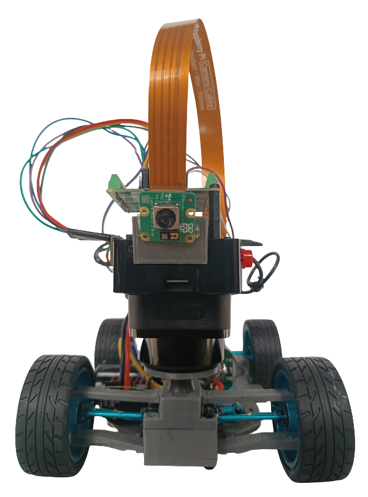
                                         
                                        <i>Vista delantera de Klevor</i>
                                

                        </td>
                        <td>
                                

                                        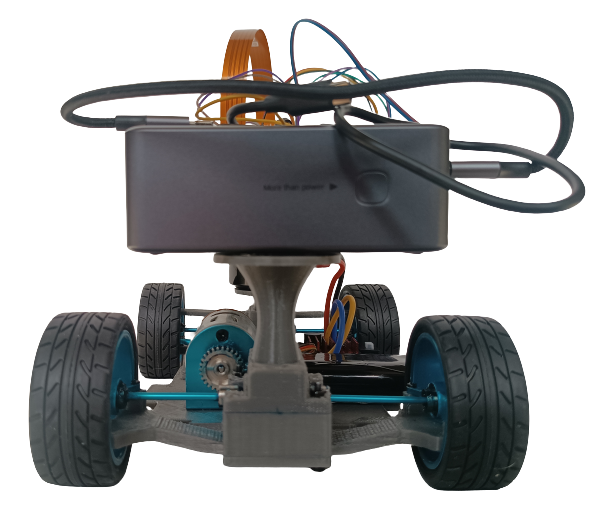
                                         
                                        <i>Vista trasera de Klevor</i>
                                

                        </td>
                </tr>
                <tr>
                        <td>
                                

                                        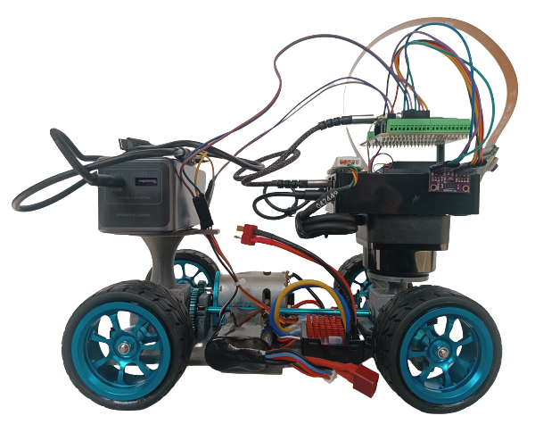
                                         
                                        <i>Vista derecha de Klevor</i>
                                

                        </td>
                        <td>
                                

                                        
                                         
                                        <i>Vista izquierda de Klevor</i>
                                

                        </td>
                </tr>
                <tr>
                        <td>
                                

                                        
                                         
                                        <i>Vista superior de Klevor</i>
                                

                        </td>
                        <td>
                                

                                        
                                         
                                        <i>Vista inferior de Klevor</i>
                                

                        </td>
                </tr>
        </tbody>
</table>

Klevor es el **predecesor** de V-Titan, participando en la temporada 2025 de la World Robot Olympiad en la categoría de Futuros Ingenieros, con el Team Steel Bot (quienes ahora participan bajo el nombre de Team Voldemor) y como todo proyecto fue evolucionando hasta culminar con la versión que tenemos hoy en día. 

Para conocer a nuestro prototipo actual, V-Titan, mejor, es importante recalcar que muchas de sus características, más específicamente en la electrónica y programación, son **directamente heredadas** de Klevor, con cambios nulos o mínimos entre un prototipo o el otro. Algunas de las **herencias** más importantes son:

- El manejo de la Raspberry Pi 5 como computadora principal

- La detección de los obstáculos gracias a la Raspberry Pi Camera 3 y su Hailo AI+

- La comunicación serial entre una computadora principal y un microcontrolador

Ahora bien, también hay que recalcar que tuvimos algunos fallos en el desarrollo de Klevor, por ejemplo: 

El uso de un ESC para controlar el motor, si bien parecía una idea muy buena en papel, utilizar el "combo" de un carro controlado por radio para nuestro prototipo, ofreciendo una velocidad bastante alta para completar los desafíos, terminó siendo un problema grave debido a la falta de precisión que éste nos ofrecía, acelerando muy rápido, sin ninguna solución en la programación para compensarlo.

Además, optamos por un modelo más robusto y pesado en comparación con los demás prototipos habituales de esta competición, si bien, gracias a esto pudimos incorporar muchos elementos de gran utilidad (como la Raspberry Pi 5), debido a ésto, no podíamos optar por cambios significativos, siendo obligados a reestructurar el prototipo desde cero en caso de necesitar algún cambio.

Debido a la gran cantidad de cambios que necesitamos, por diferentes motivos, teníamos que reestructurar el prototipo múltiples veces, por lo que terminamos confiando ciegamente en algunas características que no pudimos probar completamente.

## V-Titan (WRO 2026)

<table>
        <tbody>
                <tr>
                        <td>
                                

                                        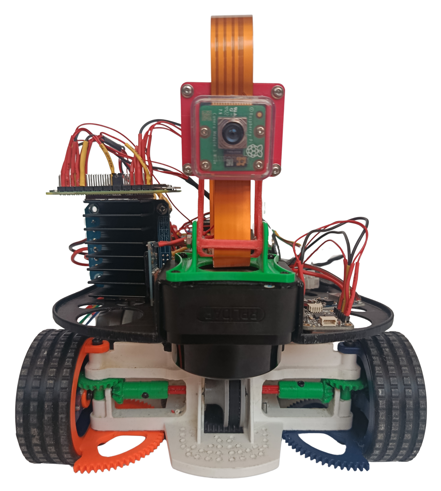
                                         
                                        <i>Vista delantera de V-Titan</i>
                                

                        </td>
                        <td>
                                

                                        
                                         
                                        <i>Vista trasera de V-Titan</i>
                                

                        </td>
                </tr>
                <tr>
                        <td>
                                

                                        
                                         
                                        <i>Vista derecha de V-Titan</i>
                                

                        </td>
                        <td>
                                

                                        
                                         
                                        <i>Vista izquierda de V-Titan</i>
                                

                        </td>
                </tr>
                <tr>
                        <td>
                                

                                        
                                         
                                        <i>Vista superior de V-Titan</i>
                                

                        </td>
                        <td>
                                

                                        
                                         
                                        <i>Vista inferior de V-Titan</i>
                                

                        </td>
                </tr>
        </tbody>
</table>

V-Titan es el **sucesor** de Klevor, participando en la temporada 2026 de la World Robot Olympiad en la categoría Futuros Ingenieros, con el Team Steel Bot, y es un proyecto que se encuentra evolucionando hasta el día de hoy.

V-Titan mejora en muchos aspectos con respecto a su predecesor, Klevor, con la mayoría de cambios siendo en el aspecto mecánico, ya que, una de nuestras metas principales era implementar un sistema de giro que permita el giro en 90 grados (o lo más cercano posible) para facilitar la estrategia para completar el Desafío Cerrado, además de esto, V-Titan conserva muchos de los componentes electrónicos que utilizó Klevor, tales la Raspberry Pi 5, y el RPLiDAR C1.

# Arquitectura de energía y sensores 

En el siguiente apartado, se discute toda la parte electrónica de V-Titan, tales como sus sensores, las razones detrás de su elección, cómo se implementan y el presupuesto energético.

## Lista de Componentes
A continuación, está la descripción de todos los componentes principales de V-Titan.

### Raspberry Pi 5 (16GB RAM)

	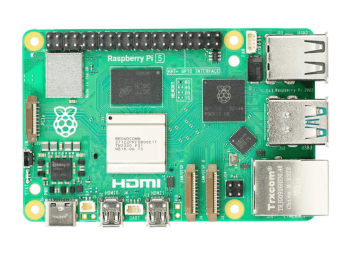
	 
	<i>Raspberry Pi 5</i>

Equipada con un procesador ARM Cortex-A76 de 64 bits a 2.4 GHz. La Raspberry Pi 5 es nuestro controlador principal de elección, decidimos usar a la Raspberry Pi 5 debido a múltiples factores, entre ellos:

- **Compatibilidad**: Existen muchos componentes de V-Titan (como la Camera Module 3 Wide) que a su vez pertenecen al ecosistema Raspberry, lo que hace que implementarlos a la Raspberry Pi 5 no requiera tanto esfuerzo.

- **Potencia**: La Raspberry Pi 5 es uno de los computadores portátiles más potentes actualmente, gracias a esto, funciones demandantes como lo es el procesamiento de imágenes en tiempo real, son fácilmente realizables por una Raspberry Pi 5.

- **Portabilidad**: La Raspberry Pi 5 destaca entre los controladores, ya que no es una computadora bastante pesada, apenas llegando a los 60 g, hace que incorporarlo a V-Titan sea una opción prácticamente segura.

| **Medida** | **Valor** |
|------------|-----------|
| Largo      | 85 mm     |
| Alto       | 58.9 mm   |
| Ancho      | 56 mm     |
| Peso       | 46 g      |

### Raspberry Pi Camera Module 3 Wide

	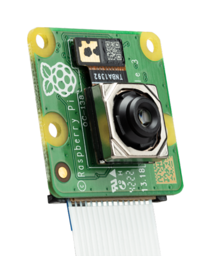
	 
	<i>Raspberry Pi Camera Module 3</i>

La Raspberry Pi Camera Module 3 Wide es nuestra elección de preferencia, como los demás componentes Raspberry, esta se destaca por ser bastante ligera y portátil, ya que, pues es una cámara bastante pequeña, midiendo apenas 25 mm × 24 mm × 12.4 mm y pesando 4 gramos, sin perder absolutamente ni una pizca de eficiencia, porque puede grabar a 1536 x 864p120, ahora bien, decidimos utilizar la versión Wide por su campo de visión horizontal de 102 grados, porque nos permite tener un rango de visión óptimo para poder detectar todos los obstáculos de la pista y lograr una mayor autonomía.

| **Medida** | **Valor** |
|------------|-----------|
| Largo      | 24 mm     |
| Alto       | 25 mm     |
| Ancho      | 12.4 mm   |
| Peso       | 4 g       |

### Raspberry Pi AI HAT+ (26 TOPS)

	
	 
	<i>Raspberry Pi AI HAT+ 26 TOPS</i>

Si bien la Raspberry Pi 5 es capaz de procesar imágenes en tiempo real, tras algunas pruebas, descubrimos que su tasa de procesamiento era bastante baja (alrededor de 1 a 2 fotos por segundo, con varias optimizaciones implementadas) por ende, tuvimos en cuenta que necesitaba un poco más de poder, por lo cual decidimos incorporar la AI HAT+ a la Raspberry Pi 5 para poder alcanzar el nivel de procesamiento necesario.

El Raspberry Pi AI HAT+ tiene dos versiones, una de 13 Trillones de Operaciones por Segundo (TOPS) y otra de 26 TOPS. Como se menciona en el índice, V-Titan posee un Raspberry Pi AI HAT+ de 26 TOPS, gracias a este procesador de imágenes, V-Titan puede analizar hasta 30 imágenes por segundo con una resolución de 640 px × 640 px.

| **Medida** | **Valor** |
|------------|-----------|
| Largo      | 65 mm     |
| Alto       | 5.5 mm    |
| Ancho      | 56 mm     |
| Peso       | 9.07 g    |

### Raspberry Pi Zero W

	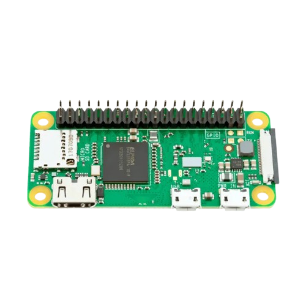
	 
	<i>Raspberry Pi Zero W</i>

Construida sobre el chip Broadcom BCM2835, la Raspberry Pi Zero WH es un ordenador de placa única ligero y ultra compacto para V-Titan. Al ejecutar un entorno Linux completo, este chip permite una fácil integración con el resto de los componentes Raspberry, haciendo que establecer comunicación de red o serial con una Raspberry Pi 5 sea nativo y sencillo dentro del mismo ecosistema.

Además de ofrecer una frecuencia de procesamiento de 1 GHz, supera drásticamente la capacidad de procesamiento de microcontroladores de tamaño similar, como el Arduino Nano que cuenta con una frecuencia de 16 MHz a 20 MHz.

La versión WH incorpora conectividad Wi-Fi/Bluetooth y cabezales de pines GPIO pre-soldados de fábrica. Esto ofrece una gran ventaja a la hora de desarrollar y practicar, ya que permite monitorear exactamente qué está procesando V-Titan en tiempo real a través de la red, sin necesidad de utilizar LED de distintos colores para señalizar decisiones y logrando un acabado final mucho más limpio.

| **Medida** | **Valor** |
|------------|-----------|
| Largo      | 65 mm     |
| Alto       | 13 mm     |
| Ancho      | 30 mm     |
| Peso       | 12 g      |

### RPLiDAR C1

	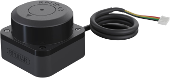
	 
	<i>RPLiDAR C1</i>

El RPLiDAR C1 es un escáner de rango láser de 360 grados, el cual puede detectar superficies que están hasta 12 metros de distancia, su punto ciego es de tan solo 5 centímetros alrededor del mismo, todos estos factores hacen que el RPLiDAR C1 sea una gran opción para poder guíar a V-Titan por la pista.

Este RPLiDAR C1 permite a V-Titan poder identificar exactamente dónde está ubicado en la pista, gracias a que nos ofrece una visión de al menos 180 grados para poder manejar la navegación por la pista con una mayor autonomía, la prioridad para el uso apropiado de este sensor, en el caso de la categoría Futuros Ingenieros es colocarlo de tal manera que su laser esté por debajo de los 10cm sobre el suelo, de tal manera que sea capaz de realizar mediciones a las paredes y los bloques, ademàs de colocarlo lo más hacia el frente posible, y priorizar que nada lo esté tapando para que su visión sea despejada.

| **Medida** | **Valor** |
|------------|-----------|
| Largo      | 55.6 mm   |
| Alto       | 41.3 mm   |
| Ancho      | 55.6 mm   |
| Peso       | 110 g     |

Especificaciones técnicas:

| **Especificación**     | **Valor**                                                                          |
|------------------------|------------------------------------------------------------------------------------|
| Rango de distancia     | Blanco: 0,05-12 m (70 % de reflectividad); Negro: 0,05-6 m (10 % de reflectividad) |
| Frecuencia de muestreo | 5 kHz                                                                              |
| Resolución angular     | 0,72°                                                                              |
| Ángulo de inclinación  | 0°-1,5°                                                                            |

### Hi Wonder HPS-3527SG 35kg Servo

<!-- github-only-start -->

	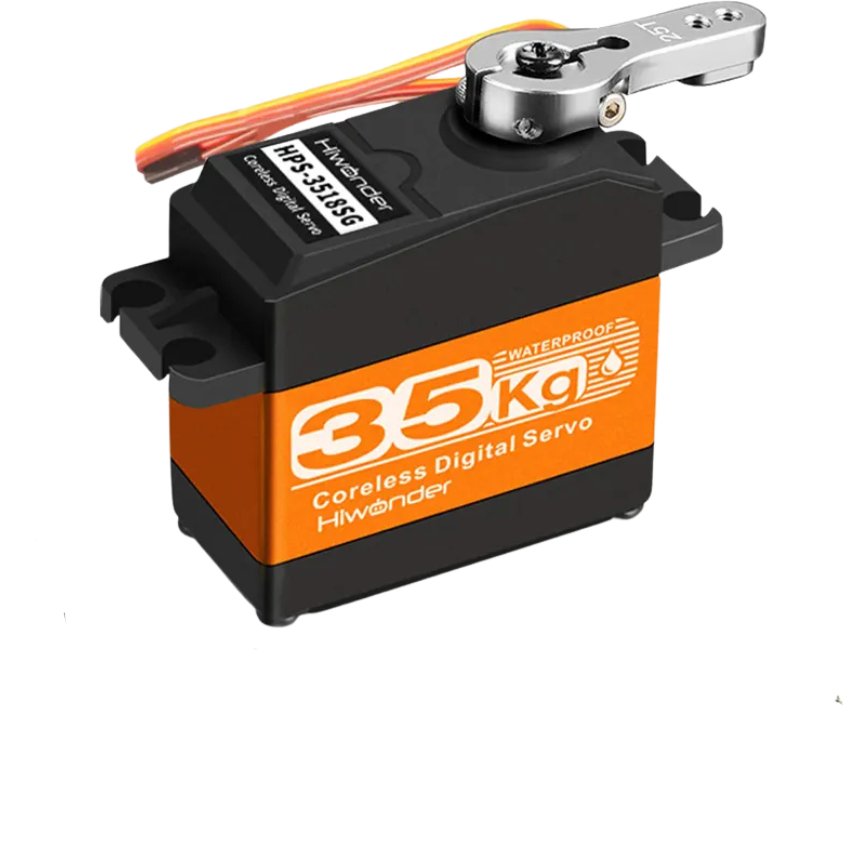
	 
	<i>Hiwonder HPS-3527SG 35kg Servo</i>

El Hiwonder HPS-3527SG 35kg Servo es el servomotor encargado de controlar la dirección de V-Titan, decidimos utilizar este modelo debido a su reducido tamaño y peso, además de una precisión más que suficiente para poder manejar a V-Titan.

No solo estos aspectos definieron la elección, el Hiwonder HPS-3527SG 35kg ofrece también una gran precisión a pesar de su reducido tamaño, algo esencialmente vital en esta competencia.

Gracias a la librería antes mencionada, la `adafruit_motor` con el módulo
`servo`, nos permiten configurar el servo a nuestra elección, convirtiendo el uso de funciones para controlar el servo previamente establecido mucho más fácil de leer sin arriesgar el rendimiento del programa.

| **Medida** | **Valor** |
|------------|-----------|
| Largo      | 40 mm     |
| Alto       | 28.8 mm   |
| Ancho      | 20 mm     |
| Peso       | 50 g      |

### HD Hex Motor

	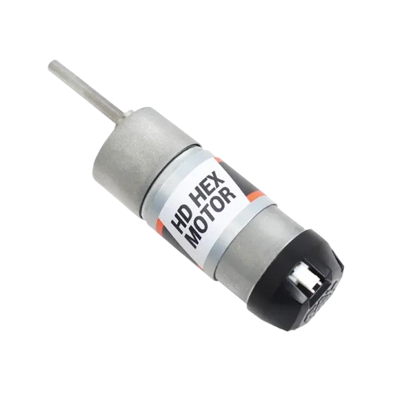
	 
	<i>HD Hex Motor</i>

Después de probar distintos modelos de motor, al final optamos por utilizar el motor HD Hex Motor, ya que éste cuenta con todos los requisitos que teníamos en mente para un motor (principalmente que cuente con un encoder y tenga una alta cantidad de RPM) ya que debido a nuestro sistema de transmisición, no era necesario que el motor cuente con un torque alto, ya que éste se puede compensar en nuestro sistema de transmisión con alguna relación de transmisión, valga la redundancia, además de ser un motor que ya se podía implementar con facilidad en el monochasis que habíamos diseñado, sólamente teniendo que cambiar su encaje.

| **Medida** | **Valor** |
|------------|-----------|
| Largo      | 77 mm     |
| Diámetro   | 37 mm     |
| Peso       | 234 g     |  

### 9-Axis IMU Gyroscope GY-BNO085

	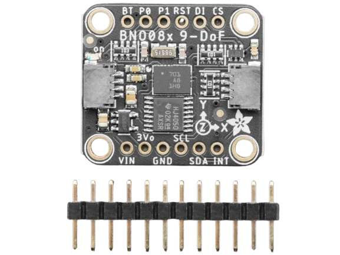
	 
	<i>Giroscopio BNO085</i>

El GY-BNO085 es un sensor de orientación inercial (IMU) de 9 Grados de Libertad (9DOF), ampliamente utilizado en aplicaciones que requieren un seguimiento de movimiento preciso. En el caso de V-Titan, optamos por utilizar este sensor para poder lograr una mayor autonomía del robot en los cruces, ya que este sensor le permite alinearse casi perfectamente y poder ajustarse.

Además de todo esto, el poder utilizar un giroscopio le permite a V-Titan contar las vueltas que ha dado tanto en el Desafío sin Obstáculos como el Desafío Cerrado de la forma más segura, ya que, a pesar de algún problema mecánico que impida que el robot sea capaz de ir completamente derecho, el giroscopio le puede hacer saber que tanto se está desvíando, siendo este uno de los componentes indispensables para poder completar este desafío.

La forma en la que lo implementamos es bastante sencilla, el giroscopio siempre está actualizando los datos de manera asíncrona cada 50 milisegundos, y V-Titan maneja dos variables, `yaw_deg` (la diferencia en grados en su orientación desde que inició en la pista hasta dónde está ubicado ahora mismo), y `relative_yaw` la cual utiliza el mismo `yaw_deg` para asignarse un valor, pero, en vez de reiniciarse cada vez que pasa de los -180 grados o 180 grados, simplemente le resta o suma (dependiendo del caso) 360 grados a `relative_yaw`, luego dividimos este número entre 90, y redondeamos hacia abajo (es decir, 10.57 pasa a ser simplemente 10), y si la división es igual a -12 o 12, sabemos que ya está casi en su zona de estacionamiento y V-Titan simplemente avanza un poquito y se detiene (en el caso del Desafío sin Obstáculos).

| **Medida** | **Valor** |
|------------|-----------|
| Largo      | 25.6 mm   |
| Alto       | 22.7 mm   |
| Ancho      | 4.6 mm    |
| Peso       | 3 g       |

### Ovonic Air 11.1V Li-Po Battery

	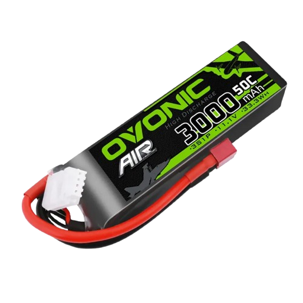
	 
	<i>Ovonic Air 11.1V Li-Po Battery</i>

La batería de 11.1V de la marca Ovonic, cumple la función de ser la fuente de alimentación principal, ya que a partir de ésta, podemos alimentar a la [Raspberry Pi 5](README.md#raspberry-pi-5-16gb-ram) y todos sus componentes embebidos, además de alimentar a nuestro motor

| **Medida** | **Valor** |
|------------|-----------|
| Largo      | 107 mm    |
| Alto       | 24 mm     |
| Ancho      | 33 mm     |
| Peso       | 190 g     |

## Diagrama de Conexiones

WIP

### Consumo Energético

| **Componente**                    | **Cantidad** | **Voltaje** | **Coriente sin Carga** | **Corriente Nominal** | **Corriente Pico** |
|-----------------------------------|--------------|-------------|------------------------|-----------------------|--------------------|
| Raspberry Pi 5                    |      1       | 5.0V        | ~0.50A                 | ~1.50A - 2.50A        | 5.00A              |
| Raspberry Pi Zero 2W              |      1       | 5.0V        | ~0.10A                 | ~0.35A - 0.50A        | 0.70A              |
| Raspberry Pi Camera Module 3 Wide |      1       | 3.3V        | ~0.05A                 | ~0.25A                | 0.30A              |
| Raspberry Pi AI HAT+ (26 TOPS)    |      1       | 5.0V        | ~0.10A                 | ~1.00A - 1.50A        | 2.50A              |
| RPLiDAR C1                        |      1       | 5.0V        | ~0.20A                 | ~0.40A                | 0.60A              |
| INJORA 14KG INJS014 Micro Servo   |      1       | 4.8V - 8.4V | ~0.02A                 | ~0.30A - 0.50A        | 1.80A (Stall)      |
| 9-Axis IMU Gyroscope GY-BNO085    |      1       | 3.3V - 5.0V | ~0.003A                | ~0.015A               | 0.03A              |
| Puente H L298N                    |      1       | 5V / 5-35V  | ~0.036A (Lógica)       | Según motor           | 2.00A por canal    |
| **TOTAL**                         |    **8**     | **3.3V-5V** | **~1.009A**            | **~3.815A - 5.165A**  | **12.93A**         |

# Movilidad y Diseño Mecánico

En este apartado se discuten todos los aspectos con lo que a movilidad y diseño se refiere, la evolución de éste, los prototipados realizados, etc...

## Métodos de Prototipaje

Para realizar nuestros prototipos, decidimos utilizar la impresión 3D como método principal, ya que ya éramos bastante familiares con todo el proceso, si bien el uso de máquinas CNC puede ser beneficioso para prototipos de esta categoría, decidimos optar por piezas pre-fabricadas o impresas en 3D, ya que nos permite minimizar el peso de V-Titan, ya que el peso fue un problema recurrente en nuestros primeros prototipos, llegando a estar 200 gramos por encima del límite establecido.

Para poder diseñar e imprimir dichas piezas, utilizamos el programa de diseño 3D SolidWorks, ya que tiene un montón de funciones útiles para el diseño de prototipos mecánicos, y, era el programa con el que teníamos mejor afinidad.

## Evolución y Justificación Del Diseño

### **Restricciones Iniciales**

* **Dimensiones y peso límite:** Máximo 300 mm (largo) 200 mm (ancho) 300 mm (alto) y un peso no mayor a 1500 g.

* **Reglamento de tracción y dirección:** Permitido tracción 4x4 impulsada por un **único motor** (o dos conectados en el mismo árbol de transmisión) y sistema de dirección para las 4 ruedas accionado por un **único servomotor**.

Con las reglas aclaradas, nuestras idea principal para la elección de componentes era que queríamos crear un prototipo lo más sencillo posible, es decir, tener la mayor cantidad de herramientas y funcionalidades en pista en la menor cantidad de componentes posibles, con esta idea en mente nos decidimos por implementar el [RPLiDAR C1](README.md#rplidar-c1) y el [Giroscopio BNO085](README.md#9-axis-imu-gyroscope-gy-bno085) como componentes principales para la navegación de V-Titan con el RPLiDAR delimitamos las paredes de la pista, y con el giroscopio obtenemos la orientación de V-Titan para una mejor autonomía a la hora de cruzar, además, optamos por usar la cámara [Raspberry Pi Camera Module 3 Wide](README.md#raspberry-pi-camera-module-3-wide) por su amplio rango de visión para detectar los obstáculos, para manejar este componente, utilizamos la [Raspberry Pi 5](README.md#raspberry-pi-5-16gb-ram) y el [Raspberry Pi AI HAT+ (26 TOPS)](README.md#raspberry-pi-ai-hat-26-tops) para manejar el modelo de detección de obstáculo. Con todo esto en mente, optamos por la [Raspberry Pi Zero 2W](README.md#raspberry-pi-zero-w) como microcontrolador para el manejo de el [Motor](README.md#hd-hex-motor) y el [Servomotor](README.md#hi-wonder-hps-3527sg-35kg-servo) y, finalmente agregamos tanto la [Batería](README.md#ovonic-air-111v-li-po-battery) como el Adaptador a 5V DC para poder alimentar a la Raspberry Pi 5.

Con todos estos componentes en mente, queríamos implementar esta idea en un sistema de transmisión 4x4 con un sistema de dirección que permita general el giro de 90 grados (o lo más cercano posible) hacia cualquier lado (izquierda o derecha) para permitir que la salida del estacionamiento en el Desafío Cerrado sea lo más fácil posible de programar, además de, cumplir con todas las reglas que tiene esta categoría, a través de pruebas y diseños, para efectos de esta documentación decidimos dividir el proceso en 4 fases:

#### **Fase 1: Prototipo de Rin Estático, Corona Interna y Guayas Flexibles**

* **Mecanismo de Rueda:** Nuestro primer prototipo fue un rin estático que actúa como soporte/pivote en la tijera, mientras que el caucho exterior móvil incorpora una corona/cremallera interna accionada por piñones para transmitir tracción.

* **Transmisión de Dirección/Potencia:** Se implementaron **guayas flexibles** (tipo mototool/rotamil) para llevar el movimiento de rotación a la rueda soportando el ángulo extremo de 90 grados.

* **Caja de Engranajes Modular:** Diseñada para distribuir el movimiento de un solo motor hacia 4 guayas independientes.

* **Resultado:** Las pruebas aisladas confirmaron la viabilidad de la rotación y el pivoteo a 90 grados.

#### **Fase 2: Pruebas de Integración y Detección de Fallas**

* **Sistema de Dirección:** Diseñamos una relación de palancas y piñones para la inversión de movimiento simultáneo. Se integraron **sensores Hall** para monitorear con precisión el ángulo de giro ante la necesidad de usar un servo de más de 360 grados.

* **Problemas Detectados:**
* Las barras de transmisión entre discos eran endebles, se doblaban e incluso una llegó a quebrarse.

* Las guayas generaban una tensión excesiva sobre el servomotor al ejecutar el giro.

* **Decisión:** Descartamos el sistema de guayas y palancas por ser complejo y pesado, buscando un mecanismo más ligero y directo.

#### **Fase 3: Rediseño a Engranajes Perpendiculares, Coronas y Correa Dentada**

* **Nuevo Sistema de Tracción:** Eliminación de guayas. Se optó por **engranajes perpendiculares** ajustando el punto de pivote sobre el centro de la rueda, manteniendo los 90 grados de giro sin perder tracción.

* **Optimización de Dirección:**
* La primera prueba con líneas de piñones pequeños generó juego entre dientes (*backlash*) y movimiento errático.

* Se reemplazaron por una **corona más grande integrada al rin**, logrando una conexión directa y precisa accionada por el servomotor único.

* **Sincronización 4x4:** Se unificaron los árboles de transmisión delantero y trasero mediante una **correa dentada con poleas**, logrando accionar las 4 ruedas simultáneamente con un solo motor.

#### **Fase 4: Optimización de Peso, Integración y Chasis Final**

* **Distribución de Componentes:** Se diseñó una plataforma elevada para separar la electrónica de la mecánica. Esta posición permitió ubicar el RPLiDAR garantizando aproximadamente 270 grados de visión frontal y un espejo de visión trasera.

* **Control de Peso (1500 g):** Al ensamblar el conjunto, se detectó un exceso de 150g.

* **Acciones Correctivas:**
* Reducción de la densidad de relleno en la impresión 3D.

* Disminución de espesores de pared y creación de vacíos estructurales en el chasis, rines y bancadas sin comprometer la rigidez.

* **Resultado Final:** Se logró ingresar dentro del rango de peso reglamentario y consolidar un chasis rígido impreso en 3D con soportes dedicados para la electrónica.

## Sistema de Transmisión

Para poder diseñar nuestro sistema de transmisión, tuvimos que tener en cuenta nuestra meta inicial de nuestro alcance de dirección, para poder transmitir el movimiento del motor hacia las ruedas aún cuando éstas estén rotadas a un ángulo de 90 grados. 

Nuestro sistema de transmisión es un sistema 4x4, para maximizar la tracción en cada rueda, éste sistema es controlado por un único motor cuyo movimiento es transmitido mediante dos correas de movimiento (una para las ruedas delanteras, y otra para las ruedas traseras), este movimiento se va a su eje correspondiente (para el cual utilizamos unos pernos de transmisión de LEGO) cada eje transmite a dos sisteams de engranajes (uno a la izquierda, otro a la derecha) y este eje tiene un engranaje cónico con un ángulo de 90 grados de 15 dientes, y este movimiento luego es transmitido directamente a la rueda (la cual en lugar de ser un caucho regular, recibe la tracción mediante sus dientes internos)

## Sistema de Dirección

Como ya se ha mencionado previamente, nuestra meta principal con nuestro sistema de dirección es tener un giro de 90 grados para facilitar la ruta en pista, para lograr esto, tuvimos que replantear la solución mecánica de Klevor desde cero. Resumidamente, todo el movimiento lo transmitimos a través de engranajes, y los rines de las ruedas actúan tanto como soportes como actuadores en el movimiento al contar con una base dentada, aunque es necesario un servo con mucha capacidad de torque para poder ejercer fuerza en las 4 ruedas. En primer lugar al servo le implementamos un eje de 20 dientes, el cual luego es conectado a un engranaje de 20 dientes para transmitir ese mismo movimiento pero en dirección opuesta, cada engranaje de 20 dientes luego transmite su movimiento a un engranaje de 40 dientes, el cual conecta con las dos ruedas, ya sean delanteras o traseras

# Arquitectura de software y estrategia para superar obstáculos

En este apartado, describimos las estrategias que empleamos en pista para poder resolver los desafíos de una manera autónoma y eficiente.

## Modelo de Detección YOLO

Para poder detectar los obstáculos del Desafío Cerrado de una manera confiable, decidimos implementar un modelo de detección YOLO (You Only Look Once) para poder mantener tracción de los obstáculos en pista, al principio, decidimos probar los modelos de prueba en la Raspberry Pi 5, utilizando la Raspberry Pi Camera Module 3 Wide para poder ejecutar los modelos de prueba, sin embargo tras las primeras pruebas notamos que el tiempo de detección era demasiado alto (alrededor de los 700ms por imágen) tras esto decidimos implementar un Raspberry Pi AI HAT+ (26 TOPS) con el cual, obtuvimos una tasa de detección de alrededor de 30 a 40 imágenes por segundo.

## Algoritmo PID

Otro algoritmo fundamental que implementamos en nuestra estrategia para facilitar el buen desempeño de V-Titan en los desafíos es el PID (Proporcional, Integral y Derivativo) éste es utilizado principalmente para que, con ayuda del giroscopio, V-Titan siempre esté orientado de paralelamente a los bordes de la pista, además de esto, el PID es utilizado para suavizar los cruces en los desafíos (para evitar el "overshooting", es decir, que V-Titan, por inercia cruce 10 o 20 grados más de lo deseado por un giro brusco)

# Pensamiento sistémico y decisiones de ingeniería

