# 🕊️ *In Memoriam*

> Este proyecto, su arquitectura y cada línea de código que da vida a este robot están dedicados con profundo cariño y respeto a la memoria de mi gran amigo y colega:
>
> **Javier Pérez** — [@kaucrow](https://github.com/kaucrow)
>
> Gracias por los años en las aulas, las incontables horas depurando código y esa pasión inquebrantable por la ingeniería que siempre nos unió. Llevar este sistema a la competencia es también llevar tu curiosidad, tu talento y tu recuerdo en cada desafío. 
>
> Aunque hoy no estés físicamente, tu huella sigue viva en este repositorio, en cada meta alcanzada y en mi memoria por el resto de mi vida. Descansa en paz, hermano.
>
> — *Ramón Álvarez*

<p align="center">
    
    <br>
    <i>Javier Pérez — <a href="https://github.com/kaucrow">@kaucrow</a> — 2 de enero de 2005 — 31 de agosto de 2026</i>
</p>

> Y también a nuestra compañera de tantos años:
>
> **Luna Margarita**
>
> Casi doce años siendo parte de nuestra familia. Gracias por tu compañía, tu nobleza y todo el cariño que nos diste sin pedir nada a cambio. Te vamos a extrañar siempre.
>
> — *Ramón Álvarez y Sebastián Álvarez*

<table>
    <tbody>
        <tr>
            <td>
                <p align="center">
                    
                    <br>
                    <i>Luna Margarita, de cachorra</i>
                </p>
            </td>
            <td>
                <p align="center">
                    
                    <br>
                    <i>Luna Margarita, en sus últimos años</i>
                </p>
            </td>
        </tr>
    </tbody>
</table>

<p align="center">
    <i>Luna Margarita — 12 de diciembre de 2014 — 5 de septiembre de 2026</i>
</p>

---

# Team Voltimor

<p align="center">
    
    <br>
    <i>Logo del Equipo</i>
</p>

Bienvenidos al repositorio de V-Titan, el robot del Team Voltimor, que compite en la World Robot Olympiad 2026 en la categoría Futuros Ingenieros. Aquí encontrarás toda la información sobre el robot, incluyendo su código, modelos 3D, esquemas y documentación.

<p align="center">
    
    <br>
    <i>Foto del Equipo, de izquierda a derecha: Ramón Álvarez, Sebastián Álvarez, Jesús Pérez (Padre, Mentor), Jesús Pérez</i>
</p>

Actualmente, este equipo está conformado por 3 miembros:

- **Ramón Álvarez**, 20 años. [ralvarezdev](https://github.com/ralvarezdev). Ejerce como líder del equipo y es el encargado de la programación. Actualmente, trabaja en Automation Labs, y finalizó sus estudios en Ingeniería en Computación en URU.
- **Sebastián Álvarez**, 16 años. [salvarezdev](https://github.com/salvarezdev). Encargado tanto de la programación, como de la documentación y la toma de decisiones con respecto a la lógica del robot. Actualmente, cursa el 1er trimestre de Ingeniería en Computación en URU.
- **Jesús Pérez**, 16 años. [Ottorafaelpg](https://https://github.com/JesusPerez15). Encargado del diseño, la mecánica y la fabricación del robot. Actualmente, cursa el 5to año de bachillerato en el Colegio Salto Ángel.

## Estructura de la documentación

Esta documentación es bastante extensa, por lo que decidimos dividir los contenidos de esta documentación en múltiples archivos para facilitar la lectura, los cuales están ubicados en la carpeta `docs`.

Ahora bien, la estructura de los archivos es la siguiente:

- En la carpeta `devices` se encuentra todo el código utilizado por Voltimor, dividido en dos carpetas, una para la Raspberry Pi 5, y la otra para la Raspberry Pi Zero W.

- En la carpeta `docs`, como ya se ha mencionado, se encuentra todo lo documentado sobre V-Titan, dividido en 4 secciones, la electrónica, la mecánica, la programación, además de estas secciones, también contamos con algunos archivos que detallan, por ejemplo, el software utilizado, los "gadgets" o herramientas que utilizamos, cómo nos pueden contactar, y demás, **estos archivos están listados al final del índice**.

- En la carpeta `3d-models` se encuentran todos los modelos de las piezas 3d que fueron impresas para V-Titan, esta carpeta está dividida para los planos de las piezas, y el archivo para imprimirlas, además de, estar organizadas por cada prototipo.

- En la carpeta `schemes` están los diagramas de flujo, y los diagramas de conexiones. En `schemes/flowcharts/` viven las fuentes Mermaid y sus renders PNG, separados en `common/` (lógica compartida por ambos desafíos), `open/` y `obstacles/`; `schemes/flowcharts/_legacy/` conserva los diagramas de versiones anteriores. En `schemes/wiring/` está el esquemático del arnés junto al proyecto tscircuit que lo genera.

- En la carpeta `t-photos` están las fotos del equipo.

- En la carpeta `v-photos` están las fotos de V-Titan.

## Índice

1. **[Historial del equipo](README.md#historial-del-equipo)**
    1. [Klevor (WRO 2025)](README.md#klevor-wro-2025)
        1. [Klevor v0.1](development/previous-prototypes/klevor-v0.1.md)
        2. [Klevor v0.1.1](development/previous-prototypes/klevor-v0.1.1.md)
        3. [Klevor v0.2](development/previous-prototypes/klevor-v0.2.md)
        4. [Klevor v1.0](development/previous-prototypes/klevor-v1.0.md)
    2. [V-Titan (WRO 2026)](README.md#v-titan-wro-2026)
2. **[Arquitectura de energía y sensores](README.md#arquitectura-de-energía-y-sensores)**
    1. [Lista de Componentes](README.md#lista-de-componentes)
        1. [Raspberry Pi 5 (16GB RAM)](README.md#raspberry-pi-5-16gb-ram)
        2. [Raspberry Pi Camera Module 3 Wide](README.md#raspberry-pi-camera-module-3-wide)
        3. [Raspberry Pi AI HAT+ (26 TOPS)](README.md#raspberry-pi-ai-hat-26-tops)
        4. [Raspberry Pi Zero 2 W](README.md#raspberry-pi-zero-2-w)
        5. [RPLiDAR C1](README.md#rplidar-c1)
        6. [Hi Wonder HPS-3527SG 35kg Servo](README.md#hi-wonder-hps-3527sg-35kg-servo)
        7. [HD Hex Motor](README.md#hd-hex-motor)
        8. [9-Axis IMU Gyroscope GY-BNO085](README.md#9-axis-imu-gyroscope-gy-bno085)
        9. [Ovonic Air 11.1V Li-Po Battery](README.md#ovonic-air-111v-li-po-battery)
        10. [Puente H BTS7960 / IBT-2](README.md#puente-h-bts7960--ibt-2)
        11. [Step Down Mini-560 Pro](README.md#step-down-mini-560-pro)
        12. [SSD1306 OLED Display](README.md#ssd1306-oled-display)
        13. [Convertidor KL89576 (DC a USB-C)](README.md#convertidor-kl89576-dc-a-usb-c)
    2. [Diagrama de Conexiones](README.md#diagrama-de-conexiones)
        1. [Consumo Energético](README.md#consumo-energético)
3. **[Movilidad y Diseño Mecánico](README.md#movilidad-y-diseño-mecánico)**
    1. [Métodos de Prototipaje](README.md#métodos-de-prototipaje)
    2. [Evolución y Justificación Del Diseño](README.md#evolución-y-justificación-del-diseño)
        1. [**Restricciones Iniciales**](README.md#restricciones-iniciales)
    3. [Sistema de Transmisión](README.md#sistema-de-transmisión)
    4. [Sistema de Dirección](README.md#sistema-de-dirección)
    5. [Chasis Inferior](README.md#chasis-inferior)
    6. [Monochasis](README.md#monochasis)
    7. [Relación de Torque y Velocidad](README.md#relación-de-torque-y-velocidad)
4. **[Arquitectura de software y estrategia para superar obstáculos](README.md#arquitectura-de-software-y-estrategia-para-superar-obstáculos)**
    1. [Arquitectura ROS2 y reparto entre dos computadores](README.md#arquitectura-ros2-y-reparto-entre-dos-computadores)
    2. [Modelo de Detección YOLO](README.md#modelo-de-detección-yolo)
    3. [Algoritmo PID](README.md#algoritmo-pid)
    4. [Estrategia en pista](README.md#estrategia-en-pista)
        1. [Inferencia del sentido de la vuelta](README.md#inferencia-del-sentido-de-la-vuelta)
        2. [Seguimiento de pasillo, vueltas y escapes](README.md#seguimiento-de-pasillo-vueltas-y-escapes)
    5. [Grabación y análisis de carreras](README.md#grabación-y-análisis-de-carreras)
    6. [Simulador y corpus de escenarios](README.md#simulador-y-corpus-de-escenarios)
5. **[Pensamiento sistémico y decisiones de ingeniería](README.md#pensamiento-sistémico-y-decisiones-de-ingeniería)**
    1. [Diseño gobernado por configuración](README.md#diseño-gobernado-por-configuración)
    2. [Perfiles de hardware intercambiables](README.md#perfiles-de-hardware-intercambiables)
    3. [Ciclo de trabajo: idea → simulación → pista](README.md#ciclo-de-trabajo-idea--simulación--pista)
    4. [Hallazgos de ingeniería](README.md#hallazgos-de-ingeniería)
    5. [Tecnologías utilizadas](README.md#tecnologías-utilizadas)

# Historial del equipo

En este apartado, discutimos brevemente nuestras experiencias pasadas con la categoría de Futuros Ingenieros y nuestro aprendizaje gracias a prototipos previos a la presente temporada.

## Klevor (WRO 2025)

<table>
        <tbody>
                <tr>
                        <td>
                                <p align="center">
                                        
                                        <br>
                                        <i>Vista delantera de Klevor</i>
                                </p>
                        </td>
                        <td>
                                <p align="center">
                                        
                                        <br>
                                        <i>Vista trasera de Klevor</i>
                                </p>
                        </td>
                </tr>
                <tr>
                        <td>
                                <p align="center">
                                        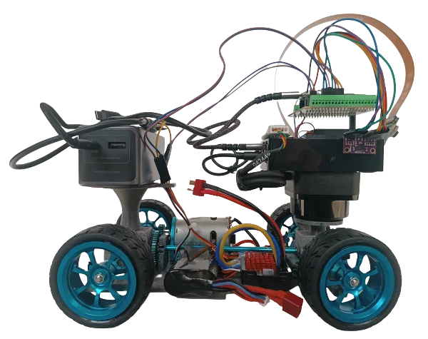
                                        <br>
                                        <i>Vista derecha de Klevor</i>
                                </p>
                        </td>
                        <td>
                                <p align="center">
                                        
                                        <br>
                                        <i>Vista izquierda de Klevor</i>
                                </p>
                        </td>
                </tr>
                <tr>
                        <td>
                                <p align="center">
                                        
                                        <br>
                                        <i>Vista superior de Klevor</i>
                                </p>
                        </td>
                        <td>
                                <p align="center">
                                        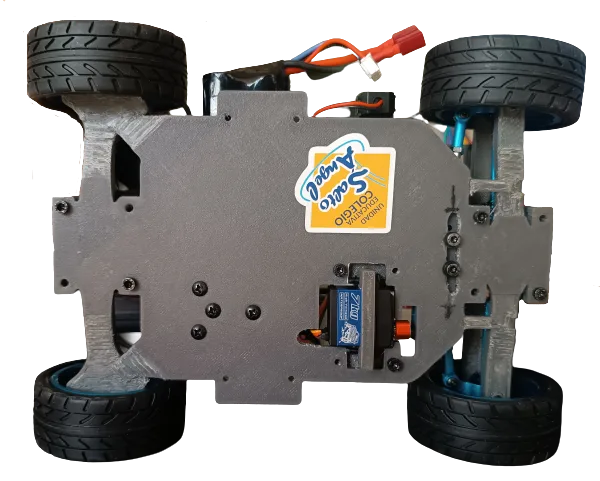
                                        <br>
                                        <i>Vista inferior de Klevor</i>
                                </p>
                        </td>
                </tr>
        </tbody>
</table>

Klevor es el **predecesor** de V-Titan, participando en la temporada 2025 de la World Robot Olympiad en la categoría de Futuros Ingenieros, con el Team Steel Bot (quienes ahora participan bajo el nombre de Team Voldemor) y como todo proyecto fue evolucionando hasta culminar con la versión que tenemos hoy en día. 

Para conocer a nuestro prototipo actual, V-Titan, mejor, es importante recalcar que muchas de sus características, más específicamente en la electrónica y programación, son **directamente heredadas** de Klevor, con cambios nulos o mínimos entre un prototipo o el otro. Algunas de las **herencias** más importantes son:

- El manejo de la Raspberry Pi 5 como computadora principal

- La detección de los obstáculos gracias a la Raspberry Pi Camera 3 y su Hailo AI+

- La comunicación serial entre una computadora principal y un microcontrolador

Ahora bien, también hay que recalcar que tuvimos algunos fallos en el desarrollo de Klevor, por ejemplo: 

El uso de un ESC para controlar el motor, si bien parecía una idea muy buena en papel, utilizar el "combo" de un carro controlado por radio para nuestro prototipo, ofreciendo una velocidad bastante alta para completar los desafíos, terminó siendo un problema grave debido a la falta de precisión que éste nos ofrecía, acelerando muy rápido, sin ninguna solución en la programación para compensarlo.

Además, optamos por un modelo más robusto y pesado en comparación con los demás prototipos habituales de esta competición, si bien, gracias a esto pudimos incorporar muchos elementos de gran utilidad (como la Raspberry Pi 5), debido a ésto, no podíamos optar por cambios significativos, siendo obligados a reestructurar el prototipo desde cero en caso de necesitar algún cambio.

Debido a la gran cantidad de cambios que necesitamos, por diferentes motivos, teníamos que reestructurar el prototipo múltiples veces, por lo que terminamos confiando ciegamente en algunas características que no pudimos probar completamente.

## V-Titan (WRO 2026)

<table>
        <tbody>
                <tr>
                        <td>
                                <p align="center">
                                        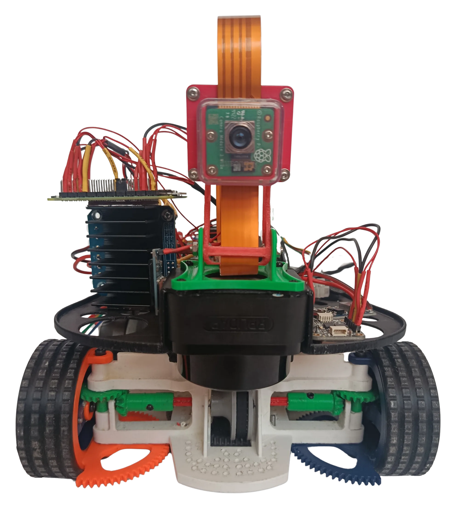
                                        <br>
                                        <i>Vista delantera de V-Titan</i>
                                </p>
                        </td>
                        <td>
                                <p align="center">
                                        
                                        <br>
                                        <i>Vista trasera de V-Titan</i>
                                </p>
                        </td>
                </tr>
                <tr>
                        <td>
                                <p align="center">
                                        
                                        <br>
                                        <i>Vista derecha de V-Titan</i>
                                </p>
                        </td>
                        <td>
                                <p align="center">
                                        
                                        <br>
                                        <i>Vista izquierda de V-Titan</i>
                                </p>
                        </td>
                </tr>
                <tr>
                        <td>
                                <p align="center">
                                        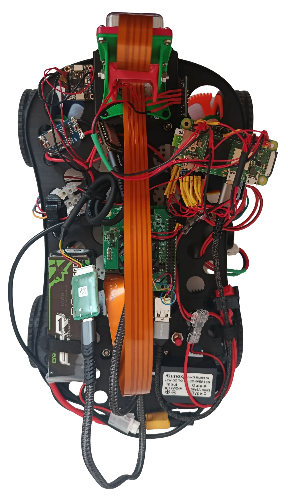
                                        <br>
                                        <i>Vista superior de V-Titan</i>
                                </p>
                        </td>
                        <td>
                                <p align="center">
                                        
                                        <br>
                                        <i>Vista inferior de V-Titan</i>
                                </p>
                        </td>
                </tr>
        </tbody>
</table>

V-Titan es el **sucesor** de Klevor, participando en la temporada 2026 de la World Robot Olympiad en la categoría Futuros Ingenieros, con el Team Steel Bot, y es un proyecto que se encuentra evolucionando hasta el día de hoy.

V-Titan mejora en muchos aspectos con respecto a su predecesor, Klevor, con la mayoría de cambios siendo en el aspecto mecánico, ya que, una de nuestras metas principales era implementar un sistema de giro que permita el giro en 90 grados (o lo más cercano posible) para facilitar la estrategia para completar el Desafío Cerrado, además de esto, V-Titan conserva muchos de los componentes electrónicos que utilizó Klevor, tales la Raspberry Pi 5, y el RPLiDAR C1.

# Arquitectura de energía y sensores 

En el siguiente apartado, se discute toda la parte electrónica de V-Titan, tales como sus sensores, las razones detrás de su elección, cómo se implementan y el presupuesto energético.

## Lista de Componentes
A continuación, está la descripción de todos los componentes principales de V-Titan.

### Raspberry Pi 5 (16GB RAM)

<p align="center">
	
	<br>
	<i>Raspberry Pi 5</i>
</p>

Equipada con un procesador ARM Cortex-A76 de 64 bits a 2.4 GHz. La Raspberry Pi 5 es nuestro controlador principal de elección, decidimos usar a la Raspberry Pi 5 debido a múltiples factores, entre ellos:

- **Compatibilidad**: Existen muchos componentes de V-Titan (como la Camera Module 3 Wide) que a su vez pertenecen al ecosistema Raspberry, lo que hace que implementarlos a la Raspberry Pi 5 no requiera tanto esfuerzo.

- **Potencia**: La Raspberry Pi 5 es uno de los computadores portátiles más potentes actualmente, gracias a esto, funciones demandantes como lo es el procesamiento de imágenes en tiempo real, son fácilmente realizables por una Raspberry Pi 5.

- **Portabilidad**: La Raspberry Pi 5 destaca entre los controladores, ya que no es una computadora bastante pesada, apenas llegando a los 60 g, hace que incorporarlo a V-Titan sea una opción prácticamente segura.

| **Medida** | **Valor** |
|------------|-----------|
| Largo      | 85 mm     |
| Alto       | 58.9 mm   |
| Ancho      | 56 mm     |
| Peso       | 46 g      |

### Raspberry Pi Camera Module 3 Wide

<p align="center">
	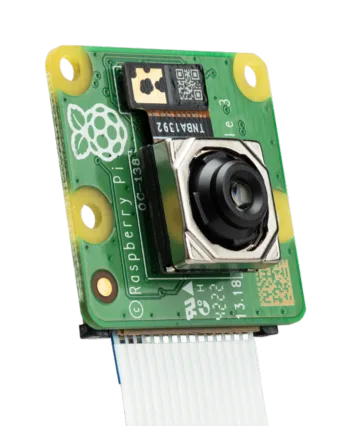
	<br>
	<i>Raspberry Pi Camera Module 3</i>
</p>

La Raspberry Pi Camera Module 3 Wide es nuestra elección de preferencia, como los demás componentes Raspberry, esta se destaca por ser bastante ligera y portátil, ya que, pues es una cámara bastante pequeña, midiendo apenas 25 mm × 24 mm × 12.4 mm y pesando 4 gramos, sin perder absolutamente ni una pizca de eficiencia, porque puede grabar a 1536 x 864p120, ahora bien, decidimos utilizar la versión Wide por su campo de visión horizontal de 102 grados, porque nos permite tener un rango de visión óptimo para poder detectar todos los obstáculos de la pista y lograr una mayor autonomía.

| **Medida** | **Valor** |
|------------|-----------|
| Largo      | 24 mm     |
| Alto       | 25 mm     |
| Ancho      | 12.4 mm   |
| Peso       | 4 g       |

### Raspberry Pi AI HAT+ (26 TOPS)

<p align="center">
	
	<br>
	<i>Raspberry Pi AI HAT+ 26 TOPS</i>
</p>

Si bien la Raspberry Pi 5 es capaz de procesar imágenes en tiempo real, tras algunas pruebas, descubrimos que su tasa de procesamiento era bastante baja (alrededor de 1 a 2 fotos por segundo, con varias optimizaciones implementadas) por ende, tuvimos en cuenta que necesitaba un poco más de poder, por lo cual decidimos incorporar la AI HAT+ a la Raspberry Pi 5 para poder alcanzar el nivel de procesamiento necesario.

El Raspberry Pi AI HAT+ tiene dos versiones, una de 13 Trillones de Operaciones por Segundo (TOPS) y otra de 26 TOPS. Como se menciona en el índice, V-Titan posee un Raspberry Pi AI HAT+ de 26 TOPS, gracias a este procesador de imágenes, V-Titan puede analizar hasta 30 imágenes por segundo con una resolución de 640 px × 640 px.

| **Medida** | **Valor** |
|------------|-----------|
| Largo      | 65 mm     |
| Alto       | 5.5 mm    |
| Ancho      | 56 mm     |
| Peso       | 9.07 g    |

### Raspberry Pi Zero 2 W

<p align="center">
	
	<br>
	<i>Raspberry Pi Zero W</i>
</p>

Construida sobre el chip Broadcom BCM2710A1 de cuatro núcleos, la Raspberry Pi Zero 2 W es un ordenador de placa única ligero y ultra compacto para V-Titan. Al ejecutar un entorno Linux completo, este chip permite una fácil integración con el resto de los componentes Raspberry, haciendo que establecer comunicación de red o serial con una Raspberry Pi 5 sea nativo y sencillo dentro del mismo ecosistema.

Además de ofrecer cuatro núcleos a 1 GHz, supera drásticamente la capacidad de procesamiento de microcontroladores de tamaño similar, como el Arduino Nano que cuenta con una frecuencia de 16 MHz a 20 MHz.

Incorpora conectividad Wi-Fi/Bluetooth y cabezales de pines GPIO soldados. Esto ofrece una gran ventaja a la hora de desarrollar y practicar, ya que permite monitorear exactamente qué está procesando V-Titan en tiempo real a través de la red, sin necesidad de utilizar LED de distintos colores para señalizar decisiones y logrando un acabado final mucho más limpio.

| **Medida** | **Valor** |
|------------|-----------|
| Largo      | 65 mm     |
| Alto       | 13 mm     |
| Ancho      | 30 mm     |
| Peso       | 12 g      |

### RPLiDAR C1

<p align="center">
	
	<br>
	<i>RPLiDAR C1</i>
</p>

El RPLiDAR C1 es un escáner de rango láser de 360 grados, el cual puede detectar superficies que están hasta 12 metros de distancia, su punto ciego es de tan solo 5 centímetros alrededor del mismo, todos estos factores hacen que el RPLiDAR C1 sea una gran opción para poder guíar a V-Titan por la pista.

Este RPLiDAR C1 permite a V-Titan poder identificar exactamente dónde está ubicado en la pista, gracias a que nos ofrece una visión de al menos 180 grados para poder manejar la navegación por la pista con una mayor autonomía, la prioridad para el uso apropiado de este sensor, en el caso de la categoría Futuros Ingenieros es colocarlo de tal manera que su laser esté por debajo de los 10cm sobre el suelo, de tal manera que sea capaz de realizar mediciones a las paredes y los bloques, ademàs de colocarlo lo más hacia el frente posible, y priorizar que nada lo esté tapando para que su visión sea despejada.

| **Medida** | **Valor** |
|------------|-----------|
| Largo      | 55.6 mm   |
| Alto       | 41.3 mm   |
| Ancho      | 55.6 mm   |
| Peso       | 110 g     |

Especificaciones técnicas:

| **Especificación**     | **Valor**                                                                          |
|------------------------|------------------------------------------------------------------------------------|
| Rango de distancia     | Blanco: 0,05-12 m (70 % de reflectividad); Negro: 0,05-6 m (10 % de reflectividad) |
| Frecuencia de muestreo | 5 kHz                                                                              |
| Resolución angular     | 0,72°                                                                              |
| Ángulo de inclinación  | 0°-1,5°                                                                            |

### Hi Wonder HPS-3527SG 35kg Servo

<!-- github-only-start -->
<p align="center">
	
	<br>
	<i>Hiwonder HPS-3527SG 35kg Servo</i>
</p>

El Hiwonder HPS-3527SG 35kg Servo es el servomotor encargado de controlar la dirección de V-Titan, decidimos utilizar este modelo debido a su reducido tamaño y peso, además de una precisión más que suficiente para poder manejar a V-Titan.

No solo estos aspectos definieron la elección, el Hiwonder HPS-3527SG 35kg ofrece también una gran precisión a pesar de su reducido tamaño, algo esencialmente vital en esta competencia.

Gracias a la librería antes mencionada, la `adafruit_motor` con el módulo
`servo`, nos permiten configurar el servo a nuestra elección, convirtiendo el uso de funciones para controlar el servo previamente establecido mucho más fácil de leer sin arriesgar el rendimiento del programa.

| **Medida** | **Valor** |
|------------|-----------|
| Largo      | 40 mm     |
| Alto       | 28.8 mm   |
| Ancho      | 20 mm     |
| Peso       | 50 g      |

### HD Hex Motor

<p align="center">
	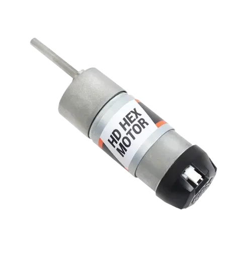
	<br>
	<i>HD Hex Motor</i>
</p>

Después de probar distintos modelos de motor, al final optamos por utilizar el motor HD Hex Motor, ya que éste cuenta con todos los requisitos que teníamos en mente para un motor (principalmente que cuente con un encoder y tenga una alta cantidad de RPM) ya que debido a nuestro sistema de transmisición, no era necesario que el motor cuente con un torque alto, ya que éste se puede compensar en nuestro sistema de transmisión con alguna relación de transmisión, valga la redundancia, además de ser un motor que ya se podía implementar con facilidad en el monochasis que habíamos diseñado, sólamente teniendo que cambiar su encaje.

| **Medida** | **Valor** |
|------------|-----------|
| Largo      | 77 mm     |
| Diámetro   | 37 mm     |
| Peso       | 234 g     |  

### 9-Axis IMU Gyroscope GY-BNO085

<p align="center">
	
	<br>
	<i>Giroscopio BNO085</i>
</p>

El GY-BNO085 es un sensor de orientación inercial (IMU) de 9 Grados de Libertad (9DOF), ampliamente utilizado en aplicaciones que requieren un seguimiento de movimiento preciso. En el caso de V-Titan, optamos por utilizar este sensor para poder lograr una mayor autonomía del robot en los cruces, ya que este sensor le permite alinearse casi perfectamente y poder ajustarse.

Además de todo esto, el poder utilizar un giroscopio le permite a V-Titan contar las vueltas que ha dado tanto en el Desafío sin Obstáculos como el Desafío Cerrado de la forma más segura, ya que, a pesar de algún problema mecánico que impida que el robot sea capaz de ir completamente derecho, el giroscopio le puede hacer saber que tanto se está desvíando, siendo este uno de los componentes indispensables para poder completar este desafío.

La forma en la que lo implementamos es bastante sencilla, el giroscopio siempre está actualizando los datos de manera asíncrona cada 50 milisegundos, y V-Titan maneja dos variables, `yaw_deg` (la diferencia en grados en su orientación desde que inició en la pista hasta dónde está ubicado ahora mismo), y `relative_yaw` la cual utiliza el mismo `yaw_deg` para asignarse un valor, pero, en vez de reiniciarse cada vez que pasa de los -180 grados o 180 grados, simplemente le resta o suma (dependiendo del caso) 360 grados a `relative_yaw`, luego dividimos este número entre 90, y redondeamos hacia abajo (es decir, 10.57 pasa a ser simplemente 10), y si la división es igual a -12 o 12, sabemos que ya está casi en su zona de estacionamiento y V-Titan simplemente avanza un poquito y se detiene (en el caso del Desafío sin Obstáculos).

| **Medida** | **Valor** |
|------------|-----------|
| Largo      | 25.6 mm   |
| Alto       | 22.7 mm   |
| Ancho      | 4.6 mm    |
| Peso       | 3 g       |

### Ovonic Air 11.1V Li-Po Battery

<p align="center">
	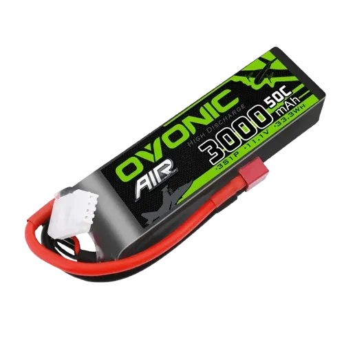
	<br>
	<i>Ovonic Air 11.1V Li-Po Battery</i>
</p>

La batería de 11.1V de la marca Ovonic, cumple la función de ser la fuente de alimentación principal, ya que a partir de ésta, podemos alimentar a la [Raspberry Pi 5](README.md#raspberry-pi-5-16gb-ram) y todos sus componentes embebidos, además de alimentar a nuestro motor

| **Medida** | **Valor** |
|------------|-----------|
| Largo      | 107 mm    |
| Alto       | 24 mm     |
| Ancho      | 33 mm     |
| Peso       | 190 g     |

### Puente H BTS7960 / IBT-2

<p align="center">
	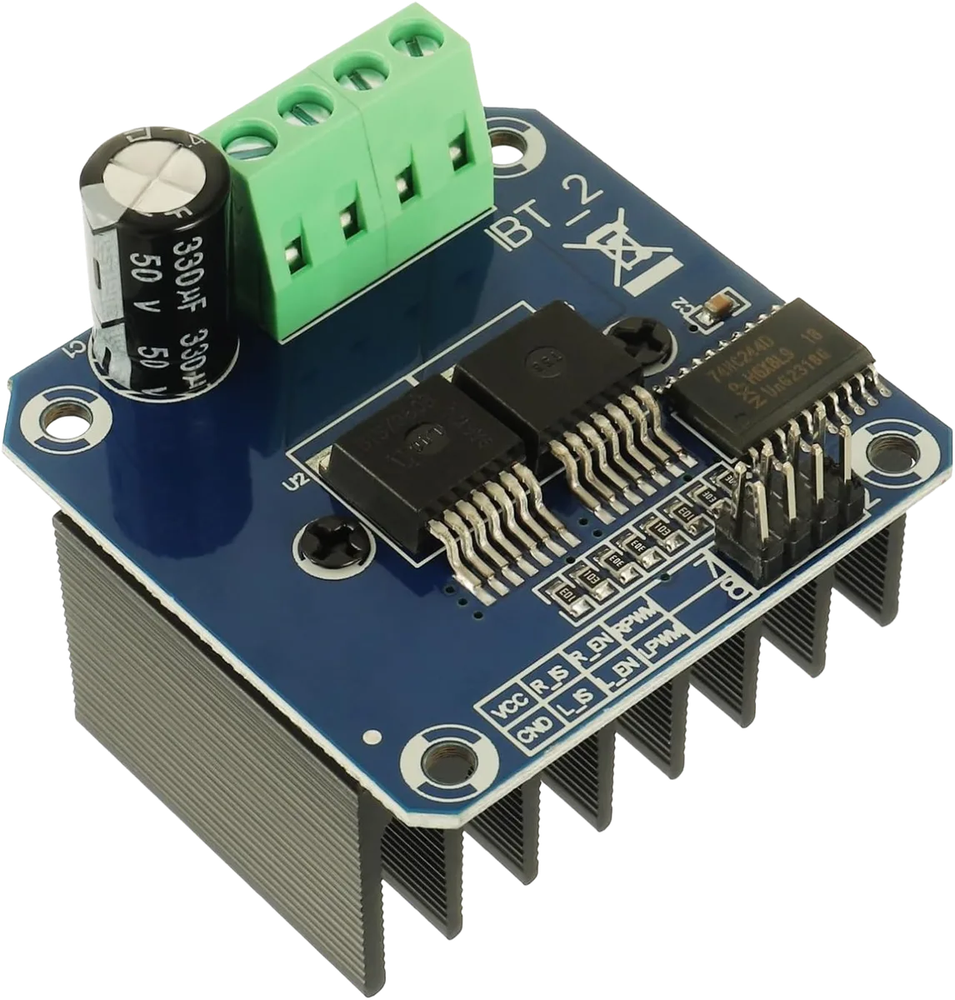
	<br>
	<i>Puente H BTS7960 / IBT-2 (el que monta V-Titan actualmente)</i>
</p>

El BTS7960 es el puente H que controla el motor de tracción. **No fue nuestra primera opción: reemplazó al L298N, y el motivo fue puramente de corriente.**

<p align="center">
	
	<br>
	<i>Puente H L298N — el diseño anterior, descartado por corriente insuficiente</i>
</p>

El L298N entrega **2 A por canal**. Cuando pasamos a medir de verdad lo que consume el tren motriz con el motor actual, el número no daba: la rama de tracción consume del orden de **10 A promedio** al 50% del ciclo de trabajo, con **picos instantáneos cercanos a 20 A** en los arranques y en los cambios de sentido. Eso es un orden de magnitud por encima de lo que el L298N puede sostener, y explicaba los cortes y el calentamiento que veíamos: el puente no estaba fallando, estaba operando muy por encima de su especificación.

El BTS7960 está clasificado a **43 A**, lo que deja un margen amplio incluso sobre los picos. La otra diferencia importante es la caída de tensión: el L298N usa transistores bipolares y pierde cerca de 2 V en el puente, mientras que el BTS7960 usa MOSFET y esa pérdida es mucho menor, de modo que llega más tensión útil al motor con la misma batería.

Este cambio también reordenó el análisis del resto de la ruta de potencia. Con el puente sobredimensionado, **el elemento más débil pasó a ser el interruptor de encendido**, cuya capacidad de conducción continua está muy por debajo del BTS7960 y de lo que puede entregar la batería. Lo dejamos documentado en el esquemático como el punto a vigilar, porque un componente sobredimensionado no elimina un cuello de botella: solo lo mueve de sitio.

| **Característica** | **L298N (anterior)** | **BTS7960 (actual)** |
|--------------------|----------------------|----------------------|
| Corriente máxima   | 2 A por canal        | 43 A                 |
| Tecnología         | Transistor bipolar   | MOSFET               |
| Caída en el puente | ~2 V                 | Muy baja             |
| Control            | ENA + IN1/IN2        | RPWM / LPWM independientes |

### Step Down Mini-560 Pro

<p align="center">
	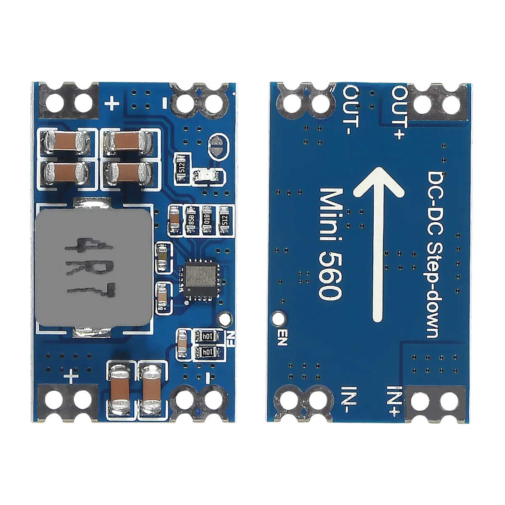
	<br>
	<i>Step Down Mini-560 Pro (el que monta V-Titan actualmente)</i>
</p>

El Mini-560 Pro es el regulador que alimenta el riel propio del servo de dirección, separándolo del riel de 5V de la Raspberry Pi para que los picos de corriente del servo no lleguen al computador.

<p align="center">
	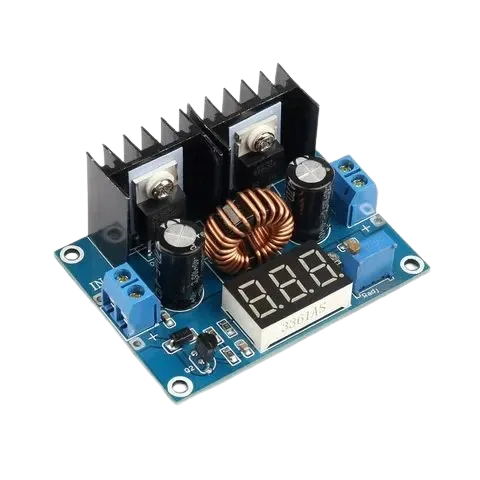
	<br>
	<i>Step Down XLC4016 — el regulador anterior, descartado por peso</i>
</p>

**También es un reemplazo, y aquí el criterio fue el peso.** El regulador original era un XLC4016, un módulo notablemente más grande y pesado. El peso fue un problema recurrente en nuestros prototipos —llegamos a estar 200 gramos por encima del límite— así que revisamos la lista de componentes buscando piezas que estuvieran sobredimensionadas para su función. El regulador del servo era una de ellas: la corriente que realmente necesita esa rama es muy inferior a lo que el XLC4016 podía entregar, de modo que estábamos pagando peso por una capacidad que nunca íbamos a usar.

El Mini-560 Pro cubre la demanda real del servo en un encapsulado mucho más compacto. La diferencia medida es de **24 g a 5 g: 19 gramos menos, casi un 80% del peso del módulo anterior**, por una capacidad que la rama del servo no necesitaba.

| **Regulador** | **Peso** |
|---------------|----------|
| XLC4016 (anterior) | 24 g |
| Mini-560 Pro (actual) | 5 g |
| **Diferencia** | **-19 g** |

Diecinueve gramos no ganan una carrera por sí solos, y ese es justamente el punto: **el peso no se recupera de un solo golpe, sino sumando decisiones pequeñas**. Llegamos a estar 200 g por encima del límite, y ninguna pieza individual explicaba esos 200 g. Salir de ahí consistió en repetir este mismo ejercicio pieza por pieza —¿cuánta capacidad usa realmente esta rama, y cuánto peso estamos pagando por la que sobra?—. Es el mismo razonamiento que aplicamos en la transmisión y en el chasis: **dimensionar cada pieza contra la carga medida, no contra el peor caso imaginable.**

### SSD1306 OLED Display

<p align="center">
	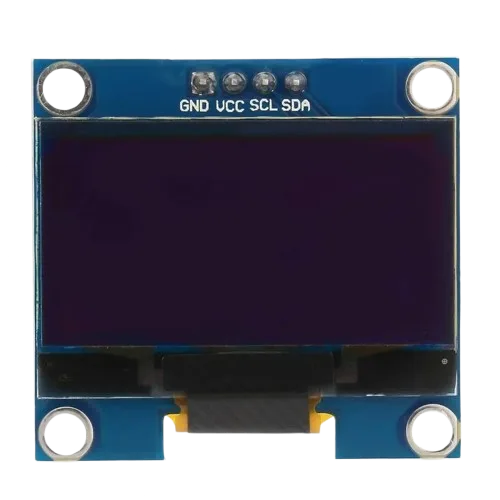
	<br>
	<i>SSD1306 OLED Display 128x64</i>
</p>

Pantalla monocroma de 128x64 píxeles conectada por I2C. Cumple una función de diagnóstico en pista: muestra el estado de la máquina de estados, el desafío seleccionado por el jumper y el resultado del autodiagnóstico de arranque, sin necesidad de conectar un computador ni depender de la red. En una mesa de competencia, poder leer en qué estado está el robot antes de pulsar el botón de inicio evita arrancar una ronda con un sensor caído.

### Convertidor KL89576 (DC a USB-C)

Convertidor reductor que toma la tensión de la batería y entrega **5 V a 5 A por salida USB-C**, dedicado exclusivamente a alimentar la Raspberry Pi 5 y el AI HAT+. Es una rama independiente de la del servo y la del motor: las tres cuelgan de la batería por separado, de modo que el consumo del tren motriz no puede provocar una caída de tensión en el computador y reiniciarlo a mitad de una ronda.

## Diagrama de Conexiones

El arnés completo de V-Titan está trazado como un esquemático generado por código, no dibujado a mano: la fuente vive en [`schemes/wiring/tscircuit/circuit.tsx`](schemes/wiring/tscircuit/circuit.tsx) y se exporta con [tscircuit](https://tscircuit.com/). Esto nos permite versionar el cableado igual que el resto del código: cualquier cambio de pin queda en el historial de git y el render se regenera desde la misma fuente.

<p align="center">
    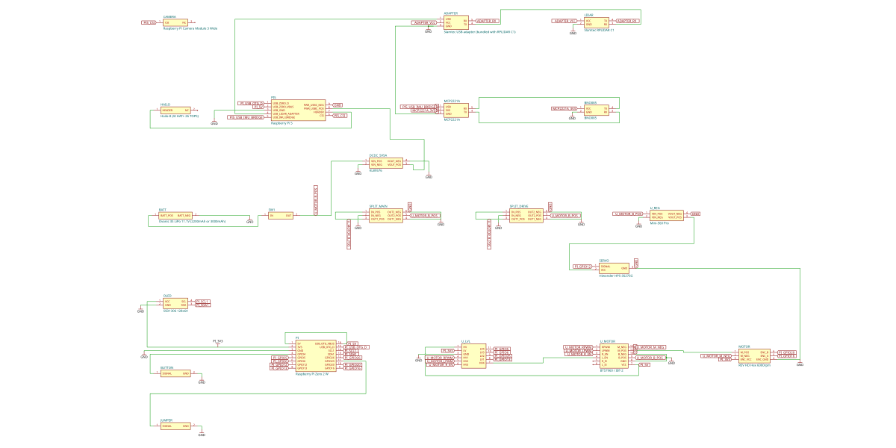
    <br>
    <i>Arnés de conexiones de V-Titan — <a href="schemes/wiring/harness.schematic.png">versión PNG</a></i>
</p>

Para regenerar los artefactos tras editar `circuit.tsx`:

```bash
cd docs/schemes/wiring/tscircuit
npm install
npm run artifacts   # netlist legible + SVG (fondo blanco) + PNG a 2400 px
```

Los exportados (`harness.schematic.svg` y `harness.schematic.png`) se comitean en `schemes/wiring/`, ya que son lo que se lee en esta documentación y reconstruirlos exige toda la cadena de herramientas de tscircuit.

### Consumo Energético

| **Componente**                    | **Cantidad** | **Voltaje** | **Corrente sin Carga** | **Corriente Nominal** | **Corriente Pico** |
|-----------------------------------|--------------|-------------|------------------------|-----------------------|--------------------|
| Raspberry Pi 5                    |      1       | 5.0V        | ~0.50A                 | ~1.50A - 2.50A        | 5.00A              |
| Raspberry Pi Zero 2W              |      1       | 5.0V        | ~0.10A                 | ~0.35A - 0.50A        | 0.70A              |
| Raspberry Pi Camera Module 3 Wide |      1       | 3.3V        | ~0.05A                 | ~0.25A                | 0.30A              |
| Raspberry Pi AI HAT+ (26 TOPS)    |      1       | 5.0V        | ~0.10A                 | ~1.00A - 1.50A        | 2.50A              |
| RPLiDAR C1                        |      1       | 5.0V        | ~0.20A                 | ~0.40A                | 0.60A              |
| Hi Wonder HPS-3527SG 35kg Servo   |      1       | 4.8V - 8.4V | ~0.02A                 | ~0.30A - 0.50A        | 1.80A (Stall)      |
| 9-Axis IMU Gyroscope GY-BNO085    |      1       | 3.3V - 5.0V | ~0.003A                | ~0.015A               | 0.03A              |
| Puente H BTS7960 / IBT-2          |      1       | 5V / 6-27V  | ~0.007A (Lógica)       | ~10.00A (tracción)    | ~20.00A (picos)    |
| **TOTAL**                         |    **8**     | **3.3V-5V** | **~0.980A**            | **~13.82A - 15.67A**  | **~30.93A**        |

> **Nota sobre la rama de tracción.** El salto respecto de la tabla anterior no es un cambio de consumo del robot, sino una corrección: el puente anterior figuraba con «según motor» en la columna nominal, de modo que la corriente de tracción —que es la mayor del sistema con diferencia— nunca entraba en el total. Los ~10 A nominales y ~20 A de pico son la rama del motor medida al 50% del ciclo de trabajo, y son exactamente el motivo por el que el L298N de 2 A por canal tuvo que ser reemplazado. El valor de 43 A del BTS7960 es la clasificación de la pieza, no un consumo: no se suma aquí.
>
> Estas tres ramas —computador, servo y tracción— cuelgan de la batería por separado a propósito. El total sirve para dimensionar la batería y el interruptor, no para dimensionar un único regulador.

# Movilidad y Diseño Mecánico

En este apartado se discuten todos los aspectos con lo que a movilidad y diseño se refiere, la evolución de éste, los prototipados realizados, etc...

## Métodos de Prototipaje

Para realizar nuestros prototipos, decidimos utilizar la impresión 3D como método principal, ya que ya éramos bastante familiares con todo el proceso, si bien el uso de máquinas CNC puede ser beneficioso para prototipos de esta categoría, decidimos optar por piezas pre-fabricadas o impresas en 3D, ya que nos permite minimizar el peso de V-Titan, ya que el peso fue un problema recurrente en nuestros primeros prototipos, llegando a estar 200 gramos por encima del límite establecido.

Para poder diseñar e imprimir dichas piezas, utilizamos el programa de diseño 3D SolidWorks, ya que tiene un montón de funciones útiles para el diseño de prototipos mecánicos, y, era el programa con el que teníamos mejor afinidad.

## Evolución y Justificación Del Diseño

### **Restricciones Iniciales**

* **Dimensiones y peso límite:** Máximo 300 mm (largo) 200 mm (ancho) 300 mm (alto) y un peso no mayor a 1500 g.

* **Reglamento de tracción y dirección:** Permitido tracción 4x4 impulsada por un **único motor** (o dos conectados en el mismo árbol de transmisión) y sistema de dirección para las 4 ruedas accionado por un **único servomotor**.

Con las reglas aclaradas, nuestras idea principal para la elección de componentes era que queríamos crear un prototipo lo más sencillo posible, es decir, tener la mayor cantidad de herramientas y funcionalidades en pista en la menor cantidad de componentes posibles, con esta idea en mente nos decidimos por implementar el [RPLiDAR C1](README.md#rplidar-c1) y el [Giroscopio BNO085](README.md#9-axis-imu-gyroscope-gy-bno085) como componentes principales para la navegación de V-Titan con el RPLiDAR delimitamos las paredes de la pista, y con el giroscopio obtenemos la orientación de V-Titan para una mejor autonomía a la hora de cruzar, además, optamos por usar la cámara [Raspberry Pi Camera Module 3 Wide](README.md#raspberry-pi-camera-module-3-wide) por su amplio rango de visión para detectar los obstáculos, para manejar este componente, utilizamos la [Raspberry Pi 5](README.md#raspberry-pi-5-16gb-ram) y el [Raspberry Pi AI HAT+ (26 TOPS)](README.md#raspberry-pi-ai-hat-26-tops) para manejar el modelo de detección de obstáculo. Con todo esto en mente, optamos por la [Raspberry Pi Zero 2W](README.md#raspberry-pi-zero-2-w) como microcontrolador para el manejo de el [Motor](README.md#hd-hex-motor) y el [Servomotor](README.md#hi-wonder-hps-3527sg-35kg-servo) y, finalmente agregamos tanto la [Batería](README.md#ovonic-air-111v-li-po-battery) como el Adaptador a 5V DC para poder alimentar a la Raspberry Pi 5.

Con todos estos componentes en mente, queríamos implementar esta idea en un sistema de transmisión 4x4 con un sistema de dirección que permita general el giro de 90 grados (o lo más cercano posible) hacia cualquier lado (izquierda o derecha) para permitir que la salida del estacionamiento en el Desafío Cerrado sea lo más fácil posible de programar, además de, cumplir con todas las reglas que tiene esta categoría, a través de pruebas y diseños, para efectos de esta documentación decidimos dividir el proceso en 4 fases:

#### **Fase 1: Prototipo de Rin Estático, Corona Interna y Guayas Flexibles**

<p align="center">
	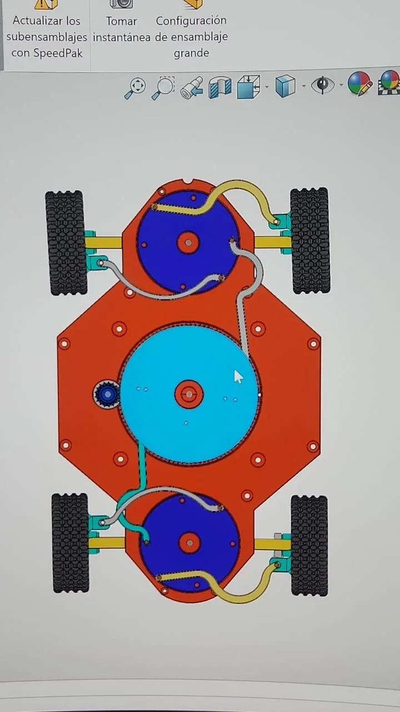
	<br>
	<i>Primer Prototipo del Sistema de Dirección</i>
</p>

* **Mecanismo de Rueda:** Nuestro primer prototipo fue un rin estático que actúa como soporte/pivote en la tijera, mientras que el caucho exterior móvil incorpora una corona/cremallera interna accionada por piñones para transmitir tracción.

* **Transmisión de Dirección/Potencia:** Se implementaron **guayas flexibles** (tipo mototool/rotamil) para llevar el movimiento de rotación a la rueda soportando el ángulo extremo de 90 grados.

* **Caja de Engranajes Modular:** Diseñada para distribuir el movimiento de un solo motor hacia 4 guayas independientes.

* **Resultado:** Las pruebas aisladas confirmaron la viabilidad de la rotación y el pivoteo a 90 grados.

#### **Fase 2: Pruebas de Integración y Detección de Fallas**

* **Sistema de Dirección:** Diseñamos una relación de palancas y piñones para la inversión de movimiento simultáneo. Se integraron **sensores Hall** para monitorear con precisión el ángulo de giro ante la necesidad de usar un servo de más de 360 grados.

* **Problemas Detectados:**
* Las barras de transmisión entre discos eran endebles, se doblaban e incluso una llegó a quebrarse.

* Las guayas generaban una tensión excesiva sobre el servomotor al ejecutar el giro.

* **Decisión:** Descartamos el sistema de guayas y palancas por ser complejo y pesado, buscando un mecanismo más ligero y directo.

#### **Fase 3: Rediseño a Engranajes Perpendiculares, Coronas y Correa Dentada**

* **Nuevo Sistema de Tracción:** Eliminación de guayas. Se optó por **engranajes perpendiculares** ajustando el punto de pivote sobre el centro de la rueda, manteniendo los 90 grados de giro sin perder tracción.

* **Optimización de Dirección:**
* La primera prueba con líneas de piñones pequeños generó juego entre dientes (*backlash*) y movimiento errático.

* Se reemplazaron por una **corona más grande integrada al rin**, logrando una conexión directa y precisa accionada por el servomotor único.

* **Sincronización 4x4:** Se unificaron los árboles de transmisión delantero y trasero mediante una **correa dentada con poleas**, logrando accionar las 4 ruedas simultáneamente con un solo motor.

#### **Fase 4: Optimización de Peso, Integración y Chasis Final**

* **Distribución de Componentes:** Se diseñó una plataforma elevada para separar la electrónica de la mecánica. Esta posición permitió ubicar el RPLiDAR garantizando aproximadamente 270 grados de visión frontal y un espejo de visión trasera.

* **Control de Peso (1500 g):** Al ensamblar el conjunto, se detectó un exceso de 150g.

* **Acciones Correctivas:**
* Reducción de la densidad de relleno en la impresión 3D.

* Disminución de espesores de pared y creación de vacíos estructurales en el chasis, rines y bancadas sin comprometer la rigidez.

* **Resultado Final:** Se logró ingresar dentro del rango de peso reglamentario y consolidar un chasis rígido impreso en 3D con soportes dedicados para la electrónica.

## Sistema de Transmisión

<p align="center">
	
	<br>
	<i>Sistema de Transmisión, visto desde arriba</i>
</p>

Para poder diseñar nuestro sistema de transmisión, tuvimos que tener en cuenta nuestra meta inicial de nuestro alcance de dirección, para poder transmitir el movimiento del motor hacia las ruedas aún cuando éstas estén rotadas a un ángulo de 90 grados. 

Nuestro sistema de transmisión es un sistema 4x4, para maximizar la tracción en cada rueda, éste sistema es controlado por un único motor cuyo movimiento es transmitido mediante dos correas dentadas de movimiento (una para las ruedas delanteras, y otra para las ruedas traseras), este movimiento se va a su eje correspondiente (para el cual utilizamos unos pernos de transmisión de LEGO) y, a su vez cada eje transmite a dos sistemas de engranajes perpendiculares (uno por rueda) y este eje tiene un engranaje cónico perpendicular de 15 dientes, y este movimiento luego es transmitido directamente a la rueda (la cual en lugar de ser un caucho regular, recibe la tracción mediante sus dientes internos) de tal manera que cada rueda recibe la misma potencia, como último detalle, el rin cumple la función de ser un soporte para la rueda dentada y los engranajes cónicos perpendiculares.

## Sistema de Dirección

<p align="center">
	
	<br>
	<i>Sistema de Dirección, visto desde arriba</i>
</p>

Como ya se ha mencionado previamente, nuestra meta principal con nuestro sistema de dirección es tener un giro de 90 grados para facilitar la ruta en pista, para lograr esto, tuvimos que replantear la solución mecánica de Klevor desde cero. Resumidamente, todo el movimiento lo transmitimos a través de engranajes, y los rines de las ruedas actúan tanto como soportes como actuadores en el movimiento al contar con una base dentada, aunque es necesario un servo con mucha capacidad de torque para poder ejercer fuerza en las 4 ruedas, razón por la cual, tuvimos que cambiar nuestro servo que tenía una capacidad de fuerza de 14kg·cm por uno de 35kg·cm. En primer lugar al servo le implementamos un eje de 20 dientes, el cual luego es conectado otro engranaje de 20 dientes para transmitir ese mismo movimiento pero en dirección opuesta, cada engranaje de 20 dientes luego transmite su movimiento a un engranaje de 40 dientes, el cual conecta con el engranaje indidivual que conecta finalmente con cada rueda, ya sean delanteras o traseras.

## Chasis Inferior 

<p align="center">
	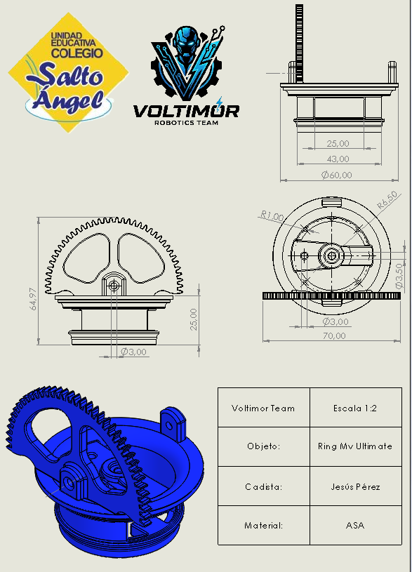
	<br>
	<i>Piñon de 33 dientes de dirección</i>
</p>

También es importante recalcar la base dentada del rin de las ruedas, o mejor dicho, el piñon de dirección de la misma, debido a que el sistema de transmisión de V-Titan en lugar de utilizar engranajes diferenciales estándar, utiliza una transmisión por engranajes a cada rueda, permite que la rueda pueda seguir recibiendo la tracción aún cuando está a 90 grados.

## Monochasis 

<p align="center">
	
	<br>
	<i>Chasis Inferior</i>
</p>

Ahora bien, es hora de hablar del chasis inferior y de cómo los sistemas de transmisión y dirección son implementados en V-Titan, el aspecto más resaltante de este chasis es su forma agujereada, la cual, se fabricó de tal manera por las limitaciones de peso que nuestro primer prototipo tenía, además de esto, en el centro del chasis de pueden aprecias dos encajes, uno para el motor y otro para el servomotor, en los extremos del chasis también se pueden apreciar los encajes para los ejes de transmisión (para los cuales utilizamos pernas de LEGO) para asegurar una conexión rígida y estable entre los componentes y el chasis.

## Relación de Torque y Velocidad 

Ahora bien, en el caso de V-Titan, éste utiliza un [REV HD Hex Motor](README.md#hd-hex-motor), el cual tiene un torque de bloqueo (es decir, su torque máximo) de 0.105Nm, y una velocidad sin carga de 6000 RPM, ahora bien, ¿cómo podemos saber si este torque es necesario para mover a V-Titan?

La fórmula general para calcular el torque necesario es:

$$T = \frac{m \cdot (a + g \cdot (\mu \cos\theta + \sin\theta)) \cdot r}{N}$$

Donde: 

"m" es la masa del vehículo (en kg)

"r" es el radio de la rueda (en metros, cuyo radio en V-Titan mide 0.035 metros)

"a" es la aceleración deseada

"g" es la gravedad ($9.81 \text{ m/s}^2$)

"$\mu$" representa el cociente de fricción (para el cual estimamos a 0.3 para unas ruedas de ASA en una lona de PVC flexible)

"$\theta$" representa el ángulo de inclinación (para el cual $\theta = 0^\circ$ en esta competición)

"N" es el número de motores en tracción (en V-Titan solo hay uno)

Al efectuar toda la operación obtenemos como resultado que se necesita un torque mínimo de 0.154Nm para que V-Titan tenga aceleración.

Así que, como el torque de bloqueo del motor (0.105Nm) es menor al torque mínimo (0.154Nm), es evidente que el motor por sí solo no podría mover a V-Titan sin utilizar algún método para aumentar el torque del motor de forma mecánica, la manera en la que resolvimos este problema es mediante las relaciones de engranajes, las cuales operan mediante la siguiente formula:

<p align="center">
	
	<br>
	<i>Relación de Engranajes</i>
</p>

El torque final, o de salida será igual a la multiplicación del torque inicial por la misma relación de engranajes total, ahora, simplemente hay que calcular la relación de engranajes total de engranajes, para la cual simplemente calculamos cada relación individual y se efectúa el producto de ese conjunto:

El motor cuenta con un eje de 50 dientes, el cual va a una correa de 33 dientes para cada eje, por lo que la relación sería: 33 / 50 = 0.66

Este eje tiene en el centro unos pernos de transmisión de LEGO los cuales a su vez, tienen un engranaje cónico de 10 dientes, que transmiten a un engranaje de 20 dientes, por ende su relación de transmisión será: 20 / 10 = 2

Este engranaje de 20 dientes a su vez, conduce a un engranaje de 15 dientes, por ende su relación de transmisión es: 15 / 20 = 0.75

Este engranaje de 15 dientes, la cual conduce otro engranaje de 20 dientes, por ende su relación de transmisión será: 20 / 15 = 1.33

Finalmente este engranaje de 20 dientes, conduce a la rueda dentada la cual cuenta con 50 dientes, por ende su relación de transmisión es: 50 / 20 = 2.5

Ahora la relación de transmisión total será:

$R_{total}$ = 0.66 * 2 * 0.75 * 1.33 * 2.5 = 3.29

Por ende el Torque de bloqueo final será:

$T_{final}$ = $T$ * $R_{total}$ = 0.105Nm * 3.29 = 0.345Nm

Un éstandar, o mejor dicho, recomendación para los motores DC es utilizar el 50% de su torque de bloqueo para aceleraciones y tramos cortos, ahora bien, 0.345Nm * 0.5 > 0.154Nm, por ende, esta relación de engranajes es suficiente por sí sola para cumplir con este estándar, aunque, en caso de no cumplir con esta recomendación, los motores DC pueden soportar ejercer picos de torque por unos breves segundos, ya que, a medida que el vehículo gana tracción, el cociente de fricción disminuye considerablemente (alrededor de un 15%) por lo que, el torque necesario baja considerablemente y es más fácil que el vehículo gane aceleración.

# Arquitectura de software y estrategia para superar obstáculos

En este apartado, describimos las estrategias que empleamos en pista para poder resolver los desafíos de una manera autónoma y eficiente.

## Arquitectura ROS2 y reparto entre dos computadores

V-Titan no corre sobre un solo computador, sino sobre dos, y el reparto no es por comodidad: es la decisión de arquitectura que sostiene todo lo demás.

La **Raspberry Pi 5** se encarga de percepción y planificación —LIDAR, cámara, inferencia en el AI HAT+, decidir hacia dónde ir— y la **Raspberry Pi Zero 2 W** se encarga exclusivamente del control en tiempo real del motor y del servo. El motivo es que esas dos cargas tienen exigencias temporales incompatibles. La inferencia de visión es pesada y su tiempo de respuesta varía; el lazo de control del motor tiene que ejecutarse a ritmo constante o el robot se vuelve inestable. Si ambas cosas compiten por el mismo procesador, un fotograma lento se traduce en una corrección de dirección tardía. Separándolas, **ningún retraso de visión puede detener el lazo de control**.

El software está organizado en cinco paquetes ROS2:

| Paquete | Responsabilidad |
|---------|-----------------|
| `vtitan_bringup` | Lanzamiento del sistema completo y composición de nodos |
| `vtitan_drivers` | Controladores de hardware: IMU, I2C, UART |
| `vtitan_navigation` | Navegación: seguimiento de pasillo, planificación, escapes |
| `vtitan_state_machine` | Máquina de estados de carrera y grabación de bags |
| `vtitan_vision` | Cámara e inferencia de detección |

Los nodos se comunican por **29 tópicos declarados en un único archivo de configuración** (`ros_topics.toml`) en lugar de estar escritos a mano en cada nodo. Esto evita una clase de error entera: un nodo que publica en `/lidar/scan` mientras otro escucha `/scan` compila, arranca y no funciona, sin ningún mensaje de error. Con los nombres centralizados, esa discrepancia no puede existir.

Un detalle que ilustra el nivel de restricción real: el SoC de la Pi Zero 2 W tiene **exactamente dos generadores de PWM por hardware**. Uno está tomado por el servo de dirección, que necesita mantener una posición absoluta y no tolera fluctuaciones. El otro se asigna a la marcha adelante del motor. La marcha atrás, que solo se usa en maniobras de estacionamiento y recuperación a baja velocidad, funciona con PWM por software y sí tolera esa fluctuación. Es un reparto deliberado de un recurso escaso, no una casualidad.

## Modelo de Detección YOLO

Para poder detectar los obstáculos del Desafío Cerrado de una manera confiable, decidimos implementar un modelo de detección YOLO (You Only Look Once) para poder mantener tracción de los obstáculos en pista, al principio, decidimos probar los modelos de prueba en la Raspberry Pi 5, utilizando la Raspberry Pi Camera Module 3 Wide para poder ejecutar los modelos de prueba, sin embargo tras las primeras pruebas notamos que el tiempo de detección era demasiado alto (alrededor de los 700ms por imágen) tras esto decidimos implementar un Raspberry Pi AI HAT+ (26 TOPS) con el cual, obtuvimos una tasa de detección de alrededor de 30 a 40 imágenes por segundo.

## Algoritmo PID

Otro algoritmo fundamental que implementamos en nuestra estrategia para facilitar el buen desempeño de V-Titan en los desafíos es el PID (Proporcional, Integral y Derivativo) éste es utilizado principalmente para que, con ayuda del giroscopio, V-Titan siempre esté orientado de paralelamente a los bordes de la pista, además de esto, el PID es utilizado para suavizar los cruces en los desafíos (para evitar el "overshooting", es decir, que V-Titan, por inercia cruce 10 o 20 grados más de lo deseado por un giro brusco)

## Estrategia en pista

El robot arranca **sin mapa y sin saber hacia qué lado se corre la pista**. Todo lo que sigue lo deduce de sus propios sensores durante los primeros metros. Los diagramas de flujo completos de esta lógica están en [`schemes/flowcharts/`](schemes/flowcharts/), separados en `common/` (lo compartido por ambos desafíos), `open/` y `obstacles/`.

### Inferencia del sentido de la vuelta

Es la primera decisión de cada ronda y condiciona todas las demás. El robot avanza despacio y centrado, y compara cuánto espacio libre mide el LIDAR a izquierda y derecha: el lado que **deja de ser pared** indica dónde está el bloque interior, y el bloque interior fija el sentido de giro.

<p align="center">
    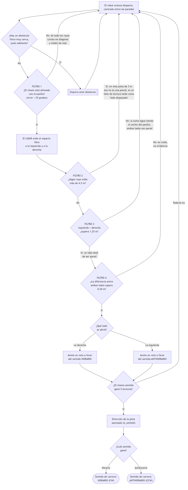
    <br>
    <i>Inferencia del sentido de la vuelta — fuente Mermaid: <a href="schemes/flowcharts/common/mermaid/inferencia-direccion.mmd"><code>inferencia-direccion.mmd</code></a></i>
</p>

Lo interesante no es la comparación, sino todo lo que hay que descartar antes de creerla. Una lectura solo cuenta como voto si supera cuatro filtros ([`inferencia-direccion.mmd`](schemes/flowcharts/common/mermaid/inferencia-direccion.mmd)):

1. **El chasis está alineado con el pasillo** (error menor a 25°). De lado, los rayos laterales cortan en diagonal y miden de más.
2. **Ningún rayo supera los 4.5 m.** En una pista de 3 m eso no puede ser una pared. Importa porque **un fallo de lectura del LIDAR se sustituye por el rango máximo**, que es exactamente la señal de «este lado está despejado» que el módulo busca: sin este filtro, un sensor mudo parece un pasillo abierto.
3. **La suma de ambos lados supera 1.25 m.** La decisión se toma sobre la *suma*, no sobre cada rayo por separado, y este es el punto fino: dos paredes suman el ancho del pasillo sin importar dónde esté el robot entre ellas, así que la suma solo salta cuando un lado deja de ser pared. Comparar los rayos directamente no funciona —un robot desviado hacia el bloque interior lee 0.27 m a su izquierda y 0.72 m a su derecha, y «el lado más lejano está abierto» elige la pared exterior y devuelve exactamente la respuesta contraria.
4. **La diferencia entre lados supera 0.20 m**, para que el ruido no cuente como evidencia.

Y aun así una sola lectura no decide: hacen falta **5 votos coincidentes**. Un rayo que se cuela por la esquina de un bloque produce errores breves y agrupados, y uno de esos llegando primero no puede decidir la ronda.

### Seguimiento de pasillo, vueltas y escapes

Con el sentido resuelto, el robot sigue el pasillo manteniéndose centrado, cuenta las vueltas por el paso acumulado alrededor del circuito, y vigila permanentemente dos condiciones de fallo: **colisión** y **atasco**. Ambas comparten una misma rutina de escape, documentada una sola vez en `common/` y referenciada desde los dos desafíos en vez de redibujarse.

<p align="center">
    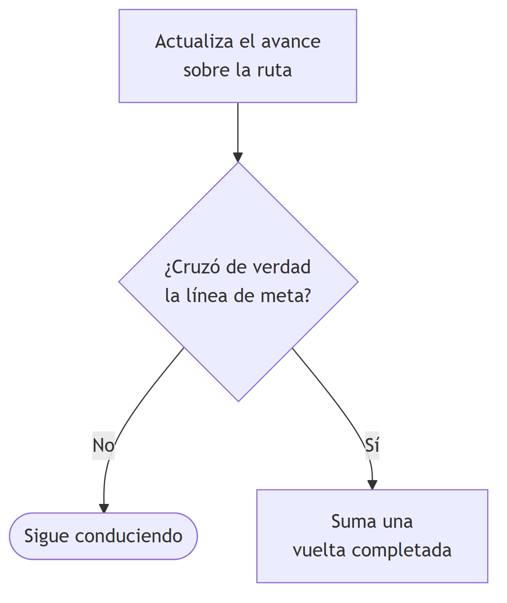
    <br>
    <i>Conteo de vueltas por paso acumulado alrededor del circuito</i>
</p>

<p align="center">
    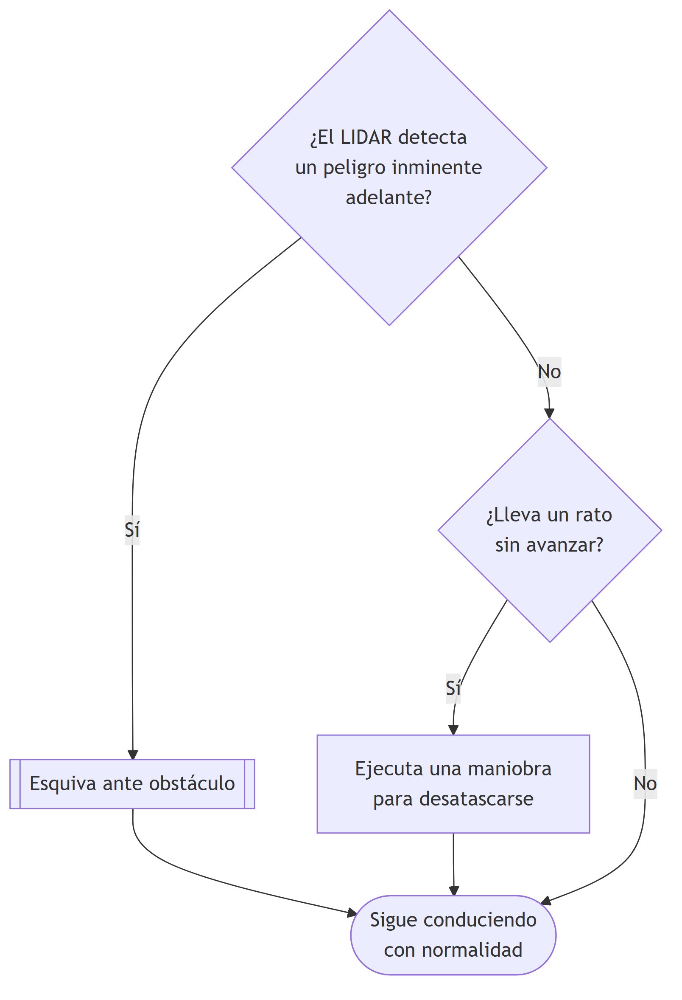
    <br>
    <i>Rutina de escape compartida ante colisión y atasco</i>
</p>

<p align="center">
    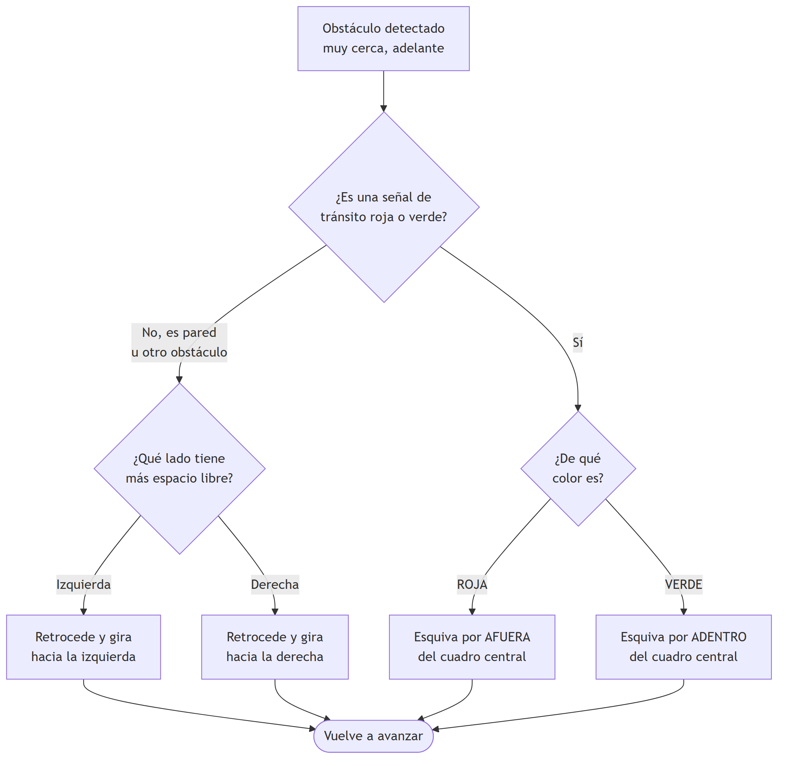
    <br>
    <i>Esquiva genérica de obstáculo</i>
</p>

En el Desafío de Obstáculos se añade la regla de color: el robot debe pasar por un lado determinado de cada señal según sea roja o verde. La consecuencia de equivocarse no es perder puntos, es **terminar la ronda**, así que el criterio de paso es una de las partes más conservadoras del sistema.

<p align="center">
    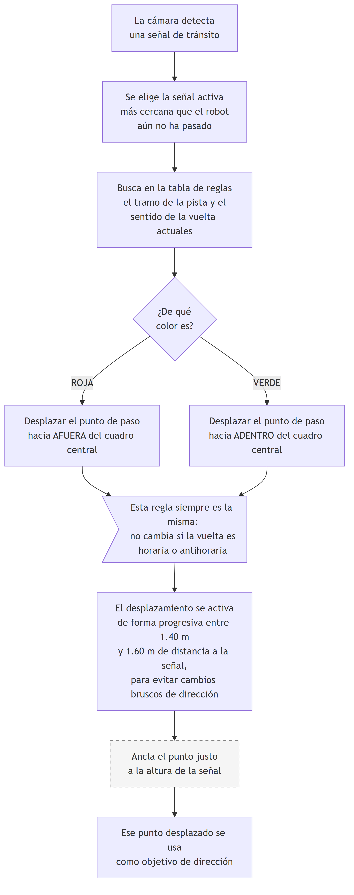
    <br>
    <i>Regla de paso por señales de color (Desafío de Obstáculos)</i>
</p>


### Vista completa de cada desafío

Los diagramas anteriores describen piezas sueltas de la lógica. Estos son los flujos completos y las máquinas de estado de cada desafío, renderizados desde las mismas fuentes Mermaid de [`schemes/flowcharts/`](schemes/flowcharts/).

<p align="center">
    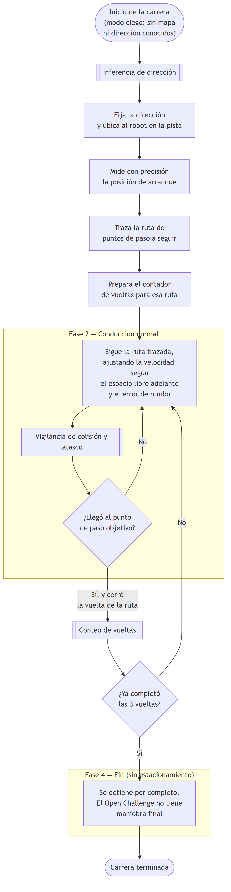
    <br>
    <i>Open Challenge — flujo completo</i>
</p>

<p align="center">
    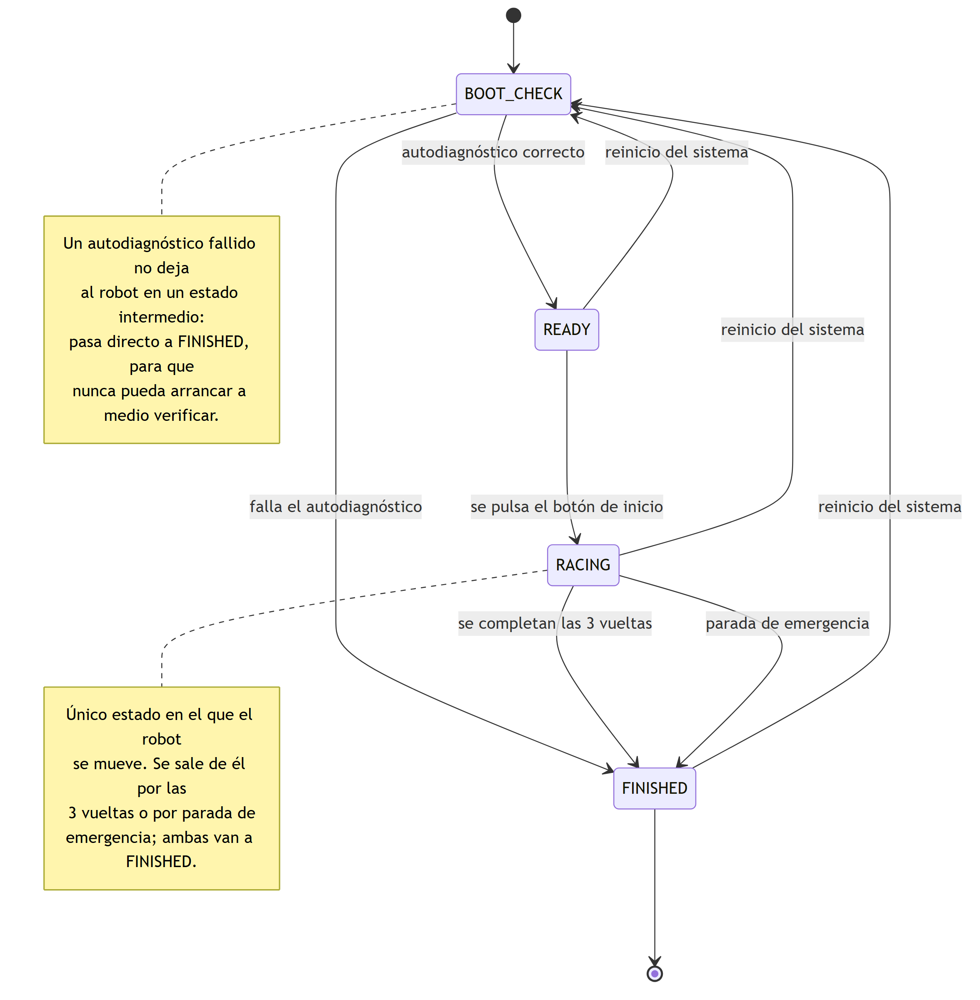
    <br>
    <i>Open Challenge — máquina de estados</i>
</p>

<p align="center">
    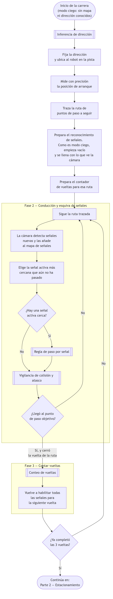
    <br>
    <i>Obstacle Challenge — parte 1: conducción y señales</i>
</p>

<p align="center">
    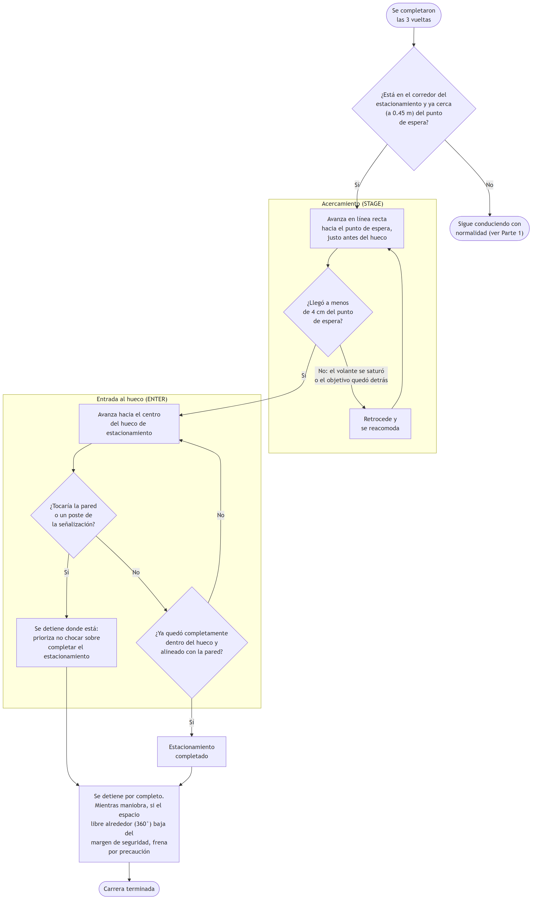
    <br>
    <i>Obstacle Challenge — parte 2: estacionamiento</i>
</p>

<p align="center">
    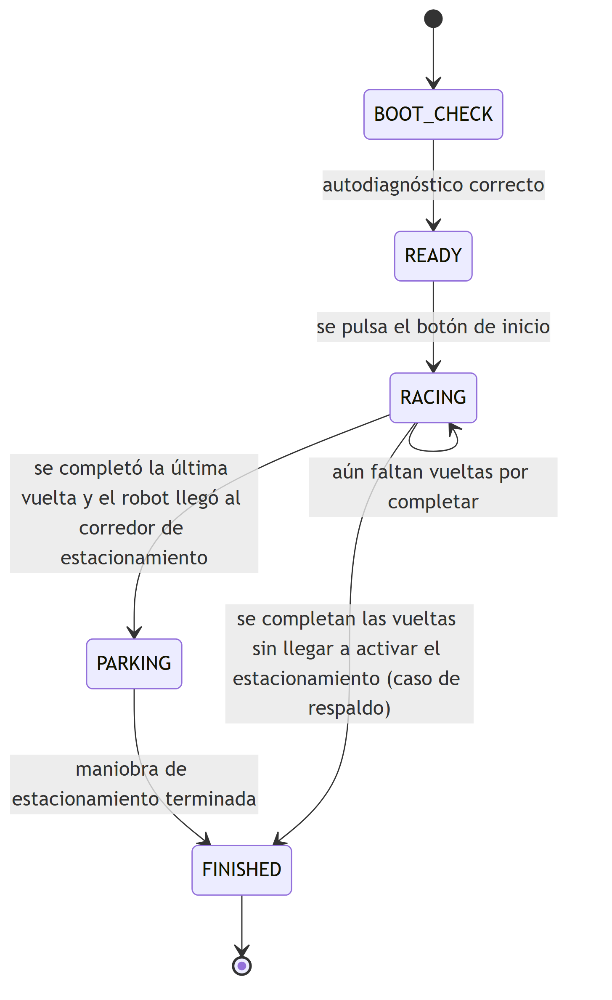
    <br>
    <i>Obstacle Challenge — máquina de estados</i>
</p>
## Grabación y análisis de carreras

Una ronda dura como máximo **180 segundos** y no se puede pausar. Si algo sale mal, mirar el robot no dice por qué. Por eso todo lo que ocurre a bordo queda grabado.

Cada ejecución escribe un *bag* en formato **MCAP** con todos los tópicos: barridos del LIDAR, pose estimada, comandos de dirección y velocidad, estado de la máquina de estados y detecciones de visión. Los bags se descargan del robot a `data/` y se analizan en frío, fuera de la pista.

Sobre esos bags corren **68 scripts de diagnóstico** especializados: uno reconstruye el conteo de vueltas, otro mide el sobrepaso en las esquinas, otro compara la dirección inferida contra lo que realmente ocurrió, otro revisa la robustez de los rayos laterales. Para inspección visual, los bags se abren en **Foxglove**.

La diferencia práctica es grande: un fallo no se resuelve repitiendo la ronda a ver si se repite, sino **reproduciendo el instante exacto tantas veces como haga falta**, con los mismos datos, hasta encontrar la causa. Varios de los hallazgos listados más abajo salieron de un bag, no de la pista.

## Simulador y corpus de escenarios

Probar solo en la pista física tiene un límite duro: cada intento cuesta minutos, cada montaje es ligeramente distinto y no se puede repetir una situación difícil a voluntad. Por eso construimos un simulador y, sobre él, un **corpus de escenarios**.

Un escenario es una combinación concreta de posición de arranque, anchos de pasillo y sentido de la pista. El corpus los enumera de forma exhaustiva:

| Desafío | Escenarios | Qué varía |
|---------|-----------|-----------|
| Open Challenge | **640** | Posición de arranque, configuración de anchos, sentido de giro |
| Obstacle Challenge | **256** | Lo anterior, más la disposición y el color de las señales |

Esto cambia el significado de «funciona». Una mejora ya no se juzga por una carrera afortunada, sino por **cuántos de los 640 escenarios completa**. La referencia actual del Open Challenge es de **638 de 640**, y los dos casos restantes están identificados uno por uno, no agrupados como «ruido».

También cambia la forma de fallar. Cuando un cambio parece mejorar el resultado, el corpus permite comprobar *cuáles* casos concretos cambiaron de estado. Más de una vez, una mejora aparente resultó ser un caso que empezó a pasar y otro distinto que empezó a fallar, con el total sin moverse.

# Pensamiento sistémico y decisiones de ingeniería

Esta sección no describe qué hace el robot, sino **cómo tomamos las decisiones** que lo llevaron a ser así. Es la parte del proyecto que más nos cambió la forma de trabajar.

## Diseño gobernado por configuración

La regla que más impacto tuvo en la calidad del sistema es simple de enunciar: **ninguna constante de comportamiento vive dentro del código**. Todas están en archivos de configuración, y cada una tiene escrito al lado por qué vale lo que vale.

Hoy son **203 constantes repartidas en 21 archivos TOML**, acompañadas de **1093 líneas de comentario**: algo más de **cinco líneas de explicación por cada valor**.

No es documentación decorativa. Un número suelto en el código es imposible de auditar: nadie recuerda, tres meses después, si `0.20` se midió, se calculó o se puso a ojo. Al obligarnos a escribir la justificación junto al valor, cada constante lleva su propia historia —qué se midió, con qué método, qué pasó cuando valía otra cosa—. Un ejemplo real, del archivo que gobierna la inferencia de dirección:

```toml
# Diferencia mínima entre izquierda y derecha para que un barrido cuente como
# evidencia y no como ruido. Antes era 0.30, lo que descartaba la asimetría que
# realmente ve un robot que arranca cerca del centro de un pasillo ancho.
min_asymmetry_m = 0.20
```

Y otro, del perfil del motor actual, que muestra el caso contrario —una constante marcada explícitamente como *todavía no medida*:

```toml
# TODAVÍA NO MEDIDA EN BANCO. 0.234 es la velocidad medida del motor anterior
# (0.156 m/s) escalada por el "~50% más rápido" con que se describió este motor,
# y es la suposición que más peso carga en este archivo.
```

Escribir «esto todavía no está medido» dentro del propio sistema evita que una estimación se convierta silenciosamente en un hecho.

## Perfiles de hardware intercambiables

El robot cambió de servo y de motor durante el desarrollo. Para que eso no obligara a tocar el código, el hardware está descrito en **perfiles componibles**: uno por pieza física.

| Perfil | Pieza |
|--------|-------|
| `180deg-injora-14kg` | Servo de dirección de 180°, 14 kg |
| `270deg-hiwonder-35kg` | Servo de dirección de 270°, 35 kg (actual) |
| `generic-motor-1500rpm` | Motor de tracción de 1500 rpm |
| `rev-hd-hex-motor-6000rpm` | Motor de tracción HD Hex de 6000 rpm (actual) |

Se combinan al arrancar. Cambiar de servo es seleccionar otro perfil, no editar código —y, sobre todo, significa que **los dos servos siguen siendo probables** después del cambio: si el de 35 kg falla en competencia, volver al de 14 kg es una línea de configuración, no una tarde de reescritura.

## Ciclo de trabajo: idea → simulación → pista

Nuestro método de trabajo se estabilizó en tres pasos, y el orden importa:

1. **Formular la hipótesis antes de medir.** Escribir qué esperamos que cambie y en qué dirección, *antes* de ejecutar nada. Sin esto es demasiado fácil ejecutar, mirar el resultado y construir después una explicación que lo justifique.
2. **Contrastar contra el corpus completo**, no contra un caso. Un cambio se evalúa sobre los 640 escenarios, y se compara siempre contra la versión inmediatamente anterior —no contra una medición vieja tomada en otras condiciones.
3. **Verificar en la pista.** El simulador orienta; no decide. Solo la pista confirma.

Dos disciplinas que aprendimos por las malas:

**El simulador se calibra contra la realidad, no al revés.** Al comparar grabaciones reales con simuladas descubrimos que el simulador giraba más de lo que gira el robot y alcanzaba su velocidad al instante, cosa que el robot no hace. Era **optimista**: aprobaba comportamientos que en pista fallaban. Lo corregimos contra datos medidos y **descartamos las conclusiones anteriores a esa calibración**, porque estaban tomadas contra un robot que no existe.

**Un resultado solo es comparable dentro de sus propias condiciones.** Una misma configuración medida en dos momentos distintos puede dar resultados diferentes si algo del entorno cambió. Por eso las comparaciones se hacen en una sola ejecución y contra la versión inmediatamente anterior.

## Hallazgos de ingeniería

Los errores más costosos del proyecto no fueron de programación, sino **suposiciones que nadie había verificado**. Estos son los que más nos enseñaron:

| Hallazgo | Consecuencia |
|----------|--------------|
| El encoder daba **60 pulsos por vuelta, no 86** | Toda medición de distancia y velocidad estaba mal por ese factor. Se descubrió midiendo con cinta métrica una distancia conocida y comparándola con lo que el robot creía haber recorrido. |
| El «techo de 0.45 m/s» **no era un límite físico** | Era un artefacto del error anterior. Con el valor correcto, el techo real resultó ser **~0.58 m/s**. Estuvimos limitando el robot por un error de cuentas, no por el motor. |
| Un LIDAR montado invertido necesita **espejar las lecturas, no rotarlas 180°** | Rotar deja los ángulos invertidos en un sentido que parece plausible: el robot no falla de golpe, sino que interpreta mal la pista de forma sutil. Fue de los fallos que más costó localizar. |
| Un fallo de lectura del LIDAR **se sustituye por el rango máximo** | Es decir, un sensor mudo se lee como «lado completamente despejado» — justo la señal que usamos para decidir el sentido de la vuelta. Sin filtrarlo, el robot podía salir a dar vueltas al revés con total confianza. |
| El puente H **operaba diez veces por encima de su especificación** | Medir el consumo real del tren motriz (~10 A, con picos de ~20 A) contra los 2 A por canal del L298N explicó de golpe los cortes y el calentamiento. |
| Sobredimensionar una pieza **no elimina el cuello de botella** | Al pasar a un puente de 43 A, el elemento más débil de la ruta de potencia pasó a ser el interruptor de encendido. El límite se movió de sitio; no desapareció. |

El patrón es siempre el mismo: **el sistema se comportaba de forma coherente con una suposición equivocada**, y por eso los síntomas nunca apuntaban a la causa. La conclusión que sacamos, y que ahora aplicamos por defecto, es medir antes de optimizar.

## Tecnologías utilizadas

| Tecnología | Uso | Por qué |
|------------|-----|---------|
| **ROS2 Kilted** | Middleware de todo el robot | Comunicación entre nodos, herramientas de grabación y ecosistema ya maduro |
| **Python** | Navegación, visión, máquina de estados | Velocidad de iteración durante el desarrollo |
| **Go** | Segunda implementación de la pila de navegación | Arranque más rápido y consumo de recursos menor en el robot |
| **Pixi / RoboStack** | Entorno de desarrollo | Permite trabajar el mismo proyecto en Windows, Linux y en la Raspberry sin divergencias |
| **Gazebo** | Simulación física | Ejecutar el corpus de escenarios sin pista |
| **Hailo + YOLO** | Detección de señales | Inferencia acelerada: de ~700 ms por imagen a 30-40 imágenes por segundo |
| **MCAP + Foxglove** | Grabación y análisis | Formato de bags y visualización posterior de cada ronda |
| **Task** | Automatización | Un único punto de entrada para compilar, probar, desplegar y simular |
| **tscircuit** | Esquemático de conexiones | El arnés se define en código y se versiona igual que el software |


