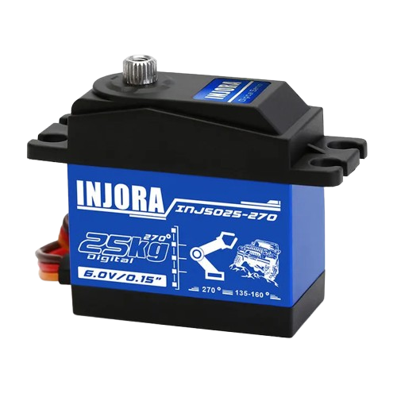
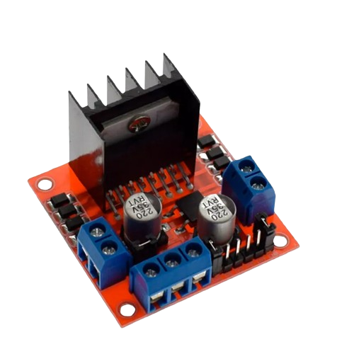
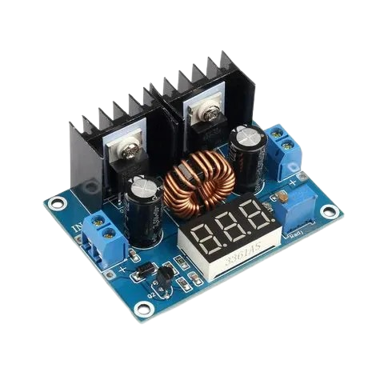
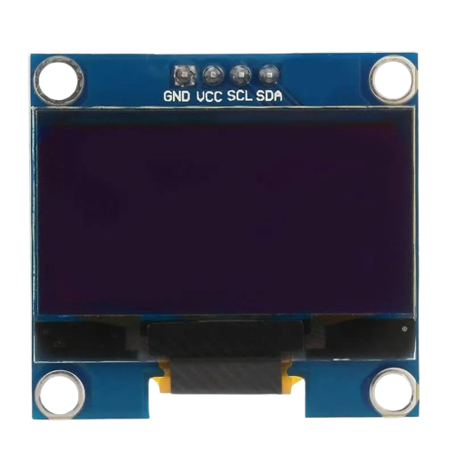

# Team Voldemor

    
     
    <i>Logo del Equipo</i>

Bienvenidos al repositorio de V-Titan, el robot del Team Voldemor, que compite en la World Robot Olympiad 2026 en la categoría Futuros Ingenieros. Aquí encontrarás toda la información sobre el robot, incluyendo su código, modelos 3D, esquemas y documentación.

## Estructura de la documentación

Esta documentación es bastante extensa, por lo que decidimos dividir los contenidos de esta documentación en múltiples archivos para facilitar la lectura, los cuales están ubicados en la carpeta `docs`.

Ahora bien, la estructura de los archivos es la siguiente:

- En la carpeta `devices` se encuentra todo el código utilizado por Voltimor, dividido en dos carpetas, una para la Raspberry Pi 5, y la otra para la Raspberry Pi Zero W.

- En la carpeta `docs`, como ya se ha mencionado, se encuentra todo lo documentado sobre V-Titan, dividido en 4 secciones, la electrónica, la mecánica, la programación, además de estas secciones, también contamos con algunos archivos que detallan, por ejemplo, el software utilizado, los "gadgets" o herramientas que utilizamos, cómo nos pueden contactar, y demás, **estos archivos están listados al final del índice**.

- En la carpeta `models` se encuentran todos los modelos de las piezas 3d que fueron impresas para V-Titan, esta carpeta está dividida para los planos de las piezas, y el archivo para imprimirlas, además de, estar organizadas por cada prototipo.

- En la carpeta `schemes` están los diagramas de flujo, y los diagramas de conexiones.

- En la carpeta `t-photos` están las fotos del equipo.

- En la carpeta `v-photos` están las fotos de V-Titan.

## Índice 

1. **[Historial del equipo](README.md#historial-del-equipo)**
	1. [Klevor v0.1](/docs/development/previous-prototypes/klevor-v0.1.md)
	2. [Klevor v0.1.1](/docs/development/previous-prototypes/klevor-v0.1.1.md)
	3. [Klevor v0.2](/docs/development/previous-prototypes/klevor-v0.2.md)
	4. [Klevor v1.0](/docs/development/previous-prototypes/klevor-v1.0.md)
2. **[Arquitectura de energía y sensores](README.md#arquitectura-de-energía-y-sensores)**
	1. [Lista de Componentes](README.md#lista-de-componentes)

         1. [Raspberry Pi 5](README.md#raspberry-pi-5-16gb-ram)
         2. [Raspberry Pi Camera Module 3 Wide](README.md#raspberry-pi-camera-module-3-wide)
         3. [Raspberry Pi AI HAT+ (26 TOPS)](README.md#raspberry-pi-ai-hat-26-tops)
         4. [Raspberry Pi Zero W](README.md#raspberry-pi-zero-w)
         5. [RPLIDAR C1](README.md#rplidar-c1)
         6. [INJORA 14KG INJS014 Micro Servo](README.md#injora-14-kg-injs014-micro-servo)
         7. [9-Axis IMU Gyroscope GY-BNO085](README.md#gyroscope-gy-bno085)
         8. [Puente H L298N](README.md#raspberry-pi-camera-module-3-wide)
         9. [Step Down XLC4016](README.md#raspberry-pi-camera-module-3-wide) 
         10. [SSD1306 OLED Display](README.md#raspberry-pi-camera-module-3-wide)
         11. [KL89576 DC to USB-C Converter](README.md#raspberry-pi-camera-module-3-wide)
         12. [Ovonic Air 11.1V Li-Po Battery](README.md#raspberry-pi-camera-module-3-wide)
	2. [Diagrama de Conexiones](README.md#Diagrama-de-conexiones) 
        
         1.[Consumo energético](README.md#consumo-energético)
         
3. **Movilidad y Diseño Mecanico**
4. **Arquitectura de software y estrategia apra superar obstáculos**
	1. Lenguajes de Programación
	2. [Librerías de Python](docs/programming/libraries/python.es.md)
	3. Diagramas
		1. [Diagramas de Flujo](docs/programming/diagrams/flowcharts.es.md)
	4. [Glosario de Términos](docs/programming/glossary.es.md)
	5. Guías
		1. Legado 
			1. [Guía de MicroPython](docs/programming/guides/legacy/micro-python.es.md)
			2. [Guía de CircuitPython](docs/programming/guides/legacy/circuit-python.es.md)
			3. [Guía de la Raspberry Pi Pico 2 W](docs/programming/guides/leg54acy/raspberry-pi-pico-2w.es.md)
		2. [Guía de MkDocs](docs/programming/guides/mkdocs.es.md)
		3. [Guía de TinyGo](docs/programming/guides/tinygo.es.md)
		4. [Guía de la Raspberry Pi 5](docs/programming/guides/raspberry-pi-5.es.md)
		5. [Guía de la Raspberry Pi Pico 2 W](docs/programming/guides/raspberry-pi-pico-2w.es.md)
		6. [Guía de Detección de Objetos](docs/programming/guides/object-detection.es.md)
5. **[Pensamiento sistémico y decisiones de ingeniería]**
6. **[Vídeos](docs/videos.es.md)**
7. **[Software](docs/software.es.md)**

# Historial del equipo

En este apartado, discutimos brevemente nuestras experiencias pasadas con la categoría de Futuros Ingenieros y nuestro aprendizaje gracias a prototipos previos a la presente temporada.

## Klevor (WRO 2025)

<table>
        <tbody>
                <tr>
                        <td>
                                

                                        
                                         
                                        <i>Vista delantera de Klevor</i>
                                

                        </td>
                        <td>
                                

                                        
                                         
                                        <i>Vista trasera de Klevor</i>
                                

                        </td>
                </tr>
                <tr>
                        <td>
                                

                                        
                                         
                                        <i>Vista derecha de Klevor</i>
                                

                        </td>
                        <td>
                                

                                        
                                         
                                        <i>Vista izquierda de Klevor</i>
                                

                        </td>
                </tr>
                <tr>
                        <td>
                                

                                        
                                         
                                        <i>Vista superior de Klevor</i>
                                

                        </td>
                        <td>
                                

                                        
                                         
                                        <i>Vista inferior de Klevor</i>
                                

                        </td>
                </tr>
        </tbody>
</table>

Klevor es el **predecesor** de V-Titan, participando en la temporada 2025 de la World Robot Olympiad en la categoría de Futuros Ingenieros, con el Team Steel Bot (quienes ahora participan bajo el nombre de Team Voldemor) y como todo proyecto fue evolucionando hasta culminar con la versión que tenemos hoy en día. 

Para conocer a nuestro prototipo actual, V-Titan, mejor, es importante recalcar que muchas de sus características, más específicamente en la electrónica y programación, son **directamente heredadas** de Klevor, con cambios nulos o mínimos entre un prototipo o el otro. Algunas de las **herencias** más importantes son:

- El manejo de la Raspberry Pi 5 como computadora principal

- La detección de los obstáculos gracias a la Raspberry Pi Camera 3 y su Hailo AI+

- La comunicación serial entre una computadora principal y un microcontrolador

Ahora bien, también hay que recalcar que tuvimos algunos fallos en el desarrollo de Klevor, por ejemplo: 

El uso de un ESC para controlar el motor, si bien parecía una idea muy buena en papel, utilizar el "combo" de un carro controlado por radio para nuestro prototipo, ofreciendo una velocidad bastante alta para completar los desafíos, terminó siendo un problema grave debido a la falta de precisión que éste nos ofrecía, acelerando muy rápido, sin ninguna solución en la programación para compensarlo.

Además, optamos por un modelo más robusto y pesado en comparación con los demás prototipos habituales de esta competición, si bien, gracias a esto pudimos incorporar muchos elementos de gran utilidad (como la Raspberry Pi 5), debido a ésto, no podíamos optar por cambios significativos, siendo obligados a reestructurar el prototipo desde cero en caso de necesitar algún cambio.

Debido a la gran cantidad de cambios que necesitamos, por diferentes motivos, teníamos que reestructurar el prototipo múltiples veces, por lo que terminamos confiando ciegamente en algunas características que no pudimos probar completamente.

## V-Titan (WRO 2026)

# Arquitectura de energía y sensores 
En el siguiente apartado, se discute toda la parte electrónica de V-Titan, tales como sus sensores, las razones detrás de su elección, cómo se implementan y el presupuesto energético.

## Lista de Componentes
A continuación, está la descripción de todos los componentes principales de V-Titan.

### Raspberry Pi 5 (16GB RAM)

	
	 
	<i>Raspberry Pi 5</i>

Equipada con un procesador ARM Cortex-A76 de 64 bits a 2.4 GHz. La Raspberry Pi 5 es nuestro controlador principal de elección, decidimos usar a la Raspberry Pi 5 debido a múltiples factores, entre ellos:

- **Compatibilidad**: Existen muchos componentes de V-Titan (como la Camera Module 3 Wide) que a su vez pertenecen al ecosistema Raspberry, lo que hace que implementarlos a la Raspberry Pi 5 no requiera tanto esfuerzo.

- **Potencia**: La Raspberry Pi 5 es uno de los computadores portátiles más potentes actualmente, gracias a esto, funciones demandantes como lo es el procesamiento de imágenes en tiempo real, son fácilmente realizables por una Raspberry Pi 5.

- **Portabilidad**: La Raspberry Pi 5 destaca entre los controladores, ya que no es una computadora bastante pesada, apenas llegando a los 60 g, hace que incorporarlo a V-Titan sea una opción prácticamente segura.

| **Medida** | **Valor** |
|------------|-----------|
| Largo      | 85 mm     |
| Alto       | 58.9 mm   |
| Ancho      | 56 mm     |
| Peso       | 46 g      |

### Raspberry Pi Camera Module 3 Wide

	
	 
	<i>Raspberry Pi Camera Module 3</i>

La Raspberry Pi Camera Module 3 Wide es nuestra elección de preferencia, como los demás componentes Raspberry, esta se destaca por ser bastante ligera y portátil, ya que, pues es una cámara bastante pequeña, midiendo apenas 25 mm × 24 mm × 12.4 mm y pesando 4 gramos, sin perder absolutamente ni una pizca de eficiencia, porque puede grabar a 1536 x 864p120, ahora bien, decidimos utilizar la versión Wide por su campo de visión horizontal de 102 grados, porque nos permite tener un rango de visión óptimo para poder detectar todos los obstáculos de la pista.

| **Medida** | **Valor** |
|------------|-----------|
| Largo      | 24 mm     |
| Alto       | 25 mm     |
| Ancho      | 12.4 mm   |
| Peso       | 4 g       |

### Raspberry Pi AI HAT+ (26 TOPS)

	
	 
	<i>Raspberry Pi AI HAT+ 26 TOPS</i>

Si bien la Raspberry Pi 5 es capaz de procesar imágenes en tiempo real, tuvimos en cuenta que necesitaba un poco más de poder, por lo cual decidimos incorporar la AI HAT+ a la Raspberry Pi 5 para poder alcanzar el nivel de procesamiento necesario.

El Raspberry Pi AI HAT+ tiene dos versiones, una de 13 Trillones de Operaciones por Segundo (TOPS) y otra de 26 TOPS. Como se menciona en el índice, V-Titan posee un Raspberry Pi AI HAT+ de 26 TOPS, gracias a este procesador de imágenes, V-Titan puede analizar hasta 30 imágenes por segundo con una resolución de 640 px × 640 px.

| **Medida** | **Valor** |
|------------|-----------|
| Largo      | 65 mm     |
| Alto       | 5.5 mm    |
| Ancho      | 56 mm     |
| Peso       | 9.07 g    |

### Raspberry Pi Zero W

	
	 
	<i>Raspberry Pi Zero W</i>

Construida sobre el chip Broadcom BCM2835, la Raspberry Pi Zero WH es un ordenador de placa única ligero y ultra compacto para V-Titan. Al ejecutar un entorno Linux completo, este chip permite una fácil integración con el resto de los componentes Raspberry, haciendo que establecer comunicación de red o serial con una Raspberry Pi 5 sea nativo y sencillo dentro del mismo ecosistema.

Además de ofrecer una frecuencia de procesamiento de 1 GHz, supera drásticamente la capacidad de procesamiento de microcontroladores de tamaño similar, como el Arduino Nano que cuenta con una frecuencia de 16 MHz a 20 MHz.

La versión WH incorpora conectividad Wi-Fi/Bluetooth y cabezales de pines GPIO pre-soldados de fábrica. Esto ofrece una gran ventaja a la hora de desarrollar y practicar, ya que permite monitorear exactamente qué está procesando V-Titan en tiempo real a través de la red, sin necesidad de utilizar LED de distintos colores para señalizar decisiones y logrando un acabado final mucho más limpio.

| **Medida** | **Valor** |
|------------|-----------|
| Largo      | 65 mm     |
| Alto       | 13 mm     |
| Ancho      | 30 mm     |
| Peso       | 12 g      |

### RPLiDAR C1

	
	 
	<i>RPLiDAR C1</i>

El RPLiDAR C1 es un escáner de rango láser de 360 grados, el cual puede detectar superficies que están hasta 12 metros de distancia, su punto ciego es de tan solo 5 centímetros alrededor del mismo, todos estos factores hacen que el RPLiDAR C1 sea una gran opción para poder guíar a V-Titan por la pista.

Este RPLiDAR C1 permite a V-Titan poder identificar exactamente dónde está ubicado en la pista, gracias a la gran cantidad de datos que este LiDAR ofrece.

| **Medida** | **Valor** |
|------------|-----------|
| Largo      | 55.6 mm   |
| Alto       | 41.3 mm   |
| Ancho      | 55.6 mm   |
| Peso       | 110 g     |

Especificaciones técnicas:

| **Especificación**     | **Valor**                                                                          |
|------------------------|------------------------------------------------------------------------------------|
| Rango de distancia     | Blanco: 0,05-12 m (70 % de reflectividad); Negro: 0,05-6 m (10 % de reflectividad) |
| Frecuencia de muestreo | 5 kHz                                                                              |
| Resolución angular     | 0,72°                                                                              |
| Ángulo de inclinación  | 0°-1,5°                                                                            |

### INJORA 14 kg INJS014 Micro Servo

<!-- github-only-start -->

	
	 
	<i>INJORA 14 kg INJS014 Micro Servo</i>

El INJORA 14 kg INJS014 Micro Servo es el servomotor encargado de controlar la dirección de V-Titan, decidimos utilizar este modelo debido a su reducido tamaño y peso, además de una precisión más que suficiente para poder manejar a V-Titan.

No solo estos aspectos definieron la elección, el INJORA 14 kg INJS014 ofrece también una gran precisión a pesar de su reducido tamaño, algo esencialmente vital en esta competencia.

Gracias a la librería antes mencionada, la `adafruit_motor` con el módulo
`servo`, nos permiten configurar el servo a nuestra elección, convirtiendo el uso de funciones para controlar el servo previamente establecido mucho más fácil de leer sin arriesgar el rendimiento del programa.

| **Medida** | **Valor** |
|------------|-----------|
| Largo      | 40 mm     |
| Alto       | 28.8 mm   |
| Ancho      | 20 mm     |
| Peso       | 50 g      |

### 9-Axis IMU Gyroscope GY-BNO085

	
	 
	<i>Giroscopio BNO085</i>

El GY-BNO085 es un sensor de orientación inercial (IMU) de 9 Grados de Libertad (9DOF), ampliamente utilizado en aplicaciones que requieren un seguimiento de movimiento preciso. En el caso de V-Titan, optamos por utilizar este sensor para poder lograr una mayor autonomía del robot en los cruces, ya que este sensor le permite alinearse casi perfectamente y poder ajustarse.

Además de todo esto, el poder utilizar un giroscopio le permite a V-Titan contar las vueltas que ha dado tanto en el Desafío sin Obstáculos como el Desafío Cerrado de la forma más segura, ya que, a pesar de algún problema mecánico que impida que el robot sea capaz de ir completamente derecho, el giroscopio le puede hacer saber que tanto se está desvíando, siendo este uno de los componentes indispensables para poder completar este desafío.

La forma en la que lo implementamos es bastante sencilla, el giroscopio siempre está actualizando los datos de manera asíncrona cada 50 milisegundos, y V-Titan maneja dos variables,
`yaw_deg` (la diferencia en grados en su orientación desde que inició en la pista hasta dónde está ubicado ahora mismo), y
`relative_yaw` la cual utiliza el mismo
`yaw_deg` para asignarse un valor, pero, en vez de reiniciarse cada vez que pasa de los -180 grados o 180 grados, simplemente le resta o suma (dependiendo del caso) 360 grados a
`relative_yaw`, luego dividimos este número entre 90, y redondeamos hacia abajo (es decir, 10.57 pasa a ser simplemente 10), y si la división es igual a -12 o 12, sabemos que ya está casi en su zona de estacionamiento y V-Titan simplemente avanza un poquito y se detiene (en el caso del Desafío sin Obstáculos).

| **Medida** | **Valor** |
|------------|-----------|
| Largo      | 25.6 mm   |
| Alto       | 22.7 mm   |
| Ancho      | 4.6 mm    |
| Peso       | 3 g       |

### Puente H L298N

	
	 
	<i>Puente H L298N</i>

| **Medida** | **Valor** |
|------------|-----------|
| Largo      | 43 mm     |
| Alto       | 27 mm     |
| Ancho      | 43 mm     |
| Peso       | 26 g      |

### Step Down XLC4016

	
	 
	<i>Step Down XLC4016</i>

| **Medida** | **Valor** |
|------------|-----------|
| Largo      | 65 mm     |
| Alto       | 24 mm     |
| Ancho      | 47 mm     |
| Peso       | 70 g      |

### SSD1306 OLED Display

	
	 
	<i>SSD1306 OLED Display</i>

 
| **Medida** | **Valor** |
|------------|-----------|
| Largo      | 27 mm     |
| Alto       | 27 mm     |
| Ancho      | 4.1 mm    |
| Peso       | 4 g       |

### KL89576 DC to USB-C Converter

	
	 
	<i>KL89576 DC to USB-C Converter</i>

| **Medida** | **Valor** |
|------------|-----------|
| Largo      | 53 mm     |
| Alto       | 27 mm     |
| Ancho      | 15 mm     |
| Peso       | 48 g      |

### Ovonic Air 11.1V Li-Po Battery

	
	 
	<i>Ovonic Air 11.1V Li-Po Battery</i>

| **Medida** | **Valor** |
|------------|-----------|
| Largo      | 25.6 mm   |
| Alto       | 22.7 mm   |
| Ancho      | 4.6 mm    |
| Peso       | 3 g       |

## Diagrama de Conexiones

WIP

### Consumo Energético

| **Componente**                    | **Cantidad** | **Voltaje** | **Coriente sin Carga** | **Corriente Nominal** | **Corriente Pico** |
|-----------------------------------|--------------|-------------|------------------------|-----------------------|--------------------|
| Raspberry Pi 5                    |      1       | 5.0V        | ~0.50A                 | ~1.50A - 2.50A        | 5.00A              |
| Raspberry Pi Zero 2W              |      1       | 5.0V        | ~0.10A                 | ~0.35A - 0.50A        | 0.70A              |
| Raspberry Pi Camera Module 3 Wide |      1       | 3.3V        | ~0.05A                 | ~0.25A                | 0.30A              |
| Raspberry Pi AI HAT+ (26 TOPS)    |      1       | 5.0V        | ~0.10A                 | ~1.00A - 1.50A        | 2.50A              |
| RPLiDAR C1                        |      1       | 5.0V        | ~0.20A                 | ~0.40A                | 0.60A              |
| INJORA 14KG INJS014 Micro Servo   |      1       | 4.8V - 8.4V | ~0.02A                 | ~0.30A - 0.50A        | 1.80A (Stall)      |
| 9-Axis IMU Gyroscope GY-BNO085    |      1       | 3.3V - 5.0V | ~0.003A                | ~0.015A               | 0.03A              |
| Puente H L298N                    |      1       | 5V / 5-35V  | ~0.036A (Lógica)       | Según motor           | 2.00A por canal    |
| **TOTAL**                         |    **8**     | **3.3V-5V** | **~1.009A**            | **~3.815A - 5.165A**  | **12.93A**         |