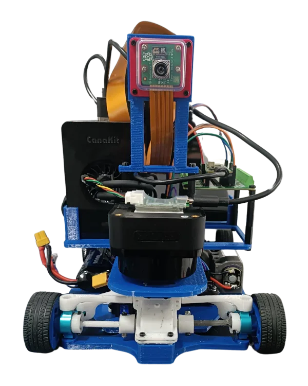
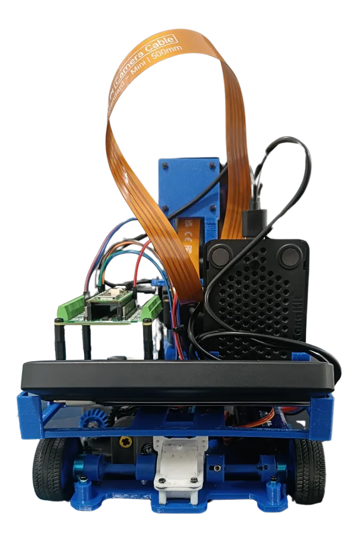
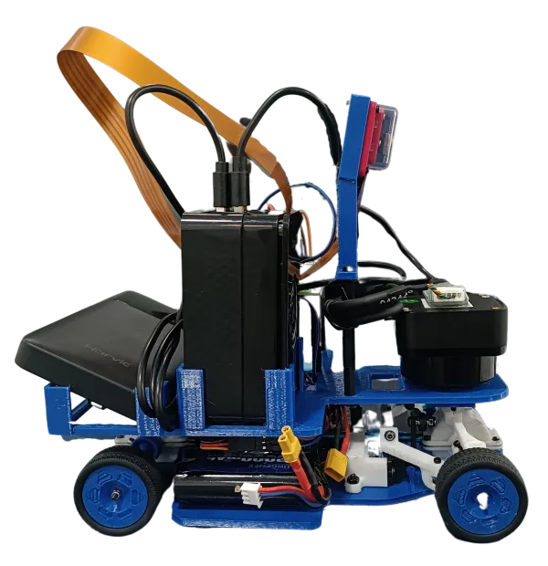
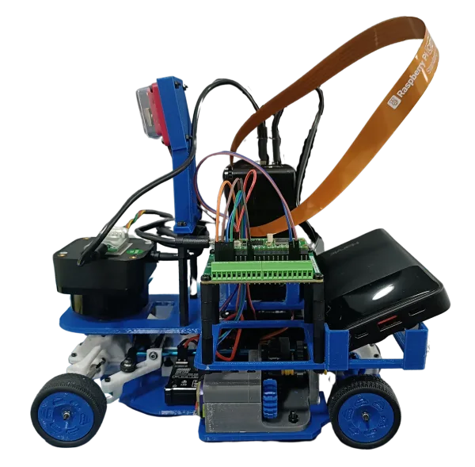
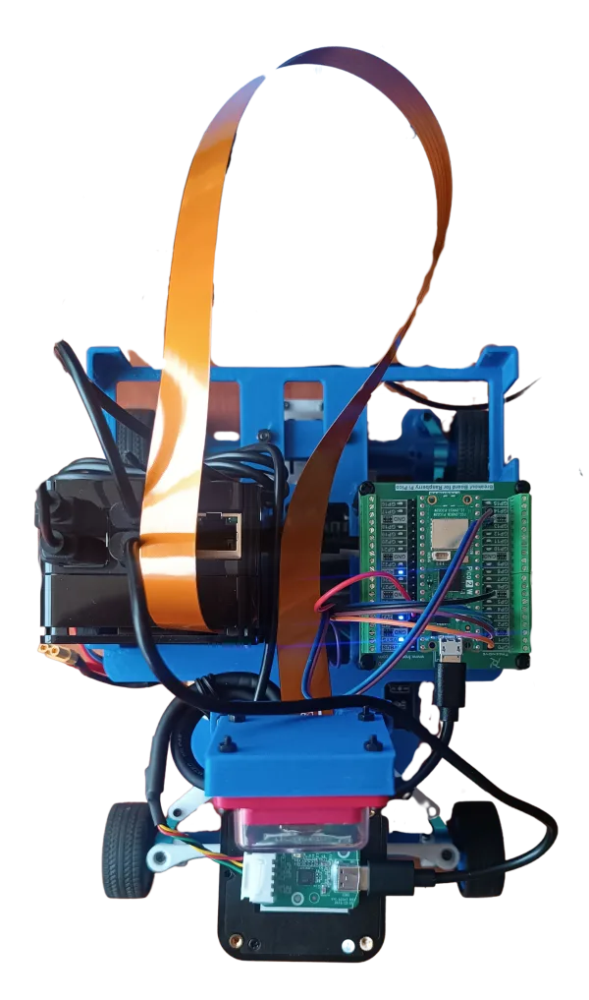
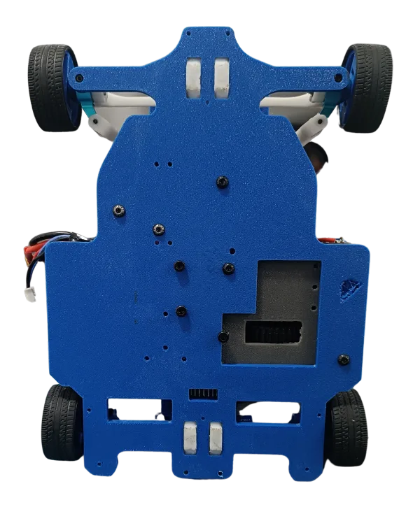

# Klevor v0.1.1

Este es un segundo prototipo de Klevor, donde se le hicieron correcciones esenciales y se agregaron nuevos componentes que explicaremos detalladamente.

	

		
		<i>Vista delantera</i>
	

	
 
		
		<i>Vista trasera</i>
	

	

		
		<i>Vista derecha</i>
	

	

		
		<i>Vista izquierda</i>
	

	

		
		<i>Vista superior</i>
	

	

		
		<i>Vista inferior</i>
	

## Primera Capa

En esta primera capa, al igual que en nuestro primer prototipo, tenemos nuestro sistema motriz, al cual no se le hicieron modificaciones. Este funciona como el sistema mecánico de un automóvil, un mecanismo 4x4 de dos diferenciales (sistema de engranajes cubiertos por una carcasa) conectados entre sí por un eje transmisor. Nosotros conectamos nuestro motor (INJORA 48T) a un piñón que tiene el eje transmisor, esto hace que los diferenciales giren en un mismo sentido y que por consecuencia, Klevor se mueva.

Una parte fundamental para nuestro robot es su sistema de cruce. Es basado en un mecanismo Ackermann, que consiste en que las dos ruedas están conectadas por una dirección o "sistema de trapecio", esto lo que hace es que, mediante una fuerza que haga el cruce (en este caso nuestro servomotor INJORA 7 kg 2065 )la dirección se mueva y eso hace girar ambas ruedas al mismo lado, debido a la geometría y forma de trapecio que tiene la dirección, las ruedas no giran con el mismo ángulo, sino que, la rueda interna respecto al cruce gira más que la rueda externa.

Las ruedas para funcionar están conectadas a un muñón de dirección, luego a un "palier" o "semieje" que pasa por dentro del muñón y se junta con la rueda para que esta gire, el palier gira mientras está junto al diferencial.

	

Esto ilustra más la geometría de la dirección que permite que las ruedas delanteras giren en ángulos diferentes y a su vez en la misma dirección, consiguiendo así un giro eficiente.

Nuestro motor (INJORA 48T) es el que se encarga de mover gran parte del sistema motriz, pero presentó una falla al no tener el suficiente torque para mover el robot. Por esto tomamos la decisión de hacer un sistema reductor de RPM.

## ¿Cómo funciona nuestro sistema reductor de RPM?

Este sistema permite que el motor, originalmente muy rápido pero con poco torque, pueda aplicar una mayor fuerza al moverse, algo importante para los desafíos, que requieren tracción y superación de obstáculos.

Este sistema cuenta con el ya antes mencionado, Motor INJORA 48T, con una velocidad de 20000 RPM con un piñón de 20 dientes instalado en su boquilla. Además de los piñones cuyos diseños 2D están adjuntos, que constan de 36, 8, 24, 17 y 40 dientes; todos provenientes de kits de LEGO.

El sistema funciona en varias etapas, en las que cada conjunto de piñones va reduciendo la velocidad de rotación y aumentando el torque.

El motor acciona un piñón de 36 dientes, engranado con el piñón de 20 dientes que está en la boquilla del motor.

El piñón de 36 dientes está montado sobre un eje que también hace girar un piñón de 8 dientes.

Este piñón de 8 dientes engrana con un piñón de 24 dientes, al cual también está fijado un piñón de 17 dientes.

El piñón de 17 dientes impulsa un piñón de 40 dientes, que está siendo atravesado por el eje principal que lleva el movimiento a los diferenciales del robot.

A continuación, explicaremos algunas reglas importantes que hay que tener en cuenta:

**Cuando un piñón más pequeño (impulsor) mueve uno más grande (impulsado), la velocidad disminuye y el torque aumenta.**

**Cuando uno más grande mueve a uno más pequeño, la velocidad aumenta y el torque disminuye.**

**La relación de transmisión o relación de reducción se calcula con la siguiente fórmula:**

$$\text{Relación de Transmisión} = \frac{N_{\text{conducido}}}{N_{\text{motriz}}}$$

Donde:
- $N_{\text{conducido}}$: Es el engranaje que recibe el movimiento (conectado a las ruedas, ejes o mecanismo final).
- $N_{\text{motriz}}$: Es el engranaje conectado directamente a la fuente de potencia (motor o manivela).

Teniendo esto en cuenta, desglosaremos paso a paso cómo esto se aplica en nuestro sistema.

El piñón de 20 dientes está directamente en la boquilla del motor.

Este impulsa un piñón de 36 dientes.

**Relación = 36/20 = 1.8**

Esto significa que el motor debe dar 1.8 vueltas para que el piñón de 36 dientes dé 1 vuelta. Por lo tanto, la velocidad se reduce y el torque se incrementa en 1.8.

Luego el piñón de 36 está fijado en el mismo eje con un piñón de 8 dientes.

Este piñón de 8 engrana con uno de 24 dientes

**Relación = 24/8 = 3**

El piñón de 8 debe girar 3 veces para que el de 24 dé una vuelta. Esto significa que triplica el torque cuando esto ocurre.

Ahora, el piñón de 24 está unido al piñón de 17 dientes, este piñón de 17 impulsa al último piñón de 40 dientes (eje final).

**Relación = 40/17 = 2.35**

El piñón de 17 dientes necesita dar 2.35 vueltas para que el de 40 dé una sola. Se reduce aún más la velocidad y se aumenta el torque.

Como todo esto está conectado en serie (uno tras otro), las relaciones se multiplican entre sí para obtener la relación de reducción total:

**Relación total = 1.8 x 3 x 2.35 = 12.69**

Esto significa que por cada 12.69 vueltas del motor, el último piñón da tan solo una vuelta, aumentando el torque así mismo.

Luego de esta reducción, el motor tiene una salida de 1576 RPM.

Seguiremos explicando esta primera capa de nuestro robot. De componentes tiene un giroscopio (BNO08X) que ayuda al robot a orientarse y así contar el número de vueltas que da, tiene una batería (URGENEX 7.4 V) que alimenta al INJORA MB100 20 A mini ESC que es un regulador de velocidad y a su vez también alimenta el motor INJORA 48T y el servomotor INJORA 7 kg 2065.

### ¿Por qué diseñamos así nuestro chasis? {:#why-design-chassis}

Este chasis es una modificación de la primera capa del primer prototipo de Klevor. Decidimos modificarla por el peso, reduciendo el espacio por componentes que ya no están, esta primera capa también está diseñada con esa forma debido a las piezas de kits que no son modificables, como lo son los diferenciales, los muñones de dirección y el eje transmisor. Así hicimos un espacio a medida para cada componente. Esta también es la razón por la que diseñamos toda la parte de conexión de las ruedas (Ruedas, Semiejes y cajas de diferenciales).

## Segunda Capa 
Esta es la capa donde más cambios se hicieron, anteriormente aquí teníamos los sensores ToF (Time of Flight), pero fueron reemplazados por el RPLidar C1 un sensor que mediante un láser infrarrojo nos permite detectar distancias de hasta 12 metros en los 360 grados, cosa que corrige el mal funcionamiento de los anteriores sensores, que daban lecturas erróneas y tenían un rango de detección muchísimo más corto. Decidimos colocarlo al revés para que evitar que tenga lecturas erróneas debido a que su láser pasaría por encima de la pared de la pista.

En esta parte superior también está el microcontrolador (Raspberry Pi Pico 2 WH) y el microprocesador (Raspberry Pi 5), además de la alimentación de los mismos, que es un power bank marca Harvic de 10000 mAh y 22.5 W, este se conecta a la Raspberry Pi 5 y a su vez, envía parte del voltaje al RPLIDAR; la Raspberry Pi Pico 2 WH y la Raspberry Camera Module 3 Wide, que es la cámara que nos ayudará a detectar los colores de los bloques en el desafío cerrado.

### ¿Por qué diseñamos así la parte superior? {:#why-design-top}

La parte superior cambió drásticamente en cuanto a diseño, los cambios que hicimos fueron:

- **Crear un espacio en la parte frontal**: Esto lo hicimos para colocar el RPLIDAR con el mayor ángulo de visión posible.

- **Recortar bordes**: Para reducir peso y espacio innecesario.

- **Orificios**: Con el fin de poder conectar cables con la parte de abajo, esto nos da más facilidad a la hora de ensamblar a Klevor.

- **Soporte Raspberry Pi Camera 3**: Luego de probar qué ángulo de colocación era el mejor para la cámara decidimos hacer un soporte completamente fijo. Aunque pensamos cambiarlo más adelante.

Decidimos eliminar también la tercera capa que tenía el primer prototipo, ya que pudimos resumir todos los componentes en una única superficie.

## Lista de Materiales 

| Componente                                                                                     | Unidad | Costo por Unidad ($) | Total ($)           |
|------------------------------------------------------------------------------------------------|--------|----------------------|---------------------|
| [Raspberry Pi 5](https://www.canakit.com/raspberry-pi-5-16gb.html)                             | 1      | 120.00               | 120.00              |
| [Raspberry Pi AI HAT+](https://www.canakit.com/raspberry-pi-ai-hat-with-case.html)             | 1      | 139.95               | 139.95              |
| [Micro SD 512GB](https://www.amazon.com/dp/B0C1Q79X3P)                                         | 1      | 54.99                | 54.99               |
| [RPLiDAR C1](https://www.amazon.com/dp/B0CNXLJJ61)                                             | 1      | 75.90                | 75.90               |
| [Raspberry Pi Pico 2WH](https://www.amazon.com/dp/B0F4W9J5CC)                                  | 1      | 14.99                | 14.99               |
| [Raspberry Pi Pico 2WH Breakout Board](https://www.amazon.com/dp/B0BFB53Y2N)                   | 1      | 11.95                | 11.95               |
| [Raspberry Pi Camera Module 3 Wide](https://www.canakit.com/raspberry-pi-camera-module-3.html) | 1      | 37.95                | 37.95               |
| [Case para la Raspberry Pi Camera Module 3](https://www.amazon.com/dp/B09TNG4V55)              | 1      | 5.99                 | 5.99                |
| [Cable para la cámara de la Raspberry Pi 5 de 50cm](https://www.amazon.com/dp/B0D3YWTNF8)      | 1      | 9.79                 | 9.79                |
| [URGENEX 3000mAh Battery](https://www.amazon.com/dp/B0CYNVSN7W)                                | 1      | 26.99                | 26.99               |
| [Giroscopio BNO085](https://www.amazon.com/dp/B0CDGZMLPP)                                      | 1      | 18.59                | 18.59               |
| [INJORA 7Kg 2065 Servo](https://www.amazon.com/dp/B0BLBMVYCW)                                  | 1      | 17.98                | 17.98               |
| [INJORA MB100 20A Brushed Mini ESC](https://www.amazon.com/dp/B0CXT74XV6)                      | 1      | 32.99                | 32.99               |
| [INJORA 180 48T Motor PRO](https://www.amazon.com/es/dp/B0BZ7D63YW/)                           | 1      | 13.98                | 13.98               |
| [Harvic Power Bank PB-607](https://nebulixcolombia.com/products/power-bank-harvic)             | 1      | 17.50 [[1](#note1)]  | 17.50 [[1](#note1)] |
| [Aluminium Alloy Front & Rear Steering Knuckle Hub Base](https://www.amazon.com/dp/B09XW246FQ) | 1      | 17.99                | 17.99               |
| [RC Car Metal Differential Kit 1/18](https://www.amazon.com/dp/B08GHC4D5M)                     | 1      | 21.98                | 21.98               |
| [10PCS Toy Car Wheels 35mm](https://www.amazon.com/dp/B0DQ96VJGL)                              | 1      | 7.99                 | 7.99                |
| [20 rodamientos de bolas MR128-2RS](https://www.amazon.com/dp/B09P1QV29K)                      | 1      | 9.29                 | 9.29                |

**Total para los Componentes: $656.79**

1. El producto está listado con un valor de $70.000,00 COP lo cual es equivalente alrededor de 21,91 dólares estadounidenses a fecha del 30 de julio de 2026. 