# Klevor v0.1

En esta sección detallaremos los componentes y su funcionalidad dentro de cada capa del robot. Explicaremos el propósito de cada pieza y cómo su integración contribuye al rendimiento general de Klevor en el recorrido de pista.

## Primera Capa

En esta primera capa toda la parte motriz de nuestro robot.

	

		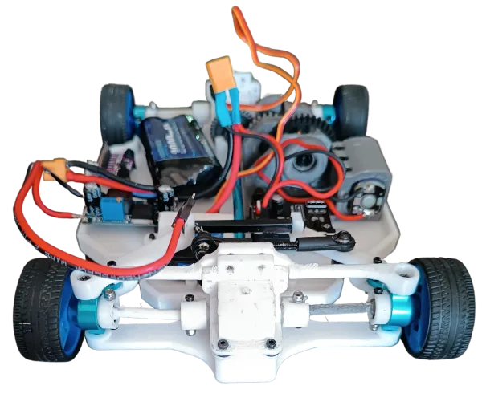
		<i>Primera capa, vista delantera</i>
	

	

		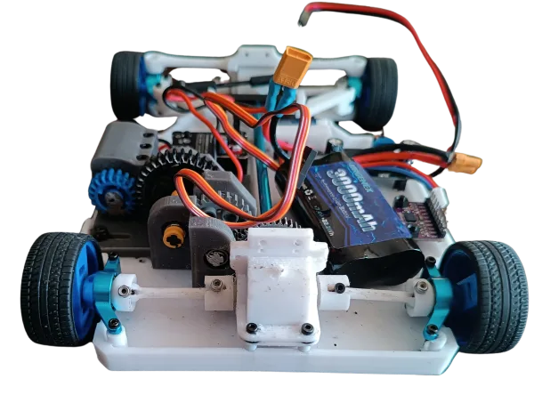
		<i>Primera capa, vista trasera</i>
	
  
	

		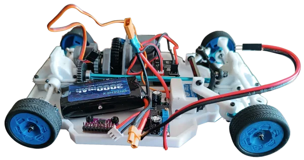
		<i>Primera capa, vista izquierda</i>
	

	

		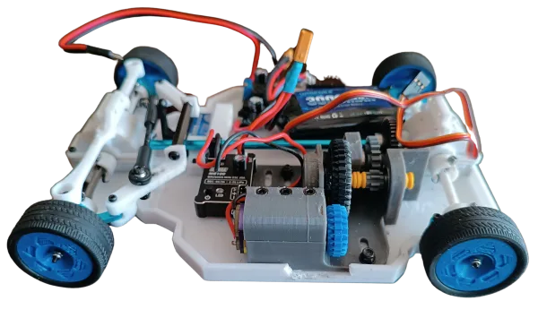
		<i>Primera capa, vista derecha</i>
	

	

		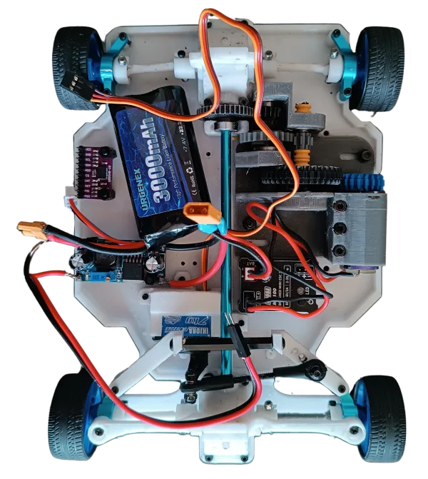
		<i>Primera capa, vista superior</i>
	

A continuación, explicaremos a detalle cómo funciona este sistema motriz. Para lograrlo, nos basamos en el sistema mecánico de un automóvil; cuyo funcionamiento depende de un diferencial (una pieza formada por varios engranajes cubiertos por una carcasa) para el movimiento de dos ruedas, al usar cuatro ruedas, usamos dos diferenciales (uno para las delanteras, otro para las traseras) conectados mediante un eje transmisor para el movimiento uniforme de todas estas. Estos diferenciales se mueven en conjunto mediante un engranaje que está conectado al eje transmisor. El eje transmisor únicamente tiene la función de conectar ambos diferenciales entre sí por medio de una ranura en estos, y tiene la adición de un engranaje en la parte donde va nuestro motor (INJORA 48T). Dicho motor originalmente lo conectamos al engranaje del eje transmisor, pero no funcionó, ya que este no cuenta con la suficiente fuerza para mover el sistema. Esto nos condujo a crear un sistema de reducción de RPM.

## ¿Cómo funciona nuestro sistema reductor de RPM?

Este sistema permite que el motor, originalmente muy rápido pero con poco torque, pueda aplicar una mayor fuerza al moverse, algo importante para los desafíos, que requieren tracción y superación de obstáculos.

Este sistema cuenta con el ya antes mencionado, Motor INJORA 48T, con una velocidad de 20000 RPM con un piñón de 20 dientes instalado en su boquilla. Además de los piñones cuyos diseños 2D están adjuntos, que constan de 36, 8, 24, 17 y 40 dientes; todos provenientes de kits de LEGO.

El sistema funciona en varias etapas, en las que cada conjunto de piñones va reduciendo la velocidad de rotación y aumentando el torque.

El motor acciona un piñón de 36 dientes, engranado con el piñón de 20 dientes que está en la boquilla del motor.

El piñón de 36 dientes está montado sobre un eje que también hace girar un piñón de 8 dientes.

Este piñón de 8 dientes engrana con un piñón de 24 dientes, al cual también está fijado un piñón de 17 dientes.

El piñón de 17 dientes impulsa un piñón de 40 dientes, que está siendo atravesado por el eje principal que lleva el movimiento a los diferenciales del robot.

A continuación, explicaremos algunas reglas importantes que hay que tener en cuenta:

**Cuando un piñón más pequeño (impulsor) mueve uno más grande (impulsado), la velocidad disminuye y el torque aumenta.**

**Cuando uno más grande mueve a uno más pequeño, la velocidad aumenta y el torque disminuye.**

**La relación de transmisión o relación de reducción se calcula con la siguiente fórmula:**

$$\text{Relación de Transmisión} = \frac{N_{\text{conducido}}}{N_{\text{motriz}}}$$

Donde:
- $N_{\text{conducido}}$: Es el engranaje que recibe el movimiento (conectado a las ruedas, ejes o mecanismo final).
- $N_{\text{motriz}}$: Es el engranaje conectado directamente a la fuente de potencia (motor o manivela).

Teniendo esto en cuenta, desglosaremos paso a paso cómo esto se aplica en nuestro sistema.

El piñón de 20 dientes está directamente en la boquilla del motor.

Este impulsa un piñón de 36 dientes.

**Relación = 36/20 = 1.8**

Esto significa que el motor debe dar 1.8 vueltas para que el piñón de 36 dientes dé 1 vuelta. Por lo tanto, la velocidad se reduce y el torque se incrementa en 1.8.

Luego el piñón de 36 está fijado en el mismo eje con un piñón de 8 dientes.

Este piñón de 8 engrana con uno de 24 dientes

**Relación = 24/8 = 3**

El piñón de 8 debe girar 3 veces para que el de 24 dé una vuelta. Esto significa que triplica el torque cuando esto ocurre.

Ahora, el piñón de 24 está unido al piñón de 17 dientes, este piñón de 17 impulsa al último piñón de 40 dientes (eje final).

**Relación = 40/17 = 2.35**

El piñón de 17 dientes necesita dar 2.35 vueltas para que el de 40 dé una sola. Se reduce aún más la velocidad y se aumenta el torque.

Como todo esto está conectado en serie (uno tras otro), las relaciones se multiplican entre sí para obtener la relación de reducción total:

**Relación total = 1.8 x 3 x 2.35 = 12.69**

Esto significa que por cada 12.69 vueltas del motor, el último piñón da tan solo una vuelta, aumentando el torque así mismo.

Luego de esta reducción, el motor tiene una salida de 1576 RPM.

La otra parte fundamental para nuestro robot es su sistema de cruce, que consta de un servomotor (INJORA 7 kg 2065) conectado a nuestro sistema "Ackermann" que funciona conectando ambas ruedas delanteras a una dirección o "sistema de trapecio". El servomotor mueve unas barras que a su vez están conectados a unos muñones de dirección que están en las ruedas, permitiendo así que, uno de los muñones de dirección anteriormente mencionados, sea empujado hacia un lado por el movimiento del servomotor y a su vez, tire de la otra rueda hacia el lado opuesto. Debido a los ángulos del trapecio, esto provoca que la rueda interior gire más que la exterior.

Algunos componentes que también están en esta capa son el giroscopio (BNO08X) y una batería de 7.4 V y 3000 mAh (URGENEX 7.4 V), y los ya mencionados INJORA 48T (motor) y el servomotor INJORA 7 kg 2065.

### ¿Por qué diseñamos de esta manera la primera capa de nuestro robot? {:#why-first-layer}

Esta capa fue 100% diseñada e impresa por nosotros. Al tener múltiples piezas de kits que no son modificables (como los diferenciales, el eje de transmisión y los muñones de dirección) tuvimos que acoplar el diseño de esta primera capa a esas piezas, y a la vez dejar espacio para los componentes restantes. Las ruedas también fueron diseñadas por nosotros, con ranuras hechas a la medida de los kits ya mencionados.

## Segunda Capa 

	

		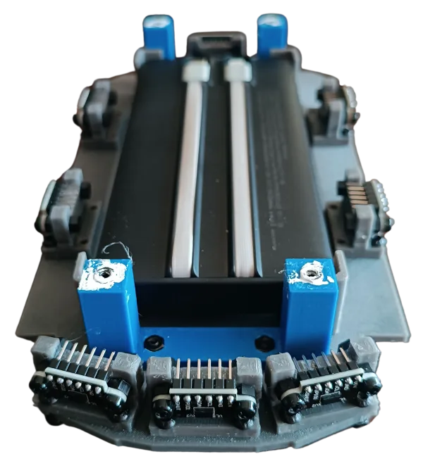
		<i>Segunda capa, vista delantera</i>
	

	

		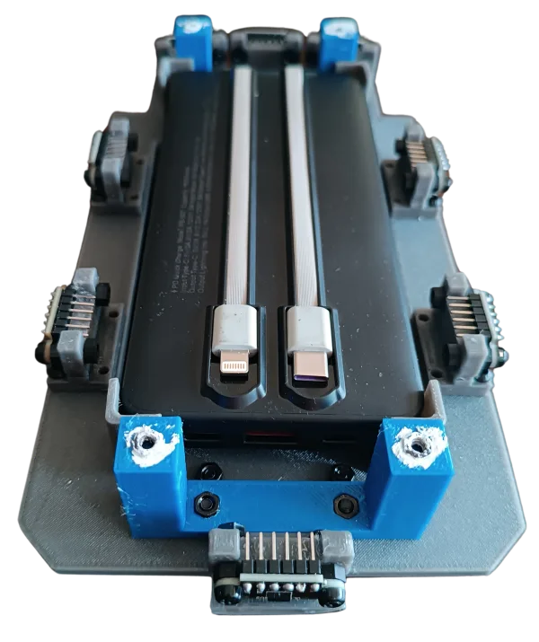
		<i>Segunda capa, vista trasera</i>
	

	

		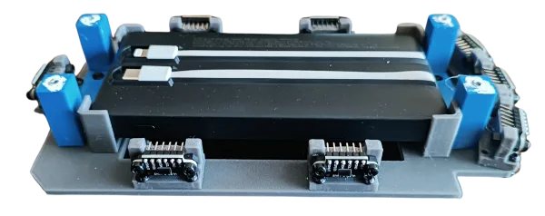
		<i>Segunda capa, vista izquierda</i>
	

	

		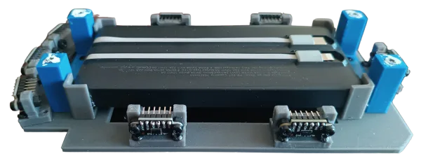
		<i>Segunda capa, vista derecha</i>
	

	

		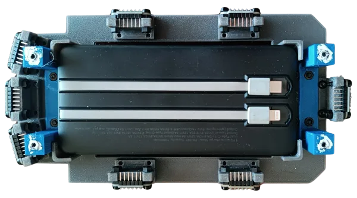
		<i>Segunda capa, vista superior</i>
	

Esta segunda capa está dedicada a la alimentación y los sensores ToF (Time of Flight) del robot.

Klevor consta de ocho sensores colocados estratégicamente para medir la proximidad en diferentes ángulos mientras se mueve, como se puede ver en las fotos del robot, los sensores están fijados en unos soportes que diseñamos en 3D y luego imprimimos. Tiene dos de estos en cada lateral, tres al frente (uno colocado horizontalmente y otros dos a los lados que están puestos a 15 grados respecto al sensor central) y uno ubicado en el centro de la parte trasera de Klevor. Todos estos se conectan a una protoboard en la parte superior de Klevor.

A futuro queremos colocar un RPLidar C1, un componente que mejorará el funcionamiento del robot, tanto en su tiempo de respuesta como en su ángulo de visión.

La parte de la alimentación cuenta con un power bank por el cual los componentes de la capa superior reciben electricidad.

Nuestra segunda capa también fue diseñada en 3D para que el power bank pudiera tener un espacio hecho a su medida en el medio, por otro lado, los sensores ToF tienen un soporte también diseñado e impreso por nosotros. ¡Están justo a su medida!

## Tercera Capa 

	

		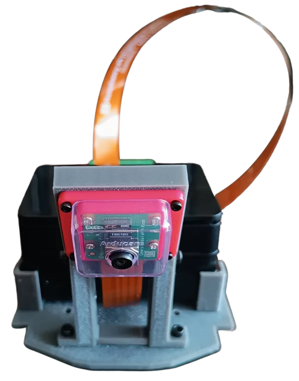
		<i>Tercera capa, vista delantera</i>
	

	

		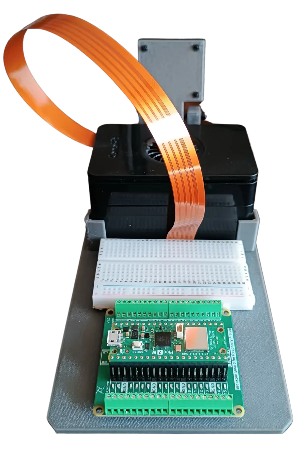
		<i>Tercera capa, vista trasera</i>
	

	

		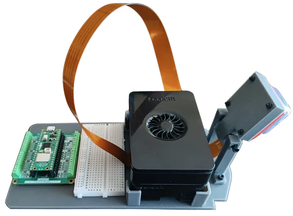
		<i>Tercera capa, vista izquierda</i>
	

	

		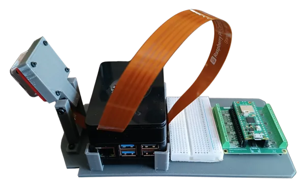
		<i>Tercera capa, vista derecha</i>
	

	

		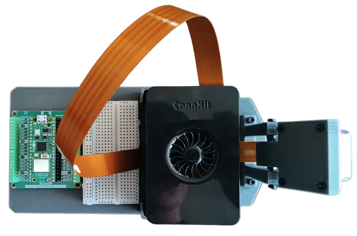
		<i>Tercera capa, vista superior</i>
	

La tercera capa de Klevor cuenta con todas las partes que contienen su programación y control, tales son la Raspberry Pi 5 y la Raspberry Pi Pico 2 WH, la Raspberry Pi 5 está conectada por USB-C a la PowerBank que se encuentra en la segunda capa; esta se encargará de darle directrices a nuestra Raspberry Camera Module 3 Wide, que funciona más eficientemente gracias a una AI Hat+ que funciona detectando las formas y colores de los obstáculos en pista. Se encuentra en la parte posterior del robot en un soporte que también fue diseñado e impreso por nosotros.

Nuestra antes mencionada Raspberry Pi Pico 2 se encarga de darle órdenes a los sensores ToF ubicados en la segunda capa, además de también estar comunicada con nuestro giroscopio; el motor INJORA 48T y el servomotor INJORA 7 kg 2065, todos ubicados en la primera capa. Esta es alimentada mediante la batería de 7.4 V y 3000 mAh (ubicada también en la primera capa). La Raspberry Pi Pico 2 soporta hasta 5.5 V, es decir, no soporta estos 7.4 voltios, razón por la que pusimos un "StepDown", un componente que se encarga de reducir el voltaje, evitando que nuestra Raspberry Pi Pico 2 sufra consecuencias por el sobre voltaje. Tanto nuestra Raspberry Pi 5 y nuestra Raspberry Pi Pico 2 están conectados entre sí por un cable de tipo USB-C.

Esta parte superior también la diseñamos e imprimimos, principalmente recortando espacios por el peso y haciendo un soporte para nuestra cámara que mediante 2 tornillos permite que la cámara gire su ángulo de inclinación, esto lo hicimos para probar en que inclinación quedaba mejor esta cámara y así no tener errores más adelante.

## Lista de Materiales

| Componente                                                                                     | Unidad | Costo por Unidad ($) | Total ($)           |
|------------------------------------------------------------------------------------------------|--------|----------------------|---------------------|
| [Raspberry Pi 5](https://www.canakit.com/raspberry-pi-5-16gb.html)                             | 1      | 120.00               | 120.00              |
| [Micro SD 512GB](https://www.amazon.com/dp/B0C1Q79X3P)                                         | 1      | 54.99                | 54.99               |
| [Raspberry Pi Camera Module 3 Wide](https://www.canakit.com/raspberry-pi-camera-module-3.html) | 1      | 37.95                | 37.95               |
| [Raspberry Pi Pico 2WH](https://www.amazon.com/dp/B0F4W9J5CC)                                  | 1      | 14.99                | 14.99               |
| [Raspberry Pi Pico 2WH Breakout Board](https://www.amazon.com/dp/B0BFB53Y2N)                   | 1      | 11.95                | 11.95               |
| [Case para la Raspberry Pi Camera Module 3](https://www.amazon.com/dp/B09TNG4V55)              | 1      | 5.99                 | 5.99                |
| [Cable para la cámara de la Raspberry Pi 5 de 50cm](https://www.amazon.com/dp/B0D3YWTNF8)      | 1      | 9.79                 | 9.79                |
| [URGENEX 3000mAh Battery](https://www.amazon.com/dp/B0CYNVSN7W)                                | 1      | 26.99                | 26.99               |
| [Giroscopio BNO085](https://www.amazon.com/dp/B0CDGZMLPP)                                      | 1      | 18.59                | 18.59               |
| [Step-Down LM2596](https://www.amazon.com/dp/B0D7ZWVSFW)                                       | 1      | 4.99                 | 4.99                |
| [INJORA 7Kg 2065 Servo](https://www.amazon.com/dp/B0BLBMVYCW)                                  | 1      | 17.98                | 17.98               |
| [INJORA MB100 20A Brushed Mini ESC](https://www.amazon.com/dp/B0CXT74XV6)                      | 1      | 32.99                | 32.99               |
| [INJORA 180 48T Motor PRO](https://www.amazon.com/es/dp/B0BZ7D63YW/)                           | 1      | 13.98                | 13.98               |
| [Half-Size Breadboard](https://www.amazon.com/dp/B01EV640I6)                                   | 1      | 5.98                 | 5.98                |
| [4pcs ToF Laser Range Finder for Arduino](https://www.amazon.com/dp/B0C6WZFZSX)                | 2      | 12.99                | 25.98               |
| [Harvic Power Bank PB-607](https://nebulixcolombia.com/products/power-bank-harvic)             | 1      | 17.50 [[1](#note1)]  | 17.50 [[1](#note1)] |
| [Aluminium Alloy Front & Rear Steering Knuckle Hub Base](https://www.amazon.com/dp/B09XW246FQ) | 1      | 17.99                | 17.99               |
| [RC Car Metal Differential Kit 1/18](https://www.amazon.com/dp/B08GHC4D5M)                     | 1      | 21.98                | 21.98               |
| [10PCS Toy Car Wheels 35mm](https://www.amazon.com/dp/B0DQ96VJGL)                              | 1      | 7.99                 | 7.99                |
| [20 rodamientos de bolas MR128-2RS](https://www.amazon.com/dp/B09P1QV29K)                      | 1      | 9.29                 | 9.29                |
**Total para los Componentes: $477.89**

1. El producto está listado con un valor de $70.000,00 COP lo cual es equivalente alrededor de 21,91 dólares estadounidenses a fecha del 30 de julio de 2026. 