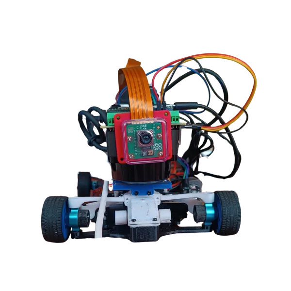
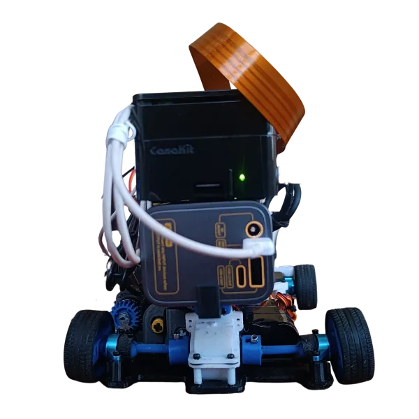
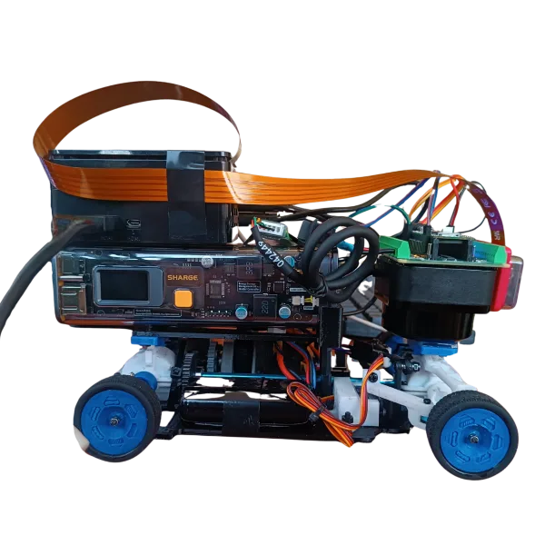
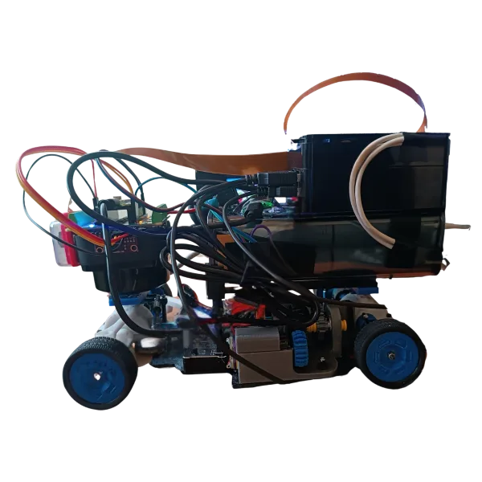
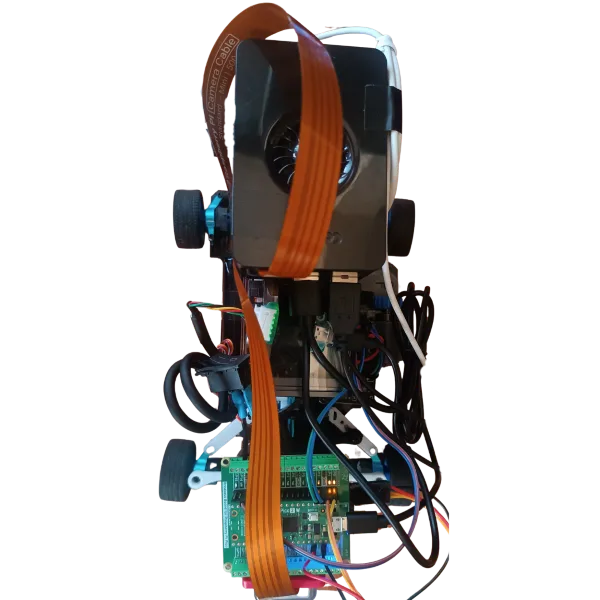
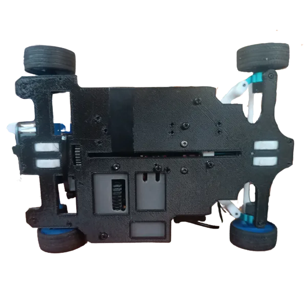

# Klevor v0.2

A continuación, explicaremos minuciosamente el cómo y el porqué hicimos un tercer prototipo de Klevor, detallando los componentes agregados y los que fueron removidos.

<table>
	<tbody>
		<tr>
			<td>
				

					
					 
					<i>Vista delantera de Klevor v0.2</i>
				

			</td>
			<td>
				

					
					 
					<i>Vista trasera de Klevor v0.2</i>
				

			</td>
		</tr>
		<tr>
			<td>
				

					
					 
					<i>Vista derecha de Klevor v0.2</i>
				

			</td>
			<td>
				

					
					 
					<i>Vista izquierda de Klevor v0.2</i>
				

			</td>
		</tr>
		<tr>
			<td>
				

					
					 
					<i>Vista superior de Klevor v0.2</i>
				

			</td>
			<td>
				

					
					 
					<i>Vista inferior de Klevor v0.2</i>
				

			</td>
		</tr>
	</tbody>
</table>

## Actualizaciones

- Implementación de la Shargeek Storm 2
- Rediseño de la capa inferior
- Rediseño de la capa superior

## Primera Capa 

A este primer nivel del robot únicamente se le hicieron modificaciones en cuanto a pesaje. Lo que significa que su sistema motriz continúa exactamente igual al del prototipo anterior.

Redujimos significativamente el tamaño de esta capa, ajustándola a los componentes. Esto nos permitió reducir 10 gramos su peso, un avance crucial. Gracias a esto, ahora Klevor cumple con el peso reglamentario, ya que en pruebas anteriores excedió los 1500 g.

## Segunda Capa

Se puede apreciar con claridad el drástico cambio que tuvo la parte superior de Klevor, donde reemplazamos la capa anterior por un soporte nuevo, hecho específicamente para que se acople la Shargeek Storm 2, sobre esta misma base, y encima de este power bank, se colocó estratégicamente la Raspberry Pi 5.

Adicionalmente, aprovechamos la estructura y ubicación del RPLidar C1 para usarlo de soporte sin interferir en su función, al este estar colocado al revés, nos permite colocar en la parte superior la Raspberry Pi Pico 2 WH, y en la parte posterior de este la Raspberry Camera Module 3 Wide.

Esto ayudó enormemente a solucionar nuestro problema con el peso, ya que esta modificación nos ahorró el soporte impreso de todos los componentes antes mencionados. En total, pudimos pasar de tener una capa de 42 g a una de tan solo 18 g, lo que se traduce en un Klevor que cumple con el peso reglamentario, alcanzando un peso total de 1470 g aproximadamente.

## Lista de Materiales

| Componente                                                                                                          | Unidad | Costo por Unidad ($) | Total ($) |
|---------------------------------------------------------------------------------------------------------------------|--------|----------------------|-----------|
| [Raspberry Pi 5](https://www.canakit.com/raspberry-pi-5-16gb.html)                                                  | 1      | 120.00               | 120.00    |
| [Raspberry Pi AI HAT+](https://www.canakit.com/raspberry-pi-ai-hat-with-case.html)                                  | 1      | 139.95               | 139.95    |
| [Micro SD 512GB](https://www.amazon.com/dp/B0C1Q79X3P)                                                              | 1      | 54.99                | 54.99     |
| [RPLiDAR C1](https://www.amazon.com/dp/B0CNXLJJ61)                                                                  | 1      | 75.90                | 75.90     |
| [Raspberry Pi Pico 2WH](https://www.amazon.com/dp/B0F4W9J5CC)                                                       | 1      | 14.99                | 14.99     |
| [Raspberry Pi Pico 2WH Breakout Board](https://www.amazon.com/dp/B0BFB53Y2N)                                        | 1      | 11.95                | 11.95     |
| [Raspberry Pi Camera Module 3 Wide](https://www.canakit.com/raspberry-pi-camera-module-3.html)                      | 1      | 37.95                | 37.95     |
| [Case para la Raspberry Pi Camera Module 3](https://www.amazon.com/dp/B09TNG4V55)                                   | 1      | 5.99                 | 5.99      |
| [Cable para la cámara de la Raspberry Pi 5 de 50cm](https://www.amazon.com/dp/B0D3YWTNF8)                           | 1      | 9.79                 | 9.79      |
| [URGENEX 3000mAh Battery](https://www.amazon.com/dp/B0CYNVSN7W)                                                     | 1      | 26.99                | 26.99     |
| [Giroscopio BNO085](https://www.amazon.com/dp/B0CDGZMLPP)                                                           | 1      | 18.59                | 18.59     |
| [INJORA 7Kg 2065 Servo](https://www.amazon.com/dp/B0BLBMVYCW)                                                       | 1      | 17.98                | 17.98     |
| [INJORA MB100 20A Brushed Mini ESC](https://www.amazon.com/dp/B0CXT74XV6)                                           | 1      | 32.99                | 32.99     |
| [INJORA 180 48T Motor PRO](https://www.amazon.com/es/dp/B0BZ7D63YW/)                                                | 1      | 13.98                | 13.98     |
| [Shargeek Storm 2](https://www.amazon.com/dp/B09NY8GN76)                                                            | 1      | 229.00               | 229.00    |
| [Aluminium Alloy Front & Rear Steering Knuckle Hub Base](https://www.amazon.com/dp/B09XW246FQ)                      | 1      | 17.99                | 17.99     |
| [RC Car Metal Differential Kit 1/18](https://www.amazon.com/dp/B08GHC4D5M)                                          | 1      | 21.98                | 21.98     |
| [10PCS Toy Car Wheels 35mm](https://www.amazon.com/dp/B0DQ96VJGL)                                                   | 1      | 7.99                 | 7.99      |
| [20 rodamientos de bolas MR128-2RS](https://www.amazon.com/dp/B09P1QV29K)                                           | 1      | 9.29                 | 9.29      |

**Total para los Componentes: $868.29**