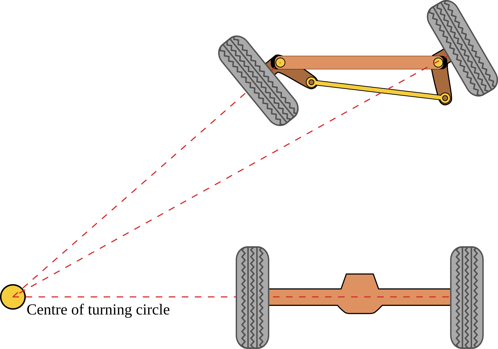

# Klevor v1.0

## Fotos del vehículo

<table>
	<tbody>
		<tr>
			<td>
				

					
					 
					<i>Vista delantera de Klevor v1.0</i>
				

			</td>
			<td>
				

					
					 
					<i>Vista trasera de Klevor v1.0</i>
				

			</td>
		</tr>
		<tr>
			<td>
				

					
					 
					<i>Vista derecha de Klevor v1.0</i>
				

			</td>
			<td>
				

					
					 
					<i>Vista izquierda de Klevor v1.0</i>
				

			</td>
		</tr>
		<tr>
			<td>
				

					
					 
					<i>Vista superior de Klevor v1.0</i>
				

			</td>
			<td>
				

					
					 
					<i>Vista inferior de Klevor v1.0</i>
				

			</td>
		</tr>
	</tbody>
</table>

## Introducción

Este prototipo de Klevor es el fruto de un arduo trabajo enfocado en mejorar su eficiencia a la hora de realizar los desafíos que depara esta edición de la WRO. A lo largo de estas mejoras, hemos priorizado la ingeniería mecánica para superar las limitaciones de prototipos anteriores y optimizar su desempeño.

Desde el primer concepto, Klevor fue pensado con una idea clara. Se estableció que su cerebro sería una Raspberry Pi 5, una decisión que nos permitió añadir capacidades de inteligencia artificial con un AI HAT+ y una Raspberry Pi Cam 3 para la detección precisa de objetos. Para la navegación, utilizamos el sensor RPLidar C1, que proporciona una detección en múltiples ángulos.

Klevor utiliza un sistema de tracción 4x4 para maximizar la fuerza y el control. Además, implementamos un sistema de cruce Ackermann, que optimiza el ángulo de giro de las ruedas. Este sistema, conocido por su uso en automóviles, alinea las ruedas de dirección de manera que todas giren alrededor de un punto común, lo que principalmente mejora la estabilidad durante los giros.

Para construir las partes únicas de nuestro robot, como las bases y los soportes, usamos un programa de diseño llamado Fusion360. Con este programa, pudimos crear cada pieza desde cero y luego imprimirlas en 3D. Gracias esto, pudimos tener menos margen de error, o corregir más rapido, logrando un diseño óptimo.

A lo largo la explicación de este prototipo, detallaremos el trayecto de Klevor, desde las primeras ideas de sus componentes hasta la creación de soluciones que ayudaron con nuestros problemas de potencia, tracción y peso.

Una parte fundamental para nuestro robot es su sistema de cruce. Es basado en un mecanismo Ackermann, que consiste en que las dos ruedas están conectadas por una dirección o "sistema de trapecio", esto lo que hace es que, mediante una fuerza que haga el cruce (en este caso nuestro servomotor INJORA 7 kg 2065) la dirección se mueva y eso hace girar ambas ruedas al mismo lado, debido a la geometría y forma de trapecio que tiene la dirección, las ruedas no giran con el mismo ángulo, sino que, la rueda interna respecto al cruce gira más que la rueda externa.

Las ruedas para funcionar están conectadas a un muñón de dirección, luego a un "palier" o "semieje" que pasa por dentro del muñón y se junta con la rueda para que esta gire, el palier gira mientras está junto al diferencial.

    
     
    <i>Sistema de Ackermann</i>

Esto ilustra más la geometría de la dirección que permite que las ruedas delanteras giren en ángulos diferentes y a su vez en la misma dirección, consiguiendo así un giro eficiente.

## Cambios
Para mejorar el rendimiento y la eficiencia de Klevor, hemos implementado varios cambios en su diseño. Estas mejoras se enfocan en optimizar la tracción, la potencia del motor y la distribución del peso.

- Nuevo chasis y ruedas

El nuevo chasis de Klevor fue diseñado específicamente para integrar de manera eficiente los nuevos componentes, asegurando que cada uno tenga el espacio adecuado para su funcionamiento. La principal razón para este rediseño fue la incorporación de nuestras nuevas ruedas de aluminio. A diferencia de los prototipos anteriores, estas ruedas tienen un diámetro y ancho mayores, y cuentan con un caucho más grueso y liso. Este diseño le proporciona a Klevor un mejor agarre en superficies planas, corrigiendo problemas de tracción que teníamos anteriormente.

- Mayor torque y eficiencia motriz

Hemos reemplazado el motor anterior (INJORA 48T) por uno con mayor torque. Este cambio nos permite aprovechar al máximo la velocidad del motor, que alcanza las 20,000 RPM, sin necesidad de un sistema para reducir las revoluciones por minuto (RPM).

- Reducción de peso

Otro cambio significativo es la sustitución de la fuente de alimentación. En prototipos anteriores, utilizábamos un power bank de casi 600g (Shargeek Storm 2), lo que limitaba las modificaciones de diseño. Ahora, con un nuevo power bank de solo 350g, hemos logrado una reducción considerable del peso. Esta mejora nos dio más libertad para optimizar el chasis sin tener que preocuparnos tanto por el peso total del robot.

## ¿Cómo diseñamos a Klevor?

Primeramente pensamos en ¿qué necesitamos para tener un robot eficiente? A partir de eso, se estableció una idea clara, un robot programado en una Rasperry Pi 5, lo que nos permitiría posteriormente usar un Raspberry PI AI HAT+ y entrenar a nuestra Raspberry Pi Cam 3 mediante inteligencia artificial, lo que definitivamente nos ayudaría a tener un mejor rendimiento en el desafío cerrado, y para que Klevor detecte los objetos a su alrededor, sensores capaces de detectar en varios ángulos, es por eso que desde nuestro segundo prototipo empezamos a usar el RPLidar C1. En cuanto a mecánica, desde el principio quisimos usar un sistema de tracción 4x4, y un sistema de cruce Ackermann.

Para lograr hacer que todo esto funcionase, pensamos en cada componente que teníamos que usar, para construir bases y soportes para los mismos, decidimos que una buena opción era imprimir estas piezas con una impresora 3D, más específicamente con un filamento tipo PTEG, el cual es bastante resistente, no muy costoso y fácil de conseguir, lo que nos permitiría hacer varias pruebas.

Todas nuestras piezas impresas fueron creadas desde 0, diseñadas en un programa de diseño llamado Fusion360, el cual fué de ayuda en varios aspectos, ya que podíamos simular las dimensiones de cada componente en el software y así posteriormente crear diferentes diseños para el chasis.

## Problemas y soluciones durante el desarrollo
A pesar de tener una base sólida acerca de lo que queríamos para construir a Klevor, se nos presentaron varios inconvenientes durante la construcción del mismo, para el primer prototipo de Klevor decidimos usar un Motor Injora 48T, que pensabamos íba a mover todo nuestro robot, a pesar de tener 20000 RPM, este no contaba con el torque suficiente para hacer a Klevor moverse, por lo que ideamos un sistema reductor de RPM, basándonos en los siguientes principios:

**Cuando un piñón más pequeño (impulsor) mueve uno más grande (impulsado), la velocidad disminuye y el torque aumenta.**

**Cuando uno más grande mueve a uno más pequeño, la velocidad aumenta y el torque disminuye.**

**La relación de transmisión o relación de reducción se calcula con la siguiente fórmula:**

$$\text{Relación de Transmisión} = \frac{N_{\text{conducido}}}{N_{\text{motriz}}}$$

Donde:
- $N_{\text{conducido}}$: Es el engranaje que recibe el movimiento (conectado a las ruedas, ejes o mecanismo final).
- $N_{\text{motriz}}$: Es el engranaje conectado directamente a la fuente de potencia (motor o manivela).

Esto significa que para aumentar el torque, tenemos que hacer que los piñones con menos dientes muevan a los piñones con más dientes, esto fué la solución para el problema de torque de nuestro robot.

Posteriormente tuvimos que hacer que Klevor fuese más liviano, la razón era el cambio de ruedas antes mencionado, ya que los rines de las que fueron utilizadas en prototipos anteriores eran impresas en 3D, lo que hacía que se desgastasen rápido. El nuevo modelo de rueda que estamos usando tiene un rin hecho de aluminio y un caucho mas grueso, lo que a su vez excedería el peso máximo establecido por la WRO, lo que hicimos para solucionar este problema y a la vez añadir más velocidad a Klevor fue cambiar el motor, uno que también cuenta con 20000 RPM, pero con torque suficiente, lo que significa que el sistema reductor antes mencionado fué descartado. 

Otra falla que presentó Klevor durante su desarrollo fué que el ángulo de giro de las ruedas era limitado, lo que suponía una dificultad a la hora de cruzar. Para corregirlo, modificamos la forma del trapecio de dirección del sistema de cruce Ackermann, el cual está compuesto por los dos brazos de dirección y la barra de acoplamiento que los une, al ajustar la posición y el ángulo de estos componentes, logramos que el ángulo de giro de Klevor incrementara significativamente.

## Lista de Materiales {:#materials-list}

| Componente                                                                                                           | Unidad | Costo por Unidad ($) | Total ($) |
|----------------------------------------------------------------------------------------------------------------------|--------|----------------------|-----------|
| [Raspberry Pi 5](https://www.canakit.com/raspberry-pi-5-16gb.html)                                                   | 1      | 120.00               | 120.00    |
| [Raspberry Pi AI HAT+](https://www.canakit.com/raspberry-pi-ai-hat-with-case.html)                                   | 1      | 139.95               | 139.95    |
| [Micro SD 512GB](https://www.amazon.com/dp/B0C1Q79X3P)                                                               | 1      | 54.99                | 54.99     |
| [RPLiDAR C1](https://www.amazon.com/dp/B0CNXLJJ61)                                                                   | 1      | 75.90                | 75.90     |
| [Raspberry Pi Camera Module 3 Wide](https://www.canakit.com/raspberry-pi-camera-module-3.html)                       | 1      | 37.95                | 37.95     |
| [Case para la Raspberry Pi Camera Module 3](https://www.amazon.com/dp/B09TNG4V55)                                    | 1      | 5.99                 | 5.99      |
| [Cable para la cámara de la Raspberry Pi 5 de 50cm](https://www.amazon.com/dp/B0D3YWTNF8)                            | 1      | 9.79                 | 9.79      |
| [Raspberry Pi Pico 2WH](https://www.amazon.com/dp/B0F4W9J5CC)                                                        | 1      | 14.99                | 14.99     |
| [Raspberry Pi Pico 2WH Breakout Board](https://www.amazon.com/dp/B0BFB53Y2N)                                         | 1      | 11.95                | 11.95     |
| [URGENEX 3000mAh Battery](https://www.amazon.com/dp/B0CYNVSN7W)                                                      | 1      | 26.99                | 26.99     |
| [Giroscopio BNO085](https://www.amazon.com/dp/B0CDGZMLPP)                                                            | 1      | 18.59                | 18.59     |
| [INJORA 7Kg 2065 Servo](https://www.amazon.com/dp/B0BLBMVYCW)                                                        | 1      | 17.98                | 17.98     |
| [60A Brushed ESC para 2-3s LiPo y motor 540](https://www.amazon.com/dp/B0F9Y6CMC8)                                   | 1      | 15.98                | 15.98     |
| [Motor 540 y disipador de calor de aluminio](https://www.amazon.com/dp/B0995W966Z)                                   | 1      | 19.39                | 19.39     |
| [UGREEN Power Bank 12000mAh 100W PD PPS](https://www.amazon.com/dp/B0CXJ1F1M7)                                       | 1      | 49.99                | 49.99     |
| [Aluminium Alloy Front & Rear Steering Knuckle Hub Base](https://www.amazon.com/dp/B09XW246FQ)                       | 1      | 17.99                | 17.99     |
| [RC Car Metal Differential Kit 1/18](https://www.amazon.com/dp/B08GHC4D5M)                                           | 1      | 21.98                | 21.98     |
| [USB-C QC PD3.0 Trigger Board Module Type-C](https://www.amazon.com/dp/B0DRJWBG7G)                                   | 1      | 16.99                | 16.99     |
| [Llantas de metal con buje de metal de 0.472 pulg](https://www.amazon.com/dp/B0BP2W7W59)                             | 1      | 20.99                | 20.99     |
| [Copa diferencial de aleación de aluminio y junta de eje de transmisión](https://www.amazon.com/dp/B09P1QV29K)       | 1      | 10.99                | 10.99     |
| [20 rodamientos de bolas MR128-2RS](https://www.amazon.com/dp/B09P1QV29K)                                            | 1      | 9.29                 | 9.29      |
| [Uxcell 0.276 in I.D. Rodamientos de bolas en miniatura](https://www.amazon.com/dp/B07XYPLPFL)                       | 1      | 8.49                 | 8.49      |
| [Smays Cable USB C de 240 W, cable corto de 1 pie C a C](https://www.amazon.com/dp/B0CYT6KQTR)                       | 1      | 7.99                 | 7.99      |
| [Hobbypark Adaptador hexagonal de rueda de aluminio](https://www.amazon.com/dp/B07D67VMDN)                           | 1      | 9.97                 | 9.97      |
| [6 piezas ajustables de aluminio Hobbypark enlace servo](https://www.amazon.com/dp/B01MQOA4CH)                       | 1      | 15.95                | 15.95     |
| [6 HobbyPark Metal Diff diferencial engranaje principal 42T y piñón motor 27T](https://www.amazon.com/dp/B07FS5RGLS) | 1      | 11.98                | 11.98     |
| [Cable micro USB corto de 1 pie [paquete de 3]](https://www.amazon.com/dp/B07FS5RGLS)                                | 1      | 6.99                 | 6.99      |

**Total para los Componentes: $780.03**